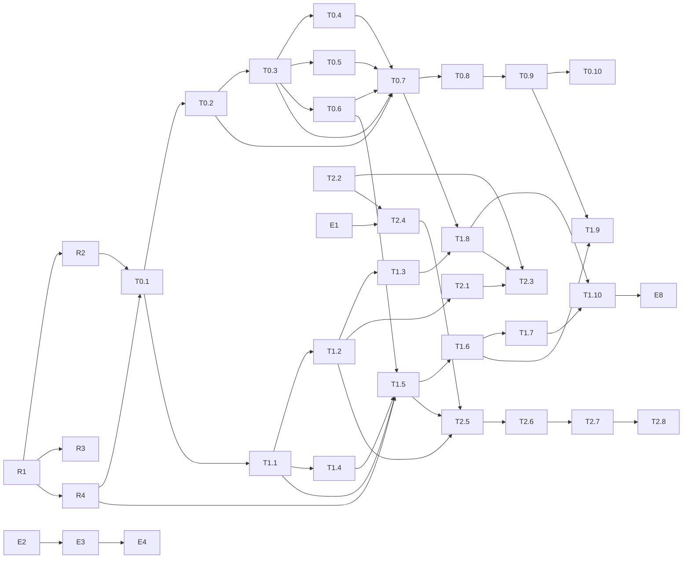

# 开发任务清单 —— 基于 Graph 的 AI 中台（v0.1）

> 配套主文档：`graph-ai-middle-platform-design.md`（设计）、`reference-projects-and-oss-landscape.md`（参考）。
> 用途：把设计拆成可以直接交给 Codex / Claude Code / 人的有界任务。每个任务都有交付物、验收命令和「不做」边界。
> 环境具体值（目标主机地址、网段、路径）不出现在本文件；用占位符，取值见未入库的 `docs/private/`。
> 日期：2026-09-01

---

## 0. 约定

### 0.1 任务字段

每个任务固定写：**目标 / 交付物 / 涉及路径 / 依赖 / 验收 / 建议执行者 / 需人工批准 / 不做**。

- **建议执行者**：`Codex` 或 `Claude Code`（代码实现）、`人`（需要登录目标主机或做决策）、`Claude Code@host`（经 SSH 在目标主机上跑只读或低风险命令）。
- **需人工批准**：`是` 表示会影响目标主机上运行中的其他服务，或不可逆；这类任务只写建议与命令，不由 agent 自动执行。
- **验收**：必须是可执行命令加期望结果。没有验收命令的任务不算定义完成。

### 0.2 占位符

| 占位符 | 含义 |
|--------|------|
| `<TARGET_HOST>` | 目标主机（SSH 别名） |
| `${NEXTTIME_DATA}` | 平台数据根目录（含 `pgdata/ sessions/ secrets/ artifacts/ backups/ codegraph/`） |
| `${KERNEL_BIND_ADDR}` | gateway 绑定的内网地址 |
| `${NEXTTIME_SUBNET_CONTROL}` / `${NEXTTIME_SUBNET_WORKERS}` | 两个 Docker 网段 |
| `${WORKER_RUNTIME}` | `runsc` 或 `runc` |
| `<CODE_DIR>` | 目标主机上的代码检出目录 |

### 0.3 工程约定（所有代码任务共同遵守）

- Python 3.13，`uv` 管理；FastAPI + Pydantic v2 + `psycopg[binary,pool]`（v3）+ `httpx` + `openai`（内核自用 LLM 调用，`base_url` 指向任一 OpenAI 兼容端点，厂商可换）+ `mcp`（官方 Python SDK）+ `PyJWT`（Handle 签名，EdDSA）。不引入 ORM；SQL 显式写。
- LLM 协议实现不自写：Worker 侧复用 pi-ai；内核只用 OpenAI 兼容子集。
- `ruff`（lint + format）、`pytest`；测试需要 Postgres 的用 docker compose 起一个临时库（`scripts/test-db.sh`）。
- 迁移：`kernel/migrations/NNNN_name.sql` 纯 SQL + `kernel/app/db/migrate.py`（记录 `schema_migrations`，幂等）。不用 alembic。
- 每个任务一个分支、一个 PR；PR 描述贴验收命令输出。Conventional Commits。
- 状态机一律「转移表驱动」：`(from_state, event) → to_state` 的数据表 + 一个通用 `transition()`，非法转移抛 `IllegalTransition`。
- 所有受治理写入在同一事务内写 `audit_records`（I11）。
- 不在代码或文档里写任何真实地址、密钥、知识库 ID；测试用 `example` 值。

### 0.4 里程碑

| 里程碑 | 目标 | 对应设计目标 |
|--------|------|-------------|
| **E** 环境准备 | 目标主机可跑 Postgres + 内核 | — |
| **R** 仓库骨架 | 能 lint / test / build | — |
| **P0** 图内核骨架 | 本体发布 → 采集器写 observed Facts → explain → Conflict → reconstruct | G1 |
| **P1** 治理闭环 | Claude Code 经 MCP 观察图、发起需审批动作 → 人批 → Gatekeeper 执行 → 审计 | G2、G3 |
| **P2** Worker 运行时 | pi Worker 在隔离容器中跑 Task，经代理调 LLM，会话回流 | G5 |

P0 + P1 + P2 = 设计文档 §16 的最小当前版本。

---

## 1. E — 环境准备（目标主机）

### E1 验证 gVisor 运行时
- 目标：确认 `runsc` 真能跑容器；决定 `${WORKER_RUNTIME}`。
- 交付物：`docs/private/` 里记录结果；`.env` 的 `WORKER_RUNTIME`。
- 涉及路径：无代码。
- 依赖：无。
- 验收：`docker run --rm --runtime=runsc alpine:3.20 true; echo $?` 为 0。失败则 `WORKER_RUNTIME=runc` 并在 T2.4 走回退分支。
- 建议执行者：Claude Code@host。
- 需人工批准：否（一次性只读容器）。
- 不做：不改 `daemon.json`。

### E2 创建平台目录树与密钥目录
- 目标：`${NEXTTIME_DATA}` 下建 `pgdata/ sessions/ secrets/ artifacts/ backups/ codegraph/ config/`，`secrets/` 权限 0700；`config/` 放 `llm-providers.yaml` 与生成的 `models.json`（不含密钥，密钥只在 `secrets/`）。
- 交付物：目录；`${NEXTTIME_DATA}/secrets/pg_password`（随机 32 字节）。
- 依赖：无。
- 验收：`stat -c '%a %n' ${NEXTTIME_DATA}/secrets` 输出 `700 …`；`ls ${NEXTTIME_DATA}` 七个子目录齐全。
- 建议执行者：Claude Code@host。
- 需人工批准：否。
- 不做：不使用 Hermes 的目录树；不复制任何现有密钥文件。

### E3 代码检出与 `.env`
- 目标：`git clone` 仓库到 `<CODE_DIR>`；从 `.env.example` 生成 `.env`，填 `NEXTTIME_DATA / KERNEL_BIND_ADDR / NEXTTIME_SUBNET_CONTROL / NEXTTIME_SUBNET_WORKERS / WORKER_RUNTIME`。
- 交付物：`<CODE_DIR>/.env`（不入库）。
- 依赖：R1（有 `.env.example`）、E1。
- 验收：`docker compose config >/dev/null && echo ok`（变量全部解析）。
- 建议执行者：人 / Claude Code@host。
- 需人工批准：否。

### E4 启动 Postgres
- 目标：`postgres` 服务起来，`vector` 扩展可用。
- 交付物：运行中的容器；`${NEXTTIME_DATA}/pgdata` 有数据。
- 依赖：E2、E3、R1。
- 验收：`docker compose up -d postgres && docker compose exec postgres pg_isready -U nexttime`；`docker compose exec postgres psql -U nexttime -c "create extension if not exists vector; select extversion from pg_extension where extname='vector';"` 有版本号。
- 建议执行者：Claude Code@host。
- 需人工批准：否（新增容器，不触碰现有服务；但会占用主机上已确认空闲的资源）。
- 不做：不发布 5432 到主机。

### E5 [建议] Docker 日志轮转与 live-restore
- 目标：`/etc/docker/daemon.json` 加 `log-opts`（`max-size`、`max-file`）与 `live-restore: true`。
- 影响：修改后需重启 dockerd；**没有 live-restore 时会重启全部现有容器**（含 RAGFlow、Hermes 相关）。先加 `live-restore` 再重启一次，之后再改日志选项则不再影响容器。
- 验收：`docker info --format '{{.LiveRestoreEnabled}}'` 为 true；新容器 `docker inspect -f '{{.HostConfig.LogConfig}}'` 显示 max-size。
- 建议执行者：人（维护窗口）。
- 需人工批准：**是**。

### E6 [建议] 收敛暴露在 0.0.0.0 的本机服务端口
- 目标：embedding 网关与 Ollama 只监听 loopback / 内网地址，或加 nft 规则限制来源。
- 影响：依赖它们的服务（Hermes 等）若用的是 0.0.0.0 地址需同步改。
- 验收：`ss -tlnp | grep -E ':(8091|11434)'` 不再出现 `0.0.0.0` / `*`。
- 建议执行者：人。
- 需人工批准：**是**。
- 不做：本平台不依赖这两个服务。

### E7 [建议] 平台备份定时器
- 目标：systemd timer 每日 `pg_dump` + `sessions/` rsync 到 `${NEXTTIME_DATA}/backups/`，保留 7 份；写恢复脚本。
- 交付物：`deploy/systemd/nexttime-backup.{service,timer}`、`scripts/backup.sh`、`scripts/restore.sh`。
- 依赖：E4。
- 验收：手动 `systemctl start nexttime-backup.service` 后 `backups/` 出现当日 dump；`scripts/restore.sh --dry-run` 通过。
- 建议执行者：Codex 写脚本，人安装 timer。
- 需人工批准：是（安装 systemd 单元）。
- 注意：LVM 卷组无空余，备份占用根 LV 空间，保留份数不要大。

### E8 TLS 反向代理（P1 内完成）
- 目标：gateway 只监听 loopback，外部经 TLS（内网 CA 或自签）访问 8443。
- 交付物：`deploy/tls/README.md`（nginx 或 caddy 两种配置模板）；`.env` 增加 `KERNEL_PUBLIC_URL`。
- 依赖：T1.8。
- 验收：`curl -k https://${KERNEL_BIND_ADDR}:8443/health` 200；`curl http://${KERNEL_BIND_ADDR}:8080/health` 拒绝连接。
- 建议执行者：Codex 写模板，人部署。
- 需人工批准：是（若复用主机已有 nginx）。

---

## 2. R — 仓库骨架

### R1 Python 工程与 compose 骨架
- 目标：`kernel/` 可 lint、可测、可 build；`docker-compose.yml` 与 `.env.example` 齐全。
- 交付物：`kernel/pyproject.toml`（uv，依赖见 0.3）、`kernel/app/__init__.py`、`kernel/app/main.py`（`/health`）、`kernel/Dockerfile`（多阶段，非 root 用户）、`kernel/tests/test_health.py`、`docker-compose.yml`（按设计 §10.2）、`.env.example`、`scripts/test-db.sh`、`Makefile`（`lint test migrate up down`）。
- 依赖：无。
- 验收：`cd kernel && uv sync && uv run ruff check . && uv run pytest -q` 通过；`docker compose config` 通过；`docker build -t nexttime/kernel:dev kernel/` 成功。
- 建议执行者：Codex。
- 需人工批准：否。
- 不做：不写任何业务表。

### R2 迁移机制
- 目标：纯 SQL 迁移 + 幂等 runner。
- 交付物：`kernel/app/db/migrate.py`、`kernel/app/db/pool.py`（psycopg 连接池，按请求设置 `app.workspace_id` 会话变量）、`kernel/migrations/0000_extensions.sql`（`vector`、`pgcrypto`）、`kernel/tests/test_migrate.py`。
- 依赖：R1。
- 验收：`make migrate` 两次运行第二次为 no-op；`select count(*) from schema_migrations` = 1。
- 建议执行者：Codex。
- 需人工批准：否。

### R3 CI
- 目标：GitHub Actions 跑 ruff + pytest（`services: postgres`），加 secret / 内网 IP 扫描（gitleaks + 一条 `grep -rE '10\.[0-9]+\.[0-9]+\.[0-9]+|172\.(1[6-9]|2[0-9]|3[01])\.'` 的守门步骤，命中即失败）。
- 交付物：`.github/workflows/ci.yml`。
- 依赖：R1。
- 验收：PR 上 CI 绿；故意在 docs 里放一个 `10.0.0.1` 的测试提交被拦下。
- 建议执行者：Codex。
- 需人工批准：否。

### R4 领域类型与转移表
- 目标：把设计 §5 的枚举与状态机落成纯 Python，无 IO。
- 交付物：`kernel/app/domain/enums.py`（PrincipalKind、Role、EpistemicStatus、ConflictType、ConflictStatus、DecisionStatus、ActionRequestStatus、TaskStatus、WorkerRunStatus、OntologyVersionStatus、GrantStatus）、`kernel/app/domain/transitions.py`（每个状态机一张转移表 + `transition()`）、`kernel/tests/test_transitions.py`（穷举：合法转移全部通过，非法转移全部抛错）。
- 依赖：R1。
- 验收：`uv run pytest kernel/tests/test_transitions.py -q`；ActionRequest 的 `proposed → executing` 必须抛 `IllegalTransition`。
- 建议执行者：Codex。
- 需人工批准：否。
- 不做：不接数据库。

---

## 3. P0 — 图内核骨架

### T0.1 核心表迁移与不变量约束
- 目标：设计 §9.2 的核心表落地，DB 层承担 I1、I3、I4、I7、I12。
- 交付物：`kernel/migrations/0001_core.sql`：`workspaces / principals / ontology_versions / objects / activities / sources / observations / links / property_assertions(可选) / evidence / conflicts / decisions / audit_records`；RLS 策略（所有业务表按 `current_setting('app.workspace_id', true)` 过滤）；触发器：`ontology_versions` 已发布行只读、`links` 的 `link_type / source_object_id / target_object_id / properties / valid_from / valid_until` 不可 UPDATE、`audit_records` 禁止 UPDATE / DELETE；应用账号 `nexttime_app` 无 `audit_records` 的 UPDATE / DELETE 权限。
- 依赖：R2、R4。
- 验收：`kernel/tests/test_invariants_db.py`：跨 workspace 外键插入失败（I1）；缺 `activity_id` 插入失败（I3）；UPDATE `links.target_object_id` 失败（I4）；UPDATE 已发布 `ontology_versions.definition` 失败（I12）；DELETE `audit_records` 失败（I11 的 DB 半边）。
- 建议执行者：Codex。
- 需人工批准：否。

### T0.2 本体注册表
- 目标：YAML 本体 → 校验 → 发布版本；写入路径能按 LinkType 的 domain / range 校验（I2）。
- 交付物：`kernel/app/ontology/schema.py`（Pydantic：ObjectType / PropertyType / LinkType / ActionType，ActionType 含 `reversibility / blast_radius / auto_approvable`）、`kernel/app/ontology/registry.py`（`publish_version / get_published / validate_link / json_schema_for(object_type)`）、`ontology/ops-assets-v1.yaml`（ObjectType：Host / ComposeProject / Container / Image / SystemdService / Volume / Network / Endpoint / Repository / Owner；LinkType：runs_on / part_of / uses_image / mounts / attached_to / exposes / depends_on / built_from / owned_by；ActionType 先只声明 `docker.container_restart`、`docker.compose_up`、`docker.compose_down`，全部 `auto_approvable: false`）、`kernel/tests/test_ontology.py`。
- 依赖：T0.1。
- 验收：发布 v1 后再次发布同内容得到 v2（发布不可变）；`validate_link("runs_on", Container, Host)` 通过，`validate_link("runs_on", Host, Container)` 拒绝。
- 建议执行者：Codex。
- 需人工批准：否。
- 不做：不建 KnowledgeBase / Dataset / Model 类型（P1 随 ragflow Gatekeeper 加）。

### T0.3 GraphStore facade 与 SQL 实现
- 目标：设计 §7.1 graph 模块的写入与读取。
- 交付物：`kernel/app/graph/store.py`（抽象：`upsert_object / assert_fact / supersede_fact / invalidate_fact / get_object / neighbors / traverse(depth≤3) / state_at(t)`）、`kernel/app/graph/sql_store.py`、`kernel/tests/test_graph_store.py`。
- 语义：`assert_fact` 输入 `(workspace, link_type, source_object, target_object, properties, valid_from, source_id, activity_id, asserted_by, epistemic_status)`；`epistemic_status` 由调用方 Principal 类型决定（human→`asserted`，agent→`inferred`，service→`observed`），不由调用方自选。
- 依赖：T0.1、T0.2。
- 验收：`state_at(t0)` 在 supersede 之后仍返回旧值；`traverse` 深度 3 内返回预期节点；同一事务内 `assert_fact` 失败不留下半条记录。
- 建议执行者：Codex。
- 需人工批准：否。

### T0.4 冲突检测（assert 路径）
- 目标：I5：异源不一致 → Conflict；同源变化 → supersede。
- 交付物：`kernel/app/epistemic/conflicts.py`（`detect_on_assert()`：按 `(workspace, source_object, link_type, target 或 property key)` 找当前 Fact；`source_id` 相同 → supersede；不同 → 两条并存 + `conflicts(open)`）、`kernel/tests/test_conflicts.py`。
- 依赖：T0.3。
- 验收：来源 A 断言 `X runs_on H1`，来源 A 再断言 `X runs_on H2` → 旧 Fact `superseded_at` 非空、无 Conflict；来源 B 断言 `X runs_on H3` → Conflict(open)，两条 Fact 都在。
- 建议执行者：Codex。
- 需人工批准：否。

### T0.5 explain 与 PROV 导出
- 目标：任意 Fact / Object 回答「系统为什么相信」。
- 交付物：`kernel/app/epistemic/explain.py`（Fact → Observation → Activity → Source + Principal + supersede 链 + 相关 Conflict）、`kernel/app/audit/prov_export.py`（PROV-O JSON-LD 最小映射：Entity / Activity / Agent / wasGeneratedBy / used / wasAttributedTo / wasInvalidatedBy）、`kernel/tests/test_explain.py`。
- 依赖：T0.3。
- 验收：随机抽 20 条 Fact，`explain` 都能到达 Source 与 Principal（属性测试）；导出的 JSON-LD 用 `pyld` 展开无错。
- 建议执行者：Codex。
- 需人工批准：否。

### T0.6 审计与重建
- 目标：I11 的应用半边 + `reconstruct(object, t)`。
- 交付物：`kernel/app/audit/writer.py`（`record(transition, target, principal, payload)`，与业务写入共用同一连接 / 事务）、`kernel/app/audit/reconstruct.py`、`kernel/tests/test_audit.py`。
- 依赖：T0.3。
- 验收：对一个 Object 做 5 次 assert / supersede 后，`reconstruct(object, t_i)` 与每次操作后的快照一致；任意受治理写入若 `audit_records` 插入失败则整体回滚。
- 建议执行者：Codex。
- 需人工批准：否。

### T0.7 HTTP API（P0 能力）与 human 认证
- 目标：设计 §9.3 中 ontology / graph / epistemic（P0 子集）/ audit 分组的 HTTP 投影；每请求设置 workspace 会话变量。
- 交付物：`kernel/app/gateway/auth.py`（MVP：`principals.api_key_hash`，`Authorization: Bearer` → Principal；P1 再加 Handle 通道）、`kernel/app/gateway/http/*.py`（路由）、`kernel/app/gateway/capabilities.py`（capability 注册表：名字、模式、所需角色；HTTP 路由由它生成或校验）、OpenAPI 输出、`kernel/tests/test_api.py`。
- 依赖：T0.2–T0.6。
- 验收：无 key 401；`use` 角色调用 `publish_ontology_version` 403；`audit` 角色能 `audit_query`；OpenAPI 中路由名集合 == capability 注册表中标记为 P0 的集合（脚本 `scripts/check-capability-consistency.py`）。
- 建议执行者：Codex。
- 需人工批准：否。

### T0.8 CLI
- 目标：`nexttime` 命令行覆盖 P0 操作。
- 交付物：`kernel/app/cli.py`（typer 或 argparse）：`workspace create`、`principal create --kind --role`、`ontology publish`、`fact assert`、`conflicts list`、`explain`、`audit reconstruct`、`collect host-inventory`（调 T0.9）；配置 `NEXTTIME_URL`、`NEXTTIME_API_KEY`。
- 依赖：T0.7。
- 验收：`nexttime --help` 列出全部子命令；`nexttime explain <id>` 输出可读的 PROV 链。
- 建议执行者：Codex。
- 需人工批准：否。

### T0.9 只读采集器 `host-inventory`
- 目标：把目标主机的**结构性**事实以 `observed` 状态写入图；重复运行幂等。
- 交付物：`collectors/host-inventory/collector.py`（数据源：`docker inspect`（容器、镜像、挂载、网络、发布端口、compose 标签）、`docker compose ls`、`systemctl list-unit-files --state=enabled` + `systemctl cat`（ExecStart / WorkingDirectory）、指定目录列表下的 `git remote -v`）；映射到本体 v1；一次运行 = 一个 Activity(kind=`ingest_run`)；Source = `host-inventory@<hostname>`；只读命令，运行身份为 `service` Principal。
- 排除：容器状态、启动时间、CPU / 内存、日志内容等每次都变的字段（它们会在 I4 下每次产生新行）。
- 依赖：T0.3、T0.4、T0.8。
- 验收：在目标主机跑两遍：第二遍 `links` 行数不变、`conflicts` 为 0；手动改一个容器的发布端口后第三遍：旧 Fact `superseded_at` 非空、新 Fact 存在、仍无 Conflict；`explain` 任一条到 `host-inventory@<hostname>` Source。不在目标主机时用 `tests/fixtures/docker-inspect-sample.json` 跑单元测试。
- 建议执行者：Codex 写；Claude Code@host 跑验收。
- 需人工批准：否（只读）。
- 不做：不 `docker exec`；不读 env 值；不采 Hermes 拉起的非 systemd 子进程（待 §19.2 决定）。

### T0.10 P0 验收脚本
- 目标：一条命令跑完 G1 的证明。
- 交付物：`scripts/accept_p0.sh`：建 workspace → 建 human / service Principal → 发布本体 → 跑采集器两遍 → 用第二个 Source 断言一条矛盾 Fact → `conflicts list` 非空 → `explain` → `audit reconstruct`；每步断言退出码与关键字段。
- 依赖：T0.1–T0.9。
- 验收：`scripts/accept_p0.sh` 退出码 0；输出末尾打印 `P0 OK`。
- 建议执行者：Codex。
- 需人工批准：否。

---

## 4. P1 — 治理闭环

### T1.1 治理表迁移
- 交付物：`kernel/migrations/0002_governance.sql`：`sessions`（principal 会话：kind = worker_run / mcp_session / service，`expires_at`）、`policies`、`capability_grants`、`capability_handles`（`jti`、`session_id`、`scope jsonb`、`revoked_at`）、`action_requests`（按设计 §9.2，`requested_by / session_id / worker_run_id nullable / actor_runtime`）、`gatekeepers`、`worker_definitions`（P1 只用于 Grant 的目标）。
- 依赖：T0.1。
- 验收：`action_requests` 的 CHECK：`status in ('executing','executed','verified','compensated')` 时 `policy_decision` 非空（I7 的 DB 半边）。
- 建议执行者：Codex。需人工批准：否。

### T1.2 Capability 与 Handle
- 目标：Grant 管理；Handle 签发 / 验证 / 撤销 / 衰减。
- 交付物：`kernel/app/capability/model.py`（Capability = `action_kind × mode × resource_scope`）、`kernel/app/capability/handles.py`（EdDSA JWT：`workspace_id / session_id / capability_set / resource_scopes / exp / jti`；验证含撤销表查询；`attenuate(parent, subset)` 只能收窄）、human 通道 API：`grant_capability / revoke_capability / issue_handle(scope, ttl, actor_runtime)`、`kernel/tests/test_handles.py`。
- 依赖：T1.1。
- 验收：过期 / 撤销 / 篡改的 Handle 全部 401；`attenuate` 试图超出父范围抛错；WorkerRun terminate 后其全部 Handle 立即失效。
- 建议执行者：Codex。需人工批准：否。

### T1.3 Handle 通道接入 gateway
- 目标：gateway 双通道：human（API key）与 Handle；Handle 通道永不能调用 `approve / reject / grant_* / set_policy`。
- 交付物：`kernel/app/gateway/auth.py` 扩展；每次调用解析为 `(principal, session, actor_runtime, capability, target)`；`kernel/tests/test_gateway_channels.py`。
- 依赖：T1.2、T0.7。
- 验收：持有含 `approve` 字样的伪造 Handle 调用 `approve` 仍 403（能力表里根本不允许 Handle 通道执行它）。
- 建议执行者：Codex。需人工批准：否。

### T1.4 Policy 引擎
- 目标：`evaluate(actor, capability, target, ctx) → allow | require_approval | deny`；双信号自动批准（I8）；高影响 ActionType 默认 `require_approval` 且不可被 workspace policy 关闭。
- 交付物：`kernel/app/policy/engine.py`（规则数据化：按 `action_kind`、`blast_radius`、`actor_runtime`、资源范围）、`set_policy` API、`kernel/tests/test_policy.py`。
- 依赖：T1.1、T0.2（ActionType 元数据）。
- 验收：ActionType `auto_approvable: true` 但 workspace 未开启 → `require_approval`；两者都满足 → `allow`；`blast_radius: high` 且 workspace 试图开启自动 → 拒绝写入该 policy。
- 建议执行者：Codex。需人工批准：否。

### T1.5 ActionRequest 状态机与审批队列
- 目标：设计 §5.5 的 ActionRequest 状态机；严格顺序 drain；幂等键；审批与 Decision 联动。
- 交付物：`kernel/app/approval/service.py`（`request_action / approve / reject / expire / mark_executed / mark_failed / compensate`）、`kernel/app/approval/drainer.py`（每 Gatekeeper 单飞、按 id 升序、遇 `pending_approval` 停）、`approve` 在同一事务内写 Approval Decision 并推进关联 agent Decision、`kernel/tests/test_action_requests.py`。
- 依赖：R4、T1.1、T1.4、T0.6。
- 验收：转移表穷举通过；同一 `idempotency_key` 第二次 `request_action` 返回同一条记录；队列中 id 更小的一条 `pending_approval` 时 id 更大的 `auto_approved` 不会先执行；审批超时进入 `expired`。
- 建议执行者：Codex。需人工批准：否。

### T1.6 Gatekeeper 协议、client 与注册表
- 目标：设计 §7.4 的 HTTP 协议；内核侧 client；部署时注册与健康检查。
- 交付物：`gatekeepers/_protocol/README.md`（协议 + JSON Schema）、`gatekeepers/_protocol/base.py`（Python 基类，供各 Gatekeeper 复用：`describe_actions / observe / simulate / apply / revert / health`）、`kernel/app/gatekeepers/client.py`、`kernel/app/gatekeepers/registry.py`（从 compose 环境变量 `GATEKEEPERS=docker=http://gatekeeper-docker:8000,...` 注册）、`kernel/tests/test_gatekeeper_client.py`（用 fake gatekeeper）。
- 依赖：T1.5。
- 验收：`list_gatekeepers` 返回健康状态与 `describe_actions` 缓存；`apply` 重复同一 `action_request_id` 时 fake gatekeeper 只执行一次。
- 建议执行者：Codex。需人工批准：否。

### T1.7 `gatekeeper-docker`
- 目标：目标主机 docker 的 observe / execute 门。
- 交付物：`gatekeepers/docker/`（FastAPI + docker SDK；`describe_actions`：`container.restart`（medium，可逆：否）、`compose.up`（high）、`compose.down`（high）；observe：`containers.list / container.inspect / compose.ls / container.logs_tail(n≤200)`；`apply` 以 `action_request_id` 去重（本地 SQLite 记录）；`simulate` 返回将影响的容器列表）、Dockerfile（非 root，socket 通过组权限）。
- 依赖：T1.6。
- 验收：`observe containers.list` 返回目标主机容器；`apply container.restart` 对一个**测试容器**（`alpine sleep`）生效且重复 `apply` 不重启第二次。
- 建议执行者：Codex 写；Claude Code@host 用测试容器验收。
- 需人工批准：否（验收只碰自建测试容器）。
- 不做：不对任何现有业务容器执行 execute。

### T1.8 MCP gateway
- 目标：官方 MCP Python SDK（streamable HTTP）暴露 capability 工具；工具名 = capability 名；参数 schema 从本体投影；bearer = Handle。
- 交付物：`kernel/app/gateway/mcp/server.py`、`kernel/app/gateway/mcp/tools.py`（由 capability 注册表生成）、`kernel/tests/test_mcp.py`（用 MCP client 列工具并调用 `get_object`）。
- 依赖：T1.3、T0.7。
- 验收：`tools/list` 集合 == capability 注册表中 Handle 通道可用的集合（`scripts/check-capability-consistency.py` 三方一致：注册表 / HTTP / MCP）；无 Handle 的 MCP 连接被拒。
- 建议执行者：Codex。需人工批准：否。

### T1.9 `gatekeeper-ragflow` 与本体扩展
- 目标：RAGFlow 知识库作为 Source 与 Gatekeeper；本体加 `KnowledgeBase / Document / Dataset` 与 `stored_in / indexed_by` 等关系。
- 交付物：`gatekeepers/ragflow/`（observe：`kb.list / kb.documents / retrieve(query, kb)`；execute：`document.upload`（medium）、`document.parse`（low）；API key 只在其 env_file）、`ontology/ops-assets-v2.yaml`（在 v1 基础上增加类型）、采集器扩展 `collectors/host-inventory/ragflow_source.py`（经 Gatekeeper observe 把 KB / Document 结构写为 `observed` Facts）。
- 依赖：T1.6、T0.2、T0.9。
- 验收：`observe kb.list` 返回知识库；采集后图里有 `KnowledgeBase` Object 与 `Document part_of KnowledgeBase` Facts；`explain` 到 Source `ragflow@<gatekeeper>`。
- 建议执行者：Codex 写；Claude Code@host 验收。
- 需人工批准：否（observe 只读；execute 不在验收里）。

### T1.10 Claude Code 接入验证（G3）
- 目标：本机 Claude Code 通过 MCP 使用同一 gateway。
- 交付物：`docs/howto-connect-claude-code.md`（`issue_handle` → `.mcp.json` 示例（URL 用占位符）→ 工具列表说明）、`scripts/accept_p1.sh`。
- 流程：human 签发 1 小时 Handle → Claude Code 调 `traverse` 看某容器依赖 → 调 `request_action(docker.container_restart, 测试容器)` → 得到 `pending_approval` + simulate 结果 → 人用 CLI `nexttime actions approve` → Gatekeeper 执行 → `audit reconstruct` 能看到全链。
- 依赖：T1.7、T1.8、T0.8。
- 验收：`scripts/accept_p1.sh` 退出 0 并打印 `P1 OK`；审计中该 ActionRequest 的 `policy_decision` 非空、`decided_by` 为 human Principal、`actor_runtime = claude-code`。
- 建议执行者：人 + Claude Code。
- 需人工批准：否（只对测试容器）。

### T1.11 TLS
- 见 E8。

---

## 5. P2 — Worker 运行时

### T2.1 内核 `llm` 按 provider 透传代理
- 目标：`/llm/<provider>/…` 每个 provider 一条路由；验证 Handle；`provider/model` 白名单；注入真实 key；SSE 流式原样转发；按 Task 计量。**不做格式转换**（wire 协议在 Worker 侧复用 pi-ai）。
- 交付物：`kernel/app/llm/providers.py`（读 `${NEXTTIME_DATA}/config/llm-providers.yaml`：`api / base_url / key_env / auth（bearer | x-api-key | x-goog-api-key）/ models`）、`kernel/app/llm/proxy.py`（路由 → 上游；入站 Handle 从该 provider `auth` 指定的请求头读取：pi-ai 对 `anthropic-messages` 发 `x-api-key`、对 `openai-completions` 发 `Authorization: Bearer`、对 Google 发 `x-goog-api-key`，验证后把同一个头换成真实 key；从请求体取 `model` 校验白名单；OpenAI 兼容流式请求强制加 `stream_options.include_usage`；解析 OpenAI 兼容与 Anthropic 两种 `usage` 格式，其他格式只记请求数与字节数）、`kernel/app/llm/client.py`（内核自用：官方 `openai` SDK，`base_url` / `api_key` / `model` 来自配置 `defaults.kernel`；只用 chat completions + tools + JSON 输出 + 流式这个子集）、`kernel/migrations/0003_llm_usage.sql`、`kernel/tests/test_llm_proxy.py`（fake upstream 两种格式）。
- 依赖：T1.2。
- 验收：不带 Handle 401；白名单外 `provider/model` 403；流式逐块转发（fake upstream 发 3 个 chunk，客户端按序收到 3 个）；`llm_usage` 记录 provider / model / input / output / cache tokens / task_id；同一请求经代理与直连 fake upstream 的响应体逐字节一致；把配置里的 `defaults.kernel` 从一个厂商换成另一个 OpenAI 兼容厂商，`client.py` 的测试零改动通过。
- 建议执行者：Codex。需人工批准：否。
- 不做：不实现任何 wire 协议转换；不自写成本表（复用 pi-ai `ModelCost`，见 T2.3）；不用任何厂商专有参数。

### T2.2 worker-runtime 镜像
- 目标：pi 0.84.4 + 平台扩展 + `models.json` 覆盖，非 root，只读根文件系统。
- 交付物：`worker-runtime/Dockerfile`（`node:24-bookworm-slim`，`npm install -g --ignore-scripts @earendil-works/pi-coding-agent@0.84.4`，创建 `worker` 用户）、`scripts/gen-models-json.py`（由 `llm-providers.yaml` **生成** `models.json`；在目标主机部署时运行 `make gen-models`，输出 `${NEXTTIME_DATA}/config/models.json`，由 supervisor 只读挂载到 Worker 的 `~/.pi/agent/models.json`，镜像本身不含任何 provider 配置：对每个允许的 provider，pi 内置的用「Override defaults」只改 `baseUrl: "${KERNEL_LLM_URL}/<provider>"` 与 `apiKey: "$CAPABILITY_HANDLE"`，模型元数据与成本表原样继承；非内置的按 `api` 类型声明）、`worker-runtime/entrypoint.sh`（自检：env 里不得出现任何 `*_API_KEY`（`CAPABILITY_HANDLE` 除外）；无出网测试；然后 `exec pi --mode rpc --session-dir /data/sessions/$WORKER_RUN_ID`）、`worker-runtime/definitions/ops-runner.yaml`（模型白名单、effort、skills、所需 capability）。
- 依赖：无（可并行）。
- 验收：`docker run --rm nexttime/worker-runtime:dev pi --version` 输出 0.84.4；带任意 `*_API_KEY` 启动时 entrypoint 退出非 0；`pi --mode rpc` 下 `/model` 列表只出现白名单内的 `provider/model`；`docker run --network none` 下 entrypoint 的出网自检报「无出网 ok」。
- 建议执行者：Codex。需人工批准：否。

### T2.3 平台扩展（TS）
- 目标：pi 扩展做五件事（设计 §7.2）：注册 capability 工具、`tool_call` 拦截转 `request_action`、`context` 注入 Task 上下文、`session_*` 回传 JSONL、上报 pi-ai 记录的每条 assistant 消息 usage / cost（与内核代理侧计量交叉核对；成本来自 pi-ai 的 `ModelCost` 元数据，不自算）。
- 交付物：`worker-runtime/platform-extension/index.ts`（≤ 500 行）、`worker-runtime/platform-extension/kernel-client.ts`、契约测试 `worker-runtime/platform-extension/test/`（用 pi 的 faux provider + fake kernel；锁定 `@earendil-works/pi-coding-agent@0.84.4`）。
- 依赖：T1.8（capability 列表与 schema）、T2.1。
- 验收：`npm test` 通过；fake kernel 收到 `request_action` 后返回 `pending_approval` 时，工具结果里带 `status: pending_approval` 与 simulate 内容且 agent 循环不阻塞。
- 建议执行者：Codex（TS）。需人工批准：否。
- 不做：不实现审批 UI；不在扩展内做任何权限判断（判断在内核）。

### T2.4 worker-supervisor
- 目标：持有 docker socket 的小服务：按允许镜像拉起 / 终止 Worker，注册 `(worker_run_id, container_id, ip)`，`runsc` 失败回退。
- 交付物：`worker-supervisor/main.py`（FastAPI：`POST /spawn`、`POST /terminate`、`GET /status`；`--runtime ${WORKER_RUNTIME}`、`--network workers`、`--read-only`、`--cap-drop ALL`、`--memory / --cpus` 上限、只注入 `KERNEL_URL / KERNEL_LLM_URL / CAPABILITY_HANDLE / TASK_ID / WORKSPACE_ID / WORKER_RUN_ID`；只读挂载 `${NEXTTIME_DATA}/config/models.json` 到 Worker 的 `~/.pi/agent/models.json`）、`worker-supervisor/Dockerfile`、`worker-supervisor/tests/`。
- 依赖：T2.2、E1。
- 验收：`spawn` 非允许镜像 403；`spawn` 后内核能查到注册的 ip；`runsc` 不可用时自动用 `runc` 并在注册记录里标注。
- 建议执行者：Codex。需人工批准：否。

### T2.5 Task 状态机、WorkerRun 与 Handle 生命周期
- 目标：`create_task → queued → spawn → running ⇄ waiting_approval → completed | failed | cancelled`；崩溃回 `queued`；terminate 撤销全部 Handle；来源绑定校验（gateway 校验 Handle 通道请求源 ip 与注册一致）。
- 交付物：`kernel/migrations/0004_tasks.sql`（`tasks / worker_runs`）、`kernel/app/task/service.py`、`kernel/app/task/reaper.py`（扫描 `running` 超时 / 容器消失）、gateway 源绑定检查、`kernel/tests/test_tasks.py`。
- 依赖：T1.2、T1.5、T2.4。
- 验收：`docker kill` 运行中的 Worker 后 Task 回 `queued` 且 attempt+1；已 `executed` 的 ActionRequest 不因重试再次执行；伪造源 ip 的 Handle 请求被拒并使 Handle 失效。
- 建议执行者：Codex。需人工批准：否。

### T2.6 会话回流
- 目标：Worker 的 JSONL 会话树成为 Source；turn → Activity；显式决策 → Decision(proposed)。
- 交付物：`kernel/app/ingest/sessions.py`（解析 pi `SessionEntry` 树，按 `parentId` 顺序投影；幂等按 entry id）、`kernel/tests/test_session_ingest.py`（用 pi 仓库 `docs/session-format.md` 的样例）。
- 依赖：T2.3、T0.3。
- 验收：一段含 3 个 turn、1 次工具调用的会话导入后：3 个 Activity、工具调用产生的 ActionRequest 与 Activity 关联；重复导入不增行。
- 建议执行者：Codex。需人工批准：否。

### T2.7 端到端场景与 P2 验收（G2、G5）
- 目标：`ops-runner` 跑一个真实但安全的任务：「找出最近退出的测试容器，解释原因，提议重启」。
- 交付物：`scripts/accept_p2.sh`（起测试容器并让它退出 → `nexttime task create --worker ops-runner …` → 等待 `waiting_approval` → 人批 → Gatekeeper 重启 → Task `completed` → `audit reconstruct` 全链）、`docs/howto-run-a-task.md`。
- 依赖：T2.1–T2.6、T1.7、T1.10。
- 验收：脚本退出 0 打印 `P2 OK`；Worker 容器内 `env` 无 provider key（脚本内 `docker exec … env | grep -ci api_key` 为 0）；Worker 容器 `curl https://example.com` 失败。
- 建议执行者：Codex 写；人 + Claude Code@host 跑。
- 需人工批准：否（只碰测试容器）。

### T2.8 混沌与不变量监控
- 目标：I9 / I10 的持续校验 + 设计 §12 的不变量监控。
- 交付物：`kernel/app/audit/invariant_checks.py`（定时：无 policy 记录却 executed 的 ActionRequest 数、跨 workspace Link 数、无 Activity 的 Fact 数、过期未撤销 Handle 数 → 指标 + 日志）、`scripts/chaos-kill-worker.sh`。
- 依赖：T2.5。
- 验收：人为写入一条违反 I7 的记录（测试库）后监控告警计数为 1。
- 建议执行者：Codex。需人工批准：否。

---

## 6. 验收矩阵

| 设计目标 | 证明脚本 | 关键断言 |
|---------|---------|---------|
| G1 溯源 | `scripts/accept_p0.sh` | 任一 Fact `explain` 到 Source + Principal + 时间 |
| G2 写操作必过策略与审计 | `scripts/accept_p1.sh`、`scripts/accept_p2.sh` | 已执行 ActionRequest 均有 `policy_decision`、`decided_by`、审计行 |
| G3 多工具共享 Context Graph | `scripts/accept_p1.sh` | Claude Code 经 MCP 发起的动作与 CLI 审批在同一条审计链 |
| G5 单机闭环 | `scripts/accept_p2.sh` | 本体 → 采集 → Worker → 审批 → 执行 → 重建 |
| G4 业务 ↔ 代码影响分析 | P4（不在本清单） | — |

---

## 7. 任务依赖图

可并行的起点：R1 → {R2, R3, R4}；E1 / E2 与 R 系列无关可同时做；T2.2 不依赖 P0 / P1，可提前。

---

## 8. 风险与未决

| 项 | 说明 | 处理 |
|----|------|------|
| pi 升级破坏扩展 ABI | 扩展只依赖文档化事件 | 锁 0.84.4；T2.3 契约测试 |
| 采集器把「状态」当「结构」 | 每次运行产生大量 supersede | T0.9 明确排除字段列表；CI 里用 fixture 跑两遍断言行数不变 |
| Handle 明文跨 LAN | 见设计 §11.2 | E8 在 P1 内完成 |
| Gatekeeper-docker 与 supervisor 都持 docker socket | 两个高权限容器 | 分离容器、非 root 用户、后续评估 docker-socket-proxy 只暴露所需 API |
| 环境整改（E5 / E6 / E7）未做 | 不影响平台运行，但影响主机整体健康 | 由你决定时机 |
| 是否采集 Hermes 拉起的子进程 | 见设计 §19.2 | 默认不采 |
| 各厂商 OpenAI 兼容端点的细节差异（工具调用、流式 `usage` 字段、JSON 模式） | Worker 侧由 pi-ai 的 `compat` 标志处理；内核自用调用只用 OpenAI 兼容子集，并在 T2.1 验收里做「换厂商零改动」测试 | — |
