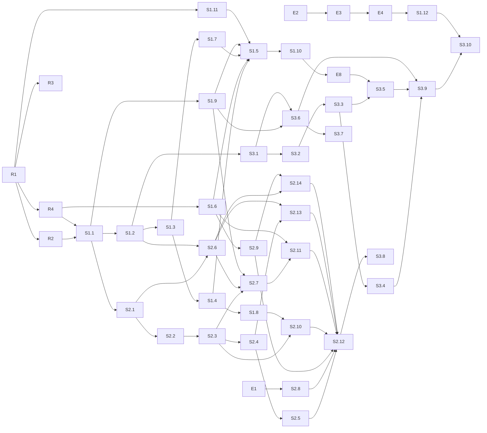

# 开发任务清单 v0.2 —— 基于 Graph 的 AI 中台

> 配套：`graph-ai-middle-platform-design.md`（v0.2）。任务按三条垂直切片组织：S1 一个用户能聊且每轮入图；S2 能经审批做事并动态拉起 Worker；S3 图有内容、看得见、找得到。S1 + S2 + S3 = 最小当前版本。
> 环境具体值不出现在本文件，用占位符，取值见未入库的 `docs/private/`。
> 日期：2026-09-01

---

## 0. 约定

### 0.1 任务字段

**目标 / 交付物 / 涉及路径 / 依赖 / 验收 / 建议执行者 / 需人工批准 / 不做**。验收必须是可执行命令加期望结果。

- 建议执行者：`Codex` 或 `Claude Code`（实现）、`人`（登录目标主机或决策）、`Claude Code@host`（经 SSH 在目标主机跑低风险命令）。
- 需人工批准 = 会影响目标主机上运行中的其他服务或不可逆；这类只写建议，不由 agent 执行。

### 0.2 占位符

`<TARGET_HOST>`、`${NEXTTIME_DATA}`、`${KERNEL_BIND_ADDR}`、`${NEXTTIME_SUBNET_CONTROL}` / `${NEXTTIME_SUBNET_WORKERS}`、`${WORKER_RUNTIME}`、`<CODE_DIR>`。

### 0.3 工程约定（全 TS）

- Node 24、TypeScript strict、pnpm workspaces、`erasableSyntaxOnly`；Biome 做 lint 与 format；Vitest。
- kernel：Fastify + `ws` + `pg`（原生驱动，显式 SQL，无 ORM）+ Zod + `@modelcontextprotocol/sdk` + `jose`（Handle 签名 EdDSA）+ pino + OpenTelemetry。
- 迁移：`packages/kernel/migrations/NNNN_name.sql` + 幂等 runner（`schema_migrations` 表）。
- 状态机一律转移表驱动，非法转移抛 `IllegalTransition`。
- 所有受治理写入与 `audit_records` 同事务（I11）。
- pi 锁 `@earendil-works/pi-coding-agent@0.84.4`；平台扩展只依赖文档化事件。
- 共享类型在 `packages/shared`：capability 注册表、事件、`ActionDescription`、Zod schema；HTTP 路由、MCP 工具、WS 方法都由注册表生成或校验。
- HTTP capability 投影约定：`POST /api/cap/<capability_name>`，`Authorization: Bearer <handle>`（S1.6 落地此约定）。
- 不写任何真实地址、密钥、知识库 ID；测试用 `example` 值。每任务一分支一 PR。

### 0.4 里程碑

| 里程碑 | 目标 | 设计目标 |
|--------|------|---------|
| E | 目标主机可跑 Postgres 与全部服务 | — |
| R | monorepo 能 lint / test / build / migrate | — |
| S1 | 登录 → 对话 → 自己的 pi 回答 → Turn 入图 | G3 部分、G4 部分 |
| S2 | 说需求 → find_workers → invoke_worker → 门动作 → 审批卡片 → 执行 → 写回 | G1、G2、G4 |
| S3 | 本体 v1 + 采集器 + Explorer + MCP gateway | G3、G5、G6 |

---

## 1. E — 环境准备（目标主机）

### E1 验证 gVisor
- 验收：`docker run --rm --runtime=runsc alpine:3.20 true; echo $?` 为 0；失败则 `.env` 里 `WORKER_RUNTIME=runc`。
- 执行者：Claude Code@host。批准：否。

### E2 目录树与密钥目录
- 目标：`${NEXTTIME_DATA}/{pgdata,workspaces,secrets,config,artifacts,backups,caddy}`；`secrets/` 0700；`workspaces/<uid>/` 只挂给该用户的入口容器，`workspaces/tasks/<task_id>/` 只挂给该 Task 的 Worker（I15）。
- 验收：`stat -c '%a %n' ${NEXTTIME_DATA}/secrets` 为 `700 …`；七个子目录齐全。
- 执行者：Claude Code@host。批准：否。

### E3 代码检出与 `.env`
- 目标：clone 到 `<CODE_DIR>`；从 `.env.example` 生成 `.env`（`NEXTTIME_DATA / KERNEL_BIND_ADDR / NEXTTIME_SUBNET_* / WORKER_RUNTIME`）。
- 验收：`docker compose config >/dev/null && echo ok`。依赖：R1、E1。批准：否。

### E4 Postgres
- 验收：`docker compose up -d postgres && docker compose exec postgres pg_isready -U nexttime`；`create extension if not exists vector` 成功。依赖：E2、E3、R1。批准：否。不做：不发布 5432。

### E5 Docker 日志轮转与 live-restore
- 已决定不做（2026-09-01）。发现保留在 `docs/private/`。

### E6 收敛 0.0.0.0 端口
- 已决定不做（2026-09-01）。

### E7 平台备份定时器
- 暂不做；设计 §13 的库损坏恢复依赖它，S3 完成后重评。届时交付 `deploy/systemd/nexttime-backup.{service,timer}`、`scripts/backup.sh`、`scripts/restore.sh`。

### E8 caddy TLS 与静态服务
- 目标：`caddy` 容器是唯一公网面：TLS（内网 CA 或自签）、`/` 服务 `packages/web/dist`、`/explorer` 服务 Explorer 构建、反代 `/api` `/ws` `/mcp` `/llm` 到 kernel。
- 交付物：`deploy/caddy/Caddyfile`；compose `caddy` 服务；`.env` 增 `KERNEL_PUBLIC_URL`。
- 验收：`curl -k https://${KERNEL_BIND_ADDR}:8443/api/health` 200；kernel 不对主机发布任何端口（`docker port` 为空）。
- 依赖：S1.6。执行者：Codex 写，Claude Code@host 部署。批准：否。
- 实现（分支 `task/e8-caddy-tls`）：`/api` `/ws` `/mcp` `/llm` 按本条文字反代到 `kernel:8080`；
  `/llm` 未按设计 §7.7 转给独立的 `llm-proxy` 服务——本条验收文字与 §7.7 的分工不一致，未擅自
  改动，见对应 PR 说明。`/` `/explorer` 在 S1.8 / S3 落地前挂占位静态根（`deploy/caddy/{placeholder,
  explorer-placeholder}`），切换步骤见 `docs/runbooks/host-caddy.md`。caddy 容器以镜像默认的
  root 用户运行（官方 `caddy:2.10` 镜像的 `/config` 卷 root-owned，非 root 需自定义 Dockerfile，
  超出本任务范围）。

---

## 2. R — 仓库骨架

### R1 monorepo 骨架
- 交付物：`pnpm-workspace.yaml`、根 `package.json`、`tsconfig.base.json`、`biome.json`、`vitest.base.ts`；`packages/{kernel,agent-host,worker-supervisor,platform-extension,web,gatekeeper-base,llm-proxy,egress-proxy,shared}` 各有 `package.json` / `src/index.ts` / 一个测试；`.dependency-cruiser.cjs`（设计 §7.10 的六层单向依赖与模块契约：`chat` / `web` 不得 import `approval` / `task`，模块不得 import 他模块内部文件）；`packages/kernel/Dockerfile`、`packages/agent-host/Dockerfile`、`packages/worker-supervisor/Dockerfile`（多阶段、非 root）；`docker-compose.yml`（设计 §10.2）；`.env.example`；`Makefile`（`lint test build migrate up down gen-models`）；`scripts/test-db.sh`。
- 验收：`pnpm install && pnpm -r lint && pnpm -r test && pnpm -r build` 通过；`docker compose config` 通过；三个镜像 build 成功。
- 执行者：Codex。批准：否。不做：业务表。

### R2 迁移机制与连接池
- 交付物：`packages/kernel/src/adapters/db/{migrate,pool}.ts`（每请求设置 `app.workspace_id` 与 `app.principal_id` 会话变量）、`packages/kernel/src/cli/migrate.ts`（迁移 CLI 入口）、`migrations/0000_extensions.sql`。
- 验收：`make migrate` 两次，第二次 no-op。依赖：R1。

### R3 CI
- 交付物：`.github/workflows/ci.yml`：Biome + Vitest（`services: postgres`）+ gitleaks + 内网 IP 守门（`grep -rE '10\.[0-9]+\.[0-9]+\.[0-9]+|172\.(1[6-9]|2[0-9]|3[01])\.'` 命中即失败）+ `dependency-cruiser` 违规即失败 + 内核纯度守门 `scripts/check-kernel-purity.sh`（`grep -rniE -f scripts/system-names.txt packages/kernel/src --exclude-dir=__fixtures__ --exclude='*.test.ts'`，清单初始为 `docker|ragflow|routeros|erp|oa|semantica|hermes`，命中即失败）。
- 验收：故意放一个 `10.0.0.1` 的提交被拦。依赖：R1。

### R4 领域类型、转移表、capability 注册表
- 交付物：`packages/shared/src/{enums,transitions,capabilities,events,action-description}.ts`；转移表覆盖 Fact 生命周期、Conflict、Decision、ActionRequest、Task、WorkerRun、EntryAgent session、OntologyVersion / WorkerDefinition、Grant；capability 注册表含名字、模式、通道（human / handle）、所需角色、参数 Zod schema。
- 验收：转移表穷举测试；`proposed → executing` 抛错；注册表中每个 capability 有且只有一个通道声明。依赖：R1。

---

## 3. S1 — 一个用户能聊，每轮入图

### S1.1 核心表迁移（含隔离列）
- 交付物：`packages/kernel/migrations/core/0001_core.sql`：`workspaces / principals(api_key_hash, role) / sessions(kind, on_behalf_of) / ontology_versions / objects / activities(kind, chat_id, sequence, status) / sources(owner_principal_id, visibility) / observations / links / conflicts / decisions / evidence / chats / audit_records`；RLS：workspace 匹配且（`visibility='workspace'` 或 owner = 当前 principal）；触发器：已发布本体只读、links 内容列不可改、audit 只增。
- 验收：`packages/kernel/src/substrate/` 下的 `test_invariants_db`：I1、I3、I4、I12、audit 不可删；用户 B 的会话读不到用户 A 的 `chats` 与私有 `sources`。
- 依赖：R2、R4。

### S1.2 graph store 最小实现
- 交付物：`packages/kernel/src/graph/{store,sql-store}.ts`：`upsert_object / assert_fact / supersede_fact / invalidate_fact / get_object / neighbors / traverse(≤3) / state_at`；`epistemic_status` 由调用方 Principal 类型决定。
- 验收：`state_at(t0)` 在 supersede 后仍返回旧值；事务失败无半条记录。依赖：S1.1。

### S1.3 gateway human 通道 + audit + explain
- 交付物：`gateway/auth.ts`（API key → Principal，创建 `web` 会话）、`audit/{writer,reconstruct}.ts`、`epistemic/explain.ts`（Fact / Decision / Turn → Observation → Activity → Source + Principal）。
- 验收：无 key 401；`member` 调 `grant_capability` 403；任一 Fact / Turn 的 `explain` 到 Source 与 Principal；audit 写失败整体回滚。依赖：S1.2。

### S1.4 chat 模块与 WS RPC
- 交付物：`chat/{service,ws}.ts`：`list_chats / new_chat / send_chat_message / stop_agent / get_chat_history / subscribe_chat`；Turn = `activities(kind='agent_turn')`；推送事件 `chat.message / chat.stream / chat.metadata`；同一 Chat 只允许一个进行中 Turn；`outbox` 派发器（写入侧 `substrate/outbox/enqueue.ts` 已随 S1.2 落地——同事务写入、唯一写路径；本任务补 application 层的派发器：进程内派发、重启重放、消费者幂等）；`host-bridge` 定义 `AgentRuntime` 接口并把 pi 的 RPC 事件翻译为平台事件词表，chat 只消费平台事件。
- 验收：WS 客户端先 `subscribe_chat` 再 `get_chat_history`，用脚本在翻页期间注入事件，不丢不重；进行中再发消息被拒。依赖：S1.3。
- 实现说明（S1.4 PR，2026-09）：
  - 落地路径与设计文档草案不同：`application/chat/{service,event-sink,push,recovery,index}.ts`（`chat/{service,ws}.ts` 中的 `ws.ts` 部分实际落在 `interfaces/ws/{server,rpc,index}.ts`，遵循 §7.10 的六层分层——`interfaces` 只依赖 `application` 服务接口）；`application/outbox/{dispatcher,index}.ts`；`application/host-bridge/{agent-runtime,fake-runtime,turn-started-consumer,index}.ts`。
  - `chat_messages` 落在新迁移 `migrations/core/0008_chat_messages.sql`（`turn_id` 可空，`sequence bigint` 由 `application/chat` 按 `(workspace_id, chat_id)` 分配，advisory lock 序列化并发写；一 Chat 一进行中 Turn 由该文件新增的 `activities_one_running_turn_per_chat_uidx` 部分唯一索引强制）。
  - `AGENT_RUNTIME` 环境变量（默认 `fake`，唯一实现是 `FakeAgentRuntime`）与 `TURN_INTERRUPT_TIMEOUT_MS`（S1.4 交付物 7 的可配置超时，默认 15 分钟）由 `packages/kernel/src/index.ts` 的 `main()` 读取。
  - 已知偏离：`send_chat_message` 在已有进行中 Turn 时抛 `TurnAlreadyRunningError`；`interfaces/http/**` 不在本任务所有权范围内，其固定的错误映射表无法识别这个新错误类，因此经 HTTP 该情形回退为 `500`（非文档设想的 `409`）——WS 传输（本任务所有权范围内）正确映射为独立的 JSON-RPC 错误码 `-32010`。`get_entry_context`/`report_turn` 的 S1 范围只含最近 Fact（`pendingApprovals`/`tasks`/`precedents` 恒为空数组，等 S2 的 approval/task 模块落地后再填充）；"上轮中断" 尚未注入 `get_entry_context`（S1.4 交付物 7 已实现启动时扫描并标记 `interrupted` + 推送 `chat.metadata`，但把这个信号读进下一轮 `context` 留给 S1.5，详见 `application/chat/recovery.ts` 的模块注释）。

### S1.5 每用户一个常驻入口容器：agent 镜像、supervisor 最小实现、agent-host 事件桥
- 交付物：`worker-runtime/Dockerfile`（node:24-bookworm-slim、pi 0.84.4、平台扩展、工具链 git / curl / python3 / pip / build-essential / ripgrep；非 root；只读根，`/workspace` 与 `/tmp` 可写）；`packages/worker-supervisor` 的常驻模式：`spawnResident(user)` 以 `--runtime ${WORKER_RUNTIME}`、`--cap-drop ALL`、挂载 `${NEXTTIME_DATA}/workspaces/<uid>` 到 `/workspace`（含 `--session-dir` 与 `PI_CODING_AGENT_DIR`）、只读挂载 `models.json`，env 只含 `KERNEL_URL / KERNEL_LLM_URL / CAPABILITY_HANDLE / NEXTTIME_MODE=entry / HTTP_PROXY / HTTPS_PROXY / NO_PROXY`，**不继承宿主 env**，容器内 `pi --mode rpc --system-prompt <入口定义> -e platform-extension`，**内置工具全开**；`packages/agent-host/src/{host,bridge}.ts`：向 supervisor 申请 / 停止入口容器、向内核申请入口 Handle、把容器 stdout 的 JSONL 事件桥到内核 `host-bridge`、写回 `prompt / stop`；崩溃自动重拉；空闲超时停容器。
- 验收：两个用户各自容器、各自 `workspaces/<uid>`；`docker kill` 某用户入口容器后再发消息，对话可续且历史完整；容器 env 无任何 `*_API_KEY`；容器内能 `curl https://example.com`（经代理）、能 `pip install requests`、能写 `/workspace`；`curl http://postgres:5432` 与任一内网地址失败。依赖：S1.4、S1.7、S1.9、S1.11。
- 不做：不给入口 Handle 任何门的 execute 能力；不在宿主进程内跑 pi。
- 实现说明（S1.5a PR，2026-09；本任务拆成两半——前半为 agent 镜像 + supervisor 常驻模式，后半
  agent-host 事件桥 + 内核真正的 `AgentRuntime` 是后续任务）：
  - 落地路径与本条文字不同：Dockerfile 在 `deploy/worker-runtime/Dockerfile`（非仓库根
    `worker-runtime/`，设计文档 §10.1 未同步，只同步了 §10.2 的 compose 片段）。
  - pi 0.84.4 没有 `--system-prompt-file` flag（本条文字与设计文档均未提及具体 flag 名，实现时
    验证得出）；用 `--system-prompt <path>`（`resource-loader.ts` `resolvePromptInput`
    在路径存在时按文件内容读取，效果等价），路径 `/workspace/.nexttime/system-prompt.md`，
    entrypoint.sh 首次运行时写入一份 S1 stopgap 默认文案（S2.6 的 WorkerDefinition 发布版本
    替换前占位）。**S2.6 更新**：这份静态文案现在是 fallback——`worker-supervisor` 在 spawn 前把
    已发布 entry WorkerDefinition 的 `systemPrompt` 写进这个路径，entrypoint.sh 本身文字不变
    （文件不存在才写），只是通常这个文件已经被提前放好了；仅当工作区从未发布过 entry
    WorkerDefinition，或内核/supervisor 链路解析失败时，这份静态文案才真正生效。
  - env 清单在本条文字的基础上多一个 `WORKSPACE_ID`：`@nexttime/platform-extension` 的
    `index.ts` 用 `readRequiredEnv('WORKSPACE_ID')`，缺它会直接抛错，且 platform-extension
    不在本任务所有权范围内。
  - `worker-supervisor` 常驻模式用 Fastify（与 kernel 同栈，且任务验收要求 `Fastify inject`
    路由测试）+ `dockerode`（Docker Engine API 客户端，只用 unix socket，不用其可选的 ssh
    传输——`pnpm-workspace.yaml` 因此把 `cpu-features`/`ssh2` 的构建脚本标 `false`）：
    `POST /resident/spawn|stop`、`GET /resident/:principalId`、
    `POST /resident/:principalId/touch`、`GET /healthz`；崩溃/kill/空闲停止后下次 spawn 一律
    整个重建容器（非同容器 `docker start`），`nexttime.restarts` label 记数，跨 supervisor 重启
    存活；`workers` 网络名不写死 `${project}_workers`，按 Compose 打的
    `com.docker.compose.network=workers` 标签在启动时解析（可用 `NETWORK_WORKERS` 覆盖）。
  - egress-proxy 没有注册用的 admin 端点（只有 `GET /healthz`）：按设计文档 §7.9 与该包
    `source-map.ts` 自己的文档，直接读写 `SOURCE_MAP_FILE`（`config/egress-sources.json`），
    `sourceId` 编码为 `entry:<workspaceId>:<principalId>`（该包把 `sourceId`
    当作不透明字符串，`report.ts` 自己的注释也说明"把它变回 workspaceId/activityId 是内核
    host-bridge 的事"——留给后半任务解析这个格式）。
  - pi 的会话目录落在各用户工作区内（`/workspace/.pi/sessions`，即 `workspaces/<uid>/.pi/sessions`），
    一个用户只有一个挂载点（I15）。原设计里的顶层 `${NEXTTIME_DATA}/sessions` 目录、kernel 与
    worker-supervisor 对它的挂载、以及备份里的 `sessions/` 都已在 S1.5a 之后的清理 PR 中去掉
    （2026-09-02 决定）；将来若需要内核读会话 JSONL，走 `workspaces/*/.pi/sessions/` 的只读挂载。
  - 主机验收（在目标主机上实测，非本地）暴露并修了四个之前没预料到的问题——细节均在
    `docs/runbooks/host-worker-runtime.md` §10：(1) `worker-supervisor` 以非 root 运行连
    docker.sock 要主机 docker 组 gid，`docker-compose.yml` 加 `group_add`；(2) bind-mount
    `models.json` 会让 Docker 以 root 建出 `.pi/`，非 root 入口容器建不了兄弟目录
    `.pi/sessions`——`resident-service.ts` 改成 supervisor 自己先建好这个目录；(3) egress 登记
    写文件失败不应该拖垮 spawn，改成 best-effort；(4) plain `http://` 请求只认小写
    `http_proxy`（"httpoxy" 规避的历史遗留），额外注入了小写三件套。
  - 主机验收还发现一个**不是代码 bug、但会让 `curl https://example.com` 验收失败**的环境问题：
    目标主机的 DNS 把公网域名解析到该主机自己网络的一个内网段（那个内网段确实可达，像是一层
    透明网关代理），`egress-proxy` 的私网判定（I10 防 DNS rebinding 的既有设计）因此正确地把它
    当私有地址拒绝——这是主机网络本身的特性，不是这几个服务的缺陷，未做任何"放宽私网判定"来
    迁就这一台主机。详见 `docs/runbooks/host-worker-runtime.md` §10。
- 实现说明（S1.5b PR，2026-09；本任务的后半——agent-host 事件桥、内核真正的 `AgentRuntime`、假
  LLM 上游、S1.5a 遗留的一处 WS 竞态修复）：
  - 落地路径：`packages/agent-host/src/{host,bridge,supervisor-client,container-io,kernel-link,
    index}.ts`；`packages/kernel/src/application/host-bridge/agent-host-runtime.ts`
    （`AgentHostRuntime`）；`packages/kernel/src/interfaces/ws/agent-host.ts`
    （`GET /internal/agent-host`）；`packages/shared/src/agent-host-protocol.ts`（kernel⇄
    agent-host 共享的 zod 协议——同 `handle-token.ts` 已有的"kernel 与另一进程共享一份 wire schema"
    先例）；`deploy/fake-llm/{Dockerfile,server.mjs}`；
    `config/llm-providers.fake.example.yaml`；`packages/llm-proxy/src/cli/gen-models.ts`。
  - `AGENT_RUNTIME=agent-host` 现在是 `docker-compose.yml` 里 `kernel` 服务的默认值（原来只有
    `fake`）；`fake` 仍可用 `.env` 的 `AGENT_RUNTIME=fake` 选回来。
  - kernel⇄agent-host 协议、pi 事件→平台事件映射表、agent-host 自身的编排规则（每 principal 至多
    一个 in-flight Turn；容器 stdio 崩溃处理；`hello` 的 `instanceId` 如何区分"重连"与"进程重启"）
    详见 `docs/runbooks/host-agent-host.md` §2；主机验收记录见该 runbook §3 与 PR body。
  - `deploy/fake-llm/server.mjs` 是纯 ESM JavaScript、零依赖（不是 TypeScript+构建）——这个目录
    不在 pnpm workspace（`pnpm-workspace.yaml` 只 glob `packages/*`），为一个文件单独搭一套 TS
    构建链，比直接用 `node` 跑源码更违背"no deps beyond node"的字面意思。
  - `make gen-models` 改成经容器化的 `llm-proxy` 镜像跑（新增
    `packages/llm-proxy/src/cli/gen-models.ts`），不再需要本机 corepack/node——目标主机没有这些
    （`docs/runbooks/host-worker-runtime.md` §10 已经点出这个缺口）；根目录既有的
    `scripts/gen-models-json.ts` 未删除，仍是本机开发时的一条独立可用路径。
  - 顺手修的既有 bug（S1.4 遗留，本任务 item 6，`packages/kernel/src/interfaces/ws/server.ts`）：
    `subscribe_chat` 的实时推送去重原来用"目前见过的最大 sequence"做单调水位线，但同一个 Chat 的
    `chat.message` 推送并不保证按 sequence 升序到达——用户自己那条消息由
    `interfaces/ws/server.ts` 的 `publishSentMessagePush` 在其请求 resolve 之后推送，助手回复由
    `application/chat/event-sink.ts` 独立地在 outbox 派发器的轮询节拍上推送，两条路径互不同步
    （虽然两者的 DB 提交顺序仍然保证正确）。若助手回复的推送先于用户自己那条消息的推送抵达监听器，
    旧的水位线逻辑会把后到达的、sequence 更小的用户消息误判成"已经发过"而直接丢弃——从未真正发送、
    也从未被 replay 补上。改成按精确 sequence 成员判定的 `Set`（`shouldDeliver`），不再假设到达顺序
    单调。`interfaces/ws/server.test.ts` 的既有并发测试补了一次确定性的收尾扫描（同一个 gap 也会让
    并发 paging 循环本身在最后一条消息提交前后有类似的、与推送无关的覆盖不全风险）与一条独立断言
    "仅靠推送本身也必须覆盖全部 sequence"，把这个 bug 单独钉死，而不是被 paging 的兜底覆盖悄悄遮盖。
  - 已知偏离（详见 PR body "假设与偏离"）：容器 stdio attach 放在 agent-host 自己（只读挂载
    `DOCKER_SOCKET_PATH`），没有给 `worker-supervisor` 新增附着端点，保持它自 S1.5a 主机验收后完全
    不动；入口 `sessions` 行的 `principal_id` 就是人类 Principal 自己（未铸造单独的
    `kind='agent'` Principal 代表"入口 agent 实例"）；`agent-host` 每个用户任一时刻只处理一个
    Turn（pi 一个进程一次只能跑一个 prompt）——同一用户第二个 Chat 并发发消息被直接
    `turnRejected`，多 Chat 共享一个入口容器的并发模型不在本任务范围内解决。

### S1.6 platform-extension `entry` 模式
- 交付物：`packages/platform-extension/src/{index,kernel-client,modes/entry}.ts`：S1 只注册 observe 组工具（`get_object / traverse / search / explain / get_task`），`find_workers` 与 `invoke_worker` 随 S2.7 加入；`context` 事件注入该用户待审批、进行中 Task、相关 Fact 与先例；`session_*` 事件把 `turn_id` 写入会话条目并回传 Turn 结果；契约测试用 pi 的 faux provider + fake kernel。
- 验收：`pnpm --filter platform-extension test`；fake kernel 收到带 `turn_id` 的回传。依赖：R4。

### S1.7 `llm-proxy` 独立服务
- 目标：按 provider 透传；provider key 只在这里；内核进程零外部凭证（I9）。
- 交付物：`packages/llm-proxy`（读 `${NEXTTIME_DATA}/config/llm-providers.yaml`；入站 Handle 从该 provider `auth` 指定的头读取，用内核公钥 EdDSA **本地**验签与过期检查，撤销表按 `jti` 周期同步不逐请求回调；换真实 key；模型白名单；SSE 原样；OpenAI 兼容与 Anthropic 两种 `usage` 解析；用量与 80% 预算警告经 `POST /internal/llm-usage` 上报内核，失败本地队列重放）；内核 `llm-usage` 模块与 `migrations/llm-usage/0001.sql`；`scripts/gen-models-json.ts`。
- 验收：无 Handle 401；过期 / 撤销 Handle 401；白名单外 403；流式逐块转发且与直连 fake upstream 逐字节一致；`llm_usage` 记 provider / model / tokens / turn_id；内核容器 env 与文件系统中不存在任何 provider key；杀掉内核后代理仍能转发并在内核恢复后补报用量。依赖：S1.3、S1.9。
- 补注（S1.7 `turn_id` 归因 PR，2026-09）：`llm_usage.turn_id` 此前恒为 NULL——`governance/llm-usage/service.ts` 的
  `recordUsage` 一直留有 `resolveTurnId` 钩子（默认恒返回 `null`），但从未有调用方注入过真实实现，且该模块本身不能
  import `application`（§7.10 分层：governance 不依赖 application）。本补丁把 S1.10 egress 已有的归因规则——
  principal 当前 `running` 的 `agent_turn`，否则取 5 分钟内最近一次（任意状态）——从
  `application/host-bridge/egress-observations.ts` 抽成同目录 `turn-attribution.ts` 的 `findAttributableTurn`
  （已解析 principalId 版，egress 复用，行为不变）与 `findAttributableTurnForSession`（先按 `sessionId` 查
  `sessions.principal_id` 再归因，`llm-usage` 专用，因为上报只带 `sessionId`）；`interfaces/http/internal/
  llm-usage.ts`——已经依赖 application 与 governance 的合法分层位置——在 `recordUsage` 所在的同一事务 `client`
  上构造 `resolveTurnId` 闭包传入，governance 侧代码不改一行，只是终于有人喂了真实实现。局限：①落在归因窗口外
  （既无 running 也无 5 分钟内的 Turn——例如 S2 前还不存在的 Worker session，或代理重放上报延迟超窗）时
  `turn_id` 记为 NULL 并 debug 级日志，从不因此拒绝上报；②`llm_usage` 的
  `on conflict (workspace_id, jti, started_at) do nothing` 保证重放不会覆盖已写入行的 `turn_id`；③一次批量上报可
  跨多个 session/principal，外层 `withWorkspace` 只用首条记录的 `sessionId` 当占位符，而 `activities_visibility`
  这条 RLS 按 `app.principal_id` 收窄可见的 Chat/Activity——`findAttributableTurnForSession` 因此在查
  `activities` 前用 `set_config('app.principal_id', ..., true)`（事务级，同 `withWorkspace` 自身机制）把它重新
  指向刚解析出的 principal，否则归因查询会因看不到该 principal 的 Turn 而总是落到"无归因"分支。

### S1.8 web：登录与对话
- 交付物：`packages/web`：登录（API key）、对话页（流式文本、工具调用行、Turn 状态）、WS 客户端（先订阅再翻页规则封装进 client）。
- 验收：Playwright：登录 → 新对话 → 发消息 → 看到流式回复 → 刷新后历史完整。依赖：S1.4。
- 实现说明（S1.8 PR，2026-09）：
  - `packages/web/src/lib/ws-client.ts`：`WsClient`（`connect` / `authenticate` / `call` / `subscribeChat` / `sendChatMessage` / `stopAgent`）是唯一封装"先 `subscribe_chat` 再 `get_chat_history` 翻页"规则的地方——`subscribeChat` 用一个按 `sequence` 去重的 `Set` 同时吃掉初次翻页与翻页期间到达的实时推送，socket 意外断开后自动重连并以最后已知 `sequence` 重新 `subscribe_chat`。`-32010`（`TURN_ALREADY_RUNNING`，`interfaces/ws/rpc.ts`）映射成 `TurnAlreadyRunningError`（`RpcError` 子类）而非裸错误消息。页面层（`ChatPage.tsx`）把持久消息（`chat.message`）与当前 Turn 的临时态（`chat.stream`/`chat.metadata`，`lib/streaming-reducer.ts`）分成两份独立 state，互不污染。
  - 页面：`LoginPage`（API key 存 `sessionStorage`，绝不进 `localStorage`/cookie）、`ChatListPage`（`list_chats`/`new_chat`）、`ChatPage`（消息列表、流式文本、工具调用行、`TurnStatusBadge`、`stop_agent` 按钮），`App.tsx` 用 URL hash（`#/chats/<id>`）而非路由库记住当前会话，刷新页面后能定位回同一个 Chat 并从 `startAfter=0` 重新走一遍"先订阅再翻页"。
  - 依赖：`react`/`react-dom`（沿用 R1 骨架版本）；新增 `@nexttime/shared`（`devDependencies`，只做 `import type` 取 `ChatStreamPayload` 等类型，`verbatimModuleSyntax` 下编译期整体擦除，不进产物体积——`pnpm --filter @nexttime/web build` 产物约 156KB / gzip 50KB）与 `@playwright/test`（`devDependencies`，仅 `e2e` 脚本用，不进 `pnpm -r test`）。未引入 UI 框架或路由库。
  - 已知偏离（详见 `packages/web/README.md`"假设与偏离"）：human 通道没有可读能力判断"这个 Chat 当前是否有 Turn 在跑"（`get_entry_context` 只在 Handle 通道，S1 范围）——对话页打开时 composer 默认可用，靠 `send_chat_message` 的 `-32010` 响应被动发现已有 Turn 在跑，`stop_agent` 不需要知道 `turnId`（服务端按 chatId 自己找那个唯一在跑的 Turn），因此 Stop 按钮始终可点，不依赖本页是否是发起者。
  - `packages/web/e2e/chat.spec.ts` + `playwright.config.ts`：显式 opt-in（`pnpm --filter @nexttime/web e2e`，需要 `WEB_E2E_BASE_URL` + `WEB_E2E_API_KEY`，且要求目标内核以 `AGENT_RUNTIME=fake` 启动，验收流程依赖 fake runtime 回显 `echo: <prompt>` 的确定性），不在 `pnpm test`/CI 里跑；S1.10 的 `scripts/accept_s1.sh` 预期用同样的两个环境变量把它接进验收链，见 README 的对应小节。
  - `docs/runbooks/host-caddy.md` §E8.5：补了一段确认构建命令与产物目录的说明，并顺手把原文里不精确的 `pnpm --filter web build`（缺 `@nexttime/` 前缀，`--filter` 按精确包名匹配会找不到包）改成 `corepack pnpm --filter @nexttime/web build`。

### S1.9 Handle 最小实现（入口 Handle）
- 交付物：`capability/{model,handles}.ts`：EdDSA JWT，含 `workspace / session / on_behalf_of / scope / exp / jti`；撤销表；agent-host 在申请入口容器前向内核申请入口 Handle（能力上限 = 入口 WorkerDefinition 固定集合）；内核公钥导出到 `${NEXTTIME_DATA}/config/handle.pub` 供 `llm-proxy` 本地验签。
- 验收：过期 / 撤销 / 篡改 401；请求体带 `on_behalf_of` 被拒（I13）。依赖：S1.1。

### S1.10 S1 验收脚本
- 交付物：`scripts/accept_s1.sh`：建 workspace、两个用户、发布入口 WorkerDefinition、各自对话、杀容器续聊、`explain(turn)`、隔离断言、出网代理断言（公网通、内网不通、目标域名出现在 Activity）。
- 验收：退出 0 打印 `S1 OK`。
- 实现说明（S1.10 PR，2026-09）：
  - 落地路径：`scripts/accept_s1.sh`（POSIX sh，一次性 kernel 镜像容器跑每一次 JSON-RPC 交互——
    宿主机没有 node/corepack；挂载只读的 `ws-client.mjs` 驱动脚本，见其自身头注释）；
    `docs/runbooks/accept-s1.md`。
  - **"发布入口 WorkerDefinition"未做，如实 `SKIP entry-worker-definition (S2.6)`**：
    WorkerDefinition 注册表是 S2.6 的交付物；S1 阶段入口定义是烧进 `worker-runtime` 镜像的静态
    system prompt（S1.5a 实现说明），S1.10 派发文字本身也认了这一点（"WorkerDefinitions land in
    S2.6 ... Print SKIP ... do not fake it"）。
  - **kernel 侧补的一个缺口**：`POST /internal/egress`（见 S1.11 条目下的补注）——脚本要断言"目标
    域名出现在 Activity"，但 `egress-proxy`（S1.11）上报的 `${KERNEL_URL}/internal/egress` 此前
    在内核侧没有路由接收。
  - `bootstrap.js` 增加 `add-principal --workspace <id> --name <name> [--role <role>]` 子命令
    （`packages/kernel/src/cli/bootstrap.ts`）：`create-workspace` 只造第一个（owner）用户，脚本
    需要在同一 workspace 里再造一个 `member` 用户（bob）验证隔离，同样的"打印一次 API key，只存
    hash"约定。
  - 已知偏离（详见 `docs/runbooks/accept-s1.md` "已知缺口"）：出网域名落进 Activity 的断言用直接
    `psql` 读，不经某个 capability（`audit_query` 看不到这次服务间写入；`explain` 的投影不含原始
    `metadata`）；"send 后立即 curl" 是顺序执行，不是真正的后台并发（内核侧新增的"最近一个 Turn"
    回退归因窗口让这一步的时机不再关键）。

### S1.11 出网代理
- 目标：agent 容器上公网必经代理；公网放行、内网与平台内部服务拒绝；按来源容器套用 WorkerDefinition 的允许 / 拒绝清单；记录目标域名与字节数到该次 Activity（I10）。
- 交付物：`packages/egress-proxy`（Node CONNECT / HTTP 转发代理，或 tinyproxy + 策略脚本；挂在 `control` 与 `workers` 网络；来源 ip → WorkerRun / 入口会话由 supervisor 注册表解析；拒绝 RFC1918、链路本地、`postgres` / `kernel` 等服务名；日志经内核 `host-bridge` 写 Activity `metadata.egress[]`）；compose 服务；`workers` 网络保持 `internal: true`。
- 验收：容器内 `curl https://example.com` 200；`curl http://10.0.0.1` 与 `curl http://postgres:5432` 被拒；Activity 记录含 `example.com`；WorkerDefinition 加 `deny: [example.com]` 后被拒。依赖：R1。
- 不做：不解密 TLS；不做内容过滤。
- 补注（S1.10 PR，2026-09）：`packages/egress-proxy` 自 S1.11 落地起就已经在向
  `${KERNEL_URL}/internal/egress` 上报（`packages/egress-proxy/src/report.ts` 的
  `EgressReporter`），但"Activity 记录含 example.com"这条验收此前无法兑现——内核侧一直没有这个
  路由接收上报。S1.10 补上：`packages/kernel/src/interfaces/http/internal/egress.ts`（路由，同
  `/internal/llm-usage` 一样 `control` 网络内无额外鉴权）+
  `packages/kernel/src/application/host-bridge/egress-observations.ts`（解析
  `sourceId=entry:<workspaceId>:<principalId>`——格式定义在 `packages/worker-supervisor/src/
  egress-map.ts`——找该 principal 当前在跑的 Turn 或最近 5 分钟内的 Turn 作回退，追加进
  `activities.metadata.egress`，有界 200 条，发 `EgressObserved` 领域事件）。

### S1.12 最小备份（compose 内，不改主机）
- 目标：每日 `pg_dump` + `workspaces/` 与 `config/` 的 tar 到 `${NEXTTIME_DATA}/backups/`，保留 7 份；恢复脚本可演练。之前 E7 被暂缓，这里以 compose 内容器形式回归，理由：设计 §10.4 与 §13 的回滚依赖它，且不触碰主机上任何现有服务。
- 交付物：`deploy/backup/backup.sh`、`scripts/restore.sh`、compose `backup` 服务（`postgres:17-alpine`）。
- 验收：`docker compose exec backup /backup.sh` 后 `backups/` 出现当日 dump；`scripts/restore.sh --dry-run` 通过；在临时库上真实恢复一次并跑 `accept_s1.sh`。依赖：E4。需人工批准：否。

---

## 4. S2 — 能经审批做事，动态拉起 Worker

### S2.1 治理表迁移
- 交付物：`migrations/0003_governance.sql`：`policies / capability_grants / capability_handles(parent_jti, on_behalf_of) / action_requests(on_behalf_of, await_decision, parent_worker_run_id, actor_runtime, idempotency_key, policy_decision CHECK) / gatekeepers / worker_definitions(kind, version, status) / tasks / worker_runs(parent_worker_run_id)`。
- 验收：I7 的 DB CHECK；`worker_definitions` 已发布只读。依赖：S1.1。
- 实现说明（S2.1 PR，2026-09）：
  - **文件落位**：本条文字的单文件 `migrations/0003_governance.sql` 未采用——仓库既有约定是每模块一个迁移目录（R2/S1.1 已定），本任务据此拆成四个文件：`migrations/governance/0002_policy.sql`（`policies` + `capability_grants`）、`migrations/governance/0003_action_requests.sql`（`action_requests`）、`migrations/task/0001_tasks.sql`（`tasks` + `worker_runs`）、`migrations/worker/0001_worker_definitions.sql`。`governance/0002`、`0003` 复用该模块已有的 advisory-lock key `7241000201`（锁是按模块而非按文件取的）；新增的 `task`、`worker` 模块各取一个新 key：`task` = `7241000401`，`worker` = `7241000501`（延续 core=`…101`、governance=`…201`、llm-usage=`…301` 的编号序列）。
  - **未创建 `gatekeepers` 表**（与本条文字及本 PR 派发文字的字面要求不同，已知偏离）：设计文档 §9.2 增量 SQL 草图自己的注释写明 "`gatekeeper_instances / operations / skills / procedures` 作为平台元本体存于 `objects / links`，状态与版本在 `properties`"，§5.1.2/S2.13 也确认注册一个门产生的是 `objects` 表里的一个 `Gatekeeper` 对象（图节点），不是关系表行；`packages/shared/src/events.ts`（`ActionRequestPendingEvent.gatekeeperId` / `ConnectionCreatedEvent.gatekeeperId`）与 `capabilities.ts`（`connect_gatekeeper({gatekeeperId, principalId})`、`propose_operation({gatekeeperId, operation})`）里 `gatekeeperId` 也全部当作图对象 id 使用，从未指向一张待建的表。因此 `action_requests.gatekeeper_id` 外键直接指向 `objects(workspace_id, id)`，本迁移不建 `gatekeepers` 表。
  - **`capability_handles` 的 `parent_jti`/`on_behalf_of` 已存在**：`governance/0001_capability_handles.sql`（S1.9 PR）建表时已含这两列并有 I13 的不可变触发器，本条文字要求的 `alter table capability_handles add column …` 是空操作，未新增任何 ALTER 迁移；`governance-schema.test.ts` 补了针对这两列的回归测试（root Handle 的 `parent_jti` 为 NULL、子 Handle 记录血缘、`on_behalf_of` 仍然 NOT NULL）而非重复造轮子。
  - **`action_requests.policy_decision` 设为可空**，未按本条派发文字字面的 `not null`（已知偏离，DB 层判断胜过字面指示）：`packages/shared/src/transitions.ts` 的 `ACTION_REQUEST_EDGES` 有真实的 `proposed →(evaluate_policy)→ policy_evaluated` 转移，`proposed` 状态必须能在决策产生前入库——`not null` 会让这个状态完全无法插入，与 I6 冲突比它"保护"的东西更大。I7/I11 改由三条 CHECK 实现：①（I6 支持）`status = 'proposed' or policy_decision is not null`；②（I7 核心）`status not in ('executing','executed','verified','compensated') or (policy_decision is not null and policy_decision <> 'deny' and (policy_decision <> 'require_approval' or approval_decision_id is not null))`；③（协调者复核追加，PR #33，2026-09）`status not in ('approved','rejected') or approval_decision_id is not null`——`approve`/`reject`（S2.3）同事务写 Approval Decision，`approved`/`rejected` 状态在写入的那一刻就必须带上这条 Decision，不能等到执行阶段的 ② 才发现缺失；`expired`/`denied`/`auto_approved` 不涉及人工决策，不受这条约束。
  - **`worker_definitions` 的 I12 触发器补上 `deprecated` 的内容不可变**（协调者复核追加，PR #33，2026-09）：原触发器只锁 `published` 行的内容与"只能转到 deprecated"，`deprecated` 行本身是完全可编辑的——但 `tasks.worker_definition_id`/`.worker_definition_version` 永久钉住某个 `(id, version)`，不论那个版本当前是 `published` 还是已经 `deprecated`，都必须保持可解析到当初真正跑过的内容。改为：`old.status in ('published','deprecated')` 时 `definition`/`kind` 一律不可改；`published` 只能转到 `deprecated`；`deprecated` 不允许任何 status 变化（含转回 `draft`/`published`）。
  - **CHECK 清单**（给后续任务对齐用；标 "无 `packages/shared` 对应导出" 的需要后续任务补一个 `*_VALUES` 导出）：
    - `action_requests.status`：`packages/shared` `ACTION_REQUEST_STATUS_VALUES`（13 态，proposed…compensated）。
    - `action_requests.policy_decision`：`'allow' | 'require_approval' | 'deny'` —— **无 `packages/shared` 对应导出**，建议 S2.2 加一个 `POLICY_DECISION_VALUES`。
    - `action_requests.blast_radius` 与 `policies.blast_radius`：`packages/shared` `BLAST_RADIUS_VALUES`（low/medium/high）。
    - `capability_grants.status`：`packages/shared` `GRANT_STATUS_VALUES`（active/revoked/expired）。
    - `tasks.status`：`packages/shared` `TASK_STATUS_VALUES`（7 态）。
    - `worker_runs.status`：`packages/shared` `WORKER_RUN_STATUS_VALUES`（4 态）。
    - `worker_definitions.kind`：`packages/shared` `WORKER_DEFINITION_KIND_VALUES`（entry/worker）。
    - `worker_definitions.status`：`packages/shared` `PUBLISHABLE_STATUS_VALUES`（draft/published/deprecated）。
    - 以上全部由 `governance-schema.test.ts` 的静态测试（读 `migrations/**` 与 `enums.ts` 比对）在 CI 每次跑，防止两边再漂移。
  - **跨模块外键——按 `migrate.ts` 的真实模块序（`core < governance < llm-usage < task < worker`，字典序）逐一判断**：`action_requests.gatekeeper_id → objects`、`.on_behalf_of → principals`、`.approval_decision_id → decisions`（均为 core 模块，governance 之前已建表，真实 FK）；`action_requests.parent_worker_run_id → worker_runs`：**无 FK**（`task` 模块排在 `governance` 之后，此列写入时 `worker_runs` 尚不存在），referential 检查留给 S2.3/S2.7 的应用层；`tasks.on_behalf_of → principals`、`.created_by_activity_id → activities`（core，真实 FK）；`tasks.worker_definition_id`/`.worker_definition_version → worker_definitions`：**无 FK**（`worker` 模块排在 `task` 之后），同样留给应用层（S2.6/S2.7）；`worker_runs.task_id`（同模块内，真实 FK）、`.parent_worker_run_id`（自引用，真实 FK）、`.session_id → sessions`（core，真实 FK）；`worker_definitions.proposed_by`/`.published_by → principals`（core，真实 FK）。两个"无 FK"的例外均在对应迁移文件的头注释里逐字解释，不是遗漏。
  - **`capability_grants` 用 `capability`/`scope` 而非 `action_kind`/`resource_scope` 命名**：直接照抄现有 `grant_capability` capability 的 `paramsSchema`（`{principalId, capability: z.string(), scope: jsonRecord}`，`packages/shared/src/capabilities.ts`），而不是另造一套字段名——`capability` 在用于满足 I14（审批者需持有该 `action_kind × resource_scope`）时即取值为对应的 `action_kind`，`scope` 的 `resourceScope` 键与 `action_requests.resource_scope` 做匹配，具体查询写法已作为迁移文件注释留给 S2.3。`action_requests.resource_scope` 定为 `text`（可空），不是 `jsonb`——照抄 `packages/shared/src/events.ts` 里 `ActionRequestPendingEvent.resourceScope: z.string().optional()` 的形状，与同文件里 `capability_grants.scope`（`jsonb`，照抄 `grant_capability` 的 `scope: jsonRecord`）刻意不同形。
  - **RLS**：`policies` / `capability_grants` / `action_requests` / `tasks` / `worker_runs` / `worker_definitions` 六张表全部 workspace-only（未做按 `on_behalf_of` 的可见性收窄）——假设，理由同 `core/0002_substrate.sql` 对 `links`/`activities` 的既有选择：§5.6 没有为这几张表规定可见性规则；I14 的审批路由明确要推给"持有范围者"而不限发起人（§8.5），所以按 owner 收窄反而是错的；G4"B 看不到 A 的卡片"是 S2.10 的应用层过滤/推送问题，不是行可见性问题。`worker_definitions` 具体照抄 `ontology_versions` 的既有先例（同表形状、同生命周期）。
  - **`worker_definitions` 不设独立 `name` 列**：`id`（稳定 UUID）+ `version` 做主键，照抄 `ontology_versions` 的既有身份约定，也与 `invoke_worker` / `publish_worker_definition` / `deprecate_worker_definition` 的 `paramsSchema`（均为 `{definitionId, version}`）一致；派发文字建议的"`(workspace_id, name, version)` 或设计隐含的等价物"，等价物就是这个。
  - **`policies` 表把 I8 的"双信号"里工作区那一半信号做成 DB CHECK**：`check (blast_radius is distinct from 'high' or auto_approve = false)`，防止 high 影响面被工作区规则打开自动批准（S2.2 验收原话"试图为 high 开自动批准被拒"），比只靠尚未实现的 policy engine 多一层防线。
  - **测试落位**：`packages/kernel/src/adapters/db/governance-schema.test.ts`（而非某个 `governance/src/…` 路径下）——沿用 `migrate.test.ts` 对"跨模块看整棵迁移树"这类测试的既有落位方式；`describe.runIf(DATABASE_URL)` 门控，本地无库自动跳过，CI（`pgvector/pgvector:pg17` service）跑。

### S2.2 Policy 引擎
- 交付物：`policy/engine.ts`：`evaluate → allow | require_approval | deny`；双信号（I8）；`requester_can_approve` 按 `blast_radius`，high 默认否，工作区可覆盖；高影响默认 `require_approval` 且工作区不能关闭。
- 验收：三种判定的表驱动测试；试图为 high 开自动批准被拒。依赖：S2.1、S3.1 的 ActionType 元数据（S2 内先用平台元本体里的 docker 动作声明）。
- 实现说明（S2.2 PR，2026-09）：
  - **文件落位**：`policy/engine.ts` 只放纯函数（`evaluate` + 配置侧的 `assertPolicyWriteAllowed`，均无 IO）；DB 读写（`policies` 表的 `readWorkspacePolicy` / `setPolicy` / `setAutoApprovedActionKind`）落在新文件 `policy/policies.ts`，`policy/index.ts` 作为该模块唯一对外接口把两者一起导出——`engine.ts` 保持"纯，无 IO"这条 S2.2 派发文字自己给出的约束，DB 访问单独成文件。
  - **`POLICY_DECISION_VALUES` 补上 S2.1 标记的缺口**：`packages/shared/src/enums.ts` 新增 `POLICY_DECISION_VALUES`/`PolicyDecision`/`PolicyDecisionSchema`（`'allow' | 'require_approval' | 'deny'`），`adapters/db/governance-schema.test.ts` 的静态 CHECK↔枚举比对测试同步更新（`action_requests.policy_decision` 从 `KNOWN_UNMAPPED_CHECKS` 移到 `EXPECTED_ENUM_CHECKS`）。
  - **`deny` 的具体规则**（派发文字原话"document the exact rule you implement"）：`evaluate()` 的 `requesterScope`（调用方 Handle 的 `CapabilityScope`）在 `resources['gatekeeper']` 数组里必须包含目标 `gatekeeperId` 才算覆盖；未覆盖 → `deny`，且这条检查排在双信号判定之前（拒绝优先于自动批准/需要审批的判定）。`'gatekeeper'` 这个 resource-scope key 是本任务定义的约定（`GATEKEEPER_RESOURCE_SCOPE_KEY` 导出常量）——`handle-token.ts` 自己的注释说 key 的词表由各 capability 自行定义，S2.4/S2.7 构造 Worker 子 Handle 时应当把它衰减出的 Gatekeeper id 集合写进这个 key。
  - **`operationAutoApprovable: false` 同时代表"未分类操作"**（I17）：不单独建一个 `classified` 字段——engine 不区分"Operation 声明了 auto_approvable=false"与"根本没有 Operation 声明"，两者都致 `require_approval`。
  - **`assertPolicyWriteAllowed`**：`set_policy` / `set_auto_approved_action_kind` 两个 handler 落库前都调用它，抛 `HighBlastRadiusAutoApproveError`（非 DB 异常）——`policies` 表自己的 CHECK 是第二道、独立的防线，不是唯一防线。
  - **已知偏离**：`set_auto_approved_action_kind` 的 `paramsSchema` 只有 `{actionKind}`，不带 `blastRadius`；该 action_kind 的真实 blast_radius 只存在于 S2.6 尚未落地的图上 Operation 对象里，本任务读不到——因此这个 handler 只能在"此 action_kind 之前已经被 `set_policy` 写过一条带 `blast_radius='high'` 的 `policies` 行"时才会触发拒绝；对一个从未配置过的 action_kind，`assertPolicyWriteAllowed` 收到 `blastRadius: undefined` 直接放行（不视为异常，只是信息不足）。S2.2 验收原文"试图为 high 开自动批准被拒"的测试覆盖以 `set_policy`（显式带 `blastRadius`）为主。

### S2.3 ActionRequest 状态机与审批队列
- 交付物：`approval/{service,drainer,routing}.ts`：`request_action / approve / reject / expire / mark_executed / mark_failed / compensate`；drain 每 Gatekeeper 单飞、升序、遇 pending 停；`approve` 前置 I14；**审批路由**：ActionRequest 进入所有持有该 `action_kind × resource_scope` 的 human Principal 的队列与对话，不限于发起者；同事务写 Approval Decision 并推进关联 agent Decision；`await_decision` 两种模式（模拟返回 / 等待到超时）；默认策略表：`low` 自动批准、`medium` / `high` 与未分类要人批；每次状态转移在同事务写 outbox 发布 `ActionRequestPending / ActionRequestUpdated`，chat 与 web 只订阅事件写各持有者的系统消息，`approval` 不 import `chat`。
- 验收：转移穷举；幂等键；顺序 drain；I14：operator 无该资源范围时 403；`await_decision=true` 时 Task 进 `waiting_approval` 且超时后工具得到 `pending_approval`。依赖：R4、S2.1、S2.2。
- 实现说明（S2.2/S2.3 合并 PR，2026-09；两个任务由同一 owner 完成，S2.3 调用 S2.2）：
  - **`approval/` 拆成多个文件**（design doc §7.10"单文件 ≤ 600 行...超过即拆，不等重构"）：`types.ts`（`ActionRequestRow`/DB 行映射/`ActionRequestNotFoundError`/`ApprovalScopeError`）、`reads.ts`（`getActionRequest` / `listPendingForApprover`（I14）/ `listExecutableQueue`（drainer 用）/ `approverHasScope`）、`transition-log.ts`（`recordTransition`——I11 的共享落点）、`request-action.ts`（`requestAction`）、`decide.ts`（`approveActionRequest` / `rejectActionRequest` / Approval Decision 写入）、`execution.ts`（`expire*` / `startActionRequestExecution` / `markActionRequestExecuted` / `markActionRequestFailed` / `compensateActionRequest`）、`await-decision.ts`（`awaitActionRequestResolution`）；`service.ts` 仍然存在，作为对这些文件的薄 barrel（派发文字点名的文件路径因此仍然成立），`index.ts` 是模块唯一对外接口（`export * from './service.js' / './drainer.js' / './routing.js'`）。
  - **CapabilityGrant CRUD 落在 `governance/capability/grants.ts`，不在 `approval/` 或 `policy/`**：`governance/capability/handles.ts` 自己的模块注释早就写"CapabilityGrant ... 随 S2.1/S2.3 落地，不在这个文件"——按 §7.1 模块表，Capability/CapabilityGrant/CapabilityHandle 是 `capability` 模块的三个概念，即使建表的是 S2.1 的 `governance/0002_policy.sql`（该文件同时也建了 `policy` 模块自己的 `policies` 表，只是迁移文件分组，不代表模块归属）。`grants.ts` 提供 `grantCapability` / `revokeCapabilityGrant` / `hasActiveGrant` / `listGrantHolderPrincipalIds` / `isWorkspaceOwner` / `listWorkspaceOwnerPrincipalIds`，`approval/reads.ts`（I14 前置检查）与 `approval/routing.ts`（持有者列表）都经 `governance/capability/index.ts` 这个公开接口调用它，不越过模块边界直接查表。
  - **`request_action` 故意未接入 gateway handler**（已知缺口，非遗漏）：该 capability 的 `paramsSchema`（`{gatekeeperId, operation, params}`）不带 `blast_radius` / `auto_approvable`——这两个值只能从 Gatekeeper 已发布的接口清单（S2.4）解析出来，而"不实现 Gatekeeper 传输层"是本任务的 Must NOT 之一。`governance/approval/request-action.ts` 的 `requestAction(client, workspaceId, input)` 服务函数本身完整可用（输入是更丰富的 TS 接口，包含 `blastRadius`/`operationAutoApprovable`/`requesterScope` 等，由调用方——S2.4 的 Gatekeeper 客户端——解析后传入）；`application/gateway/handlers.ts` 与 `application/gateway/dispatch.test.ts` 都在注释里指出这一点，`dispatch.test.ts` 原本用 `approve`/`grant_capability` 作"未实现 capability"的例子，改成 `request_action`（未实现）与 `set_quota`（S2.7 范围，仍未实现，替下已被 S2.3 实现的 `grant_capability` 验证 403 场景）。
  - **"推进关联 agent Decision" 未实现**：S2.3 派发文字"同事务写 Approval Decision 并推进关联 agent Decision"里，Approval Decision（`decide.ts` 写入 `decisions` 表、`action_requests.approval_decision_id` 指向它）已实现；但"关联 agent Decision"——即 agent 通过 `record_decision` 记录的、与本次 ActionRequest 相关的 Decision——目前没有任何列把 `action_requests` 和它关联起来（`record_decision` 是 S1.6 已注册但未实现的 capability，`action_requests` 本身也没有 `related_decision_id` 之类的字段），本任务未新增迁移去补这个关联（读first 列表允许"如果 decisions 字段不够用可以加新迁移"，但这里缺的是 `action_requests` 侧的列，且关联语义——一次 ActionRequest 应该推进哪个 agent Decision——本身依赖尚未存在的 `record_decision` 实现与调用约定，本任务不代为决定）。
  - **`decisions.activity_id NOT NULL` 的处理**：`approve`/`reject` 各自开一个最小 Activity（`kind: 'governance.approval_decision'`，`startActivity` 起、`endActivity` 落 `completed`）来满足这个外键，而不是复用某个已存在的 Turn/Task Activity——S2.3 阶段 `action_requests` 本身不携带触发它的 Turn/Task 引用（`parent_worker_run_id` 有，但没有 `activity_id`/`turn_id`），S2.7/S2.11 落地后如果需要更精确的溯源，可以在那时把这个 Activity 换成真正的 Turn Activity。
  - **状态持久化**：`request_action` 用一次 INSERT 直接落到策略解析后的最终状态（`auto_approved` / `pending_approval` / `denied`），不会先插入一行 `proposed` 再单独 UPDATE 到 `policy_evaluated`——转移表（`transition()`）仍然逐跳校验合法性（I6），但因为整段解析在同一次调用、同一个事务内完成，外部任何人都不可能观测到 `proposed`/`policy_evaluated` 这两个中间态，没有必要为它们单独落一行/单独写一条 audit+outbox。
  - **审计粒度**：`approval/*` 每个转移函数（`request_action`/`approve`/`reject`/`expire`/`start_execution`/`mark_executed`/`mark_failed`/`compensate`）都自己调用 `writeAudit`+`enqueue`（`transition-log.ts` 的 `recordTransition`），不管调用方是不是 `dispatchCapability`——`expire`/`start_execution`/`mark_executed`/`mark_failed`/`compensate` 根本不经过 `dispatchCapability`（reaper 与 S2.4 的执行路径直接调用），所以只能自己写审计；`request_action`/`approve`/`reject` 因此会有两条 audit_records（`dispatch.ts` 自己那条"这次 capability 调用"的粗粒度记录，加上这里"ActionRequest 发生了哪个转移"的细粒度记录）——两者语义不同，不是重复。
  - **`ActionRequestPendingEvent` 新增 `holderPrincipalIds`**（`packages/shared/src/events.ts`，必填字段，`events.test.ts` 对应更新）：由 `approval/routing.ts` 的 `computeActionRequestHolders`（workspace owner 并集 `governance/capability` 的匹配 grant 持有者）填充，`chat`/`web`（S2.10/S2.11，不在本任务范围）据此往每个持有者的对话/队列写系统消息——`approval` 自身从不 import `chat`。
  - **I14**：`owner` 视为持有一切范围（跳过 grant 匹配查询）；其他角色必须在 `capability_grants` 里有一条 `status='active'`、`capability=action_kind`、`scope.resourceScope` 为空或等于目标 `resource_scope`、未过期的行，SQL 沿用 `governance/0002_policy.sql` 迁移注释里给出的匹配写法。角色层面的门槛（`operator`+）由既有的 `authorizeCapabilityCall`/`minRole` 机制挡在更前面，本任务未改动那部分。
  - **`await_decision=true`**：`await-decision.ts` 的 `awaitActionRequestResolution(read, options)` 是与 DB/pool 完全解耦的轮询原语（注入 `read`/`now`/`sleep`，纯单元测试、无需 Postgres），满足"超时后返回仍为 `pending_approval` 的行"这条验收；把它接到真正的 Worker 工具调用等待、以及 Task 状态转 `waiting_approval`，是 S2.7（`invoke_worker`）的事——`application/task` 目前是占位模块，governance 层也不允许依赖 application 层（§7.10），本任务只交付这个原语本身。
  - **`interfaces/http/capability-route.ts` / `interfaces/ws/rpc.ts` 补了错误映射**：`ApprovalScopeError`→403、`ActionRequestNotFoundError`/`GrantNotFoundError`→404、`IllegalTransition`（`@nexttime/shared`）→409（WS 新增错误码 `ILLEGAL_TRANSITION=-32011`）、`HighBlastRadiusAutoApproveError`/`SetPolicyValidationError`→400——这两个文件不在本任务"涉及路径"字面列表里，但派发文字要求"wired to a handler in the gateway handler map"，缺这几行映射会让这些 governed 错误全部退化成裸 500，判断为本任务应负责的最小必要改动。
  - **组合根接入 reaper**：`packages/kernel/src/index.ts` 的 `createBackgroundServices`/`main()` 新增一个 `setInterval`（默认 5 分钟，`APPROVAL_REAPER_INTERVAL_MS` 可调）轮询调用 `expireOverduePendingApprovals(pool, {timeoutMs})`（`APPROVAL_TIMEOUT_MS` 可调，默认 24h），与既有的 outbox dispatcher 轮询、`stop_agent` 的 `AgentRuntime` 挂接走同一种"composition root 持有定时器句柄，`start()`/`stop()` 成对"模式；drain（`ApprovalDrainer`）未接入组合根——它依赖的真实 `ActionExecutor`（Gatekeeper 客户端）是 S2.4 的交付物，本任务只交付类与集成测试用的假执行器。
  - **测试策略**：`policy/engine.test.ts`、`approval/await-decision.test.ts` 是纯单元测试（无 DB，Vitest 默认跑）；`approval/service.integration.test.ts`、`approval/drainer.integration.test.ts` 是 `describe.runIf(DATABASE_URL)` 的集成测试，跟随 `governance/llm-usage/service.test.ts` 的既有先例（该文件整个只有集成测试，没有假 SQL client 的单元测试）——本地无 `DATABASE_URL` 会自动跳过，经 CI 的 Postgres service 验证。集成测试里 `expireOverduePendingApprovals` 的用例特意把待验证的行显式改早 `requested_at`（而不是传一个负的 `timeoutMs` 让"现在减去超时"变成未来），因为这个 reaper 本身是跨 workspace 扫描——Vitest 默认并行跑测试文件，一个负超时会波及同一 Postgres 实例上其它并发测试文件刚创建的 pending 行，参考 `application/outbox/dispatcher.integration.test.ts` 自己注释里同样的"跨文件并行"顾虑。

### S2.4 通用门：协议、基类、四种传输、接口清单、命令策略表
- 目标：门不是逐系统写的代码。一个基类 + 四种传输种类 + 一份接口清单就能接入任意系统。
- 交付物：`packages/gatekeeper-base`（协议 Zod schema：`describe_operations / observe / simulate / apply / revert / health`；Operation 模型：`name / binding / params_schema / mode / blast_radius / reversibility / auto_approvable / await_decision / reads / writes / result_mapping(JMESPath)`；凭证解析两种：共享 env、ConnectedAccount 本地加密存储按 `on_behalf_of`；`apply` 幂等存储）；传输实现 `kinds/{http,mcp,cli,ssh}.ts`（`http`：从 OpenAPI 导入清单草稿，GET → observe，其余 → execute 并按动词给默认影响半径；`mcp`：`tools/list` 即清单，`readOnlyHint` → observe；`cli`：命令模板；`ssh`：命令模板 + 命令策略表，正则模式 → `mode / blast_radius / auto_approvable`，未命中 → `require_approval`）；kernel `gatekeepers/{client,registry,manifest}.ts`（清单入平台元本体为 `Operation` 对象；`propose_operation` 产草稿，owner 发布）。
- 验收：fake 系统：OpenAPI 导入后 GET 为 observe、POST 为 execute；`ssh` 门对 `show …` 自动放行、对未知命令返回 `require_approval`（I17）、对 `rm -rf` 命中高影响；重复 `apply` 只执行一次；ConnectedAccount 按 `on_behalf_of` 取到不同凭证；结果映射把响应写成 `observed` Fact。依赖：S2.3、S2.6。
- 不做：不做 `db` / `browser`；不解析 CLI help 自动生成清单（P5）。
- 实现说明（S2.4 PR，2026-09）：
  - **`packages/gatekeeper-base` 是独立可运行的库 + 服务**：`GatekeeperBase`（`gatekeeper-base.ts`）是纯逻辑（校验 params、按 `mode` 路由 `observe`/`apply`、`result_mapping` → `observedFacts`、幂等 `apply`），`server.ts` 是薄 Fastify 适配层（`/gate/{describe_operations,observe,simulate,apply,revert,health}`，与内核同款 `{ok,result}`/`{ok:false,error}` 信封）；`index.ts` 的 `startGatekeeperServer()`/`main()` 是 env 驱动的单一 transport 引导（`GATE_TRANSPORT_KIND`/`GATE_TARGET_BASE_URL`/`GATE_MANIFEST_FILE`/`GATE_CREDENTIAL_MODE` 等），S2.5 的 `docker`/`ragflow` 门可以直接用它起服务，也可以绕过 `main()` 直接组 `GatekeeperBase`+`createGatekeeperServer`（`mcp`/`ssh` 或非文件清单场景）。
  - **`ssh` 传输放弃 `ssh2`，改 `execFile('ssh', …)`**：`pnpm-workspace.yaml` 已经把 `ssh2`（`worker-supervisor` 的 dockerode 间接依赖）的原生构建脚本标记为 `false`（未使用、拒绝信任）；把它转正为直接依赖会打破这个已有决定。改用系统 `ssh` 二进制（镜像里本来就要装，`gatekeeper-base/Dockerfile` 补了 `openssh-client`），本地永远不经过 shell（`execFile`，不是 `exec`），远端命令仍是交给远端 shell 的一整条字符串——这是 ssh 协议本身的限制，不是本实现的退让；真正的治理落在命令策略表（`classifyCommand`），不是本地转义。
  - **`cli`/`ssh` 的参数转义**：`renderCommandTemplate` 把模板按空白切 token，`{name}` 占位符整体替换为**一个** argv 元素（哪怕值本身含空格或 shell 元字符也不会被拆成两个 token）——测试 `cli.test.ts` 专门断言 `{msg}` 塞入 `"a; rm -rf / && b"` 不会产生第二条命令。
  - **JSON Schema 校验用 `ajv`，不是 Zod**：`Operation.params_schema` 在协议里就是"JSON Schema object"（`packages/shared` 自己的注释），来自 OpenAPI/MCP/手写 YAML，运行期才知道形状；`params-validation.ts` 用 `ajv` 编译并缓存（`WeakMap`，按 schema 对象本身的引用，manifest 加载一次不会变）。`import { Ajv } from 'ajv'` 用具名导入，不是 `import Ajv from 'ajv'`——ajv 8 的 `.d.ts` 在本仓 `moduleResolution: NodeNext` + `verbatimModuleSyntax` 下走默认导入会解析到整个模块命名空间（不可构造），具名导入没有这个问题。
  - **结果映射产出的是"候选"，内核才真正写图**：`gatekeeper-base` 的 `applyResultMapping` 只从响应算出 `{objectType, identity, properties}[]`（JMESPath 库是 `jmespath`），不接触任何图/DB——内核侧 `application/gateway/observed-facts.ts` 的 `writeObservedFacts` 才是真正落库的地方（见下）。
  - **kernel 侧模块落位：新建 `governance/gatekeepers/`，不是 `governance/connections/`**：设计文档 §7.1 模块表把"门实例注册、清单导入草稿"划给 `connections`，但 `governance/connections/index.ts` 仍是 S2.13 的占位符——S2.13 的交付物是**人工发起**的 `request_connection` 卡片流程（人填地址/凭证 → `create_connection`/`publish_manifest`/`connect_gatekeeper`），本任务交付的是它下面那一层：注册一个 Gatekeeper 实例（端点/传输种类）、导入/发布它的 Operation 清单——这两层职责不同，且 S2.13 尚未开工，抢先把两者都塞进 `connections/` 等于替未动工的任务定了内部结构。`governance/gatekeepers/` 现在只导出服务接口（`registerGatekeeper`/`getGatekeeper`/`importManifest`/`proposeOperation`/`publishOperation`/`deprecateOperation`/`getPublishedOperation`/`getOrCreateGatekeeperServicePrincipal`），S2.13 落地时应该调用这些函数而不是重新实现，就像 `governance/approval` 调用 `governance/policy`/`governance/capability` 一样（同级模块互相调用公开接口，不互相读表）。
  - **Gatekeeper 与 Operation 都没有专属关系表**：`design doc §9.2`"gatekeeper_instances / operations ... 作为平台元本体存于 objects / links，状态与版本在 properties"——`substrate/ontology/meta-objects.ts` 新增 `registerGatekeeperObject`（S2.6 已有，本任务加了 `name`/`endpoint` 两个 properties 字段）与 `registerOperationDraftObject`/`setOperationStatusObject`；Operation 的身份键是 `{gatekeeperId, name}`（`substrate/graph` 新增 `getObjectByIdentity`，`upsertObject` 早已支持的身份键 upsert 这次第一次有了对称的读接口），`status: draft|published|deprecated` 存在 `properties` 里，`governance/gatekeepers/manifest.ts` 负责转移表检查（`PUBLISHABLE_TRANSITIONS`）——`meta-objects.ts` 的两个新函数本身不做策略判断，纯投影（同 `registerGatekeeperObject` 已有的风格）。`Gatekeeper --exposes--> Operation` 每次 `importManifest`/`proposeOperation` 都新断一条 Fact（不去重）——Fact 是仅追加的观测事件，不是需要去重的关系表行，重复注册留下多条 `exposes` 边符合这个模型，不是 bug。
  - **`action_kind` = Operation 自己的 `name`，不带门前缀**：没有用 `<gate>.<op>` 这种复合字符串（尽管 §7.4 的能力投影确实叫这个名字）——`action_kind` 是 `governance/policy`/`governance/capability` 早就在用的 grant/policy 匹配键（S2.2/S2.3 已实现），如果拼上门的 UUID 或人类可读名，不同门实例的同名 Operation 就没法共享一条策略/授权规则；更关键的是 Operation 名字本身允许带点（设计文档例子 `container.restart`），任何分隔符都解不开"门前缀在哪结束"。副作用是 `governance/approval` 的 `action_requests` 表新增了一个之前没有的列——见下一条。
  - **新迁移 `migrations/governance/0004_action_request_params.sql`**：`action_requests` 原表（S2.1，已应用）没有存 Operation 调用参数的列；`ActionExecutor.execute()`/`request_action` 的内联执行路径需要在 `apply` 时把当初 `request_action` 收到的 `params` 原样传回去，而且这次 `apply` 可能发生在完全不同的事务/进程（人工批准后由 drainer 异步执行）——不能从 `action_kind` 反推。新增 `params jsonb not null default '{}'::jsonb`，`governance/approval/{types,request-action}.ts` 同步扩展 `ActionRequestRow`/`ACTION_REQUEST_ROW_COLUMNS`/`requestAction()` 的输入与写入。
  - **`request_action` 是两阶段 capability（协调者复核，PR #42，2026-09；取代本节以下三条曾经的写法）**：`dispatchCapability`（`dispatch.ts`）把 handler 包在一个事务里，提交发生在 handler 返回**之后**。最初版本让"等待人工批准"与"auto_approved 后执行"都跑在这同一个未提交事务里，是两个真 bug 而不只是"已知代价"：① 轮询用的是同一个未提交事务里的 `client`——刚插入的 ActionRequest 行对任何其它连接都不可见，人的 `approve()`（另一个请求、另一个事务）永远看不到它，等待只能超时；② `auto_approved` 时在 ActionRequest、其 audit 行、Activity 都还未提交的情况下就调门的 `apply`（真实外部副作用）——`apply` 之后任何一步失败，这个副作用就发生了却没有留下可追溯的记录（I7/I11），而且这次 `executing` 转移对将在 `ActionRequestUpdated{auto_approved}`（提交后才发布）触发的 drain consumer 也完全不可见。修复引入 `CapabilityHandlerResult.afterCommit?: (pool) => Promise<unknown>`（`capability-handler.ts`，`dispatch.ts` 头注释有完整契约）：phase 1（`dispatchCapability` 已有事务内）只做"解析 ActionRequest"这一件事；phase 2（`afterCommit`，事务提交后才跑）做一切需要等别的连接可见、或有真实外部效果的事——且 phase 2 自己的每次 DB 写都开一个新的短事务（`createAdminWithTransaction`，与定时 tick/outbox consumer 同一个工厂函数），`apply` 调用永远不在任何事务里。这是仓库里第一个两阶段 capability；S2.7 的 `invoke_worker`（同样要长时间等待又不能占住请求自己的事务）预期用同一形状。
  - **判定表**（R = phase 1，dispatch.ts 事务内；A = phase 2，`afterCommit`，提交后、只用短事务）：① Operation 未发布（draft 或压根不存在，I17 未分类）→ R：`requestAction` 带 `blast_radius=medium/auto_approvable=false/await_decision=true` → 恒为 `pending_approval`（`operationAutoApprovable=false` 在 `governance/policy/engine.ts` 里无条件强制 `require_approval`，不可能是 `auto_approved`/`denied`）→ 落入下面 pending_approval 那一支。② `mode=observe` → 只有 R：直接调门 `observe`（开一个 Activity），`writeObservedFacts` 落图，不产生 ActionRequest，没有 `afterCommit`（读操作没有"效果发生却没记录"的风险；哪怕这次写 Fact 失败，整个 phase-1 事务干净回滚，是正确行为）。③ `mode=execute` 解析成 `denied` → R：抛 `ActionRequestDeniedError`（403）。④ 解析成 `auto_approved` → R 返回 `{actionRequestId, status}` + `afterCommit`；A：`tryExecuteInline` 立即尝试执行。⑤ 解析成 `pending_approval` 且 `await_decision=false` → 只有 R：立刻调门 `simulate`（只读，不需要 `afterCommit`），返回 `{status:'pending_approval', actionRequestId, simulate}`。⑥ 解析成 `pending_approval` 且 `await_decision=true` → R 返回 `{actionRequestId, status}` + `afterCommit`；A：`pollAndExecute` 用短事务轮询到状态离开 `pending_approval`/`approved` 或 `awaitDecisionTimeoutMs`（默认 90s）耗尽——预算内观测到 `approved`/`auto_approved` 就执行；`rejected`/`expired` 原样返回；已经是 `executed`/`failed`（并发的 drain 抢先了）就回读存下的结果；预算耗尽仍是 `pending_approval` 就原样返回，预算耗尽那一刻已经 `approved` 但还没来得及执行就返回 `{status:'approved'}`（不再多等一次门调用，执行交给已经接好的异步 drain 路径）。
  - **`tryExecuteInline` 与异步 drain 的竞态**：phase 2 与 outbox consumer/定时 tick 都可能对同一行调 `startActionRequestExecution`；行锁 + 条件 UPDATE（S2.3）保证只有一个赢，输的一方拿到 `IllegalTransition`——不会自己重新调一次 `apply`（一次真失败后盲目重试可能对不保证幂等的下游系统造成二次执行；只有门自己按 `actionRequestId` 做的幂等存储才被信任去重 `apply`），而是轮询到终态后从审计轨迹回读赢家的结果（`markActionRequestExecuted`/`markActionRequestFailed` 写状态转移与 `resultMetadata`/`reason` 在同一个事务，`readTerminalOutcome` 直接读回，双方都能拿到 `data`，不再是"输的一方拿不到结果"）。
  - **组合根接线**（`packages/kernel/src/index.ts`）：新增 `buildGatekeeperExecutionDeps(pool)` 是"`GatekeeperClient` + admin 模式 `ActionExecutor`"唯一的构造逻辑（协调者复核原话"the single shared executor path"——两个独立实例行为完全一致，`ActionExecutor` 本身无内部状态，这里追求的是"只有一处定义怎么构造"，不是跨同步/异步边界共享同一个 JS 对象）。`createServer()` 用它同步调用 `setRequestActionDeps({gatekeeperClient, actionExecutor, awaitDecisionTimeoutMs})`——不等 `createBackgroundServices` 的异步 `AgentRuntime` 引导，因为构造它不需要任何异步产物，只需要已经在手的 `deps.pool`。`ApprovalDrainer`（同样用 `buildGatekeeperExecutionDeps`）、outbox consumer（`application/gateway/action-request-drain-consumer.ts`，订阅 `ActionRequestUpdated`，`status` 为 `approved`**或** `auto_approved` 都触发——后者是"没人同步等待的 `await_decision:false` 自动批准请求"兜底）、定时 tick（`GATEKEEPER_DRAIN_INTERVAL_MS`，默认 1 分钟，扫 `governance/approval` 新增的 `listDistinctExecutableGatekeepers`）都在 `createBackgroundServices` 里。三条异步触发路径、以及 phase 2 自己的每一次短事务，全部用同一个 `skipRoleSwitch:true` 的管理员事务工厂（`SYSTEM_ACTOR_PLACEHOLDER`，现已提到 `governance/gatekeepers/system-actor.ts` 一处共享定义——一个从不被当真实 Principal 解引用的占位 UUID，只满足 `withWorkspace` 的非空校验；phase 2 拿到它之后的第一件事是用它换出真正的 Gatekeeper 服务 Principal，之后的短事务改用后者）——这类跨 workspace 后台任务与既有的 outbox dispatcher/审批 reaper 是同一类角色，不复用 per-request 的 RLS 事务。
  - **服务 Principal 承担 `observed` 归属**：`substrate/graph/store.ts` 的 `deriveEpistemicStatus` 只认 `caller.kind`，`service → observed`；但实际调用 `request_action` 的可能是 `human`（owner 调试）或 `agent`（Worker/入口）。`governance/gatekeepers/service-principal.ts` 的 `getOrCreateGatekeeperServicePrincipal` 按固定 `display_name` 懒创建一个 workspace 级共享 `service` Principal（不是每个 Gatekeeper 一个——`explain()` 靠 Fact 的 `activity_id`/`Gatekeeper --exposes--> Operation` 定位到具体门，不靠 `asserted_by`），`application/gateway/observed-facts.ts` 的 `writeObservedFacts` 用它去 `assertFact`（`Gatekeeper --observed--> target`），保证门读回来的东西落图状态是 `observed`，与真正发起调用的 Principal 无关。
  - **human 通道的 `request_action` 直接放行 Gatekeeper 覆盖检查**：`governance/policy/engine.ts` 的 `deny` 判定读 `requesterScope.resources['gatekeeper']`，这是 Handle scope 的概念，human 通道压根没有 Handle；`resolveRequesterScope`（`request-action-handler.ts`）对 human 调用者直接合成一个覆盖目标 Gatekeeper 的 scope——派发文字本身允许"human-channel calls are allowed the same way (owner testing)"，本任务把它落实为"human 通道视为对任意它能看到的 Gatekeeper 都有覆盖"，而不是要求先给 human Principal 发一个假 Handle。
  - **`publish_operation`/`deprecate_operation` 新增到 `packages/shared/src/capabilities.ts`**（派发文字明确允许，"in the existing style only if absent"）：`meta` 组、`channel:'human'`、无 `minRole`（与既有的 `publish_skill`/`publish_worker_definition` 同款——I16 的真正门槛是通道，不是角色），参数 `{gatekeeperId, name}`（Operation 没有独立 id 列，身份键就是这两个字段）；`HUMAN_ONLY_CAPABILITY_NAMES` 同步补上这两个名字。
  - **已知偏离 / 未覆盖**：① `revert` 协议已实现（`GatekeeperBase.revert`/`adapters/gatekeeper-client`），但没有任何调用方——设计文档没有把"失败后自动 revert"划给 S2.4，`governance/approval` 已有的 `compensateActionRequest` 状态机也是留给未来任务接线；② `simulate` 在 `await_decision=false` 分支里每次都会真的调一次门的网络请求，没有做缓存/去重；③ `governance/gatekeepers/registry.ts` 的 `registerGatekeeper` 在没给 `systemObjectId` 时会自建一个 `ConnectedSystem` 占位 Object（本任务自己的测试与验收脚本用得到，真正的连接流程 S2.13 预期总是带着一个更完整的系统对象调用它，那时这个分支基本不会被触发）；④ ssh 传输的策略表分类（`classifyCommand`）是纯函数与传输内部行为，没有把"活分类结果"接回内核侧静态 Operation 的 `blast_radius`/`auto_approvable`——通用命令探索走观测/`propose_operation`（agent 探索后把发现的具体命令连同分类结果提议成一个具名 Operation），结构化、受策略约束的调用走已发布 Operation，两条路径故意不合并（`ssh.ts` 模块注释与 PR 说明里有更长的论证）。
  - **测试策略**：`packages/gatekeeper-base` 全部是纯单元测试（无网络，54 个用例覆盖四种传输 + 凭证 + 幂等存储 + 结果映射 + 协议 server 的 Fastify inject）；kernel 侧新增 `adapters/gatekeeper-client/index.test.ts`（单元，假 `fetch`）与三个 `describe.runIf(DATABASE_URL)` 集成测试（`governance/gatekeepers/{registry,manifest}.test.ts`、`application/gateway/request-action.integration.test.ts`——后者起一个真正的 `@nexttime/gatekeeper-base` Fastify 服务器监听本地端口，覆盖六个场景：observe 写 Fact；auto-approve 执行一次**且门只在行对第二个连接可见之后才被调用**（`RecordingTransport` 在 `invoke()` 内部用独立连接查 `status='executing'`，不是靠推断）；`await_decision=true` 由**另一个连接**在等待期间批准，结果 `executed` 且带 `data`、门只调一次（协调者复核指出的、单阶段版本原本永远等不到的场景）；outbox consumer 会触发的 drainer 与 phase 2 自己的执行在同一行上竞态，仍只调一次门（`Promise.all([resultPromise, drainer.drainGatekeeper(...)])` 直接构造竞态）；未分类走 require_approval；draft 永不执行；本地无 `DATABASE_URL` 自动跳过，经 CI 的 Postgres service 验证。

### S2.5 `docker` 预置清单与 `ragflow` 门实例
- 交付物：`gatekeepers/docker`（`cli` 种类的预置清单 + dockerode 绑定；observe：`containers.list / container.inspect / compose.ls / container.logs_tail`；execute：`container.restart`（medium，`await_decision=false`，simulate 返回将影响的容器）、`compose.up / compose.down`（high）；全部 `auto_approvable=false`）；`gatekeepers/ragflow`（`http` 种类的清单：observe `kb.list / kb.documents / retrieve`，execute `document.upload`（medium）、`document.parse`（low））。
- 验收：对自建测试容器 `apply container.restart` 生效且重复不重启。执行者：Codex 写，Claude Code@host 验收。批准：否。不做：不对现有业务容器 execute。
- 实现说明（S2.5 PR，2026-09）：
  - **两个门都是独立的 TS package（`pnpm-workspace.yaml` 新增 `gatekeepers/*`），不是 `@nexttime/gatekeeper-base`'s `main()` 的纯配置实例**——`main()`/`startGatekeeperServer()`（`packages/gatekeeper-base/src/index.ts`）的 `GATE_TRANSPORT_KIND=cli` 分支永远构造基类自己的 `CliTransport`（`execFile` 真的跑一个 `docker` 二进制），与任务原文"no docker CLI in the image"直接冲突；`http` 分支则硬编码 `GATE_TARGET_BASE_URL`/`SharedEnvCredentialResolver({env})`（永远读 `GATE_CREDENTIAL_DEFAULT`），无法参数化成任务原文给的 `RAGFLOW_BASE_URL`/`GATE_CREDENTIAL_RAGFLOW_API_KEY` 这两个更具名的变量名而不改动 `@nexttime/gatekeeper-base` 本身（不在本任务所有权范围）。两个门各自的 `src/index.ts` 因此直接组 `GatekeeperBase` + `createGatekeeperServer`——这正是基类 README 自己文档化的"需要更特殊场景时直接组装"逃生舱口，`docker` 门额外提供一个自定义 `Transport`（`transport.ts`），`ragflow` 门复用基类现成的 `HttpTransport`/`SharedEnvCredentialResolver`，只是换了构造参数。两个包各自的 README"Which build"一节有完整论证。
  - **manifest 是数据文件（`manifest.json`），不是 TS 字面量**——匹配设计文档 §7.10/§10.1 对"接入包"的定义（`gatekeepers/<system>/manifest.yaml`，本次落地为等价的 `.json`，`OperationSchema` 本来就是从 JSON Schema/YAML 载入的运行期数据，不是编译期类型）；`src/index.ts` 用与基类 `loadManifest` 相同的方式在启动时读取，`GATE_MANIFEST_FILE` 可覆盖（不重建镜像换清单）。
  - **`docker` 门的 dockerode 绑定**：`docker-client.ts` 是一个窄接口 `DockerClient`（`listContainers/inspectContainer/logsTail/restart/start/stop/ping`）+ 真实 dockerode 实现，风格照抄 `packages/worker-supervisor/src/docker-client.ts`（同一仓库已有的先例：接口port + 假实现，测试从不碰真 socket）；`transport.ts` 的 `createDockerTransport` 按 `operation.name` 分发到这个接口，`binding.kind` 仍声明为 `'cli'`（满足 `CliBindingSchema`、维持"清单看起来像一个 cli 门"的外部一致性），但从不被读取来决定怎么执行——`GatekeeperBase` 本来就是"一个 manifest 配一个 transport 实例"，`binding.kind` 只是每个 Operation 自己的元数据。`container.logs_tail` 需要反多路复用 Docker 日志流的 8 字节帧头（`demuxDockerLogBuffer`，单元测试覆盖含截断帧的情况）。
  - **`compose.up`/`compose.down` 是缩水语义，已知偏离**：镜像里只有 Docker Engine API（dockerode），没有 `docker compose` 二进制（任务原文明确禁止装）、也没有实现 Compose 文件解析——`compose.up` 只启动该 `com.docker.compose.project=<project>` 标签下**已存在**的、当前非运行状态的容器，`compose.down` 只停止其中运行中的容器；不拉镜像、不创建/重建服务、不管网络/卷。S2.5 验收原文只字面要求 `container.restart` 的幂等 apply，未把 `compose.up`/`compose.down` 的真实语义纳入验收，这个简化不影响可验收范围。两个包 README 与 `docs/runbooks/host-gatekeepers.md` §11 都记了这条。
  - **`ragflow` 清单的 REST 形状经在线核对，非凭记忆手写**（`docs/references/http_api_reference.md`，上游 `infiniflow/ragflow`）：响应统一是 `{code, data}` 信封，`result_mapping.jmes_path` 因此写成 `data[*]`/`data.docs[*]`，不是裸 `[*]`。两个已知限制：① `document.upload` 只能用 RAGFlow 的 `type=empty` 模式创建空占位文档，不支持真实文件内容——`@nexttime/gatekeeper-base` 的 `HttpTransport` 只发 JSON body，RAGFlow 真实上传要求 `multipart/form-data`，这需要给基类加 multipart 支持或给这个门单写一个自定义 Transport（同 `docker` 门那样），超出"最少代码即可"的本任务范围；② RAGFlow 自己的 `code != 0` 应用层错误对协议不可见——`HttpTransport` 只认 HTTP 状态码，一次 200 但 `code != 0` 的响应会被当成 `ok:true` 且 `observedFacts` 为空，调用方需要自己看 `data.code`/`data.message`。两条都写在 `gatekeepers/ragflow/README.md`。
  - **`document.upload`/`document.parse`/`compose.up`/`compose.down` 的 `await_decision` 未被任务原文逐字给出**：本次实现统一设为 `true`（`container.restart` 的显式 `false` 除外）——高影响半径操作默认走同步等待批准的路径，是偏保守的工程判断，非任务原文字面要求；`document.upload`/`document.parse` 的 `auto_approvable:false` 同理沿用 `@nexttime/gatekeeper-base`'s `importOpenApi` 对新导入 execute 类 Operation 的既有默认（owner 必须先审后发布，I17）。
  - **`bootstrap.js register-gatekeeper` 子命令**（`packages/kernel/src/cli/bootstrap.ts`）：S2.13 尚未开工，`governance/gatekeepers`（S2.4）已有的 `registerGatekeeper`/`importManifest`/`publishOperation` 服务函数还没有任何调用方——这个子命令是任务原文明确允许的"if only service functions exist, provide a … subcommand"过渡路径：拉目标端点的 `describe_operations` → 注册 Gatekeeper 实例 → 导入清单（全部落草稿，I17）→ `--publish true` 时逐个发布。`registerGatekeeperFromCli` 的 `HttpGatekeeperClient` 可通过 `options.gatekeeperClient` 注入，`bootstrap.test.ts` 用一个假 `GatekeeperClient` 覆盖它，不需要真起一个门服务。此文件不得出现 `docker`/`ragflow` 等具体系统名（`scripts/check-kernel-purity.sh`）——子命令与其 usage 文字全部用中性词汇（`--name <name> --endpoint <url>`），具体例子只出现在 runbook 里。
  - **compose/主机脚本改动**：`docker-compose.yml` 的 `gatekeeper-docker` 新增 `${NEXTTIME_DATA}/gatekeepers/docker:/data/gate` 挂载与 `group_add: ["${DOCKER_GID:-999}"]`（非 root uid 10001 连 docker.sock 的既有模式，同 `worker-supervisor`/`agent-host`）；`gatekeeper-ragflow` 新增 `${NEXTTIME_DATA}/gatekeepers/ragflow:/data/gate`。`scripts/host-bootstrap.sh`/`scripts/host-env-init.sh` 的目录创建/chown 清单加了这两个子目录（`gatekeeper-ragflow.env` 模板同时把占位变量名从旧的 `RAGFLOW_URL`/`RAGFLOW_API_KEY`（S1.9 时代先占位，本任务给出真正形状）改成 `RAGFLOW_BASE_URL`/`GATE_CREDENTIAL_RAGFLOW_API_KEY`）；`deploy/backup/backup.sh` 的文件备份 tar 新增 `gatekeepers/`（两个门都只用 `SharedEnvCredentialResolver`/共享 env 凭证，没有 `ConnectedAccount` 本地加密存储，`GATE_DATA_DIR` 下只有幂等存储这类操作态数据，判定为"config-like"纳入备份，不是 `secrets/`）。
  - **测试策略**：两个门包都是纯单元测试（无网络/无 socket）——`docker` 门：`manifest.test.ts`（清单校验 `OperationSchema` + 任务原文的分类表）、`docker-client.test.ts`（日志帧反多路复用）、`transport.test.ts`（经真实 `GatekeeperBase` + 假 `DockerClient`：`containers.list`/`container.inspect` 的 `observedFacts` 结果映射、`container.restart` 的 `simulate` 与幂等 `apply`——重复同一 `idempotencyKey` 只调一次假 dockerode 的 `restart`、`compose.up`/`compose.down` 只对目标状态不同的容器动作）、`index.test.ts`（`buildDockerGate` 装配）；`ragflow` 门同理，`result-mapping.test.ts` 用从在线文档核对出的样例响应验证映射到 `KnowledgeBase`/`Document`。kernel 侧新增 `cli/bootstrap.test.ts` 的 `registerGatekeeperFromCli` 集成测试（`describe.runIf(DATABASE_URL)`，假 `GatekeeperClient`）：不发布时清单落草稿、`--publish true` 时全部发布。`docs/runbooks/host-gatekeepers.md` 是本任务对"对自建测试容器 apply container.restart 生效且重复不重启"这条验收在真实 Docker 上的复核步骤（本机无 Docker，未在开发机验证）。
  - **已知偏离 / 未覆盖**：① `gatekeepers/ragflow` 未针对任何真实 RAGFlow 部署做端到端验证（本机与本次主机验收都没有可用实例）——runbook §10 把这一步标为"若本机有可用的 RAGFlow 实例"的可选步骤；② `compose.ls` 未声明 `result_mapping`（任务原文只要求 `containers.list`/`container.inspect` 映射到 `Container` Fact，`compose.ls` 的分组视图没有对应的单一 ObjectType，留作纯 Observation）；③ 两个门的 `GATE_PORT` 默认统一为 `8083`（任务原文未指定；两者是不同容器/不同网络命名空间，不冲突，选一个值是为了 runbook/compose/README 三处保持一致，不是设计要求）。

### S2.6 平台元本体与 WorkerDefinition 注册表
- 交付物：`ontology/platform-meta.yaml`（ObjectType：WorkerDefinition / Gatekeeper / Operation / Capability / Skill / Procedure；LinkType：exposes / reads / writes / can_act_on / requires / connects_to / uses / steps）；`ontology/entry-agent.yaml`（kind=entry，能力上限固定，system prompt 教异步模型）；`ontology/ops-runner.yaml`（kind=worker）；`worker/definitions.ts`（`propose / publish / deprecate`，publish 只 human 通道）；注册 Gatekeeper 时同步写元本体对象；I16：Handle 通道写这些类型被拒。
- 验收：引用 draft 被拒；Handle 通道 `assert_fact(WorkerDefinition …)` 403。依赖：S2.1、S1.2。
- 实现说明（S2.6 PR，2026-09）：
  - **本体加载器是本任务新建的第一套机制**：`substrate/ontology/index.ts` 在 R1 之后一直是占位符（`export {}`，S3.1 尚未落地），本任务据此实现了 `substrate/ontology/loader.ts`（YAML 解析 + Zod 校验 `OntologyDefinitionSchema` + `publishOntologyVersion` 直接写 `published` 行——bootstrap 时种入，无草稿态，同 `worker_definitions` 种子一样理由：种子步骤没有第二个评审者）与 `meta-objects.ts`（`projectWorkerDefinitionObject`、`registerGatekeeperObject`，把已发布的 WorkerDefinition / 未来的 Gatekeeper 投影成图 `objects`/`links` 行——§7.1 模块表把"WorkerDefinition、Gatekeeper、Capability 对象"这部分职责划给 `ontology` 模块，不是 `application/worker`）。S3.1 预期复用这套加载器给核心领域本体，而不是另起一套。
  - **文件布局**：`ontology/*.yaml` 用平面文件（`platform-meta.yaml` / `entry-agent.yaml` / `ops-runner.yaml`），未采用设计文档 §10.1 草图里的目录形态（`ontology/platform-meta/`）——本任务派发文字明确给的是平面文件路径，覆盖设计文档的目录草图（"design doc only where names deviate"）。
  - **`ONTOLOGY_DIR`**：`substrate/ontology/loader.ts` 的 `resolveOntologyDir()` 默认按源文件相对路径向上 5 层解出仓库根 `ontology/`（同 `cli/migrate.ts` `defaultMigrationsDir()` 的手法，本地 `src`/`dist` 深度相同）；但 `ontology/` 是仓库根内容而非 `packages/kernel/` 自身文件，`pnpm deploy` 不会带进部署镜像——`packages/kernel/Dockerfile` runtime 阶段因此新增 `COPY --from=build .../ontology ./ontology` 与 `ENV ONTOLOGY_DIR=/app/ontology`，本地开发走相对路径回退，容器里显式覆盖。
  - **`propose_worker_definition` 的 capability 参数 schema 做了必要扩展**（`packages/shared/src/capabilities.ts`）：原 schema 只有 `{definition: jsonRecord}`，既没有办法指定"给已存在的哪个 id 追加新版本"，也没有独立的 `kind` 字段（`worker_definitions.kind` 是与 `definition` jsonb 并列的 DB 列，不应该塞进这个不透明 blob 里再解出来两处真源）——本任务在这个属于自己所有权范围内的 capability 组上新增了 `definitionId`（可选）与 `kind`（必填）两个顶层字段，`definition` 保留为纯内容 blob。
  - **I16 在 registry 侧几乎是"免费"的，不需要额外运行时检查**：`publish_worker_definition`/`deprecate_worker_definition` 的 `channel:'human'` 已经在 `authorizeCapabilityCall` 里被通用拦下（Handle 通道请求根本进不到 handler）；`propose` 永远 INSERT 一行新记录且 `proposed_by` 恒为调用者自身（`currentPrincipalId`），"修改他人草稿"这条路径在这组 capability 的形状下不存在。
  - **I16 在图写入路径（`assert_fact`）上是本任务新建的一个专门 guard**：`application/gateway/meta-ontology-guard.ts` 导出 `assertMetaOntologyHandleWriteAllowed(channel, objectType)`，`MetaOntologyWriteForbiddenError extends ForbiddenError`（`interfaces/http/capability-route.ts` 新增一条更早的 `instanceof` 分支，映射到稳定的 HTTP 错误码 `meta_ontology_write_forbidden`，而非退化成通用的 `forbidden`）。`gateway/handlers.ts` 新增的 `assertFactHandler` 解析 `objectId`/`sourceId` 引用的 Object 类型，命中平台元本体类型且是 Handle 通道即 403；**已知偏离**：`assert_fact` 这个 capability 的既有 paramsSchema（`{objectId, linkType, value, sourceId?}`）与 `substrate/graph/store.ts` 的 `AssertFactInput`（`sourceObjectId/targetObjectId/activityId`，I3 要求 `activityId` 必填）形状对不上——这个缺口在本任务之前就存在，不属于 WorkerDefinition/元本体范围，本任务只做到"guard 检查完全跑通、写入本身仍是 `AssertFactWriteNotImplementedError`（501）"，不擅自改写一个不归自己所有的通用 capability 的语义。验收标准"Handle 通道 assert_fact(WorkerDefinition …) 403"因此是在真实 `dispatchCapability` 管线上验证的（不是绕开管线的纯函数单测）：先经 `publish_worker_definition`（human 通道）真的发布出一个 WorkerDefinition 图对象，再用 Handle 通道对它调 `assert_fact`，断言 403。
  - **`publishWorkerDefinition` 顺带发现并修的一个 S1.6 既有 bug**：`governance/capability/handles.ts` 的 `entryScope()` 固定能力集漏掉了 `explain`——设计文档 §5.1.2/§7.4 明确把 `explain` 列进入口 S1 observe 组，`platform-extension` 的 entry 模式也确实把它注册成工具，但 `ENTRY_CEILING_CAPABILITIES` 的构造逻辑只用 `group==='graph'` 判定（`explain` 的 group 是 `'epistemic'`），导致入口 agent 实际调用 `explain` 时会被 Handle scope 拒绝——此前没有任何测试覆盖到这一步（`handles.test.ts` 只断言"scope 等于自身"）。已在 `ENTRY_CEILING_EXTRA_CAPABILITY_NAMES` 补上 `explain` 并加回归断言；发现路径是本任务自己的 `entry-agent.yaml` 需要通过"capabilities ⊆ entryScope()"校验，逐项核对时发现的。
  - **`AgentHostRuntime.startTurn` 解析已发布入口 WorkerDefinition**（`application/host-bridge/agent-host-runtime.ts` 新增 `resolveEntryDefinition`）：每次 `startTurn` 都重新查一次（发布本身很少发生，多一次读比维护一份可能过期的缓存更简单也更不容易出 bug），失败或从未发布过都不影响 Turn（降级为不带 `systemPrompt`/`model` 的帧，`entrypoint.sh` 的写-if-missing 静态兜底与 pi 自己的默认模型选择接手）。`packages/shared/src/agent-host-protocol.ts` 的 `KernelStartTurnCommandSchema` 新增两个可选字段承载它们。
  - **容器落地三层透传**：`agent-host`（`host.ts` 的 `ensureAttachment`）把 `cmd.systemPrompt`/`cmd.model` 转发进 `supervisor-client.ts` 的 `SpawnInput`；`worker-supervisor` 的 `SpawnRequestSchema`（`config.ts`）新增同名可选字段，`resident-service.ts` 的 `spawn()` 在决定复用/新建容器**之前**把 `systemPrompt` 写入 `/workspace/.nexttime/system-prompt.md`（内容不变则不覆写；无论是否复用都写，保证下一次真正重启时读到的是最新版——`entrypoint.sh` 本条文字不变，仍然是"文件不存在才写自己的静态兜底"，只是现在多数情况下这个文件已经由 supervisor 提前放好了），`model` 经 `spawn-spec.ts` 的 `buildSpawnSpec` 变成容器 `cmd: ['--model', model]`（`ContainerSpec.cmd` 字段与该机制均已由 S2.8/PR #35 落地，本任务复用，未重新发明）。
  - **`create-workspace` 种子**：`cli/bootstrap.ts` 在与 workspace/owner 同一事务内，先 `seedPlatformMetaOntology` 再 `proposeWorkerDefinition`+`publishWorkerDefinition`（读取 `ontology/entry-agent.yaml`，`kind` 与内容分离——见该文件头注释）发布 entry v1；新增 `--entry-model <provider/id>` 覆盖种子文件里留空的 `model` 字段；两步都不吞异常，加载/校验失败直接中断 `create-workspace`（这是一次性的部署期种子操作，失败应该立刻可见，不套用别处"上报失败不阻塞"的 best-effort 惯例）。
  - **`scripts/accept_s1.sh`**：`entry_worker_definition_step` 不再整体 SKIP——断言新 workspace 已有一条已发布的 entry WorkerDefinition，经 caddy 用 owner 的 human 通道 `propose_worker_definition`/`publish_worker_definition` 发布 v2（与既有 `explain_step` 同样的传输方式）；Handle 通道 403 这一半在主机脚本里铸造一个真 Handle 成本过高（主机无 node/corepack，也没有面向任意 shell 调用的签发 capability），改为指向 `handlers.test.ts` 里跑在真实 gateway 管线上的内核单测，如实 SKIP 并在 `docs/runbooks/accept-s1.md` 里写明——见该 runbook "已知缺口"。

### S2.7 `find_workers` 与 `invoke_worker`
- 交付物：`graph/find-means.ts`（`find_operations / find_workers / find_procedures`：元本体 traverse × 用户 Grant 交集）；`task/{service,invoke,reaper}.ts`（`invoke_worker(def@v, input, wait, timeout=90s)`；子 Handle 衰减且继承 `on_behalf_of`；`parent_worker_run_id`；超时返回 `task_id`；崩溃回队；terminate 撤销 Handle；**配额（I18）**：派生链深度 ≤ 3、每用户并发 WorkerRun、每 Task token 与时长、每工作区日成本，作为工作区策略数据，`migrations/task/0002_quotas.sql`；深度或并发超限时 `invoke_worker` 返回入口 agent 可转述的错误；预算 80% 时经 `context` 注入警告，100% 时 Task `failed: budget_exhausted`）。
- 验收：入口 Handle 请求含 execute 的子 Handle 被拒；`wait=true` 超时返回 `task_id` 不挂死；子 WorkerRun 的 ActionRequest 沿 `parent_worker_run_id` 回到父 Task；第四层派生被拒且错误可读；fake `llm-proxy` 上报 100% 后 Task 进入 `failed: budget_exhausted` 且入口 agent 下一轮 `context` 含该信息。依赖：S2.3、S2.6、S1.9、S1.7。
- 实现说明（S2.7 PR，2026-09）：
  - **为什么 `invoke_worker` 从不使用 `dispatchCapability` 自己开的那个事务**：这是本任务最重要的一个架构决定，不是随手的偏离。`invoke_worker` 会铸造一个 CapabilityHandle 并让刚 spawn 的 Worker 容器**立刻**用它回调内核——但 Worker 的第一次 API 调用要验签 `capability_handles`，这张表在插入所在事务提交之前，对任何其它连接都不可见（`governance/capability/handles.ts` 的 `createDbRevocationCheck` 对未知 `jti` 是 fail-closed，等同"已撤销"）。如果沿用别的 capability handler 那种"整个调用共享 `dispatchCapability` 的一个事务"的写法，`wait=true` 的轮询（默认最多 90 秒）会把这个事务一直开着——意味着刚 spawn 出来的 Worker 在整个等待窗口内完全无法通过身份验证，是一次自我造成的死锁，不只是"没做到最优"。`application/task/invoke.ts`（以及 `spawn.ts`/`lifecycle.ts`/`reaper.ts`/`service.ts`）因此自己管理若干条短的、独立提交的 `withWorkspace(deps.pool, ...)` 事务：创建阶段提交后 Handle 立刻可用，`wait=true` 的轮询只调用 supervisor 的 HTTP 状态接口（不占用任何数据库事务）。`application/gateway/handlers.ts` 的 `invokeWorkerHandler`/`cancelTaskHandler` 因此完全不使用 dispatch.ts 传入的 `client`；`dispatchCapability` 自己那条"这次 capability 被调用了"的粗粒度 audit 行仍然正常写入（在它自己的、内容基本为空的事务里）——这是一处刻意的、有文档说明的例外，不是遗漏。
  - **`TaskRuntimeDeps`（`runtime.ts`）新增一个 `pool: PoolLike` 字段**，与既有 `agentRuntime`/`setAgentRuntimeForHandlers` 完全同构的"组合根设置一次、handler 读取"模式：`packages/kernel/src/index.ts` 的 `createBackgroundServices` 只有在拿到 `options.handleKeyPair` 时才调用 `configureTaskRuntime`——不论 `AGENT_RUNTIME`/`kind` 是什么（`invoke_worker` 铸 Handle 与 `AgentHostRuntime` 是否存在无关），也不强制要求（没有 keypair 时 `invoke_worker` 会抛 `TaskRuntimeNotConfiguredError`，但只在真被调用时才抛，从不在启动时让整个内核进程崩溃）。`main()` 因此把 `loadHandleKeyPair()` 从"只在 `kind==='agent-host'` 时读"改成"总是尝试读，读失败仅告警、不致命，除非 `kind==='agent-host'`"——目标部署的 `handle_key` secret 本来就无条件挂进 kernel 容器（compose 文件），这个改动只是让本地/测试环境在没配 Handle 密钥时也能正常起服务，只是 `invoke_worker` 不可用。
  - **子 Handle 铸造不复用 `governance/capability/handles.ts` 的 `attenuate()`**：`attenuate()` 把子 Handle 绑定到与父 Handle **相同**的 session（"衰减不开新 session"，它自己的文档注释原话）；但一个 WorkerRun 需要**自己的**session（派发文字："sid = a new worker_run-kind session"）——`worker_runs.session_id` 以及建在它之上的出网来源归属（`worker:<workspaceId>:<workerRunId>`）都需要一个稳定、专属的 key，即使是同一 Task 下的一次 requeue 也要拿到一个全新的 session/Handle。`application/task/handle-mint.ts` 因此把 `attenuate()` 内部的子集校验单独抽成 `governance/capability/handles.ts` 新导出的 `assertScopeIsSubset(parentScope, childScope)`（`attenuate()` 自身改写为调用这个新函数，行为不变），`mintWorkerRunHandle` 自己建 session 行、再调更底层的 `issueHandle`。
  - **"入口 Handle 请求含 execute 的子 Handle 被拒"的精确规则**（`handle-mint.ts` 的 `computeChildHandleScope`，全部逻辑都有单元测试覆盖，`handle-mint.test.ts`）：WorkerDefinition 声明的非 execute 类需求，调用方 Handle 若没有就**静默丢弃**（子 Handle 拿不到那一项，调用仍然成功——对应设计文字"capabilities ∩ definition's declared needs"的字面读法）；execute 类需求（`<gate>.<op>:execute`、`request_action`——`governance/capability/handles.ts` 新导出的 `EXECUTE_CLASS_CAPABILITY_NAMES`/`isExecuteClassCapability`）若调用方 Handle 没有，则**拒绝整次调用**（`InvokeWorkerAttenuationError`），不静默丢弃——因为静默铸造一个"干不了自己定义声称要干的事"的 Worker 是比直接报错更差的失败模式。`governance/capability/handles.ts` 的 `ENTRY_CEILING_CAPABILITIES` 结构上从不包含任何 execute 类名字，所以入口 Handle 发起、且目标定义声明了 execute 类需求的每一次 `invoke_worker` 调用，都会被这条规则拒绝——这就是验收条目"入口 Handle 请求含 execute 的子 Handle 被拒"的字面实现，不是巧合。开发过程中发现过一次真实 bug：早期实现把"execute 类缺失即拒绝"和"非 execute 类缺失即丢弃"分开判断后，仍然无条件把整份声明列表塞进 `childCapabilities`，再用一次统一的 `assertScopeIsSubset` 兜底校验——这个兜底反而把本该"静默丢弃"的非 execute 项也一起拒绝了；`handle-mint.test.ts` 的"a non-execute-class capability the parent lacks is silently dropped, not rejected"这条用例第一次跑就抓到了它，修法是让 `childCapabilities` 的构造过程本身就保证只包含"parent 持有，或 execute 类且已通过检查"的项，末尾的 `assertScopeIsSubset` 变成真正意义上的、永不应触发的第二道防线。
  - **human 通道调用 `invoke_worker` 的授权模型（"unconstrained"）**：`invoke_worker` 注册表 `channel:'handle'`，但 `application/gateway/authorize.ts` 既有的解读允许 human 调用任何 `channel:'handle'` capability（human 信任等级 ⊇ handle）。human 调用者没有 Handle 可衰减——`handle-mint.ts` 的 `resolveParentAuthority` 因此区分：`owner` 角色 → `'unconstrained'`（跳过子集校验，因为没有东西可衰减，且 owner 是平台内最高的人类权限），任何其它角色 → `EMPTY_CAPABILITY_SCOPE`（视为持有空 scope，execute 类需求同样会被拒绝，绝不静默放行）。这条区分是必要的：`invoke_worker` 的 `minRole` 只是 `'member'`，如果"没有 parent Handle = 不做任何约束"对所有 human 角色一视同仁，任何 `member` 都能绕开整套 Handle 衰减模型直接铸造 execute 类子 Handle。
  - **配额（I18）**：`application/task/quotas.ts` 定义 5 个 key（`task.max_depth`、`task.max_concurrent_worker_runs_per_user`、`task.default_token_budget`、`task.default_duration_limit_sec`、`task.daily_cost_budget_usd`），编译内默认值 + `migrations/task/0002_quotas.sql`（`quotas(workspace_id, key, value jsonb)`，与 §9.2 增量草图逐字一致）里的工作区覆盖，`resolveQuotas` 合并两者。`task.max_depth` 有一个不可被工作区覆盖突破的硬顶 `HARD_MAX_DEPTH = 3`（`resolveQuotas` 对读到的值再做一次 `Math.min`，`set_quota` 的 zod 校验本身也拒绝写入超过 3 的值——双重防线，理由同 §5.4 I18 本身就是不可协商的失控防护，不是普通的工作区偏好）。深度用 `worker_runs.depth`（新列，见下）反算——不做递归 CTE：调用方若持有 Handle，按其 `sid` 查自己是否对应一行 `worker_runs`（是则депth = 该行 `depth`+1，否则 0）。并发用 `worker_runs join tasks` 按 `tasks.on_behalf_of` 与未终止状态计数；日成本读 `governance/llm-usage` 新导出的 `sumTodayCostUsd`（与既有 `sumTodayTokens` 同构，只是求和列换成 `cost_usd`，之前只在 S1.7 的 token 维度做过，这是它的成本维度对照）。三种超限都在**创建任何行之前**用同一条 `withWorkspace` 事务内的读校验完成，且额外把子 Handle 的子集/execute 校验也挪到 Task 行插入之前（`computeChildHandleScope` 先干跑一次，`spawnWorkerRun` 内部再算一次同样结果——纯函数、廉价，换来的是被拒绝的调用不留下半个 Task 行）。三种错误共用 `QuotaExceededError`（`code` 字段是 `depth_exceeded`/`concurrency_exceeded`/`daily_cost_exceeded` 之一，`message` 是可读文本）——HTTP 层映射到 `429` + 该 `code` 原样透出，WS 层因为线协议没有独立字符串 code 的位置，统一映射到一个新数字码 `QUOTA_EXCEEDED`，`message` 仍然透出（入口 agent 转述用的是 `message`，两个传输层都不丢）。
  - **`migrations/task/0003_task_worker_run_lineage.sql`**：在已应用的 `0001_tasks.sql`/`worker_definitions` 之上纯增量加列（`alter table ... add column if not exists`，从不改动已应用列的类型或约束）——`worker_runs` 加 `depth`/`activity_id`/`attempt`；`tasks` 加 `token_budget`/`duration_limit_sec`/`tokens_used`/`budget_warned_at`/`failure_reason`/`retry_count`。`worker_runs.activity_id` 就是"S2.7 在 spawn 时创建的 `kind='worker_run'` Activity"（下面 egress 归因一条）落地的地方。
  - **`packages/shared/src/transitions.ts` 补了一条 `WorkerRun` 边**：`{from: 'provisioning', event: 'terminate', to: 'terminated'}`——原表只有 `provisioning -> running`（`start`）一条出边，但 `invoke_worker` 在拿到 WorkerRun 的 id 之后、真正调用 supervisor `/task/spawn` 之前就已经把它落库为 `provisioning`（supervisor 需要这个 id 才能起容器）；如果 spawn 调用本身失败（网络错误、镜像不在 allowlist、配额竞态），这一行必须能合法地直接转到 `terminated`，而不是卡在一个转移表都不允许离开的状态。属于本任务发现并修的一个既有小缺口，穷举测试（`transitions.test.ts`）不需要改——它按表自身的边自动覆盖新边。
  - **Task/WorkerRun 状态表（如实现）**：
    - `Task`：`queued`（`invoke_worker` 直接插入这个状态，从不落地 `created` 这个瞬时态——理由同 `governance/approval/request-action.ts` 的既有先例："单次 INSERT 落到已解析的最终状态"）→ `running`（spawn 成功）；`running ⇄ waiting_approval`（`reaper.ts` 的事件驱动路由，见下）；`running -> completed`（S2.9 的 `completeTaskWithResult` seam）；`running`/`queued`/`waiting_approval` -> `failed`（`failure_reason` 之一：`spawn_failed`、`no_result`、`worker_failed`、`timeout`、`budget_exhausted`）；`-> cancelled`（`terminateTask`/`cancel_task`）。
    - `WorkerRun`：`provisioning`（行落库，Handle 还没铸）→ `running`（spawn 成功）；`provisioning -> terminated`（spawn 失败，新增的转移边）；`running -> terminated`（正常终止/超时/失败/预算耗尽/显式 terminate，`lifecycle.ts` 的 `terminateWorkerRunRow` 统一入口，幂等）。`suspended` 状态在 S2.7 未使用（设计文档把它类比 Task 的 `waiting_approval`，但 S2.7 的实现选择让 WorkerRun 在等待审批时保持 `running`——审批状态只体现在 Task 层——容器本身并没有真的暂停，这个偏离已在下面单独说明）。
  - **`reactToSupervisorStatus`（`lifecycle.ts`）是 `invoke.ts` 的 `wait=true` 轮询与 `reaper.ts` 的 30 秒定时扫描共用的唯一反应逻辑**：`exited`（退出码 0，S2.9 还没接上结果契约）→ 若 Task 还是 `running` 就标 `failed: no_result`；`failed`（非零退出码）→ `tasks.retry_count < 1` 时requeue 一次（读回失败 WorkerRun 自己那份已经铸造好的 Handle scope 作为衰减起点，不重新解析调用方——见下一条），否则 `failed: worker_failed`；`terminated`（reason 由 supervisor 给出）→ `reason==='timeout'` 时 `failed: timeout`，否则（`requested`，通常是 `terminateTask` 已经同步处理过）只兜底确保 Task 不会永远卡在非终态。
  - **requeue-once 的衰减起点是"失败的 WorkerRun 自己已经持有的 scope"，不是重新解析原始调用方**：`lifecycle.ts` 的 `spawnWorkerRunForRetry` 直接从 `capability_handles`（按 `session_id` 查）读回失败 WorkerRun 自己那份 `scope`/`jti`/`expires_at`，以它作为新一次 `spawnWorkerRun` 的 `parentAuthority`/`declaredCapabilities`/`declaredGates` ——requeue 语义上不是"再申请一次新的东西"，而是"用已经被批准过的同一份权限重跑一次"，因此不可能因为这条路径而意外扩大权限，也不需要原始调用方的 Handle 仍然有效（Worker 本身产生的失败与调用方是否还在线无关）。
  - **`spawnWorkerRun` 独立成 `application/task/spawn.ts`**：最初写在 `invoke.ts` 里，但 `lifecycle.ts`（requeue 需要它）要静态 import `invoke.ts`，而 `invoke.ts` 的 `wait=true` 轮询又要用 `lifecycle.ts` 的 `reactToSupervisorStatus`——`depcruise` 正确报出这是一处循环依赖（当时用一个函数体内的 `await import()` 绕开，`depcruise` 仍能探测到、只是降级成 warning 而非 error）。拆成独立的 `spawn.ts`（不依赖 `invoke.ts` 或 `lifecycle.ts`）后两者都改成静态 import，`pnpm depcruise` 回到 0 违规、0 警告——比留着一个"能过 CI 但本质是循环"的写法更干净，值得多花的这点重构成本。
  - **`waiting_approval` 路由是事件驱动，不轮询**（`reaper.ts` 的 `registerActionRequestRoutingConsumer`）：订阅 outbox 的 `ActionRequestPending`/`ActionRequestUpdated`（`OutboxDispatcher.subscribe`，与既有 `turn-started-consumer.ts` 同一模式），从不导入 `governance/approval` 内部文件——两个事件本身不携带 `parentWorkerRunId`（`packages/shared/src/events.ts` 故意没有为此加宽这两个事件），改用它模块公开的 `getActionRequest` 按 `actionRequestId` 回读一次拿到 `parentWorkerRunId`，再用本任务新导出的 `taskForWorkerRun` 找到父 Task。**已知简化**（有文档说明，非疏漏）：`ActionRequestUpdated` 只要该事件对应的 ActionRequest 自己离开 `pending_approval` 就无条件把 Task 从 `waiting_approval` 恢复到 `running`，不检查同一 Task 下是否还有**另一条**并发 pending 的 ActionRequest——`governance/approval` 目前没有一个公开读接口能回答"这组 WorkerRun 下还有哪些 pending"，凭空发明一个不是本任务该单方面决定的事；一个 Task 同时有多条并发待批 ActionRequest 不在本任务验收范围内，被验证的单条审批流程不受这个简化影响。
  - **egress 归因扩展到 `worker:` 前缀**（`application/host-bridge/egress-observations.ts`）：`entry:<workspaceId>:<principalId>` 之外新增 `worker:<workspaceId>:<workerRunId>`（格式定义在 `packages/worker-supervisor/src/egress-map.ts` 的 `taskSourceId()`，S2.8 已经在按这个格式登记，只是内核之前不认）。与 `entry:` 路径不同，这条路径没有"最近 N 分钟窗口"回退逻辑：`invoke_worker`（`spawn.ts`）在 spawn 时就已经建好这个 WorkerRun 专属的 `kind='worker_run'` Activity 并记在新列 `worker_runs.activity_id` 上，一次查表直接拿到，不存在"当前有没有在跑的 Turn"这种歧义。`RecordEgressObservationsResult` 新增 `attributedToWorkerRun`/`skippedNoWorkerRun` 两个计数字段（纯增量，既有 `entry:` 相关字段与语义不变；调用方 `interfaces/http/internal/egress.ts` 与两处既有测试的 `toEqual` 断言相应更新）。
  - **I18 预算：token 计数的记账点是 `interfaces/http/internal/llm-usage.ts`，不是 `governance/llm-usage` 自己**：沿用 PR #37（S1.7 turn 归因）定的同一模式——`governance/llm-usage/service.ts` 的分层禁止它 import `application`，新增的 `onRecordInserted` 选项（`RecordUsageOptions`）因此和既有 `resolveTurnId` 完全同构：只在**真正新插入**的记录上触发（`on conflict do nothing` 吞掉的重放记录绝不重复计入预算，用真实的 `INSERT` 影响行数判断，不是"批次里有没有报错"），由 `interfaces/http/internal/llm-usage.ts`（分层上已经合法依赖两边）在同一个 client/事务上接上 `application/task` 的 `recordWorkerRunUsage` 闭包。`recordWorkerRunUsage` 对非 `worker_run` 类 session（比如 entry）直接是空操作——`worker_runs` 查不到匹配的 `session_id` 就返回，不会误伤入口会话的用量记账。≥80% 且尚未告警过（`tasks.budget_warned_at is null`）时打一次 `BudgetWarning`（`scope:'task'`）并落 `budget_warned_at`（沿用 S1.7 workspace 维度预算警告的同一边缘触发写法）；≥100% 时同一事务内把 Task 标 `failed: budget_exhausted`、终止该 Task 下所有未终止的 WorkerRun（撤销 Handle 是硬性的、在同一事务内完成；额外尝试通知 supervisor 终止容器是 best-effort——用 `getConfiguredTaskRuntime()` 包一层 try/catch，就算这一步失败，Handle 已经撤销，Worker 后续任何 API 调用都会因为 Handle 已撤销而被拒，容器本身晚一点被动物理清理不影响正确性）。
  - **`find_workers`/`find_operations`/`find_procedures` 的"与调用者 Grant 取交集"落地方式**：`substrate/graph/find-means.ts`（新文件）只做纯文本检索（`objects` 表 `properties`/`identity_key` 的 ILIKE，按 `name`/`description`/其它 字段 分层排序），限定在 substrate 层允许的依赖范围内（不能 import `governance/capability`）——"published only"是免费的：`WorkerDefinition` 对象只会在 `publishWorkerDefinition` 时被投影进图（从不在 `propose` 时），非草稿是结构性保证，不需要额外过滤。`application/task/service.ts` 的 `findWorkers` 补上真正的调用者交集：对每个候选 WorkerDefinition 用 `computeChildHandleScope` 空跑一次（`declaredCapabilities`/`declaredGates` 来自它已发布的定义内容），能通过就保留、`InvokeWorkerAttenuationError` 就剔除——这把"这个 Worker 是不是这个调用者现在其实根本调不动"提前到 `find_workers` 阶段过滤掉，而不是让 agent 找到又在 `invoke_worker` 时被拒。`findOperations`/`findProcedures` 目前只是 `find-means.ts` 候选的直通（`Operation`/`Procedure` 对象要等 S2.4/S2.14 才会真的被投影进图，S2.7 阶段恒为空结果），函数签名已经预留了 `caller` 参数，S2.4/S2.14 落地后接入交集逻辑只需要改这一个文件。
  - **`substrate/ontology/meta-objects.ts` 的 `projectWorkerDefinitionObject` 新增 `name`/`description` 两个可选属性**（透传自 `packages/shared/src/worker-definition.ts` 新增的同名可选字段，两种 kind 都可以声明），单纯为了给 `find_workers` 的文本检索一点可检索的内容——WorkerDefinition 的图投影此前只有 `{kind}`。`application/worker/definitions.ts` 的 `publishWorkerDefinition` 在调用图投影时顺带透传。
  - **`create_task` 未接线**（读过它的 `paramsSchema` 后的决定，非遗漏）：注册表里 `create_task` 只有 `{input: z.unknown()}`，不带 `definitionId`/`version`；但 `tasks.worker_definition_id`/`.worker_definition_version` 是 `not null`（`migrations/task/0001_tasks.sql`），系统里唯一真正建 Task 行的路径（`invoke_worker`）总是把这两列钉死在创建那一刻（§5.5 "Task 固定引用启动时版本"）。没有办法只用这个 capability 自己的参数造出一行合法的 Task，除非编造一个 WorkerDefinition 引用或者放宽这条 `not null`（两者都不是本任务能单方面替一个形状早于本任务、注册表里已经存在的 capability 决定的事）。留空（落到 `CapabilityNotImplementedError`，501）而不是硬猜；`invoke_worker(..., wait: false)` 已经覆盖了"建一个 Task、不等它"的每一个真实调用场景。
  - **`cancel_task` 顺手接了线**（不在派发文字"Handlers wired"的明确清单里，但值得一提）：底层 `terminateTask` 本身是预算耗尽/超时路径已经需要的既有函数，接一个 5 行的 handler 薄封装成本很低，且注册表里的 `paramsSchema`（`{taskId}`）已经和这个函数的需要完全匹配——留一个已经有真实服务函数、只是没接 capability 线的能力，会是比接上它更奇怪的不一致。
  - **给 S2.9 的 seam**：`lifecycle.ts` 导出 `completeTaskWithResult(client, workspaceId, actorPrincipalId, taskId, workerRunId, result)`——把 Task 从 `running` 转 `completed`、记录 `result`、终止对应 WorkerRun（撤销 Handle）。S2.9 的 `task/result.ts` 应该在自己的 capability/内部路由 handler 里直接调用它；调用前 Task 必须仍是 `running`（否则 `IllegalTransition`，说明 reaper 已经先一步判定为 `failed: no_result`，S2.9 侧需要自己决定如何处理这种竞态——这次没有替它做选择）。
  - **给 S2.11 的 seam**：`getTaskWithWorkerRuns`（读 Task + 其全部 WorkerRun）、`taskForWorkerRun`；`TaskUpdated`/`WorkerRunUpdated`（新增）/`ActionRequestPending`/`ActionRequestUpdated` 四个 outbox 事件已经在每次状态转移时发出，S2.11 直接订阅即可，不需要改这个模块。`Turn --generated--> Task` 的边（Task 行的 `created_by_activity_id`）S2.7 里始终是 `null`——`invoke_worker` 的入参没有 Turn/Activity 上下文，写这条边是 S2.11 自己的职责范围。
  - **已知偏离清单**（PR body "已知偏离"重复一遍，便于以后查）：①`WorkerRun` 的 `suspended` 状态在 S2.7 未被任何代码路径写入（等待审批时 WorkerRun 保留 `running`，只有 Task 转 `waiting_approval`）；②`ActionRequestUpdated` 恢复 Task 时不检查同一 Task 下是否有其它并发 pending 项；③`find_operations`/`find_procedures` 在 S2.4/S2.14 落地前恒为空结果；④`invoke_worker` 的注册表参数新增了可选 `gates` 字段（`packages/shared/src/capabilities.ts`），不影响任何既有调用方（新字段全程可选）。

### S2.8 worker-supervisor
- 交付物：`packages/worker-supervisor` 的一次性模式（常驻模式已在 S1.5）：`spawnTask / terminate / status`；`--runtime ${WORKER_RUNTIME}` 回退 runc；`--network workers --read-only --cap-drop ALL`；挂载 `${NEXTTIME_DATA}/workspaces/tasks/<task_id>` 到 `/workspace`；env 只注入 `KERNEL_URL / KERNEL_LLM_URL / CAPABILITY_HANDLE / TASK_ID / WORKSPACE_ID / WORKER_RUN_ID / NEXTTIME_MODE=worker / HTTP(S)_PROXY`、**不继承宿主 env**；只读挂载 `models.json` 与该定义 `uses` 的 Skill；注册 `(worker_run_id, container_id, ip)` 供 gateway 来源绑定与出网代理解析；Task 结束保留工作目录为 artifact，按保留策略清理。
- 验收：非允许镜像 403；源 ip 与注册不一致的 Handle 请求被拒并撤销；容器内 env 无 `*_API_KEY`。依赖：E1。
- 实现说明（S2.8 PR，2026-09；与常驻模式共用同一进程、同一 Fastify server、同一
  `DockerClient`——`packages/worker-supervisor/README.md`"Task 模式"一节是这里的详细版）：
  - 落地为 HTTP API（与常驻模式同一信任边界：`control` 网络内部、不发布端口、不做独立鉴权），不是
    派发文字字面的 `spawnTask/terminate/status` 函数名：`POST /task/spawn`
    `{taskId, workerRunId, workspaceId, onBehalfOf, capabilityHandle, image?, model?, skills?,
    timeoutSec?}` → `200 {containerId, ip}` / `403`（镜像不在 allowlist）/ `400`；
    `POST /task/:workerRunId/terminate` → `204`/`404`；`GET /task/:workerRunId` →
    `200 {workerRunId, status, exitCode?, containerId, ip, startedAt, finishedAt?, reason?}` /
    `404`。容器身份键是 `workerRunId`（`nexttime-task-<workerRunId>`），工作目录键是 `taskId`
    （`workspaces/tasks/<taskId>`）——一个 Task 若未来允许多次 WorkerRun 重试，工作目录按设计延续，
    容器各自独立。
  - env 恰好是本条文字列出的清单加大小写代理三件套镜像（`http_proxy`/`https_proxy`/`no_proxy`，
    理由同 S1.5a 已经记录的 "httpoxy" 规避）——**没有** `PI_CODING_AGENT_DIR`/`HOME`：对照 pi
    0.84.4 参考项目验证，`HOME=/workspace` 已烘焙在镜像层，pi 未设
    `PI_CODING_AGENT_DIR` 时的默认值 `join(homedir(), '.pi', 'agent')` 因此恰好落在 resident
    模式显式设置的同一路径，不需要重复设置。
  - `models.json` 只读挂到 `/workspace/.pi/agent/models.json`（与 resident 模式同一目标路径）；
    每个 `skills[]` 只读挂到 `/workspace/.pi/agent/skills/<name>`——对照同一参考项目
    `core/skills.ts` `loadSkills` 验证过是 pi 的默认全局 skills 目录，不是派发文字"验证不了就用
    兜底路径"那句话所预期的猜测值。`skills[].name` 限定为安全的单段路径（拒绝 `.`/`..`/含 `/`），
    防止挂载目标逃逸出 skills 目录。
  - Task 状态 `running -> exited | terminated | failed` 的四态划分是本次实现的显式假设（派发文字
    只写了"kill after timeoutSec ... status terminated with reason"，未逐字定义 exited 与
    failed 的边界）：`terminated` 是本服务主动结束的（不看退出码），其余按 Docker 退出码分类
    （`0` → `exited`，非 0 → `failed`），借鉴 Kubernetes Job 的 Complete/Failed 划分。
  - `no-new-privileges` 加在 `docker-client.ts` 共享的 `createAndStart` 里（与
    `--read-only`/`--cap-drop ALL`/tmpfs `/tmp` 这几项已有的做法一致——它们本来就是这个函数
    无条件加给所有容器的，不是每个 spec 各自的字段），因此 resident 模式的入口容器现在也带这个
    flag——纯加固，不改变任何已测行为（两种模式都已经以非 root 运行，`no-new-privileges` 只挡
    setuid/setgid 提权）。
  - 镜像 allowlist（`WORKER_IMAGE_ALLOWLIST`）是**追加式**：默认 `WORKER_IMAGE` 始终在 allowlist
    里，设置这个变量不会意外把默认镜像挡在外面——派发文字未明确这一点，是本次实现偏保守的判断。
  - `reconcile()`（supervisor 重启后按 `nexttime.role=worker` label 重新登记仍在跑的容器，参照
    resident 模式已有的同名机制）、周期性 `reap()`（超时踢除 + 发现自然退出，30s 一次）、工作目录
    退休 sweep（`TASK_WORKDIR_RETENTION_HOURS`，默认 72，1 小时一次）都是"Lifecycle"那段描述落地
    成的具体机制，各自的轮询周期与失败处理（`docker.remove` 失败 best-effort、egress 登记失败
    best-effort，都与 resident 模式已有的容错风格一致）是本次实现的选择。
  - 已知缺口——"源 ip 与注册不一致的 Handle 请求被拒并撤销"这条验收标准跨到了 Gatekeeper/kernel
    的门禁范围：本包只提供注册本身（egress 来源映射 `worker:<workspaceId>:<workerRunId>` 写入
    `SOURCE_MAP_FILE`；`GET /task/:workerRunId` 按 `workerRunId` 正查 `containerId`/`ip`），没有
    按来源 IP 反查 `workerRunId` 的端点，也没有撤销 Handle 的机制（Handle 生命周期不在本包所有权
    范围）——如果 S2.7 的 gateway 侧确实需要这个反查方向，留给那个任务评估要不要在这里加索引，
    详见 `docs/runbooks/host-worker-runtime.md` §11。
  - 内核 host-bridge（`egress-observations.ts`）目前只解析 `entry:` 前缀的 sourceId；教它解析
    `worker:` 前缀、把 Task 的出网流量记到对应 Activity 上是 S2.7/S2.11 的工作，未改动内核代码。
  - `platform-extension` 的 `worker` 模式扩展是 S2.9 交付物，还没实现——本任务 spawn 出的容器里
    pi 大概率因为扩展不认识 `NEXTTIME_MODE=worker` 而很快非零退出；本任务只交付
    `worker-supervisor` 这一半（容器 spec、生命周期、状态机、注册表），端到端"Worker 真的能干活"
    的验证要等 S2.9 落地。
  - `docker-compose.yml`/`.env.example` 只加了 `TASK_MAX_RUNTIME_SEC`/`TASK_WORKDIR_RETENTION_HOURS`
    的可选 passthrough（都已有内置默认值）；`WORKER_IMAGE_ALLOWLIST` 未加进 compose/.env.example
    ——默认空（只允许 `WORKER_IMAGE`）已经安全，是更少用到的旗舰级 override，按"minimal"原则
    留给需要时再加。
  - 本机（Windows，无 Docker）只验证了 `typecheck`/`lint`/`test`（74 条新增用例覆盖 spawn
    spec、状态机、终止、egress 登记增删、退休 sweep、`GET/POST /task/*` 路由、入参校验）与
    `depcruise`/`ci:guards`/`validate-compose.mjs`；容器级行为（真实 `dockerode`、镜像构建、
    `docker inspect` 核对 env/labels/挂载/安全选项）留给目标主机验收，步骤见
    `docs/runbooks/host-worker-runtime.md` §10。
  - PR review 追加（PR #35）：`taskId`/`workerRunId`/`workspaceId`/`onBehalfOf` 首版只做了
    `min(1)`——`taskId` 是 bind-mount 的 host 路径片段、`workerRunId` 是容器名，未校验时一个
    `../../pgdata` 形状的值就能把宿主机任意目录挂进 Worker 容器；`skills[].hostPath` 同样未校验，
    能把 `/var/run/docker.sock`、`/etc` 之类路径只读挂进容器。收紧为：四个 id 字段改
    `z.string().uuid()`（`config.ts` `idClaim`——沿用平台既有的 UUID 约定，`packages/shared/src/
    handle-token.ts` `uuidClaim`、`packages/kernel/src/governance/llm-usage/service.ts` 已经在用；
    resident 模式自己的 `SpawnRequestSchema`/`StopRequestSchema` 与 `/resident/:principalId` 路径
    参数当时仍是 `min(1)`，已在紧随其后的改动里收紧为同一条规则——`config.ts` `IdClaimSchema`）；新增 `isSkillHostPathAllowed`（同 `isImageAllowed` 的写法：纯函数 +
    `server.ts` 逐个 skill 校验，不满足 `400`，不落到 docker 客户端）——要求绝对路径且经
    `path.posix.normalize` 后落在 `${config.nextTimeData}/` 之下。详见
    `packages/worker-supervisor/README.md`"POST /task/spawn"一节与本文档同一小节顶部的运行手册
    引用。

### S2.9 `worker` 模式扩展与结果契约
- 交付物：`entrypoint.sh` 增加 `worker` 模式自检（env 无 `*_API_KEY`；出网必经代理：直连内网失败、经代理公网通）；扩展 `modes/worker.ts`（向内核取 Handle 内允许的 Operation 列表并注册为 `<gate>.<op>` 工具，observe 直接经内核转门，execute 经 `tool_call` 拦截转 `request_action`；`context` 注入 Task 输入、相关 Fact、装载的 Skill；结束时按结果契约返回 `{summary, findings, facts_to_assert, evidence, artifacts, proposed_skill?, proposed_operations?}`；全量 JSONL 回传为私有 Source）；内核侧 `task/result.ts` 把 `facts_to_assert` 以 `inferred` 写入、证据挂 Activity、提议存草稿。镜像本身已在 S1.5 交付。
- 验收：`pi --version` 0.84.4；带任意 `*_API_KEY` 启动退出非 0；`/model` 列表只出现白名单内的 `provider/model`；工具列表恰好等于 Handle 内的 Operation；fake kernel 返回 `pending_approval` 时工具结果带 simulate 且循环不阻塞；结果契约中的 Fact 入图为 `inferred` 且 `explain` 到该 WorkerRun。依赖：S1.5、S1.6、S2.4。

### S2.10 审批卡片与任务视图（web）
- 交付物：`action.pending / action.updated / task.updated` 推送；卡片：标题、Markdown 描述、模拟效果、动作种类、批准 / 拒绝 / 「总是批准此类」（`set_auto_approved_action_kind`）、`await_decision` 时的阻塞样式；任务与 Worker 列表；「连接系统」页与连接卡片（`request_connection` → 填地址、凭证、种类 → 门实例；`http` / `mcp` 自动导入清单草稿并展示给 owner 发布）；审批卡片出现在**持有范围者**的对话与队列（可能不是发起者）。
- 验收：Playwright：卡片出现 → 批准 → 状态更新 → 对话里出现 Worker 完成消息；用户 B 的界面看不到 A 的卡片；把 B 授予该动作范围后，卡片出现在 B 自己的对话与队列里并可批准，A 的对话里只显示状态；连接卡片建门后图里出现 `Gatekeeper` 与系统对象。依赖：S2.3、S2.13、S1.8。

### S2.11 chat 与 Task 联动
- 交付物：Task 与 ActionRequest 状态变化推送到 `on_behalf_of` 用户的 Chat；下一轮 `context` 注入 Task 结果；Turn `generated` Task / Decision 的边写入。
- 验收：超时返回 `task_id` 的 `invoke_worker` 在审批后，下一轮对话入口 agent 能引用结果。依赖：S2.7、S1.6。

### S2.12 S2 验收脚本
- 交付物：`scripts/accept_s2.sh`：(1) 用户 A 用连接卡片接入一台测试 SSH 主机（容器模拟）与一个测试 OpenAPI 服务；(2) A 对话「重启测试容器」→ `find_*` → `invoke_worker` → 卡片 → A 批准 → 执行 → `explain` 全链；(3) A 问「测试 API 的 GET 返回什么」→ 入口 agent 直接观察，不拉 Worker；(4) Worker 在 SSH 主机跑一条未分类命令 → 卡片 → 勾「总是允许」→ 第二次不再出卡片；(5) 用户 B 尝试批准 A 范围的动作 403；(6) Worker 容器 `env | grep -ci api_key` 为 0；Worker 经代理 `curl https://example.com` 成功、直连内网失败；(7) Worker 结果契约里的 Fact 入图为 `inferred`。
- 验收：退出 0 打印 `S2 OK`。

### S2.13 连接系统流程与清单导入
- 目标：把一个新系统接进来只需要一张卡片。
- 交付物：kernel `connections/service.ts`（`request_connection(kind, target)` 产生连接请求卡片；human 填地址、凭证、凭证种类 → 凭证直达门实例的存储，不经内核持久化 → 注册门 → 图里生成 `Gatekeeper` 与系统对象及 `connects_to`；`http` 从 OpenAPI URL 导入清单草稿，`mcp` 从 `tools/list` 导入；owner 发布清单）；`connect_gatekeeper` 把门授予某用户的入口 agent（写 Grant）。
- 验收：接入 fake OpenAPI 后 `find_operations("stock")` 命中；内核数据库任何表中不存在凭证明文；未发布的清单对 agent 不可见。依赖：S2.4、S2.6。

### S2.14 Skill、Procedure 与提议流程
- 目标：做过的事沉淀成图里可发现的做法。
- 交付物：元本体 `Skill`（pi skill 格式的 markdown + 适用的门种类与 ObjectType）与 `Procedure`（有序步骤引用 Operation / WorkerDefinition，含审批步与验证步）；`propose_skill / publish_skill / propose_procedure / publish_procedure`（提议私有、发布 human 通道）；supervisor 按 WorkerDefinition `uses` 把已发布 Skill 挂进容器的 pi skills 目录；`ops-runner` 定义的 system prompt 含「结束时提炼 Fact、记 Decision、成功且新颖时提议 Skill」；入口定义的 prompt 含三档编排规则与异步模型。
- 验收：Worker 结束后草稿 Skill 出现且仅提议者可见；发布后 `find_procedures` / 下一次 Worker 容器内可读到该 Skill；Procedure 的步骤引用不存在的 Operation 时发布被拒。依赖：S2.6、S2.9。

---

## 5. S3 — 图有内容、看得见、找得到

### S3.1 本体注册表与本体 v1
- 交付物：`ontology/{schema,registry}.ts`（含 `identity_key` 每 ObjectType；ActionType 元数据）；`ontology/ops-assets-v1.yaml`：ObjectType `Host / ComposeProject / Container / Image / SystemdService / Process / Volume / Network / Endpoint / Repository / Owner`，LinkType `runs_on / part_of / uses_image / mounts / attached_to / exposes / depends_on / built_from / owned_by / spawned_by`；身份键：Container = 项目 + 服务名，Image = digest，Repository = 远程地址，Process = 可执行路径 + 工作目录 + 父进程；`propose_ontology_change` 走 Handle 通道生成私有 draft。
- 验收：同内容再发布得 v2；`validate_link` domain / range；agent 提议的 draft 对他人不可见。依赖：S1.2。

### S3.2 冲突检测
- 交付物：`epistemic/conflicts.ts`：同 `source_id` → supersede；不同 → Conflict(open)；私有参与的 Conflict 只对私有方可见。
- 验收：v0.1 T0.4 的三步测试 + 可见性测试。依赖：S3.1。

### S3.3 采集器 `host-inventory`（TS）
- 交付物：`collectors/host-inventory`：dockerode + `systemctl` + `git remote` + 进程树（只保留 agent 运行时进程树下的非 systemd 子进程；命令行在形成 Observation 前脱敏，`environ` 不读）；service Principal；只采结构性字段；一次运行一个 Activity。
- 验收：跑两遍无重复无 Conflict；改一个端口后第三遍旧 Fact supersede；fixture 含 `--token=abc` 入库为 `***`（脱敏失败整批不提交）。依赖：S3.1、S3.2。批准：否（只读）。

### S3.4 `gatekeeper-ragflow` 与本体 v2
- 交付物：observe `kb.list / kb.documents / retrieve`；execute `document.upload`（medium）、`document.parse`（low）；`ops-assets-v2.yaml` 增 `KnowledgeBase / Document / Dataset`；采集器扩展经门 observe 写 `observed` Fact。
- 验收：图里有 `Document part_of KnowledgeBase`；`explain` 到 `ragflow@<gatekeeper>`。依赖：S2.4、S3.3。

### S3.5 Explorer 契约与挂载
- 交付物：`kernel/src/explorer-contract/*`：设计 §9.5 的 9 个端点，响应形状按 Semantica `explorer/schemas.py`，`207` 约定，`X-API-Key`（human 通道）；`explorer/` 构建脚本从 Semantica 源码 `explorer/` 构建静态包，caddy 挂 `/explorer`，隐藏 Ontology 等工作区。
- 验收：Explorer 的 Graph / Decision / Lineage 三个工作区能加载并显示采集器写入的图与 S2 的决策链。依赖：S3.3、E8。

### S3.6 MCP gateway 与 `interactive` 模式
- 交付物：`kernel/src/mcp/*`（TS SDK，streamable HTTP，工具由注册表生成，Semantica 17 个工具名与必填参数别名）；扩展 `modes/interactive.ts`；`docs/howto-connect-claude-code.md`、`docs/howto-connect-pi.md`。
- 验收：`tools/list` = 注册表 Handle 通道集合 + 别名；Claude Code 经 MCP `traverse` 到同一图；无 Handle 连接被拒。依赖：S1.9、S3.1。

### S3.7 语义一致性校验
- 交付物：`scripts/check-capability-consistency.ts`：注册表 = HTTP 路由 = MCP 工具 = WS 方法 = policy 可识别 `action_kind`。
- 验收：CI 步骤；故意删一个路由被拦。依赖：S3.6。

### S3.8 不变量监控与混沌
- 交付物：`audit/invariant-checks.ts`（I1–I16 定时校验 → 指标与日志）；`scripts/chaos-kill-worker.sh`、`scripts/chaos-kill-entry.sh`。
- 验收：人为写入违反 I7 的记录后告警计数为 1；杀入口进程与 Worker 后系统状态符合 §13。依赖：S2.12。

### S3.9 S3 验收脚本
- 交付物：`scripts/accept_s3.sh`：采集 → 入口 agent 回答「哪个服务依赖哪个」并 explain → Explorer 端点返回图 → Claude Code 经 MCP 观察同一图。
- 验收：退出 0 打印 `S3 OK`。

### S3.10 运行手册与测试策略文档
- 目标：换人能维护。
- 交付物：`docs/runbooks/`：重启各服务与恢复顺序、从备份恢复、轮换 Handle 签名密钥与 provider key、新增一个接入包（含清单导入与发布）、新增一个领域包、升级 pi 版本（契约测试流程）、排查一次失败的 Task（沿 `explain` 与审计）；`docs/testing.md`：设计 §7.10 的测试分层与每层的运行命令。
- 验收：按「从备份恢复」手册在临时环境走一遍成功；按「新增接入包」手册接入一个 fake 系统成功。依赖：S3.9、S1.12。

---

## 6. 验收矩阵

| 设计目标 | 脚本 | 关键断言 |
|---------|------|---------|
| G1 Web 说需求 → 动态 Worker → 写回 | `accept_s2.sh` | 卡片、审批、执行、explain 全链 |
| G2 写操作必过策略与审计 | `accept_s2.sh` | 已执行 ActionRequest 均有 `policy_decision`、`decided_by`、审计行 |
| G3 溯源 | `accept_s1.sh`、`accept_s3.sh` | Turn 与 Fact 的 `explain` 到 Source 与 Principal |
| G4 用户隔离 | `accept_s1.sh`、`accept_s2.sh` | B 看不到 A 的 Chat、卡片、私有 Source；B 批不了 A 范围的动作；I15 |
| G5 图有内容看得见 | `accept_s3.sh` | 采集入图；Explorer 三工作区 |
| G6 多运行时接入 | `accept_s3.sh` | Claude Code 经 MCP 观察同一图 |

---

## 7. 依赖图

可并行起点：R1 后 R2 / R3 / R4；E1 / E2 与 R 无关；S1.6、S1.7、S1.9 可与 S1.4 并行；S2.8、S2.9 不依赖 S2 其他任务。

---

## 8. 风险与未决

| 项 | 处理 |
|----|------|
| 常驻入口容器被当真源 | S1.5 验收含杀容器续聊；真源在 Postgres + JSONL |
| `invoke_worker` 阻塞等审批 | 90 秒超时返回 `task_id`；入口 prompt 教异步；S2.11 联动 |
| Worker 往入口目录塞扩展 | I15：E2 目录归属 + S2.8 不挂载 |
| Explorer 契约成本 | S3.5 只做 9 个端点，其余隐藏 |
| 接口清单把写操作误分类为观察 | 导入按动词给默认值；owner 发布前过目；未分类默认要批（I17） |
| agent 经公网外带数据 | 出网代理记录域名；WorkerDefinition 拒绝清单；有意接受的剩余风险 |
| S2 范围扩大（四种门 + 连接流程 + Skill） | 这是「能干活」的最小集合，不再拆到 P5；S2 验收脚本七步全过才算完成 |
| Semantica skills | 不复用实现，只借 UX；工具名别名在 S3.6 |
| pi ABI 变化 | 锁 0.84.4；S1.6 / S2.9 契约测试 |
| 每用户一个 pi 进程的内存 | S1.5 空闲超时停进程 |
| E7 备份暂缓 | S3 后重评 |
| 各厂商 OpenAI 兼容差异 | pi-ai `compat`；内核不做协议 |
| pi 的 `extension_ui_request` 子协议（对话内即时提问）尚无任务承接 | 未决：归入 S2.10 或 P5，实现前定 |
| Explorer 契约的服务端 facade（游标分页、分析端点）工作量未估 | S3.5 开工前先估 |
