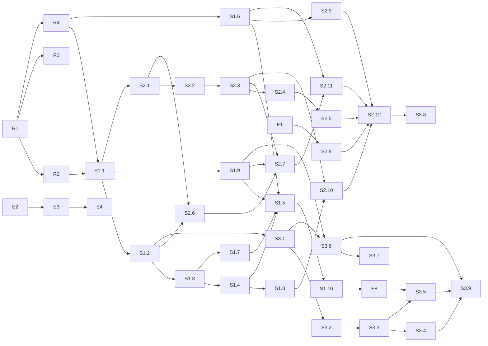

# 开发任务清单 v0.2 —— 基于 Graph 的 AI 中台

> 配套：`graph-ai-middle-platform-design.md`（v0.2）。任务按三条垂直切片组织：S1 一个用户能聊且每轮入图；S2 能经审批做事并动态拉起 Worker；S3 图有内容、看得见、找得到。S1 + S2 + S3 = 最小当前版本。
> 环境具体值不出现在本文件，用占位符，取值见未入库的 `docs/private/`。
> 日期：2026-09-01

---

## 0. 约定

### 0.1 任务字段

**目标 / 交付物 / 涉及路径 / 依赖 / 验收 / 建议执行者 / 需人工批准 / 不做**。验收必须是可执行命令加期望结果。

- 建议执行者：`Codex` 或 `Claude Code`（实现）、`人`（登录目标主机或决策）、`Claude Code@host`（经 SSH 在目标主机跑低风险命令）。
- 需人工批准 = 会影响目标主机上运行中的其他服务或不可逆；这类只写建议，不由 agent 执行。

### 0.2 占位符

`<TARGET_HOST>`、`${NEXTTIME_DATA}`、`${KERNEL_BIND_ADDR}`、`${NEXTTIME_SUBNET_CONTROL}` / `${NEXTTIME_SUBNET_WORKERS}`、`${WORKER_RUNTIME}`、`<CODE_DIR>`。

### 0.3 工程约定（全 TS）

- Node 24、TypeScript strict、pnpm workspaces、`erasableSyntaxOnly`；Biome 做 lint 与 format；Vitest。
- kernel：Fastify + `ws` + `pg`（原生驱动，显式 SQL，无 ORM）+ Zod + `@modelcontextprotocol/sdk` + `jose`（Handle 签名 EdDSA）+ pino + OpenTelemetry。
- 迁移：`packages/kernel/migrations/NNNN_name.sql` + 幂等 runner（`schema_migrations` 表）。
- 状态机一律转移表驱动，非法转移抛 `IllegalTransition`。
- 所有受治理写入与 `audit_records` 同事务（I11）。
- pi 锁 `@earendil-works/pi-coding-agent@0.84.4`；平台扩展只依赖文档化事件。
- 共享类型在 `packages/shared`：capability 注册表、事件、`ActionDescription`、Zod schema；HTTP 路由、MCP 工具、WS 方法都由注册表生成或校验。
- 不写任何真实地址、密钥、知识库 ID；测试用 `example` 值。每任务一分支一 PR。

### 0.4 里程碑

| 里程碑 | 目标 | 设计目标 |
|--------|------|---------|
| E | 目标主机可跑 Postgres 与全部服务 | — |
| R | monorepo 能 lint / test / build / migrate | — |
| S1 | 登录 → 对话 → 自己的 pi 回答 → Turn 入图 | G3 部分、G4 部分 |
| S2 | 说需求 → find_workers → invoke_worker → 门动作 → 审批卡片 → 执行 → 写回 | G1、G2、G4 |
| S3 | 本体 v1 + 采集器 + Explorer + MCP gateway | G3、G5、G6 |

---

## 1. E — 环境准备（目标主机）

### E1 验证 gVisor
- 验收：`docker run --rm --runtime=runsc alpine:3.20 true; echo $?` 为 0；失败则 `.env` 里 `WORKER_RUNTIME=runc`。
- 执行者：Claude Code@host。批准：否。

### E2 目录树与密钥目录
- 目标：`${NEXTTIME_DATA}/{pgdata,sessions,host,secrets,config,artifacts,backups,caddy}`；`secrets/` 0700；`host/` 由 agent-host 的 OS 用户拥有（I15）。
- 验收：`stat -c '%a %n' ${NEXTTIME_DATA}/secrets` 为 `700 …`；八个子目录齐全。
- 执行者：Claude Code@host。批准：否。

### E3 代码检出与 `.env`
- 目标：clone 到 `<CODE_DIR>`；从 `.env.example` 生成 `.env`（`NEXTTIME_DATA / KERNEL_BIND_ADDR / NEXTTIME_SUBNET_* / WORKER_RUNTIME`）。
- 验收：`docker compose config >/dev/null && echo ok`。依赖：R1、E1。批准：否。

### E4 Postgres
- 验收：`docker compose up -d postgres && docker compose exec postgres pg_isready -U nexttime`；`create extension if not exists vector` 成功。依赖：E2、E3、R1。批准：否。不做：不发布 5432。

### E5 Docker 日志轮转与 live-restore
- 已决定不做（2026-09-01）。发现保留在 `docs/private/`。

### E6 收敛 0.0.0.0 端口
- 已决定不做（2026-09-01）。

### E7 平台备份定时器
- 暂不做；设计 §13 的库损坏恢复依赖它，S3 完成后重评。届时交付 `deploy/systemd/nexttime-backup.{service,timer}`、`scripts/backup.sh`、`scripts/restore.sh`。

### E8 caddy TLS 与静态服务
- 目标：`caddy` 容器是唯一公网面：TLS（内网 CA 或自签）、`/` 服务 `packages/web/dist`、`/explorer` 服务 Explorer 构建、反代 `/api` `/ws` `/mcp` `/llm` 到 kernel。
- 交付物：`deploy/caddy/Caddyfile`；compose `caddy` 服务；`.env` 增 `KERNEL_PUBLIC_URL`。
- 验收：`curl -k https://${KERNEL_BIND_ADDR}:8443/api/health` 200；kernel 不对主机发布任何端口（`docker port` 为空）。
- 依赖：S1.6。执行者：Codex 写，Claude Code@host 部署。批准：否。

---

## 2. R — 仓库骨架

### R1 monorepo 骨架
- 交付物：`pnpm-workspace.yaml`、根 `package.json`、`tsconfig.base.json`、`biome.json`、`vitest.base.ts`；`packages/{kernel,agent-host,worker-supervisor,platform-extension,web,gatekeeper-base,shared}` 各有 `package.json` / `src/index.ts` / 一个测试；`packages/kernel/Dockerfile`、`packages/agent-host/Dockerfile`、`packages/worker-supervisor/Dockerfile`（多阶段、非 root）；`docker-compose.yml`（设计 §10.2）；`.env.example`；`Makefile`（`lint test build migrate up down gen-models`）；`scripts/test-db.sh`。
- 验收：`pnpm install && pnpm -r lint && pnpm -r test && pnpm -r build` 通过；`docker compose config` 通过；三个镜像 build 成功。
- 执行者：Codex。批准：否。不做：业务表。

### R2 迁移机制与连接池
- 交付物：`packages/kernel/src/db/{migrate,pool}.ts`（每请求设置 `app.workspace_id` 与 `app.principal_id` 会话变量）、`migrations/0000_extensions.sql`。
- 验收：`make migrate` 两次，第二次 no-op。依赖：R1。

### R3 CI
- 交付物：`.github/workflows/ci.yml`：Biome + Vitest（`services: postgres`）+ gitleaks + 内网 IP 守门（`grep -rE '10\.[0-9]+\.[0-9]+\.[0-9]+|172\.(1[6-9]|2[0-9]|3[01])\.'` 命中即失败）。
- 验收：故意放一个 `10.0.0.1` 的提交被拦。依赖：R1。

### R4 领域类型、转移表、capability 注册表
- 交付物：`packages/shared/src/{enums,transitions,capabilities,events,action-description}.ts`；转移表覆盖 Fact 生命周期、Conflict、Decision、ActionRequest、Task、WorkerRun、EntryAgent session、OntologyVersion / WorkerDefinition、Grant；capability 注册表含名字、模式、通道（human / handle）、所需角色、参数 Zod schema。
- 验收：转移表穷举测试；`proposed → executing` 抛错；注册表中每个 capability 有且只有一个通道声明。依赖：R1。

---

## 3. S1 — 一个用户能聊，每轮入图

### S1.1 核心表迁移（含隔离列）
- 交付物：`migrations/0001_core.sql`：`workspaces / principals(api_key_hash, role) / sessions(kind, on_behalf_of) / ontology_versions / objects / activities(kind, chat_id, sequence, status) / sources(owner_principal_id, visibility) / observations / links / conflicts / decisions / evidence / chats / audit_records`；RLS：workspace 匹配且（`visibility='workspace'` 或 owner = 当前 principal）；触发器：已发布本体只读、links 内容列不可改、audit 只增。
- 验收：`test_invariants_db`：I1、I3、I4、I12、audit 不可删；用户 B 的会话读不到用户 A 的 `chats` 与私有 `sources`。
- 依赖：R2、R4。

### S1.2 graph store 最小实现
- 交付物：`packages/kernel/src/graph/{store,sql-store}.ts`：`upsert_object / assert_fact / supersede_fact / invalidate_fact / get_object / neighbors / traverse(≤3) / state_at`；`epistemic_status` 由调用方 Principal 类型决定。
- 验收：`state_at(t0)` 在 supersede 后仍返回旧值；事务失败无半条记录。依赖：S1.1。

### S1.3 gateway human 通道 + audit + explain
- 交付物：`gateway/auth.ts`（API key → Principal，创建 `web` 会话）、`audit/{writer,reconstruct}.ts`、`epistemic/explain.ts`（Fact / Decision / Turn → Observation → Activity → Source + Principal）。
- 验收：无 key 401；`member` 调 `grant_capability` 403；任一 Fact / Turn 的 `explain` 到 Source 与 Principal；audit 写失败整体回滚。依赖：S1.2。

### S1.4 chat 模块与 WS RPC
- 交付物：`chat/{service,ws}.ts`：`list_chats / new_chat / send_chat_message / stop_agent / get_chat_history / subscribe_chat`；Turn = `activities(kind='agent_turn')`；推送事件 `chat.message / chat.stream / chat.metadata`；同一 Chat 只允许一个进行中 Turn。
- 验收：WS 客户端先 `subscribe_chat` 再 `get_chat_history`，用脚本在翻页期间注入事件，不丢不重；进行中再发消息被拒。依赖：S1.3。

### S1.5 agent-host：每用户一个 pi RPC 子进程
- 交付物：`packages/agent-host/src/{host,process,bridge}.ts`：`ensureEntryAgent(user)` 创建 `${HOST_DATA}/users/<uid>/{agent,sessions,cwd}`（平台 OS 用户所有，I15），拉起 `pi --mode rpc --session-dir … --system-prompt … -e platform-extension --tools <平台工具>`，env 只含 `KERNEL_URL / KERNEL_LLM_URL / CAPABILITY_HANDLE / NEXTTIME_MODE=entry / PI_CODING_AGENT_DIR`；JSONL 事件 → 内核 `host-bridge`；`prompt / stop`；崩溃自动重拉；空闲超时停进程。
- 验收：两个用户各自子进程、各自目录；`kill -9` 某用户子进程后再发消息，对话可续且历史完整；子进程 env 中无任何 `*_API_KEY`。依赖：S1.4、S1.7。

### S1.6 platform-extension `entry` 模式
- 交付物：`packages/platform-extension/src/{index,kernel-client,modes/entry}.ts`：注册 observe 组工具（`get_object / traverse / search / explain / get_task`）；`context` 事件注入该用户待审批、进行中 Task、相关 Fact 与先例；`session_*` 事件把 `turn_id` 写入会话条目并回传 Turn 结果；契约测试用 pi 的 faux provider + fake kernel。
- 验收：`pnpm --filter platform-extension test`；fake kernel 收到带 `turn_id` 的回传。依赖：R4。

### S1.7 `llm` 按 provider 透传代理
- 交付物：`kernel/src/llm/{providers,proxy,usage}.ts`（读 `${NEXTTIME_DATA}/config/llm-providers.yaml`；入站 Handle 从该 provider `auth` 指定的头读取；换真实 key；模型白名单；SSE 原样；OpenAI 兼容与 Anthropic 两种 `usage` 解析）；`scripts/gen-models-json.ts`；`migrations/0002_llm_usage.sql`。
- 验收：无 Handle 401；白名单外 403；流式逐块转发且与直连 fake upstream 逐字节一致；`llm_usage` 记 provider / model / tokens / turn_id。依赖：S1.3。

### S1.8 web：登录与对话
- 交付物：`packages/web`：登录（API key）、对话页（流式文本、工具调用行、Turn 状态）、WS 客户端（先订阅再翻页规则封装进 client）。
- 验收：Playwright：登录 → 新对话 → 发消息 → 看到流式回复 → 刷新后历史完整。依赖：S1.4。

### S1.9 Handle 最小实现（入口 Handle）
- 交付物：`capability/{model,handles}.ts`：EdDSA JWT，含 `workspace / session / on_behalf_of / scope / exp / jti`；撤销表；宿主拉起子进程前向内核申请入口 Handle（能力上限 = 入口 WorkerDefinition 固定集合）。
- 验收：过期 / 撤销 / 篡改 401；请求体带 `on_behalf_of` 被拒（I13）。依赖：S1.1。

### S1.10 S1 验收脚本
- 交付物：`scripts/accept_s1.sh`：建 workspace、两个用户、发布入口 WorkerDefinition、各自对话、杀进程续聊、`explain(turn)`、隔离断言。
- 验收：退出 0 打印 `S1 OK`。

---

## 4. S2 — 能经审批做事，动态拉起 Worker

### S2.1 治理表迁移
- 交付物：`migrations/0003_governance.sql`：`policies / capability_grants / capability_handles(parent_jti, on_behalf_of) / action_requests(on_behalf_of, await_decision, parent_worker_run_id, actor_runtime, idempotency_key, policy_decision CHECK) / gatekeepers / worker_definitions(kind, version, status) / tasks / worker_runs(parent_worker_run_id)`。
- 验收：I7 的 DB CHECK；`worker_definitions` 已发布只读。依赖：S1.1。

### S2.2 Policy 引擎
- 交付物：`policy/engine.ts`：`evaluate → allow | require_approval | deny`；双信号（I8）；`requester_can_approve` 按 `blast_radius`，high 默认否，工作区可覆盖；高影响默认 `require_approval` 且工作区不能关闭。
- 验收：三种判定的表驱动测试；试图为 high 开自动批准被拒。依赖：S2.1、S3.1 的 ActionType 元数据（S2 内先用平台元本体里的 docker 动作声明）。

### S2.3 ActionRequest 状态机与审批队列
- 交付物：`approval/{service,drainer}.ts`：`request_action / approve / reject / expire / mark_executed / mark_failed / compensate`；drain 每 Gatekeeper 单飞、升序、遇 pending 停；`approve` 前置 I14；同事务写 Approval Decision 并推进关联 agent Decision；`await_decision` 两种模式（模拟返回 / 等待到超时）。
- 验收：转移穷举；幂等键；顺序 drain；I14：operator 无该资源范围时 403；`await_decision=true` 时 Task 进 `waiting_approval` 且超时后工具得到 `pending_approval`。依赖：R4、S2.1、S2.2。

### S2.4 Gatekeeper 协议、基类与注册表
- 交付物：`packages/gatekeeper-base`（协议 Zod schema；`describe_actions` 含 `auto_approvable / await_decision / reversibility / blast_radius / read_only / title / description_template`；凭证解析两种：共享 env、ConnectedAccount 本地加密存储按 `on_behalf_of`；`apply` 幂等存储）；kernel `gatekeepers/{client,registry}.ts`。
- 验收：fake gatekeeper：重复 `apply` 只执行一次；`describe_actions` 校验失败的门不注册。依赖：S2.3。

### S2.5 `gatekeeper-docker`
- 交付物：`gatekeepers/docker`（dockerode；observe：`containers.list / container.inspect / compose.ls / container.logs_tail`；execute：`container.restart`（medium，`await_decision=false`，simulate 返回将影响的容器）、`compose.up / compose.down`（high）；全部 `auto_approvable=false`）。
- 验收：对自建测试容器 `apply container.restart` 生效且重复不重启。执行者：Codex 写，Claude Code@host 验收。批准：否。不做：不对现有业务容器 execute。

### S2.6 平台元本体与 WorkerDefinition 注册表
- 交付物：`ontology/platform-meta.yaml`（ObjectType：WorkerDefinition / Gatekeeper / Capability；LinkType：can_act_on / requires / connects_to）；`ontology/entry-agent.yaml`（kind=entry，能力上限固定，system prompt 教异步模型）；`ontology/ops-runner.yaml`（kind=worker）；`worker/definitions.ts`（`propose / publish / deprecate`，publish 只 human 通道）；注册 Gatekeeper 时同步写元本体对象；I16：Handle 通道写这些类型被拒。
- 验收：引用 draft 被拒；Handle 通道 `assert_fact(WorkerDefinition …)` 403。依赖：S2.1、S1.2。

### S2.7 `find_workers` 与 `invoke_worker`
- 交付物：`graph/find-workers.ts`（元本体 traverse × 用户 Grant 交集）；`task/{service,invoke,reaper}.ts`（`invoke_worker(def@v, input, wait, timeout=90s)`；子 Handle 衰减且继承 `on_behalf_of`；`parent_worker_run_id`；超时返回 `task_id`；崩溃回队；terminate 撤销 Handle）。
- 验收：入口 Handle 请求含 execute 的子 Handle 被拒；`wait=true` 超时返回 `task_id` 不挂死；子 WorkerRun 的 ActionRequest 沿 `parent_worker_run_id` 回到父 Task。依赖：S2.3、S2.6、S1.9。

### S2.8 worker-supervisor
- 交付物：`packages/worker-supervisor`：`spawn / terminate / status`；`--runtime ${WORKER_RUNTIME}` 回退 runc；`--network workers --read-only --cap-drop ALL`；env 只注入六个变量、**不继承宿主 env**；只读挂载 `models.json`；注册 `(worker_run_id, container_id, ip)`。
- 验收：非允许镜像 403；源 ip 与注册不一致的 Handle 请求被拒并撤销；容器内 env 无 `*_API_KEY`。依赖：E1。

### S2.9 worker-runtime 镜像与 `worker` 模式扩展
- 交付物：`worker-runtime/Dockerfile`（node:24-bookworm-slim、pi 0.84.4、非 root、只读根）、`entrypoint.sh`（自检 env 与出网）、扩展 `modes/worker.ts`（Handle 内 capability 工具；`tool_call` 拦截 execute → `request_action`；`context` 注入 Task 输入；全量 JSONL 回传为私有 Source）。
- 验收：`pi --version` 0.84.4；带 `*_API_KEY` 启动退出非 0；`--network none` 自检通过；fake kernel 返回 `pending_approval` 时工具结果带 simulate 且循环不阻塞。依赖：S1.6。

### S2.10 审批卡片与任务视图（web）
- 交付物：`action.pending / action.updated / task.updated` 推送；卡片：标题、Markdown 描述、模拟效果、动作种类、批准 / 拒绝 / 「总是批准此类」（`set_auto_approved_action_kind`）、`await_decision` 时的阻塞样式；任务与 Worker 列表；「连接系统」页（`connect_gatekeeper`）。
- 验收：Playwright：卡片出现 → 批准 → 状态更新 → 对话里出现 Worker 完成消息；用户 B 的界面看不到 A 的卡片。依赖：S2.3、S1.8。

### S2.11 chat 与 Task 联动
- 交付物：Task 与 ActionRequest 状态变化推送到 `on_behalf_of` 用户的 Chat；下一轮 `context` 注入 Task 结果；Turn `generated` Task / Decision 的边写入。
- 验收：超时返回 `task_id` 的 `invoke_worker` 在审批后，下一轮对话入口 agent 能引用结果。依赖：S2.7、S1.6。

### S2.12 S2 验收脚本
- 交付物：`scripts/accept_s2.sh`：起测试容器 → 用户 A 对话「重启它」→ 卡片 → A 批准 → 执行 → `explain` 全链；用户 B 尝试批准 403；`docker exec` Worker 容器 `env | grep -ci api_key` 为 0；Worker `curl https://example.com` 失败。
- 验收：退出 0 打印 `S2 OK`。

---

## 5. S3 — 图有内容、看得见、找得到

### S3.1 本体注册表与本体 v1
- 交付物：`ontology/{schema,registry}.ts`（含 `identity_key` 每 ObjectType；ActionType 元数据）；`ontology/ops-assets-v1.yaml`：ObjectType `Host / ComposeProject / Container / Image / SystemdService / Process / Volume / Network / Endpoint / Repository / Owner`，LinkType `runs_on / part_of / uses_image / mounts / attached_to / exposes / depends_on / built_from / owned_by / spawned_by`；身份键：Container = 项目 + 服务名，Image = digest，Repository = 远程地址，Process = 可执行路径 + 工作目录 + 父进程；`propose_ontology_change` 走 Handle 通道生成私有 draft。
- 验收：同内容再发布得 v2；`validate_link` domain / range；agent 提议的 draft 对他人不可见。依赖：S1.2。

### S3.2 冲突检测
- 交付物：`epistemic/conflicts.ts`：同 `source_id` → supersede；不同 → Conflict(open)；私有参与的 Conflict 只对私有方可见。
- 验收：v0.1 T0.4 的三步测试 + 可见性测试。依赖：S3.1。

### S3.3 采集器 `host-inventory`（TS）
- 交付物：`collectors/host-inventory`：dockerode + `systemctl` + `git remote` + 进程树（只保留 agent 运行时进程树下的非 systemd 子进程；命令行在形成 Observation 前脱敏，`environ` 不读）；service Principal；只采结构性字段；一次运行一个 Activity。
- 验收：跑两遍无重复无 Conflict；改一个端口后第三遍旧 Fact supersede；fixture 含 `--token=abc` 入库为 `***`（脱敏失败整批不提交）。依赖：S3.1、S3.2。批准：否（只读）。

### S3.4 `gatekeeper-ragflow` 与本体 v2
- 交付物：observe `kb.list / kb.documents / retrieve`；execute `document.upload`（medium）、`document.parse`（low）；`ops-assets-v2.yaml` 增 `KnowledgeBase / Document / Dataset`；采集器扩展经门 observe 写 `observed` Fact。
- 验收：图里有 `Document part_of KnowledgeBase`；`explain` 到 `ragflow@<gatekeeper>`。依赖：S2.4、S3.3。

### S3.5 Explorer 契约与挂载
- 交付物：`kernel/src/explorer-contract/*`：设计 §9.5 的 9 个端点，响应形状按 Semantica `explorer/schemas.py`，`207` 约定，`X-API-Key`（human 通道）；`explorer/` 构建脚本从 Semantica 源码 `explorer/` 构建静态包，caddy 挂 `/explorer`，隐藏 Ontology 等工作区。
- 验收：Explorer 的 Graph / Decision / Lineage 三个工作区能加载并显示采集器写入的图与 S2 的决策链。依赖：S3.3、E8。

### S3.6 MCP gateway 与 `interactive` 模式
- 交付物：`kernel/src/mcp/*`（TS SDK，streamable HTTP，工具由注册表生成，Semantica 17 个工具名与必填参数别名）；扩展 `modes/interactive.ts`；`docs/howto-connect-claude-code.md`、`docs/howto-connect-pi.md`。
- 验收：`tools/list` = 注册表 Handle 通道集合 + 别名；Claude Code 经 MCP `traverse` 到同一图；无 Handle 连接被拒。依赖：S1.9、S3.1。

### S3.7 语义一致性校验
- 交付物：`scripts/check-capability-consistency.ts`：注册表 = HTTP 路由 = MCP 工具 = WS 方法 = policy 可识别 `action_kind`。
- 验收：CI 步骤；故意删一个路由被拦。依赖：S3.6。

### S3.8 不变量监控与混沌
- 交付物：`audit/invariant-checks.ts`（I1–I16 定时校验 → 指标与日志）；`scripts/chaos-kill-worker.sh`、`scripts/chaos-kill-entry.sh`。
- 验收：人为写入违反 I7 的记录后告警计数为 1；杀入口进程与 Worker 后系统状态符合 §13。依赖：S2.12。

### S3.9 S3 验收脚本
- 交付物：`scripts/accept_s3.sh`：采集 → 入口 agent 回答「哪个服务依赖哪个」并 explain → Explorer 端点返回图 → Claude Code 经 MCP 观察同一图。
- 验收：退出 0 打印 `S3 OK`。

---

## 6. 验收矩阵

| 设计目标 | 脚本 | 关键断言 |
|---------|------|---------|
| G1 Web 说需求 → 动态 Worker → 写回 | `accept_s2.sh` | 卡片、审批、执行、explain 全链 |
| G2 写操作必过策略与审计 | `accept_s2.sh` | 已执行 ActionRequest 均有 `policy_decision`、`decided_by`、审计行 |
| G3 溯源 | `accept_s1.sh`、`accept_s3.sh` | Turn 与 Fact 的 `explain` 到 Source 与 Principal |
| G4 用户隔离 | `accept_s1.sh`、`accept_s2.sh` | B 看不到 A 的 Chat、卡片、私有 Source；B 批不了 A 范围的动作；I15 |
| G5 图有内容看得见 | `accept_s3.sh` | 采集入图；Explorer 三工作区 |
| G6 多运行时接入 | `accept_s3.sh` | Claude Code 经 MCP 观察同一图 |

---

## 7. 依赖图

可并行起点：R1 后 R2 / R3 / R4；E1 / E2 与 R 无关；S1.6、S1.7、S1.9 可与 S1.4 并行；S2.8、S2.9 不依赖 S2 其他任务。

---

## 8. 风险与未决

| 项 | 处理 |
|----|------|
| 常驻 pi 子进程被当真源 | S1.5 验收含杀进程续聊；真源在 Postgres + JSONL |
| `invoke_worker` 阻塞等审批 | 90 秒超时返回 `task_id`；入口 prompt 教异步；S2.11 联动 |
| Worker 往入口目录塞扩展 | I15：E2 目录归属 + S2.8 不挂载 |
| Explorer 契约成本 | S3.5 只做 9 个端点，其余隐藏 |
| Semantica skills | 不复用实现，只借 UX；工具名别名在 S3.6 |
| pi ABI 变化 | 锁 0.84.4；S1.6 / S2.9 契约测试 |
| 每用户一个 pi 进程的内存 | S1.5 空闲超时停进程 |
| E7 备份暂缓 | S3 后重评 |
| 各厂商 OpenAI 兼容差异 | pi-ai `compat`；内核不做协议 |
