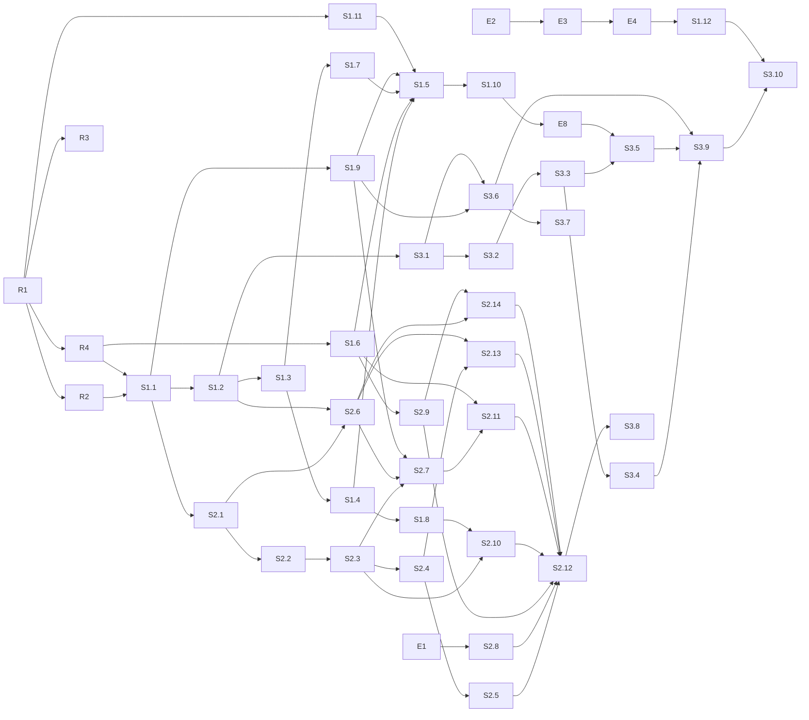

# 开发任务清单 v0.2 —— 基于 Graph 的 AI 中台

> 配套：`graph-ai-middle-platform-design.md`（v0.2）。任务按三条垂直切片组织：S1 一个用户能聊且每轮入图；S2 能经审批做事并动态拉起 Worker；S3 图有内容、看得见、找得到。S1 + S2 + S3 = 最小当前版本。
> 环境具体值不出现在本文件，用占位符，取值见未入库的 `docs/private/`。
> 日期：2026-09-01

---

## 0. 约定

### 0.1 任务字段

**目标 / 交付物 / 涉及路径 / 依赖 / 验收 / 建议执行者 / 需人工批准 / 不做**。验收必须是可执行命令加期望结果。

- 建议执行者：`Codex` 或 `Claude Code`（实现）、`人`（登录目标主机或决策）、`Claude Code@host`（经 SSH 在目标主机跑低风险命令）。
- 需人工批准 = 会影响目标主机上运行中的其他服务或不可逆；这类只写建议，不由 agent 执行。

### 0.2 占位符

`<TARGET_HOST>`、`${NEXTTIME_DATA}`、`${KERNEL_BIND_ADDR}`、`${NEXTTIME_SUBNET_CONTROL}` / `${NEXTTIME_SUBNET_WORKERS}`、`${WORKER_RUNTIME}`、`<CODE_DIR>`。

### 0.3 工程约定（全 TS）

- Node 24、TypeScript strict、pnpm workspaces、`erasableSyntaxOnly`；Biome 做 lint 与 format；Vitest。
- kernel：Fastify + `ws` + `pg`（原生驱动，显式 SQL，无 ORM）+ Zod + `@modelcontextprotocol/sdk` + `jose`（Handle 签名 EdDSA）+ pino + OpenTelemetry。
- 迁移：`packages/kernel/migrations/NNNN_name.sql` + 幂等 runner（`schema_migrations` 表）。
- 状态机一律转移表驱动，非法转移抛 `IllegalTransition`。
- 所有受治理写入与 `audit_records` 同事务（I11）。
- pi 锁 `@earendil-works/pi-coding-agent@0.84.4`；平台扩展只依赖文档化事件。
- 共享类型在 `packages/shared`：capability 注册表、事件、`ActionDescription`、Zod schema；HTTP 路由、MCP 工具、WS 方法都由注册表生成或校验。
- HTTP capability 投影约定：`POST /api/cap/<capability_name>`，`Authorization: Bearer <handle>`（S1.6 落地此约定）。
- 不写任何真实地址、密钥、知识库 ID；测试用 `example` 值。每任务一分支一 PR。

### 0.4 里程碑

| 里程碑 | 目标 | 设计目标 |
|--------|------|---------|
| E | 目标主机可跑 Postgres 与全部服务 | — |
| R | monorepo 能 lint / test / build / migrate | — |
| S1 | 登录 → 对话 → 自己的 pi 回答 → Turn 入图 | G3 部分、G4 部分 |
| S2 | 说需求 → find_workers → invoke_worker → 门动作 → 审批卡片 → 执行 → 写回 | G1、G2、G4 |
| S3 | 本体 v1 + 采集器 + Explorer + MCP gateway | G3、G5、G6 |

---

## 1. E — 环境准备（目标主机）

### E1 验证 gVisor
- 验收：`docker run --rm --runtime=runsc alpine:3.20 true; echo $?` 为 0；失败则 `.env` 里 `WORKER_RUNTIME=runc`。
- 执行者：Claude Code@host。批准：否。

### E2 目录树与密钥目录
- 目标：`${NEXTTIME_DATA}/{pgdata,workspaces,secrets,config,artifacts,backups,caddy}`；`secrets/` 0700；`workspaces/<uid>/` 只挂给该用户的入口容器，`workspaces/tasks/<task_id>/` 只挂给该 Task 的 Worker（I15）。
- 验收：`stat -c '%a %n' ${NEXTTIME_DATA}/secrets` 为 `700 …`；七个子目录齐全。
- 执行者：Claude Code@host。批准：否。

### E3 代码检出与 `.env`
- 目标：clone 到 `<CODE_DIR>`；从 `.env.example` 生成 `.env`（`NEXTTIME_DATA / KERNEL_BIND_ADDR / NEXTTIME_SUBNET_* / WORKER_RUNTIME`）。
- 验收：`docker compose config >/dev/null && echo ok`。依赖：R1、E1。批准：否。

### E4 Postgres
- 验收：`docker compose up -d postgres && docker compose exec postgres pg_isready -U nexttime`；`create extension if not exists vector` 成功。依赖：E2、E3、R1。批准：否。不做：不发布 5432。

### E5 Docker 日志轮转与 live-restore
- 已决定不做（2026-09-01）。发现保留在 `docs/private/`。

### E6 收敛 0.0.0.0 端口
- 已决定不做（2026-09-01）。

### E7 平台备份定时器
- 暂不做；设计 §13 的库损坏恢复依赖它，S3 完成后重评。届时交付 `deploy/systemd/nexttime-backup.{service,timer}`、`scripts/backup.sh`、`scripts/restore.sh`。

### E8 caddy TLS 与静态服务
- 目标：`caddy` 容器是唯一公网面：TLS（内网 CA 或自签）、`/` 服务 `packages/web/dist`、`/explorer` 服务 Explorer 构建、反代 `/api` `/ws` `/mcp` `/llm` 到 kernel。
- 交付物：`deploy/caddy/Caddyfile`；compose `caddy` 服务；`.env` 增 `KERNEL_PUBLIC_URL`。
- 验收：`curl -k https://${KERNEL_BIND_ADDR}:8443/api/health` 200；kernel 不对主机发布任何端口（`docker port` 为空）。
- 依赖：S1.6。执行者：Codex 写，Claude Code@host 部署。批准：否。
- 实现（分支 `task/e8-caddy-tls`）：`/api` `/ws` `/mcp` `/llm` 按本条文字反代到 `kernel:8080`；
  `/llm` 未按设计 §7.7 转给独立的 `llm-proxy` 服务——本条验收文字与 §7.7 的分工不一致，未擅自
  改动，见对应 PR 说明。`/` `/explorer` 在 S1.8 / S3 落地前挂占位静态根（`deploy/caddy/{placeholder,
  explorer-placeholder}`），切换步骤见 `docs/runbooks/host-caddy.md`。caddy 容器以镜像默认的
  root 用户运行（官方 `caddy:2.10` 镜像的 `/config` 卷 root-owned，非 root 需自定义 Dockerfile，
  超出本任务范围）。

---

## 2. R — 仓库骨架

### R1 monorepo 骨架
- 交付物：`pnpm-workspace.yaml`、根 `package.json`、`tsconfig.base.json`、`biome.json`、`vitest.base.ts`；`packages/{kernel,agent-host,worker-supervisor,platform-extension,web,gatekeeper-base,llm-proxy,egress-proxy,shared}` 各有 `package.json` / `src/index.ts` / 一个测试；`.dependency-cruiser.cjs`（设计 §7.10 的六层单向依赖与模块契约：`chat` / `web` 不得 import `approval` / `task`，模块不得 import 他模块内部文件）；`packages/kernel/Dockerfile`、`packages/agent-host/Dockerfile`、`packages/worker-supervisor/Dockerfile`（多阶段、非 root）；`docker-compose.yml`（设计 §10.2）；`.env.example`；`Makefile`（`lint test build migrate up down gen-models`）；`scripts/test-db.sh`。
- 验收：`pnpm install && pnpm -r lint && pnpm -r test && pnpm -r build` 通过；`docker compose config` 通过；三个镜像 build 成功。
- 执行者：Codex。批准：否。不做：业务表。

### R2 迁移机制与连接池
- 交付物：`packages/kernel/src/adapters/db/{migrate,pool}.ts`（每请求设置 `app.workspace_id` 与 `app.principal_id` 会话变量）、`packages/kernel/src/cli/migrate.ts`（迁移 CLI 入口）、`migrations/0000_extensions.sql`。
- 验收：`make migrate` 两次，第二次 no-op。依赖：R1。

### R3 CI
- 交付物：`.github/workflows/ci.yml`：Biome + Vitest（`services: postgres`）+ gitleaks + 内网 IP 守门（`grep -rE '10\.[0-9]+\.[0-9]+\.[0-9]+|172\.(1[6-9]|2[0-9]|3[01])\.'` 命中即失败）+ `dependency-cruiser` 违规即失败 + 内核纯度守门 `scripts/check-kernel-purity.sh`（`grep -rniE -f scripts/system-names.txt packages/kernel/src --exclude-dir=__fixtures__ --exclude='*.test.ts'`，清单初始为 `docker|ragflow|routeros|erp|oa|semantica|hermes`，命中即失败）。
- 验收：故意放一个 `10.0.0.1` 的提交被拦。依赖：R1。

### R4 领域类型、转移表、capability 注册表
- 交付物：`packages/shared/src/{enums,transitions,capabilities,events,action-description}.ts`；转移表覆盖 Fact 生命周期、Conflict、Decision、ActionRequest、Task、WorkerRun、EntryAgent session、OntologyVersion / WorkerDefinition、Grant；capability 注册表含名字、模式、通道（human / handle）、所需角色、参数 Zod schema。
- 验收：转移表穷举测试；`proposed → executing` 抛错；注册表中每个 capability 有且只有一个通道声明。依赖：R1。

---

## 3. S1 — 一个用户能聊，每轮入图

### S1.1 核心表迁移（含隔离列）
- 交付物：`packages/kernel/migrations/core/0001_core.sql`：`workspaces / principals(api_key_hash, role) / sessions(kind, on_behalf_of) / ontology_versions / objects / activities(kind, chat_id, sequence, status) / sources(owner_principal_id, visibility) / observations / links / conflicts / decisions / evidence / chats / audit_records`；RLS：workspace 匹配且（`visibility='workspace'` 或 owner = 当前 principal）；触发器：已发布本体只读、links 内容列不可改、audit 只增。
- 验收：`packages/kernel/src/substrate/` 下的 `test_invariants_db`：I1、I3、I4、I12、audit 不可删；用户 B 的会话读不到用户 A 的 `chats` 与私有 `sources`。
- 依赖：R2、R4。

### S1.2 graph store 最小实现
- 交付物：`packages/kernel/src/graph/{store,sql-store}.ts`：`upsert_object / assert_fact / supersede_fact / invalidate_fact / get_object / neighbors / traverse(≤3) / state_at`；`epistemic_status` 由调用方 Principal 类型决定。
- 验收：`state_at(t0)` 在 supersede 后仍返回旧值；事务失败无半条记录。依赖：S1.1。

### S1.3 gateway human 通道 + audit + explain
- 交付物：`gateway/auth.ts`（API key → Principal，创建 `web` 会话）、`audit/{writer,reconstruct}.ts`、`epistemic/explain.ts`（Fact / Decision / Turn → Observation → Activity → Source + Principal）。
- 验收：无 key 401；`member` 调 `grant_capability` 403；任一 Fact / Turn 的 `explain` 到 Source 与 Principal；audit 写失败整体回滚。依赖：S1.2。

### S1.4 chat 模块与 WS RPC
- 交付物：`chat/{service,ws}.ts`：`list_chats / new_chat / send_chat_message / stop_agent / get_chat_history / subscribe_chat`；Turn = `activities(kind='agent_turn')`；推送事件 `chat.message / chat.stream / chat.metadata`；同一 Chat 只允许一个进行中 Turn；`outbox` 派发器（写入侧 `substrate/outbox/enqueue.ts` 已随 S1.2 落地——同事务写入、唯一写路径；本任务补 application 层的派发器：进程内派发、重启重放、消费者幂等）；`host-bridge` 定义 `AgentRuntime` 接口并把 pi 的 RPC 事件翻译为平台事件词表，chat 只消费平台事件。
- 验收：WS 客户端先 `subscribe_chat` 再 `get_chat_history`，用脚本在翻页期间注入事件，不丢不重；进行中再发消息被拒。依赖：S1.3。
- 实现说明（S1.4 PR，2026-09）：
  - 落地路径与设计文档草案不同：`application/chat/{service,event-sink,push,recovery,index}.ts`（`chat/{service,ws}.ts` 中的 `ws.ts` 部分实际落在 `interfaces/ws/{server,rpc,index}.ts`，遵循 §7.10 的六层分层——`interfaces` 只依赖 `application` 服务接口）；`application/outbox/{dispatcher,index}.ts`；`application/host-bridge/{agent-runtime,fake-runtime,turn-started-consumer,index}.ts`。
  - `chat_messages` 落在新迁移 `migrations/core/0008_chat_messages.sql`（`turn_id` 可空，`sequence bigint` 由 `application/chat` 按 `(workspace_id, chat_id)` 分配，advisory lock 序列化并发写；一 Chat 一进行中 Turn 由该文件新增的 `activities_one_running_turn_per_chat_uidx` 部分唯一索引强制）。
  - `AGENT_RUNTIME` 环境变量（默认 `fake`，唯一实现是 `FakeAgentRuntime`）与 `TURN_INTERRUPT_TIMEOUT_MS`（S1.4 交付物 7 的可配置超时，默认 15 分钟）由 `packages/kernel/src/index.ts` 的 `main()` 读取。
  - 已知偏离：`send_chat_message` 在已有进行中 Turn 时抛 `TurnAlreadyRunningError`；`interfaces/http/**` 不在本任务所有权范围内，其固定的错误映射表无法识别这个新错误类，因此经 HTTP 该情形回退为 `500`（非文档设想的 `409`）——WS 传输（本任务所有权范围内）正确映射为独立的 JSON-RPC 错误码 `-32010`。`get_entry_context`/`report_turn` 的 S1 范围只含最近 Fact（`pendingApprovals`/`tasks`/`precedents` 恒为空数组，等 S2 的 approval/task 模块落地后再填充）；"上轮中断" 尚未注入 `get_entry_context`（S1.4 交付物 7 已实现启动时扫描并标记 `interrupted` + 推送 `chat.metadata`，但把这个信号读进下一轮 `context` 留给 S1.5，详见 `application/chat/recovery.ts` 的模块注释）。

### S1.5 每用户一个常驻入口容器：agent 镜像、supervisor 最小实现、agent-host 事件桥
- 交付物：`worker-runtime/Dockerfile`（node:24-bookworm-slim、pi 0.84.4、平台扩展、工具链 git / curl / python3 / pip / build-essential / ripgrep；非 root；只读根，`/workspace` 与 `/tmp` 可写）；`packages/worker-supervisor` 的常驻模式：`spawnResident(user)` 以 `--runtime ${WORKER_RUNTIME}`、`--cap-drop ALL`、挂载 `${NEXTTIME_DATA}/workspaces/<uid>` 到 `/workspace`（含 `--session-dir` 与 `PI_CODING_AGENT_DIR`）、只读挂载 `models.json`，env 只含 `KERNEL_URL / KERNEL_LLM_URL / CAPABILITY_HANDLE / NEXTTIME_MODE=entry / HTTP_PROXY / HTTPS_PROXY / NO_PROXY`，**不继承宿主 env**，容器内 `pi --mode rpc --system-prompt <入口定义> -e platform-extension`，**内置工具全开**；`packages/agent-host/src/{host,bridge}.ts`：向 supervisor 申请 / 停止入口容器、向内核申请入口 Handle、把容器 stdout 的 JSONL 事件桥到内核 `host-bridge`、写回 `prompt / stop`；崩溃自动重拉；空闲超时停容器。
- 验收：两个用户各自容器、各自 `workspaces/<uid>`；`docker kill` 某用户入口容器后再发消息，对话可续且历史完整；容器 env 无任何 `*_API_KEY`；容器内能 `curl https://example.com`（经代理）、能 `pip install requests`、能写 `/workspace`；`curl http://postgres:5432` 与任一内网地址失败。依赖：S1.4、S1.7、S1.9、S1.11。
- 不做：不给入口 Handle 任何门的 execute 能力；不在宿主进程内跑 pi。
- 实现说明（S1.5a PR，2026-09；本任务拆成两半——前半为 agent 镜像 + supervisor 常驻模式，后半
  agent-host 事件桥 + 内核真正的 `AgentRuntime` 是后续任务）：
  - 落地路径与本条文字不同：Dockerfile 在 `deploy/worker-runtime/Dockerfile`（非仓库根
    `worker-runtime/`，设计文档 §10.1 未同步，只同步了 §10.2 的 compose 片段）。
  - pi 0.84.4 没有 `--system-prompt-file` flag（本条文字与设计文档均未提及具体 flag 名，实现时
    验证得出）；用 `--system-prompt <path>`（`resource-loader.ts` `resolvePromptInput`
    在路径存在时按文件内容读取，效果等价），路径 `/workspace/.nexttime/system-prompt.md`，
    entrypoint.sh 首次运行时写入一份 S1 stopgap 默认文案（S2.6 的 WorkerDefinition 发布版本
    替换前占位）。
  - env 清单在本条文字的基础上多一个 `WORKSPACE_ID`：`@nexttime/platform-extension` 的
    `index.ts` 用 `readRequiredEnv('WORKSPACE_ID')`，缺它会直接抛错，且 platform-extension
    不在本任务所有权范围内。
  - `worker-supervisor` 常驻模式用 Fastify（与 kernel 同栈，且任务验收要求 `Fastify inject`
    路由测试）+ `dockerode`（Docker Engine API 客户端，只用 unix socket，不用其可选的 ssh
    传输——`pnpm-workspace.yaml` 因此把 `cpu-features`/`ssh2` 的构建脚本标 `false`）：
    `POST /resident/spawn|stop`、`GET /resident/:principalId`、
    `POST /resident/:principalId/touch`、`GET /healthz`；崩溃/kill/空闲停止后下次 spawn 一律
    整个重建容器（非同容器 `docker start`），`nexttime.restarts` label 记数，跨 supervisor 重启
    存活；`workers` 网络名不写死 `${project}_workers`，按 Compose 打的
    `com.docker.compose.network=workers` 标签在启动时解析（可用 `NETWORK_WORKERS` 覆盖）。
  - egress-proxy 没有注册用的 admin 端点（只有 `GET /healthz`）：按设计文档 §7.9 与该包
    `source-map.ts` 自己的文档，直接读写 `SOURCE_MAP_FILE`（`config/egress-sources.json`），
    `sourceId` 编码为 `entry:<workspaceId>:<principalId>`（该包把 `sourceId`
    当作不透明字符串，`report.ts` 自己的注释也说明"把它变回 workspaceId/activityId 是内核
    host-bridge 的事"——留给后半任务解析这个格式）。
  - pi 的会话目录落在各用户工作区内（`/workspace/.pi/sessions`，即 `workspaces/<uid>/.pi/sessions`），
    一个用户只有一个挂载点（I15）。原设计里的顶层 `${NEXTTIME_DATA}/sessions` 目录、kernel 与
    worker-supervisor 对它的挂载、以及备份里的 `sessions/` 都已在 S1.5a 之后的清理 PR 中去掉
    （2026-09-02 决定）；将来若需要内核读会话 JSONL，走 `workspaces/*/.pi/sessions/` 的只读挂载。
  - 主机验收（在目标主机上实测，非本地）暴露并修了四个之前没预料到的问题——细节均在
    `docs/runbooks/host-worker-runtime.md` §10：(1) `worker-supervisor` 以非 root 运行连
    docker.sock 要主机 docker 组 gid，`docker-compose.yml` 加 `group_add`；(2) bind-mount
    `models.json` 会让 Docker 以 root 建出 `.pi/`，非 root 入口容器建不了兄弟目录
    `.pi/sessions`——`resident-service.ts` 改成 supervisor 自己先建好这个目录；(3) egress 登记
    写文件失败不应该拖垮 spawn，改成 best-effort；(4) plain `http://` 请求只认小写
    `http_proxy`（"httpoxy" 规避的历史遗留），额外注入了小写三件套。
  - 主机验收还发现一个**不是代码 bug、但会让 `curl https://example.com` 验收失败**的环境问题：
    目标主机的 DNS 把公网域名解析到该主机自己网络的一个内网段（那个内网段确实可达，像是一层
    透明网关代理），`egress-proxy` 的私网判定（I10 防 DNS rebinding 的既有设计）因此正确地把它
    当私有地址拒绝——这是主机网络本身的特性，不是这几个服务的缺陷，未做任何"放宽私网判定"来
    迁就这一台主机。详见 `docs/runbooks/host-worker-runtime.md` §10。
- 实现说明（S1.5b PR，2026-09；本任务的后半——agent-host 事件桥、内核真正的 `AgentRuntime`、假
  LLM 上游、S1.5a 遗留的一处 WS 竞态修复）：
  - 落地路径：`packages/agent-host/src/{host,bridge,supervisor-client,container-io,kernel-link,
    index}.ts`；`packages/kernel/src/application/host-bridge/agent-host-runtime.ts`
    （`AgentHostRuntime`）；`packages/kernel/src/interfaces/ws/agent-host.ts`
    （`GET /internal/agent-host`）；`packages/shared/src/agent-host-protocol.ts`（kernel⇄
    agent-host 共享的 zod 协议——同 `handle-token.ts` 已有的"kernel 与另一进程共享一份 wire schema"
    先例）；`deploy/fake-llm/{Dockerfile,server.mjs}`；
    `config/llm-providers.fake.example.yaml`；`packages/llm-proxy/src/cli/gen-models.ts`。
  - `AGENT_RUNTIME=agent-host` 现在是 `docker-compose.yml` 里 `kernel` 服务的默认值（原来只有
    `fake`）；`fake` 仍可用 `.env` 的 `AGENT_RUNTIME=fake` 选回来。
  - kernel⇄agent-host 协议、pi 事件→平台事件映射表、agent-host 自身的编排规则（每 principal 至多
    一个 in-flight Turn；容器 stdio 崩溃处理；`hello` 的 `instanceId` 如何区分"重连"与"进程重启"）
    详见 `docs/runbooks/host-agent-host.md` §2；主机验收记录见该 runbook §3 与 PR body。
  - `deploy/fake-llm/server.mjs` 是纯 ESM JavaScript、零依赖（不是 TypeScript+构建）——这个目录
    不在 pnpm workspace（`pnpm-workspace.yaml` 只 glob `packages/*`），为一个文件单独搭一套 TS
    构建链，比直接用 `node` 跑源码更违背"no deps beyond node"的字面意思。
  - `make gen-models` 改成经容器化的 `llm-proxy` 镜像跑（新增
    `packages/llm-proxy/src/cli/gen-models.ts`），不再需要本机 corepack/node——目标主机没有这些
    （`docs/runbooks/host-worker-runtime.md` §10 已经点出这个缺口）；根目录既有的
    `scripts/gen-models-json.ts` 未删除，仍是本机开发时的一条独立可用路径。
  - 顺手修的既有 bug（S1.4 遗留，本任务 item 6，`packages/kernel/src/interfaces/ws/server.ts`）：
    `subscribe_chat` 的实时推送去重原来用"目前见过的最大 sequence"做单调水位线，但同一个 Chat 的
    `chat.message` 推送并不保证按 sequence 升序到达——用户自己那条消息由
    `interfaces/ws/server.ts` 的 `publishSentMessagePush` 在其请求 resolve 之后推送，助手回复由
    `application/chat/event-sink.ts` 独立地在 outbox 派发器的轮询节拍上推送，两条路径互不同步
    （虽然两者的 DB 提交顺序仍然保证正确）。若助手回复的推送先于用户自己那条消息的推送抵达监听器，
    旧的水位线逻辑会把后到达的、sequence 更小的用户消息误判成"已经发过"而直接丢弃——从未真正发送、
    也从未被 replay 补上。改成按精确 sequence 成员判定的 `Set`（`shouldDeliver`），不再假设到达顺序
    单调。`interfaces/ws/server.test.ts` 的既有并发测试补了一次确定性的收尾扫描（同一个 gap 也会让
    并发 paging 循环本身在最后一条消息提交前后有类似的、与推送无关的覆盖不全风险）与一条独立断言
    "仅靠推送本身也必须覆盖全部 sequence"，把这个 bug 单独钉死，而不是被 paging 的兜底覆盖悄悄遮盖。
  - 已知偏离（详见 PR body "假设与偏离"）：容器 stdio attach 放在 agent-host 自己（只读挂载
    `DOCKER_SOCKET_PATH`），没有给 `worker-supervisor` 新增附着端点，保持它自 S1.5a 主机验收后完全
    不动；入口 `sessions` 行的 `principal_id` 就是人类 Principal 自己（未铸造单独的
    `kind='agent'` Principal 代表"入口 agent 实例"）；`agent-host` 每个用户任一时刻只处理一个
    Turn（pi 一个进程一次只能跑一个 prompt）——同一用户第二个 Chat 并发发消息被直接
    `turnRejected`，多 Chat 共享一个入口容器的并发模型不在本任务范围内解决。

### S1.6 platform-extension `entry` 模式
- 交付物：`packages/platform-extension/src/{index,kernel-client,modes/entry}.ts`：S1 只注册 observe 组工具（`get_object / traverse / search / explain / get_task`），`find_workers` 与 `invoke_worker` 随 S2.7 加入；`context` 事件注入该用户待审批、进行中 Task、相关 Fact 与先例；`session_*` 事件把 `turn_id` 写入会话条目并回传 Turn 结果；契约测试用 pi 的 faux provider + fake kernel。
- 验收：`pnpm --filter platform-extension test`；fake kernel 收到带 `turn_id` 的回传。依赖：R4。

### S1.7 `llm-proxy` 独立服务
- 目标：按 provider 透传；provider key 只在这里；内核进程零外部凭证（I9）。
- 交付物：`packages/llm-proxy`（读 `${NEXTTIME_DATA}/config/llm-providers.yaml`；入站 Handle 从该 provider `auth` 指定的头读取，用内核公钥 EdDSA **本地**验签与过期检查，撤销表按 `jti` 周期同步不逐请求回调；换真实 key；模型白名单；SSE 原样；OpenAI 兼容与 Anthropic 两种 `usage` 解析；用量与 80% 预算警告经 `POST /internal/llm-usage` 上报内核，失败本地队列重放）；内核 `llm-usage` 模块与 `migrations/llm-usage/0001.sql`；`scripts/gen-models-json.ts`。
- 验收：无 Handle 401；过期 / 撤销 Handle 401；白名单外 403；流式逐块转发且与直连 fake upstream 逐字节一致；`llm_usage` 记 provider / model / tokens / turn_id；内核容器 env 与文件系统中不存在任何 provider key；杀掉内核后代理仍能转发并在内核恢复后补报用量。依赖：S1.3、S1.9。

### S1.8 web：登录与对话
- 交付物：`packages/web`：登录（API key）、对话页（流式文本、工具调用行、Turn 状态）、WS 客户端（先订阅再翻页规则封装进 client）。
- 验收：Playwright：登录 → 新对话 → 发消息 → 看到流式回复 → 刷新后历史完整。依赖：S1.4。
- 实现说明（S1.8 PR，2026-09）：
  - `packages/web/src/lib/ws-client.ts`：`WsClient`（`connect` / `authenticate` / `call` / `subscribeChat` / `sendChatMessage` / `stopAgent`）是唯一封装"先 `subscribe_chat` 再 `get_chat_history` 翻页"规则的地方——`subscribeChat` 用一个按 `sequence` 去重的 `Set` 同时吃掉初次翻页与翻页期间到达的实时推送，socket 意外断开后自动重连并以最后已知 `sequence` 重新 `subscribe_chat`。`-32010`（`TURN_ALREADY_RUNNING`，`interfaces/ws/rpc.ts`）映射成 `TurnAlreadyRunningError`（`RpcError` 子类）而非裸错误消息。页面层（`ChatPage.tsx`）把持久消息（`chat.message`）与当前 Turn 的临时态（`chat.stream`/`chat.metadata`，`lib/streaming-reducer.ts`）分成两份独立 state，互不污染。
  - 页面：`LoginPage`（API key 存 `sessionStorage`，绝不进 `localStorage`/cookie）、`ChatListPage`（`list_chats`/`new_chat`）、`ChatPage`（消息列表、流式文本、工具调用行、`TurnStatusBadge`、`stop_agent` 按钮），`App.tsx` 用 URL hash（`#/chats/<id>`）而非路由库记住当前会话，刷新页面后能定位回同一个 Chat 并从 `startAfter=0` 重新走一遍"先订阅再翻页"。
  - 依赖：`react`/`react-dom`（沿用 R1 骨架版本）；新增 `@nexttime/shared`（`devDependencies`，只做 `import type` 取 `ChatStreamPayload` 等类型，`verbatimModuleSyntax` 下编译期整体擦除，不进产物体积——`pnpm --filter @nexttime/web build` 产物约 156KB / gzip 50KB）与 `@playwright/test`（`devDependencies`，仅 `e2e` 脚本用，不进 `pnpm -r test`）。未引入 UI 框架或路由库。
  - 已知偏离（详见 `packages/web/README.md`"假设与偏离"）：human 通道没有可读能力判断"这个 Chat 当前是否有 Turn 在跑"（`get_entry_context` 只在 Handle 通道，S1 范围）——对话页打开时 composer 默认可用，靠 `send_chat_message` 的 `-32010` 响应被动发现已有 Turn 在跑，`stop_agent` 不需要知道 `turnId`（服务端按 chatId 自己找那个唯一在跑的 Turn），因此 Stop 按钮始终可点，不依赖本页是否是发起者。
  - `packages/web/e2e/chat.spec.ts` + `playwright.config.ts`：显式 opt-in（`pnpm --filter @nexttime/web e2e`，需要 `WEB_E2E_BASE_URL` + `WEB_E2E_API_KEY`，且要求目标内核以 `AGENT_RUNTIME=fake` 启动，验收流程依赖 fake runtime 回显 `echo: <prompt>` 的确定性），不在 `pnpm test`/CI 里跑；S1.10 的 `scripts/accept_s1.sh` 预期用同样的两个环境变量把它接进验收链，见 README 的对应小节。
  - `docs/runbooks/host-caddy.md` §E8.5：补了一段确认构建命令与产物目录的说明，并顺手把原文里不精确的 `pnpm --filter web build`（缺 `@nexttime/` 前缀，`--filter` 按精确包名匹配会找不到包）改成 `corepack pnpm --filter @nexttime/web build`。

### S1.9 Handle 最小实现（入口 Handle）
- 交付物：`capability/{model,handles}.ts`：EdDSA JWT，含 `workspace / session / on_behalf_of / scope / exp / jti`；撤销表；agent-host 在申请入口容器前向内核申请入口 Handle（能力上限 = 入口 WorkerDefinition 固定集合）；内核公钥导出到 `${NEXTTIME_DATA}/config/handle.pub` 供 `llm-proxy` 本地验签。
- 验收：过期 / 撤销 / 篡改 401；请求体带 `on_behalf_of` 被拒（I13）。依赖：S1.1。

### S1.10 S1 验收脚本
- 交付物：`scripts/accept_s1.sh`：建 workspace、两个用户、发布入口 WorkerDefinition、各自对话、杀容器续聊、`explain(turn)`、隔离断言、出网代理断言（公网通、内网不通、目标域名出现在 Activity）。
- 验收：退出 0 打印 `S1 OK`。
- 实现说明（S1.10 PR，2026-09）：
  - 落地路径：`scripts/accept_s1.sh`（POSIX sh，一次性 kernel 镜像容器跑每一次 JSON-RPC 交互——
    宿主机没有 node/corepack；挂载只读的 `ws-client.mjs` 驱动脚本，见其自身头注释）；
    `docs/runbooks/accept-s1.md`。
  - **"发布入口 WorkerDefinition"未做，如实 `SKIP entry-worker-definition (S2.6)`**：
    WorkerDefinition 注册表是 S2.6 的交付物；S1 阶段入口定义是烧进 `worker-runtime` 镜像的静态
    system prompt（S1.5a 实现说明），S1.10 派发文字本身也认了这一点（"WorkerDefinitions land in
    S2.6 ... Print SKIP ... do not fake it"）。
  - **kernel 侧补的一个缺口**：`POST /internal/egress`（见 S1.11 条目下的补注）——脚本要断言"目标
    域名出现在 Activity"，但 `egress-proxy`（S1.11）上报的 `${KERNEL_URL}/internal/egress` 此前
    在内核侧没有路由接收。
  - `bootstrap.js` 增加 `add-principal --workspace <id> --name <name> [--role <role>]` 子命令
    （`packages/kernel/src/cli/bootstrap.ts`）：`create-workspace` 只造第一个（owner）用户，脚本
    需要在同一 workspace 里再造一个 `member` 用户（bob）验证隔离，同样的"打印一次 API key，只存
    hash"约定。
  - 已知偏离（详见 `docs/runbooks/accept-s1.md` "已知缺口"）：出网域名落进 Activity 的断言用直接
    `psql` 读，不经某个 capability（`audit_query` 看不到这次服务间写入；`explain` 的投影不含原始
    `metadata`）；"send 后立即 curl" 是顺序执行，不是真正的后台并发（内核侧新增的"最近一个 Turn"
    回退归因窗口让这一步的时机不再关键）。

### S1.11 出网代理
- 目标：agent 容器上公网必经代理；公网放行、内网与平台内部服务拒绝；按来源容器套用 WorkerDefinition 的允许 / 拒绝清单；记录目标域名与字节数到该次 Activity（I10）。
- 交付物：`packages/egress-proxy`（Node CONNECT / HTTP 转发代理，或 tinyproxy + 策略脚本；挂在 `control` 与 `workers` 网络；来源 ip → WorkerRun / 入口会话由 supervisor 注册表解析；拒绝 RFC1918、链路本地、`postgres` / `kernel` 等服务名；日志经内核 `host-bridge` 写 Activity `metadata.egress[]`）；compose 服务；`workers` 网络保持 `internal: true`。
- 验收：容器内 `curl https://example.com` 200；`curl http://10.0.0.1` 与 `curl http://postgres:5432` 被拒；Activity 记录含 `example.com`；WorkerDefinition 加 `deny: [example.com]` 后被拒。依赖：R1。
- 不做：不解密 TLS；不做内容过滤。
- 补注（S1.10 PR，2026-09）：`packages/egress-proxy` 自 S1.11 落地起就已经在向
  `${KERNEL_URL}/internal/egress` 上报（`packages/egress-proxy/src/report.ts` 的
  `EgressReporter`），但"Activity 记录含 example.com"这条验收此前无法兑现——内核侧一直没有这个
  路由接收上报。S1.10 补上：`packages/kernel/src/interfaces/http/internal/egress.ts`（路由，同
  `/internal/llm-usage` 一样 `control` 网络内无额外鉴权）+
  `packages/kernel/src/application/host-bridge/egress-observations.ts`（解析
  `sourceId=entry:<workspaceId>:<principalId>`——格式定义在 `packages/worker-supervisor/src/
  egress-map.ts`——找该 principal 当前在跑的 Turn 或最近 5 分钟内的 Turn 作回退，追加进
  `activities.metadata.egress`，有界 200 条，发 `EgressObserved` 领域事件）。

### S1.12 最小备份（compose 内，不改主机）
- 目标：每日 `pg_dump` + `workspaces/` 与 `config/` 的 tar 到 `${NEXTTIME_DATA}/backups/`，保留 7 份；恢复脚本可演练。之前 E7 被暂缓，这里以 compose 内容器形式回归，理由：设计 §10.4 与 §13 的回滚依赖它，且不触碰主机上任何现有服务。
- 交付物：`deploy/backup/backup.sh`、`scripts/restore.sh`、compose `backup` 服务（`postgres:17-alpine`）。
- 验收：`docker compose exec backup /backup.sh` 后 `backups/` 出现当日 dump；`scripts/restore.sh --dry-run` 通过；在临时库上真实恢复一次并跑 `accept_s1.sh`。依赖：E4。需人工批准：否。

---

## 4. S2 — 能经审批做事，动态拉起 Worker

### S2.1 治理表迁移
- 交付物：`migrations/0003_governance.sql`：`policies / capability_grants / capability_handles(parent_jti, on_behalf_of) / action_requests(on_behalf_of, await_decision, parent_worker_run_id, actor_runtime, idempotency_key, policy_decision CHECK) / gatekeepers / worker_definitions(kind, version, status) / tasks / worker_runs(parent_worker_run_id)`。
- 验收：I7 的 DB CHECK；`worker_definitions` 已发布只读。依赖：S1.1。

### S2.2 Policy 引擎
- 交付物：`policy/engine.ts`：`evaluate → allow | require_approval | deny`；双信号（I8）；`requester_can_approve` 按 `blast_radius`，high 默认否，工作区可覆盖；高影响默认 `require_approval` 且工作区不能关闭。
- 验收：三种判定的表驱动测试；试图为 high 开自动批准被拒。依赖：S2.1、S3.1 的 ActionType 元数据（S2 内先用平台元本体里的 docker 动作声明）。

### S2.3 ActionRequest 状态机与审批队列
- 交付物：`approval/{service,drainer,routing}.ts`：`request_action / approve / reject / expire / mark_executed / mark_failed / compensate`；drain 每 Gatekeeper 单飞、升序、遇 pending 停；`approve` 前置 I14；**审批路由**：ActionRequest 进入所有持有该 `action_kind × resource_scope` 的 human Principal 的队列与对话，不限于发起者；同事务写 Approval Decision 并推进关联 agent Decision；`await_decision` 两种模式（模拟返回 / 等待到超时）；默认策略表：`low` 自动批准、`medium` / `high` 与未分类要人批；每次状态转移在同事务写 outbox 发布 `ActionRequestPending / ActionRequestUpdated`，chat 与 web 只订阅事件写各持有者的系统消息，`approval` 不 import `chat`。
- 验收：转移穷举；幂等键；顺序 drain；I14：operator 无该资源范围时 403；`await_decision=true` 时 Task 进 `waiting_approval` 且超时后工具得到 `pending_approval`。依赖：R4、S2.1、S2.2。

### S2.4 通用门：协议、基类、四种传输、接口清单、命令策略表
- 目标：门不是逐系统写的代码。一个基类 + 四种传输种类 + 一份接口清单就能接入任意系统。
- 交付物：`packages/gatekeeper-base`（协议 Zod schema：`describe_operations / observe / simulate / apply / revert / health`；Operation 模型：`name / binding / params_schema / mode / blast_radius / reversibility / auto_approvable / await_decision / reads / writes / result_mapping(JMESPath)`；凭证解析两种：共享 env、ConnectedAccount 本地加密存储按 `on_behalf_of`；`apply` 幂等存储）；传输实现 `kinds/{http,mcp,cli,ssh}.ts`（`http`：从 OpenAPI 导入清单草稿，GET → observe，其余 → execute 并按动词给默认影响半径；`mcp`：`tools/list` 即清单，`readOnlyHint` → observe；`cli`：命令模板；`ssh`：命令模板 + 命令策略表，正则模式 → `mode / blast_radius / auto_approvable`，未命中 → `require_approval`）；kernel `gatekeepers/{client,registry,manifest}.ts`（清单入平台元本体为 `Operation` 对象；`propose_operation` 产草稿，owner 发布）。
- 验收：fake 系统：OpenAPI 导入后 GET 为 observe、POST 为 execute；`ssh` 门对 `show …` 自动放行、对未知命令返回 `require_approval`（I17）、对 `rm -rf` 命中高影响；重复 `apply` 只执行一次；ConnectedAccount 按 `on_behalf_of` 取到不同凭证；结果映射把响应写成 `observed` Fact。依赖：S2.3、S2.6。
- 不做：不做 `db` / `browser`；不解析 CLI help 自动生成清单（P5）。

### S2.5 `docker` 预置清单与 `ragflow` 门实例
- 交付物：`gatekeepers/docker`（`cli` 种类的预置清单 + dockerode 绑定；observe：`containers.list / container.inspect / compose.ls / container.logs_tail`；execute：`container.restart`（medium，`await_decision=false`，simulate 返回将影响的容器）、`compose.up / compose.down`（high）；全部 `auto_approvable=false`）；`gatekeepers/ragflow`（`http` 种类的清单：observe `kb.list / kb.documents / retrieve`，execute `document.upload`（medium）、`document.parse`（low））。
- 验收：对自建测试容器 `apply container.restart` 生效且重复不重启。执行者：Codex 写，Claude Code@host 验收。批准：否。不做：不对现有业务容器 execute。

### S2.6 平台元本体与 WorkerDefinition 注册表
- 交付物：`ontology/platform-meta.yaml`（ObjectType：WorkerDefinition / Gatekeeper / Operation / Capability / Skill / Procedure；LinkType：exposes / reads / writes / can_act_on / requires / connects_to / uses / steps）；`ontology/entry-agent.yaml`（kind=entry，能力上限固定，system prompt 教异步模型）；`ontology/ops-runner.yaml`（kind=worker）；`worker/definitions.ts`（`propose / publish / deprecate`，publish 只 human 通道）；注册 Gatekeeper 时同步写元本体对象；I16：Handle 通道写这些类型被拒。
- 验收：引用 draft 被拒；Handle 通道 `assert_fact(WorkerDefinition …)` 403。依赖：S2.1、S1.2。

### S2.7 `find_workers` 与 `invoke_worker`
- 交付物：`graph/find-means.ts`（`find_operations / find_workers / find_procedures`：元本体 traverse × 用户 Grant 交集）；`task/{service,invoke,reaper}.ts`（`invoke_worker(def@v, input, wait, timeout=90s)`；子 Handle 衰减且继承 `on_behalf_of`；`parent_worker_run_id`；超时返回 `task_id`；崩溃回队；terminate 撤销 Handle；**配额（I18）**：派生链深度 ≤ 3、每用户并发 WorkerRun、每 Task token 与时长、每工作区日成本，作为工作区策略数据，`migrations/task/0002_quotas.sql`；深度或并发超限时 `invoke_worker` 返回入口 agent 可转述的错误；预算 80% 时经 `context` 注入警告，100% 时 Task `failed: budget_exhausted`）。
- 验收：入口 Handle 请求含 execute 的子 Handle 被拒；`wait=true` 超时返回 `task_id` 不挂死；子 WorkerRun 的 ActionRequest 沿 `parent_worker_run_id` 回到父 Task；第四层派生被拒且错误可读；fake `llm-proxy` 上报 100% 后 Task 进入 `failed: budget_exhausted` 且入口 agent 下一轮 `context` 含该信息。依赖：S2.3、S2.6、S1.9、S1.7。

### S2.8 worker-supervisor
- 交付物：`packages/worker-supervisor` 的一次性模式（常驻模式已在 S1.5）：`spawnTask / terminate / status`；`--runtime ${WORKER_RUNTIME}` 回退 runc；`--network workers --read-only --cap-drop ALL`；挂载 `${NEXTTIME_DATA}/workspaces/tasks/<task_id>` 到 `/workspace`；env 只注入 `KERNEL_URL / KERNEL_LLM_URL / CAPABILITY_HANDLE / TASK_ID / WORKSPACE_ID / WORKER_RUN_ID / NEXTTIME_MODE=worker / HTTP(S)_PROXY`、**不继承宿主 env**；只读挂载 `models.json` 与该定义 `uses` 的 Skill；注册 `(worker_run_id, container_id, ip)` 供 gateway 来源绑定与出网代理解析；Task 结束保留工作目录为 artifact，按保留策略清理。
- 验收：非允许镜像 403；源 ip 与注册不一致的 Handle 请求被拒并撤销；容器内 env 无 `*_API_KEY`。依赖：E1。

### S2.9 `worker` 模式扩展与结果契约
- 交付物：`entrypoint.sh` 增加 `worker` 模式自检（env 无 `*_API_KEY`；出网必经代理：直连内网失败、经代理公网通）；扩展 `modes/worker.ts`（向内核取 Handle 内允许的 Operation 列表并注册为 `<gate>.<op>` 工具，observe 直接经内核转门，execute 经 `tool_call` 拦截转 `request_action`；`context` 注入 Task 输入、相关 Fact、装载的 Skill；结束时按结果契约返回 `{summary, findings, facts_to_assert, evidence, artifacts, proposed_skill?, proposed_operations?}`；全量 JSONL 回传为私有 Source）；内核侧 `task/result.ts` 把 `facts_to_assert` 以 `inferred` 写入、证据挂 Activity、提议存草稿。镜像本身已在 S1.5 交付。
- 验收：`pi --version` 0.84.4；带任意 `*_API_KEY` 启动退出非 0；`/model` 列表只出现白名单内的 `provider/model`；工具列表恰好等于 Handle 内的 Operation；fake kernel 返回 `pending_approval` 时工具结果带 simulate 且循环不阻塞；结果契约中的 Fact 入图为 `inferred` 且 `explain` 到该 WorkerRun。依赖：S1.5、S1.6、S2.4。

### S2.10 审批卡片与任务视图（web）
- 交付物：`action.pending / action.updated / task.updated` 推送；卡片：标题、Markdown 描述、模拟效果、动作种类、批准 / 拒绝 / 「总是批准此类」（`set_auto_approved_action_kind`）、`await_decision` 时的阻塞样式；任务与 Worker 列表；「连接系统」页与连接卡片（`request_connection` → 填地址、凭证、种类 → 门实例；`http` / `mcp` 自动导入清单草稿并展示给 owner 发布）；审批卡片出现在**持有范围者**的对话与队列（可能不是发起者）。
- 验收：Playwright：卡片出现 → 批准 → 状态更新 → 对话里出现 Worker 完成消息；用户 B 的界面看不到 A 的卡片；把 B 授予该动作范围后，卡片出现在 B 自己的对话与队列里并可批准，A 的对话里只显示状态；连接卡片建门后图里出现 `Gatekeeper` 与系统对象。依赖：S2.3、S2.13、S1.8。

### S2.11 chat 与 Task 联动
- 交付物：Task 与 ActionRequest 状态变化推送到 `on_behalf_of` 用户的 Chat；下一轮 `context` 注入 Task 结果；Turn `generated` Task / Decision 的边写入。
- 验收：超时返回 `task_id` 的 `invoke_worker` 在审批后，下一轮对话入口 agent 能引用结果。依赖：S2.7、S1.6。

### S2.12 S2 验收脚本
- 交付物：`scripts/accept_s2.sh`：(1) 用户 A 用连接卡片接入一台测试 SSH 主机（容器模拟）与一个测试 OpenAPI 服务；(2) A 对话「重启测试容器」→ `find_*` → `invoke_worker` → 卡片 → A 批准 → 执行 → `explain` 全链；(3) A 问「测试 API 的 GET 返回什么」→ 入口 agent 直接观察，不拉 Worker；(4) Worker 在 SSH 主机跑一条未分类命令 → 卡片 → 勾「总是允许」→ 第二次不再出卡片；(5) 用户 B 尝试批准 A 范围的动作 403；(6) Worker 容器 `env | grep -ci api_key` 为 0；Worker 经代理 `curl https://example.com` 成功、直连内网失败；(7) Worker 结果契约里的 Fact 入图为 `inferred`。
- 验收：退出 0 打印 `S2 OK`。

### S2.13 连接系统流程与清单导入
- 目标：把一个新系统接进来只需要一张卡片。
- 交付物：kernel `connections/service.ts`（`request_connection(kind, target)` 产生连接请求卡片；human 填地址、凭证、凭证种类 → 凭证直达门实例的存储，不经内核持久化 → 注册门 → 图里生成 `Gatekeeper` 与系统对象及 `connects_to`；`http` 从 OpenAPI URL 导入清单草稿，`mcp` 从 `tools/list` 导入；owner 发布清单）；`connect_gatekeeper` 把门授予某用户的入口 agent（写 Grant）。
- 验收：接入 fake OpenAPI 后 `find_operations("stock")` 命中；内核数据库任何表中不存在凭证明文；未发布的清单对 agent 不可见。依赖：S2.4、S2.6。

### S2.14 Skill、Procedure 与提议流程
- 目标：做过的事沉淀成图里可发现的做法。
- 交付物：元本体 `Skill`（pi skill 格式的 markdown + 适用的门种类与 ObjectType）与 `Procedure`（有序步骤引用 Operation / WorkerDefinition，含审批步与验证步）；`propose_skill / publish_skill / propose_procedure / publish_procedure`（提议私有、发布 human 通道）；supervisor 按 WorkerDefinition `uses` 把已发布 Skill 挂进容器的 pi skills 目录；`ops-runner` 定义的 system prompt 含「结束时提炼 Fact、记 Decision、成功且新颖时提议 Skill」；入口定义的 prompt 含三档编排规则与异步模型。
- 验收：Worker 结束后草稿 Skill 出现且仅提议者可见；发布后 `find_procedures` / 下一次 Worker 容器内可读到该 Skill；Procedure 的步骤引用不存在的 Operation 时发布被拒。依赖：S2.6、S2.9。

---

## 5. S3 — 图有内容、看得见、找得到

### S3.1 本体注册表与本体 v1
- 交付物：`ontology/{schema,registry}.ts`（含 `identity_key` 每 ObjectType；ActionType 元数据）；`ontology/ops-assets-v1.yaml`：ObjectType `Host / ComposeProject / Container / Image / SystemdService / Process / Volume / Network / Endpoint / Repository / Owner`，LinkType `runs_on / part_of / uses_image / mounts / attached_to / exposes / depends_on / built_from / owned_by / spawned_by`；身份键：Container = 项目 + 服务名，Image = digest，Repository = 远程地址，Process = 可执行路径 + 工作目录 + 父进程；`propose_ontology_change` 走 Handle 通道生成私有 draft。
- 验收：同内容再发布得 v2；`validate_link` domain / range；agent 提议的 draft 对他人不可见。依赖：S1.2。

### S3.2 冲突检测
- 交付物：`epistemic/conflicts.ts`：同 `source_id` → supersede；不同 → Conflict(open)；私有参与的 Conflict 只对私有方可见。
- 验收：v0.1 T0.4 的三步测试 + 可见性测试。依赖：S3.1。

### S3.3 采集器 `host-inventory`（TS）
- 交付物：`collectors/host-inventory`：dockerode + `systemctl` + `git remote` + 进程树（只保留 agent 运行时进程树下的非 systemd 子进程；命令行在形成 Observation 前脱敏，`environ` 不读）；service Principal；只采结构性字段；一次运行一个 Activity。
- 验收：跑两遍无重复无 Conflict；改一个端口后第三遍旧 Fact supersede；fixture 含 `--token=abc` 入库为 `***`（脱敏失败整批不提交）。依赖：S3.1、S3.2。批准：否（只读）。

### S3.4 `gatekeeper-ragflow` 与本体 v2
- 交付物：observe `kb.list / kb.documents / retrieve`；execute `document.upload`（medium）、`document.parse`（low）；`ops-assets-v2.yaml` 增 `KnowledgeBase / Document / Dataset`；采集器扩展经门 observe 写 `observed` Fact。
- 验收：图里有 `Document part_of KnowledgeBase`；`explain` 到 `ragflow@<gatekeeper>`。依赖：S2.4、S3.3。

### S3.5 Explorer 契约与挂载
- 交付物：`kernel/src/explorer-contract/*`：设计 §9.5 的 9 个端点，响应形状按 Semantica `explorer/schemas.py`，`207` 约定，`X-API-Key`（human 通道）；`explorer/` 构建脚本从 Semantica 源码 `explorer/` 构建静态包，caddy 挂 `/explorer`，隐藏 Ontology 等工作区。
- 验收：Explorer 的 Graph / Decision / Lineage 三个工作区能加载并显示采集器写入的图与 S2 的决策链。依赖：S3.3、E8。

### S3.6 MCP gateway 与 `interactive` 模式
- 交付物：`kernel/src/mcp/*`（TS SDK，streamable HTTP，工具由注册表生成，Semantica 17 个工具名与必填参数别名）；扩展 `modes/interactive.ts`；`docs/howto-connect-claude-code.md`、`docs/howto-connect-pi.md`。
- 验收：`tools/list` = 注册表 Handle 通道集合 + 别名；Claude Code 经 MCP `traverse` 到同一图；无 Handle 连接被拒。依赖：S1.9、S3.1。

### S3.7 语义一致性校验
- 交付物：`scripts/check-capability-consistency.ts`：注册表 = HTTP 路由 = MCP 工具 = WS 方法 = policy 可识别 `action_kind`。
- 验收：CI 步骤；故意删一个路由被拦。依赖：S3.6。

### S3.8 不变量监控与混沌
- 交付物：`audit/invariant-checks.ts`（I1–I16 定时校验 → 指标与日志）；`scripts/chaos-kill-worker.sh`、`scripts/chaos-kill-entry.sh`。
- 验收：人为写入违反 I7 的记录后告警计数为 1；杀入口进程与 Worker 后系统状态符合 §13。依赖：S2.12。

### S3.9 S3 验收脚本
- 交付物：`scripts/accept_s3.sh`：采集 → 入口 agent 回答「哪个服务依赖哪个」并 explain → Explorer 端点返回图 → Claude Code 经 MCP 观察同一图。
- 验收：退出 0 打印 `S3 OK`。

### S3.10 运行手册与测试策略文档
- 目标：换人能维护。
- 交付物：`docs/runbooks/`：重启各服务与恢复顺序、从备份恢复、轮换 Handle 签名密钥与 provider key、新增一个接入包（含清单导入与发布）、新增一个领域包、升级 pi 版本（契约测试流程）、排查一次失败的 Task（沿 `explain` 与审计）；`docs/testing.md`：设计 §7.10 的测试分层与每层的运行命令。
- 验收：按「从备份恢复」手册在临时环境走一遍成功；按「新增接入包」手册接入一个 fake 系统成功。依赖：S3.9、S1.12。

---

## 6. 验收矩阵

| 设计目标 | 脚本 | 关键断言 |
|---------|------|---------|
| G1 Web 说需求 → 动态 Worker → 写回 | `accept_s2.sh` | 卡片、审批、执行、explain 全链 |
| G2 写操作必过策略与审计 | `accept_s2.sh` | 已执行 ActionRequest 均有 `policy_decision`、`decided_by`、审计行 |
| G3 溯源 | `accept_s1.sh`、`accept_s3.sh` | Turn 与 Fact 的 `explain` 到 Source 与 Principal |
| G4 用户隔离 | `accept_s1.sh`、`accept_s2.sh` | B 看不到 A 的 Chat、卡片、私有 Source；B 批不了 A 范围的动作；I15 |
| G5 图有内容看得见 | `accept_s3.sh` | 采集入图；Explorer 三工作区 |
| G6 多运行时接入 | `accept_s3.sh` | Claude Code 经 MCP 观察同一图 |

---

## 7. 依赖图

可并行起点：R1 后 R2 / R3 / R4；E1 / E2 与 R 无关；S1.6、S1.7、S1.9 可与 S1.4 并行；S2.8、S2.9 不依赖 S2 其他任务。

---

## 8. 风险与未决

| 项 | 处理 |
|----|------|
| 常驻入口容器被当真源 | S1.5 验收含杀容器续聊；真源在 Postgres + JSONL |
| `invoke_worker` 阻塞等审批 | 90 秒超时返回 `task_id`；入口 prompt 教异步；S2.11 联动 |
| Worker 往入口目录塞扩展 | I15：E2 目录归属 + S2.8 不挂载 |
| Explorer 契约成本 | S3.5 只做 9 个端点，其余隐藏 |
| 接口清单把写操作误分类为观察 | 导入按动词给默认值；owner 发布前过目；未分类默认要批（I17） |
| agent 经公网外带数据 | 出网代理记录域名；WorkerDefinition 拒绝清单；有意接受的剩余风险 |
| S2 范围扩大（四种门 + 连接流程 + Skill） | 这是「能干活」的最小集合，不再拆到 P5；S2 验收脚本七步全过才算完成 |
| Semantica skills | 不复用实现，只借 UX；工具名别名在 S3.6 |
| pi ABI 变化 | 锁 0.84.4；S1.6 / S2.9 契约测试 |
| 每用户一个 pi 进程的内存 | S1.5 空闲超时停进程 |
| E7 备份暂缓 | S3 后重评 |
| 各厂商 OpenAI 兼容差异 | pi-ai `compat`；内核不做协议 |
| pi 的 `extension_ui_request` 子协议（对话内即时提问）尚无任务承接 | 未决：归入 S2.10 或 P5，实现前定 |
| Explorer 契约的服务端 facade（游标分页、分析端点）工作量未估 | S3.5 开工前先估 |
