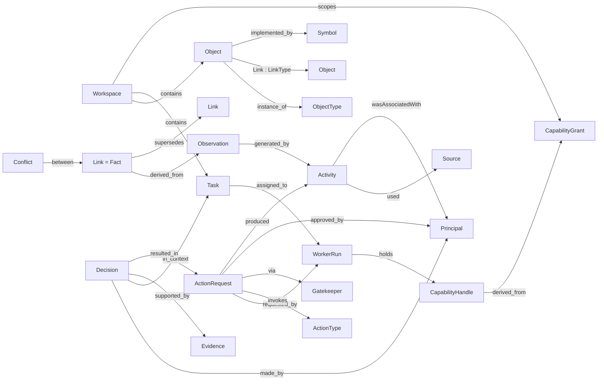
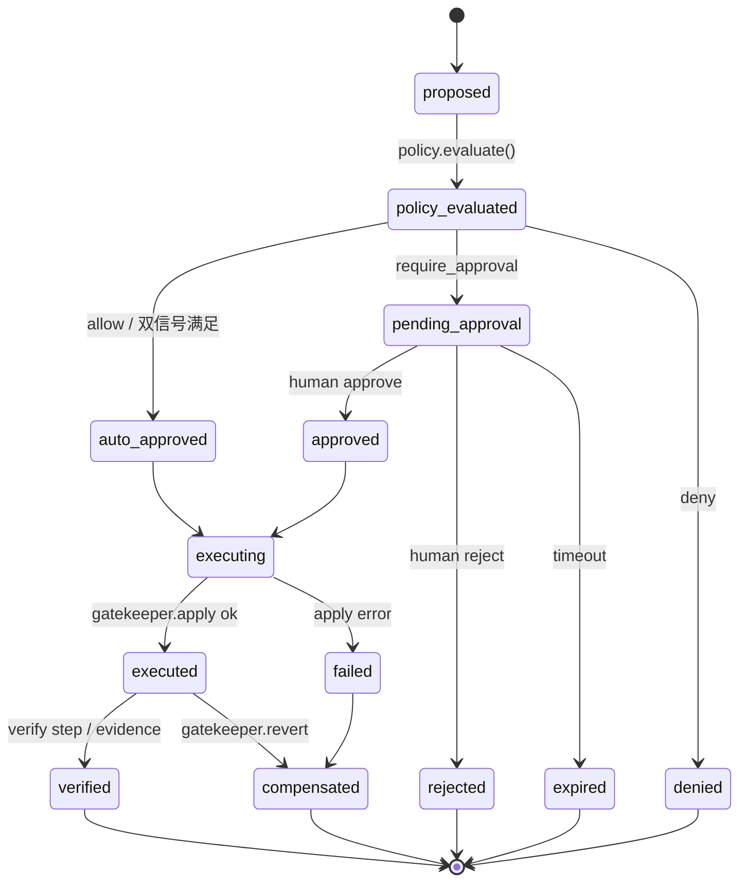
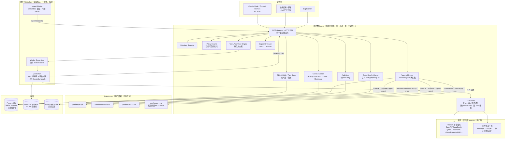

# 基于 Graph 的 AI 中台 —— 架构设计（v0.1 草案）

> 文档性质：架构设计 / 领域建模（Ontology-first）。
> 状态：**全部为提案（Target Architecture）**，目前没有任何组件已实现。凡描述「内核」「Gatekeeper」「Worker」等组件，均指待建目标，不是现状。
> 参考项目分析（Semantica / cloudflare-os / pi）与开源生态调研见同目录 `reference-projects-and-oss-landscape.md`。
> 日期：2026-09-01

---

## 0. 怎么读这份文档

- 只想要结论：读 §1 总体判断、§4 五类图的重新定位、§16 最小当前版本。
- 要做建模评审：读 §5 Domain Model（这是全文的核心，其余章节都是它的投影）。
- 要开始动手：读 §9 数据 / API 设计、§10 部署、§15 路线图、§19 待你决策的问题。

---

## 1. 总体判断（Overall Judgment）

1. **「基于 Graph」应当理解为领域模型的形状，而不是「必须上图数据库」。** 形状 = 带类型的对象 + 带类型的有向关系 + 双时态（业务时间 / 系统时间）+ 每条边都有溯源（provenance）。这个形状可以先落在 PostgreSQL 上，图数据库是按需加的遍历投影（§9.1）。否则「AI 中台」会退化成「又一个 Neo4j 项目」。

2. **五类图不是五套系统，而是一个 Domain Model 的三种视图。** Ontology + Knowledge Graph + Code Graph 回答「世界是什么」（World Model）；Context Graph 回答「系统凭什么相信 / 做过什么决定」（Epistemic Model）；Graph Engineering 回答「谁可以做什么、按什么流程做」（Governance Model）。把它们拆成五个子系统是最常见的过度设计（§4）。

3. **三个参考项目正好是一条技术线，各取一层。** pi 提供 agent 执行内核（最小机制、类型化扩展 ABI、JSONL 会话树、多层嵌入方式）；cloudflare-os 本身就是基于 `pi-agent-core` 构建的，它提供「内核 / 驱动 / 进程」的分权模型、Observation 与 Action 的读写分离、审批队列、双信号自动批准、单一鉴权收口点；Semantica 提供图基底的概念：Decision / Conflict / Provenance（W3C PROV-O）/ BiTemporalFact 作为一等对象，以及「一个 facade + 可换后端」的存储抽象。**借概念与协议，不 fork 代码**：cloudflare-os 的机制锁死在 workerd 运行时上，Semantica 是 18 万行重依赖 Python，pi 的 server 包仍标注 experimental。

4. **三个项目共同的缺口，就是中台必须补的部分：** 多租户 / 工作空间边界、以 capability 为单位的授权模型、对象与决策的显式状态机、把「置信度 float」升级为受治理的认知状态（观察 / 抽取 / 推理 / 断言 / 已验证 / 被推翻），并与「被取代 / 被作废」的生命周期时间戳分开。这四项都要进最小版本，尤其是 workspace 隔离——图一旦长大再补租户边界是最贵的迁移。

5. **推荐架构：模块化单体「图内核」+ 按需拉起的独立 AI Worker + 独立部署的 Gatekeeper 连接器。** 内核是唯一真源和唯一治理收口点；Worker 是一次性、隔离、只持有 capability 句柄、拿不到凭证的执行进程（pi 以 RPC 子进程方式嵌入）；Gatekeeper 持有外部系统凭证并提供 observe / simulate / apply / revert。Semantica 作为内核后面的抽取 Worker，只能经内核的 `ingest` capability 写入，不允许成为第二真源。

---

## 2. 背景与目标

### 2.1 背景

- 你当前主方向是 Hermes / AI Agent 系统：长期记忆、跨会话连续性、多工具协作（Codex / Claude Code / Claude Cowork）、Linux RPA、Android 自动化、企业 AI 数据与工具治理。
- 这些方向共同需要一个「所有 agent 共享的、可审计的、带语义的状态层」，而不是每个工具各自维护一份 markdown 记忆或一份向量库。
- 「五类图」框架给出了正确的问题分类（系统知道什么 / 系统怎么干活），但没有给出可实施的领域模型和治理边界。

### 2.2 目标（可验证）

| # | 目标 | 验证方式 |
|---|------|---------|
| G1 | 任何一条图上的关系或属性，都能回答「系统为什么相信它」：追溯到来源、活动、执行者、时间 | `explain(fact_id)` 返回完整 PROV 链 |
| G2 | 任何一个 agent 对外部系统的写操作，都经过策略判定并留下可重建的审批 / 执行记录 | 审计日志中不存在无 policy 决策记录的已执行 ActionRequest |
| G3 | 多个 agent 运行时（pi / Claude Code / Codex / Hermes）通过同一 MCP gateway 读写同一份 Context Graph，实现跨会话、跨工具连续性 | 两个不同工具在不同会话里对同一 Task 的决策互相可见 |
| G4 | 业务概念与代码符号可以互相链接，支持「改这个字段影响哪些报表 / 哪些函数」的影响分析 | `impact_analysis(object)` 跨 KG 与 Code Graph 返回结果 |
| G5 | 单机 docker-compose 可跑通最小闭环：本体发布 → 断言事实（两个来源对同一主谓不一致时生成 Conflict 而非覆盖）→ Worker 执行任务 → 审批 → 审计追溯 | §16 的验收脚本全部通过 |

### 2.3 非目标（当前阶段明确不做）

- 不做通用 BI 语义层（metrics / dimensions）。需要时接 Cube / Malloy，不自研。
- 不做分布式图数据库选型与分片。
- 不做可视化流程编辑器。
- 不做 SaaS 多组织计费层；workspace 是逻辑租户，物理隔离留待需要时再做。

---

## 3. 现状与约束（Current Reality）

### 3.1 现状

- **已有**：三个参考项目的源码（未部署）；本机已有 `codegraph` MCP 工具（SQLite 索引，按项目 `.codegraph/`）。
- **目标主机**（2026-09-01 只读盘点；硬件规格、地址、网段、路径与完整服务清单保存在未入库的 `docs/private/` 中）：一台 x86_64 Linux VM，资源余量足够运行 Postgres + 内核 + 数个 Worker；Docker + Compose，已配置 gVisor `runsc` 运行时（尚未验证可用）；Python 3.13 + uv。与本设计相关的现有组件：一套知识库栈（RAGFlow 及其 ES / MySQL / MinIO / Valkey）、一个 agent 运行时及其 SQLite 记忆存储、两个 FastAPI 数据运行时、一个本机 embedding 网关。**没有 Postgres**；MySQL 仅供知识库栈。GPU 已被 embedding 网关占满，**本机不能承担 LLM 推理**。
- **未有**：中台的任何组件。本文档全部是目标态。

### 3.2 三个参考项目各自的角色与边界

| 项目 | 在本设计中的角色 | 借什么 | 不借什么 |
|------|-----------------|--------|---------|
| **pi 0.84.4**（MIT，TS） | Worker 的 agent 执行内核 | 最小机制内核；`tool_call` / `context` / `before_provider_request` 等约 30 个类型化扩展事件；JSONL 父指针会话树（分支 / fork / 压缩天然支持）；RPC 子进程模式（JSON-lines over stdio）；多 provider 统一消息格式 | `packages/server` / `client` / `protocol`（experimental）；不依赖它的 TUI |
| **cloudflare-os**（Apache-2.0，TS，基于 pi-agent-core） | 治理模型与分权结构的蓝本 | OS 类比（内核 / 驱动 / 进程 / 可执行文件）；Observation 同步授权 vs Action 进审批队列；simulate pending action 不阻塞 agent；双信号自动批准（作者标注 `autoApprovable` × 用户规则开启）；单一鉴权收口点 `getGatekeeperClassFor`；凭证只存在 Gatekeeper 内；`build` / `use` 两级粗粒度角色；固定字段词表的结构化日志 | 任何依赖 workerd 的机制（Facets、Dynamic Workers、不可伪造 RPC stub、DO）；11k 行的 Overseer god object |
| **Semantica 0.6.7**（MIT，Python） | 摄取 / 抽取 / 冲突 / 溯源 Worker；概念词表来源 | Decision / Conflict / ProvenanceEntry(PROV-O) / BiTemporalFact 作为一等对象；`GraphStore` / `TripleStore` / `VectorStore` 一 facade 多后端模式；`plugins/` 一套能力多运行时适配的分发方式；`state_at(t)` 时点快照 | 直接对存储写入（必须经内核）；单 API key 鉴权；作为主存储或主 API |

### 3.3 约束

- 自托管、可观测、可审计；docker-compose 优先；部署目标是上述单台 x86 Linux 主机。
- 开源项目（仓库公开），暂不考虑商用；因此入库文档不含任何环境具体值。
- Hermes 记忆晋升暂不接入；平台的目录、密钥、存储都不与 Hermes 的目录树绑定。
- LLM 全部使用外部 provider，本机不做推理；不绑定单一厂商，优先 OpenAI 兼容协议，Worker 侧复用 pi-ai 的多 provider 实现。
- 优先巩固与产品化，不扩项目范围。
- 治理靠系统边界，不靠 prompt。
- 不发明新词：沿用 kernel / gatekeeper / capability / Decision / Provenance / Conflict / Session / Extension 这些三个项目已有的词汇。

---

## 4. 五类图 → 一个 Domain Model 的三种模型

| 视频中的「图」 | 回答的问题 | 在本设计中的定位 | 真源 / 生成方式 | 时态语义 |
|---------------|-----------|-----------------|----------------|---------|
| **Ontology** | 有哪些概念、关系、规则、动作、权限 | **类型层**：ObjectType / LinkType / PropertyType / ActionType / Policy 的注册表，带版本 | 人工定义 + 受治理发布（draft → published → deprecated） | 版本化 |
| **Knowledge Graph** | 普遍为真的事实 | **World Model 的实例层**：Object / Link，每条 Link 是一个带溯源的 Fact | 摄取抽取（Semantica）/ 人工断言 / 系统同步 | 业务有效期 `valid_from / valid_until` |
| **Code Graph** | 代码结构与依赖 | **World Model 的派生子本体**：Repository / Commit / File / Symbol + defines / calls / imports；真源是 `repo@commit`，索引可重建、不可手编 | 联邦现有 `codegraph` SQLite 索引，不重造 indexer | 绑定 commit |
| **Context Graph** | 当前业务上下文、状态、决策轨迹、血缘、责任人 | **Epistemic + 运行态**：Source / Observation / Activity / Decision / Conflict / Evidence / Task / Dataset / Owner / Lineage | agent 会话、审批、摄取运行、人工决策 | 双时态：业务时间 + 系统时间 `recorded_at / superseded_at` |
| **Graph Engineering** | 系统怎么干活 | **Governance Model**：Capability / Policy / ActionRequest / Approval / Workflow / Audit | 管理员定义 + 运行时事件 | 事件流，append-only |

**对「Graph Engineering」的重新解释**：视频把它定义为「agent 编排图」。本设计把它收进 Capability + Policy + Workflow + Audit，原因只有一句：**没有权限模型的编排正是 agent 失控的来源**。所以 Workflow 在这里是「在受治理 capability 之上的持久状态机」，节点是 Step，边是合法状态转移，而不是任意可连的流程框。

三者对应本体方法论的三个模型：

```
World Model      = Ontology(类型) + Knowledge Graph(实例) + Code Graph(派生实例)
Epistemic Model  = Context Graph(观察 / 主张 / 决策 / 证据 / 冲突 / 溯源)
Governance Model = Graph Engineering(能力 / 策略 / 审批 / 工作流 / 审计)
```

三者**共享一套存储与一套 workspace 边界**，但语义严格分开：不能把一条 agent 推理出来的 Link 当成 verified fact，不能把 Decision 当成日志行，不能把「工具可调用」当成「有权执行」。

---

## 5. Domain Model / Ontology

> 本节按 Ontology → Domain Model → Relationship → Invariants → State Machine → Capability / Policy 的顺序展开。§9 的表结构、API、MCP 工具全部是本节的投影。

### 5.1 一等概念（Define what exists）

#### 5.1.1 租户与主体（所有模型的根）

| 概念 | 含义 | 为什么是一等 |
|------|------|-------------|
| **Workspace** | 逻辑租户 / 工作空间。所有 Object、Link、Decision、Task、Policy、CapabilityGrant 都归属唯一 Workspace | 是所有其它对象的作用域边界；跨 Workspace 关系默认非法 |
| **Principal** | 行为主体：`human` / `agent`（一次 WorkerRun 的身份）/ `service` | 每次受治理变更都必须有 actor；agent 与 human 的权限与审计语义不同 |
| **Role** | Principal 在 Workspace 内的粗粒度角色：`admin` / `build` / `use` / `audit` | 借 cloudflare-os 的 build/use，刻意保持粗；细粒度授权走 Capability |

#### 5.1.2 World Model（Ontology + KG + Code Graph）

| 概念 | 含义 | 一等 / 属性 / 派生 |
|------|------|-------------------|
| **OntologyVersion** | 一次发布的类型集合快照 | 一等；Object 引用创建时的版本 |
| **ObjectType** | 对象类型：属性集、允许的 LinkType、允许的 ActionType | 一等（Ontology 内） |
| **LinkType** | 有向关系类型：source / target ObjectType、基数、是否 ownership | 一等（Ontology 内） |
| **PropertyType** | 属性定义：类型、约束、是否需要溯源 | ObjectType 的组成部分 |
| **ActionType** | 受治理的领域动作（借 Palantir Ontology 的 Action 概念）：参数、前置条件、效果、`reversibility`、`blast_radius`、`auto_approvable` | 一等；是 Ontology 与 Governance 的连接点 |
| **Object** | 某 ObjectType 的实例；有稳定身份 | 一等 |
| **Link** | 两个 Object 之间某 LinkType 的实例；**每条 Link 同时是一个 Fact**（见 5.1.3） | 一等 |
| **PropertyAssertion** | 某 Object 某属性在某时段的取值断言；也是 Fact | MVP 中可折叠为 Object 属性列 + 溯源指针；需要属性级历史时再独立成表 |
| **Repository / Commit / File / Symbol** | Code Graph 子本体的 ObjectType；`defines` / `calls` / `imports` / `references` 是其 LinkType | 派生：真源是 `repo@commit`，由 indexer Activity 生成，只能重建不能手改 |
| **`implemented_by`** | 业务 Object → Symbol 的跨图 LinkType | 一等 LinkType；是 G4 影响分析的关键边 |

#### 5.1.3 Epistemic Model（Context Graph）

| 概念 | 含义 | 说明 |
|------|------|------|
| **Source** | 信息来源：文档 / 数据库 / API / 人 / agent 会话（pi JSONL） | 一等 |
| **Activity** | PROV-O `prov:Activity`：一次摄取运行、一次抽取、一个 agent turn、一个 Workflow Step；`used` Source / Fact，`generated` Fact / Decision，`wasAssociatedWith` Principal | 一等；所有 Fact 与 Decision 的溯源锚点 |
| **Observation** | 从 Source 捕获的原始事实（抽取输出，尚未做真伪判断） | 一等；与 Fact 区分，避免把抽取结果直接当知识 |
| **Fact** | 认知单元：一条 Link 或一条 PropertyAssertion，带 `epistemic_status`、`confidence`、双时态、`derived_from` Observation / Activity、`asserted_by` Principal、`supersedes` | **语义上一等，物理上投影为 Link / PropertyAssertion 表上的同一组列**（借 Semantica BiTemporalFact，补认知状态） |
| **Evidence** | 支持某 Fact 或 Decision 的证据指针（Source 中的片段、产物、测试结果） | 一等 |
| **Conflict** | 两个 Fact 之间的冲突：类型（value / type / relationship / temporal / logical）、严重度、解决状态、解决者 | 一等；**禁止 last-write-wins**（借 Semantica） |
| **Decision** | 由 Principal 在某 Task 上下文中做出的决策：理由、备选、结果、证据、`approved_by`、`supersedes` | 一等，有生命周期（借 Semantica，加状态机） |
| **Dataset** | 数据资产：Owner、质量、schema 引用 | 一等 ObjectType（视频中 Context Graph 的「运行元数据」部分） |
| **Lineage** | Dataset 之间经 Activity 的派生关系 | 不是新概念：就是 `prov:wasDerivedFrom` 边（OpenLineage 的 Job / Run / Dataset 可直接映射为 Activity 类型 / Activity 实例 / Dataset） |
| **Memory item** | 面向 Hermes 方向：preference / procedure / reflection / session summary | 不是独立子系统：是几类特定 ObjectType 的 Fact，其晋升（抽取 → 已验证）是受治理的状态转移 |

#### 5.1.4 Governance Model（Graph Engineering）

| 概念 | 含义 |
|------|------|
| **Capability** | 「可以做什么」的最小授权单元 = ActionType 或 ToolKind × 资源范围（Workspace / ObjectType / 具体对象 / Gatekeeper 资源 URL 模式）× 模式（`observe` / `propose` / `execute`）× 约束（速率、时间窗）。**Tool = Capability + 前置条件 + 允许的资源 + 允许的关系 + 允许的状态转移 + Policy + 审计语义** |
| **CapabilityGrant** | 管理员把 Capability 授予 Principal 或 WorkerDefinition 的记录；可撤销、有有效期 |
| **CapabilityHandle** | 一次 **Principal 会话**实际持有的短期句柄（§11.2）；从 Grant 派生、绑定会话、可衰减、可撤销。会话有三种：WorkerRun（平台拉起的 pi Worker）、外部运行时的一次 MCP 会话（Claude Code / Codex / Hermes）、长期 service 会话（Ingest Worker，定期轮换） |
| **Policy** | 对 (actor, capability, target, context) 给出 `allow` / `require_approval` / `deny` 的规则；数据化存储 |
| **ActionRequest** | 持有 Handle 的 Principal 会话（WorkerRun 或外部运行时会话）对某 ActionType 的一次执行请求，有完整生命周期（5.5）；可携带 Gatekeeper 的 simulate 结果 |
| **Approval** | 人对 ActionRequest 的决定；本身是一个 Decision。`approve(action_request_id)` 在同一事务内写入 Approval Decision、推进 ActionRequest、并把关联的 agent Decision 推进到 `approved`——审批真源只有这一处。**`approve` / `reject` 只能经 human 认证通道调用，不能经 CapabilityHandle 调用** |
| **Task** | 分派给 Worker 的工作单元；持久状态；幂等键；owner |
| **WorkflowRun / Step** | 多步任务的持久状态机；Step 类型：`agent` / `tool` / `approval` / `verify` / `compensate`；边 = 合法转移 |
| **WorkerDefinition** | 「可执行文件」：模型、system prompt、skills、扩展集合、需要的 Capability 集合 |
| **WorkerRun** | 一次 Worker 进程实例：绑定 Task、持有 CapabilityHandle、拥有 `agent` 类型 Principal；其会话日志回流为 Source |
| **Gatekeeper** | 外部系统连接器（借 cloudflare-os）：独立部署、持有凭证、暴露 `describe_actions` / `observe` / `simulate` / `apply` / `revert` |
| **AuditRecord** | 每次受治理状态转移的 append-only 记录 |

### 5.2 关键关系（Define relationships）



| 关系 | 方向 / 基数 | 语义 |
|------|------------|------|
| Workspace `contains` Object / Link / Task / Decision / Policy / Grant | 1 : N，ownership | 删除 Workspace 需先归档全部内容，不做级联硬删 |
| Object `instance_of` ObjectType@OntologyVersion | N : 1 | 一个 Object 恰好一个类型 |
| Link : LinkType (source Object → target Object) | 受 LinkType 的 domain / range / 基数约束 | 有向；ownership 型 LinkType 表示包含 |
| Fact `derived_from` Observation `generated_by` Activity `used` Source | 每个 Fact ≥ 1 条到 Activity 的路径 | 这是 `explain()` 的遍历路径 |
| Fact `supersedes` Fact | 同一主语 + 谓语 | 旧 Fact 置 `superseded_at`，不删除 |
| Conflict `between` Fact, Fact | N : 2 | 解决冲突是一个 Decision |
| Decision `made_by` Principal，`approved_by` Principal | approved_by 可为空 | agent 的 Decision 在高影响场景必须有 human `approved_by` |
| Decision `resulted_in` ActionRequest | 0..N | 「决定了但没做」是合法状态，要有证据 |
| CapabilityHandle `derived_from` CapabilityGrant，`bound_to` Principal 会话（WorkerRun / MCP 会话 / service 会话） | N : 1；1 : 1 | 句柄不能比 Grant 更宽（只能衰减） |
| ActionRequest `via` Gatekeeper | N : 1 | 凭证只在 Gatekeeper 内 |
| Dataset `wasDerivedFrom` Dataset（经 Activity） | 血缘 | 与 Fact 溯源共用 PROV 词表 |
| Object `implemented_by` Symbol | N : N | 跨 KG / Code Graph 的唯一桥 |

### 5.3 永不允许存在的关系

1. 跨 Workspace 的 Link（除非经显式 Share 记录，且 Share 本身是受审批的 Decision）。
2. WorkerRun 持有任何外部系统凭证（token / password / key）。Worker 只持有 CapabilityHandle。
3. 已执行（`executed`）的 ActionRequest 没有对应的 Policy 决策记录。
4. 没有 Activity 溯源的 Fact。
5. 一个 Object 有两个 ObjectType。
6. `epistemic_status = verified` 的 Fact 没有 `verified_by` Principal 与 Evidence。
7. Code Graph 的 Symbol / File 节点被人工编辑（只能由 indexer Activity 重建）。
8. CapabilityHandle 的范围大于其来源 CapabilityGrant。
9. 经 CapabilityHandle 通道完成的 Approval（审批只能来自 human 认证通道）。

### 5.4 不变量与强制机制（Define invariants）

| # | 不变量 | 强制机制 |
|---|--------|---------|
| I1 | 每行业务表都有非空 `workspace_id`；所有查询带 workspace 谓词 | DB `NOT NULL` + 复合外键 `(workspace_id, id)`；Postgres RLS 按会话变量过滤；内核 repository 层不暴露无 workspace 的查询方法 |
| I2 | Link 的 source / target 与 LinkType 的 domain / range 一致 | 内核写入路径校验（Ontology 注册表）；触发器兜底 |
| I3 | Fact 必有 `activity_id`、`asserted_by`、`recorded_at` | DB `NOT NULL` |
| I4 | Fact 变更只追加，不覆盖：更新 = 新行 + 旧行 `superseded_at` | 内核只提供 `assert` / `supersede` / `invalidate` capability，不提供 UPDATE 值的 API；DB 触发器禁止修改 `link_type` / `source_object_id` / `target_object_id` / `properties` / `valid_from` / `valid_until` 列，只允许写 `superseded_at` / `invalidated_at` / 认知状态列 |
| I5 | **不同来源**对同一主谓给出不同值时，必须生成 Conflict，而不是覆盖；**同一来源**再次观察到变化则 supersede 旧 Fact，不是 Conflict | 内核 `assert_fact` 与 `submit_observations` 两条写入路径共用同一冲突检测（按 `source_id` 区分同源 / 异源）（P0 先实现 assert 路径的精确匹配检测，P3 接入 Semantica `ConflictDetector` 的语义检测）；测试断言 |
| I6 | ActionRequest 的状态只能沿 5.5 定义的转移走 | 状态机在内核内实现；DB `CHECK` 约束枚举；转移表驱动 |
| I7 | `execute` 模式的 ActionRequest 必须先有 Policy 决策记录（`allow` 或 `approved`） | 内核状态机前置条件；DB CHECK（§9.2） |
| I8 | 自动批准 = ActionType 声明 `auto_approvable` **且** Workspace Policy 对该 ActionKind 开启 | Policy 引擎双信号判定（借 cloudflare-os） |
| I9 | Worker 进程环境变量 / 文件系统中不存在 Gatekeeper 凭证 | 架构：凭证只加载到 Gatekeeper 容器；启动测试扫描 Worker env |
| I10 | Worker 网络只能到达内核 gateway（含其 `llm` 代理端点）；Worker 内不存在 LLM provider key | docker network 默认拒绝出网；测试从 Worker 容器发起外连必须失败；启动自检扫描 env |
| I11 | 所有受治理转移都产生 AuditRecord | 内核状态机在同一事务内写审计表 |
| I12 | OntologyVersion 发布后不可修改；变更 = 新版本 | DB：published 行只读触发器 |

### 5.5 状态机（Define state and lifecycle）

**Fact（Link / PropertyAssertion）**

```
生命周期（两列时间戳 superseded_at / invalidated_at）:
  recorded ──(supersede)──▶ superseded
  recorded ──(invalidate: 证据证明错误)──▶ invalidated
epistemic_status 晋升（独立的一列，与生命周期正交）:
  observed | extracted | inferred | asserted
       └──(verify: human 或 verification workflow, 需 Evidence)──▶ verified
       └──(contradict: 出现更高可信来源的相反 Fact)──▶ contradicted
```

**Conflict**：`open → resolved(chosen_fact) | accepted_both(标注语境不同) | dismissed(误报)`；每次解决产生 Decision。

**Decision**：`proposed → approved | rejected → executed → verified | failed → superseded | archived`。agent 提出的 Decision 若关联 `blast_radius ≥ medium` 的 ActionType，`approved` 必须由 human Principal 完成。

**ActionRequest**（核心治理状态机，借 cloudflare-os ApprovalQueue 并显式化）



`pending_approval` 期间允许 Gatekeeper 返回 `simulate` 结果，Worker 可以基于模拟结果继续推进（不阻塞），但任何依赖该结果的后续 ActionRequest 在父请求 `executed` 前不得进入 `executing`（借 cloudflare-os 严格顺序 drain）。

**Task**：`created → queued → running ⇄ waiting_approval → completed | failed | cancelled`；`running` 中 Worker 崩溃 → `queued`（attempt+1），超过上限 → `failed`。

**WorkerRun**：`provisioning → running → suspended → terminated`；`terminated` 时撤销全部 CapabilityHandle。

**OntologyVersion**：`draft → published → deprecated`。Object 保留其创建时版本引用；迁移 = Activity。

**CapabilityGrant**：`active → revoked | expired`。撤销即时使所有派生 Handle 失效。

### 5.6 认知状态（Separate knowledge from truth）

Semantica 只有一个 `confidence` float。本设计把它拆成两个正交维度：

- `epistemic_status`（离散、受治理）：`observed`（系统直接采集，如 API 返回）/ `extracted`（NLP / LLM 抽取）/ `inferred`（推理引擎或 agent 推理）/ `asserted`（人工断言）/ `verified`（有 Evidence 且经 Principal 验证）/ `contradicted`（出现更高可信来源的相反 Fact）。「被取代 / 被作废」不是认知状态，是生命周期，由 `superseded_at` / `invalidated_at` 表达。
- `confidence`（连续、仅供排序与阈值）：保留 Semantica 的 float。

规则：**检索给 agent 的上下文必须带 `epistemic_status`**；默认 prompt 组装时对 `extracted` / `inferred` 标注「未验证」；高影响 ActionType 的前置条件可以要求依赖的 Fact 为 `verified`。这样「模型推理 ≠ 事实、检索结果 ≠ 已验证知识」由系统保证，不靠 prompt。

### 5.7 三模型分离（World / Epistemic / Governance）

| 问题 | 归属模型 | 典型对象 |
|------|---------|---------|
| 存在什么、如何关联 | World | ObjectType / Object / Link / Symbol |
| 系统凭什么相信、何时知道、谁说的、有没有被推翻 | Epistemic | Source / Activity / Observation / Fact 的认知列 / Conflict / Evidence / Decision |
| 谁可以在什么条件下改什么、要不要人批、如何审计 | Governance | Capability / Grant / Handle / Policy / ActionRequest / Approval / Audit |

存储可以共享（同一个 Postgres），语义边界由内核模块边界与 API 命名维持（§7、§9.3）。

---

## 6. 目标架构（Target Architecture）



分层解释：

1. **消费方**：任何 agent 运行时通过 MCP 接入；业务系统走 HTTP；人走 Explorer。三者看到的是同一套 capability，不同投影。
2. **内核**：一个进程、多个内部模块、一个事务边界。**不是微服务**。拆分理由（独立伸缩 / 不同信任域 / 不同失效域）在这一层不成立。
3. **Worker**：真正需要独立失效域与信任域的地方。每个 WorkerRun 是一个容器（或受限进程），生命周期 = 一个 Task。
4. **Gatekeeper**：需要独立信任域（持有凭证）与独立生命周期（随外部系统 API 变化）的地方，所以是独立部署单元。
5. **存储**：Postgres 是唯一 system of record；会话 JSONL 与 codegraph SQLite 是只读 Source，回流为 Fact 时经内核。

---

## 7. 核心模块

### 7.1 内核（Kernel）模块清单

| 模块 | 职责 | 拥有的状态 | 对外 capability |
|------|------|-----------|----------------|
| **gateway** | 认证 Principal、验证 CapabilityHandle、把 MCP 工具调用与 HTTP 调用映射到 capability、限流、审计入口 | 无 | 所有 |
| **ontology** | OntologyVersion 生命周期、类型校验、Schema 投影（JSON Schema 给 MCP 工具参数 / 给 Explorer） | ObjectType / LinkType / ActionType / PropertyType | `publish_ontology_version` / `get_type` / `list_types` / `validate` |
| **graph** | Object / Link / Fact 的写入（assert / supersede / invalidate）、遍历、时点查询 `state_at(t)`、hybrid search（结构 + 向量） | Object / Link / PropertyAssertion / Embedding | `get_object` / `traverse` / `search` / `state_at` / `assert_fact` / `supersede_fact` / `invalidate_fact` |
| **epistemic** | Activity / Observation / Evidence / Conflict / Decision；`explain(fact)`；冲突检测入口；认知状态晋升 | 同名对象 | `explain` / `record_decision` / `find_precedents` / `causal_chain` / `resolve_conflict` / `verify_fact` / `list_conflicts` |
| **ingest** | 接收 Ingest Worker 的抽取结果（Observation 批），做 ontology 映射、冲突检测、写入 Fact；每次是一个 Activity | Source / Activity | `register_source` / `submit_observations` |
| **policy** | Policy 数据化存储与评估；双信号自动批准判定 | Policy | `evaluate`（内部）/ `set_policy` |
| **approval** | ActionRequest 状态机、审批队列、严格顺序 drain、simulate 缓存 | ActionRequest / Approval | `request_action` / `approve` / `reject` / `list_pending` / `get_action` |
| **capability** | Grant 管理、Handle 签发 / 撤销 / 验证 | CapabilityGrant / CapabilityHandle | `grant_capability` / `revoke_capability` / `issue_handle`（内部） |
| **task** | Task / WorkflowRun / Step 状态机、幂等、重试、超时、补偿；调用 Supervisor 拉起 Worker | Task / WorkflowRun / WorkerRun | `create_task` / `spawn_worker` / `get_task` / `cancel_task` / `advance_step`（内部） |
| **codegraph** | 只读适配现有 `.codegraph/` SQLite；把 Symbol / File 投影成 Code 子本体的 Object；`impact_analysis` 跨图 | 无（只读联邦）+ `implemented_by` Link | `code_explore` / `code_impact` / `link_symbol` |
| **audit** | append-only 审计；`reconstruct(object, t)`；导出 PROV-O JSON-LD | AuditRecord | `audit_query` / `reconstruct` / `export_prov` |
| **gatekeeper-registry** | 部署时注册 Gatekeeper（名称、健康、`describe_actions` 结果缓存） | Gatekeeper 元数据 | `list_gatekeepers` |
| **llm** | 两件事。(1) **按 provider 的透明反向代理**：对 Worker 暴露 `/llm/<provider>/…`，每个 provider 一条路由（上游 base URL、鉴权头名、key 环境变量、允许的模型）；入站 Handle 从该 provider `auth` 字段指定的请求头读取（pi-ai 对 `anthropic-messages` 发 `x-api-key`，对 `openai-completions` 发 `Authorization: Bearer`，对 Google 发 `x-goog-api-key`），验证后把同一个头换成真实 key、校验模型白名单、原样转发（含 SSE 流），**不做任何格式转换**——wire 协议实现全部在 Worker 侧复用 pi-ai。(2) **内核自用调用**：抽取、验证、摘要等用官方 `openai` Python SDK，`base_url` 指向任一 OpenAI 兼容端点，厂商与模型是配置不是代码。计量：代理解析 OpenAI 兼容格式（`stream_options.include_usage`）与 Anthropic 格式的 `usage`，并与 pi-ai 上报的每条消息 usage / cost 交叉核对 | LlmUsage | 无对外 capability；Worker 以 Handle 为 bearer 调用。provider key 只在此模块 |

### 7.2 Worker 运行时

- **镜像**：pi 独立二进制 + **平台扩展**（唯一的 TS 代码，约几百行）+ 该 WorkerDefinition 的 skills / prompt 模板。
- **启动**：Supervisor 以 `pi --mode rpc` 拉起；环境只注入 `KERNEL_URL`、`CAPABILITY_HANDLE`、`TASK_ID`、`WORKSPACE_ID`、`WORKER_RUN_ID`。
- **平台扩展做四件事**：
  1. 注册工具：把 Handle 内允许的 capability 投影成 pi 工具（参数 schema 来自 ontology 模块的 JSON Schema 投影）。pi 不内置 MCP，所以由扩展做 gateway 客户端。
  2. `tool_call` 事件：对 `execute` 模式调用一律转成 `request_action`，等待内核返回（`auto_approved` 直接执行；`pending_approval` 时把 simulate 结果作为工具结果返回并标注 pending）。这是**便利闸门**，不是安全边界（安全边界是 gateway + 凭证隔离）。
  3. `context` 事件（pi 的 `transformContext` 接缝）：在每次 LLM 调用前，从 Context Graph 拉取 Task 相关 Fact（带 `epistemic_status` 标注）、待办审批状态、相关 Decision 先例，注入上下文。
  4. `session_*` 事件：把 JSONL 会话树增量回传内核，作为 Source；`agent_end` 时内核把 turn 投影为 Activity，工具结果中的显式决策投影为 Decision（proposed）。
- **LLM 访问**：Worker 不持有任何 provider key。**协议实现复用 pi-ai，不重造**：pi-ai 内置 `openai-completions` / `openai-responses` / `anthropic-messages` / `google-generative-ai` / `bedrock-converse-stream` / `mistral-conversations` 等 wire 实现和几十个 provider（DeepSeek、Moonshot、Qwen、MiniMax、智谱、OpenRouter、Groq、xAI、Mistral，以及任意 OpenAI 兼容服务，含中国区独立 provider），并按消息记录 usage 与 cost。平台只在镜像内置的 `~/.pi/agent/models.json` 里，把每个允许的 provider 的 `baseUrl` 改成内核 `llm` 模块的对应路由 `${KERNEL_LLM_URL}/<provider>`、`apiKey` 改成 CapabilityHandle（内置 provider 用 pi 的「Override defaults」方式，模型元数据原样继承；非内置的按 `api` 类型声明）。内核代理按路由注入真实 key 并转发，不转换格式，厂商特有能力（thinking、prompt caching、工具流式）由 pi-ai 对应实现处理，内核不感知。目标主机上的 Ollama 因显存耗尽不可用，**不作为后端**。pi 官方容器化文档明确指出「纯 Docker 模式下 provider key 会进入容器」，这条代理正是为了在保持 Worker 无出网的前提下消除该问题。
- **隔离**：容器级；默认拒绝出网，只放行到 gateway（含 `llm` 端点）；只读根文件系统 + 任务工作目录卷。pi 明确声明自己没有沙箱，所以隔离必须由容器提供。
- **多 Worker 协作**：Worker 通过 `create_task`（若其 Handle 允许）派生子 Task，子 Worker 的结果写回 Context Graph，父 Worker 通过 Task 状态与 Decision 读取，不靠会话上下文传递（对应 A5 多 agent 原则）。

### 7.3 Ingest Worker（Semantica）

- 单独容器（重依赖：torch / spaCy）；作为长期 `service` Principal 运行，只持有 `ingest` capability 的 Handle（service 会话，定期轮换）。
- 用 Semantica 的 ingest → parse → normalize → split → extract → conflict-detect 流水线产出 Observation 批 + PROV-O 记录，调用内核 `submit_observations`。
- **不直接连接 Postgres / 图库**。Semantica 自带的 GraphStore / VectorStore 后端在本设计中不启用，避免第二真源。
- 内核 `ingest` 模块负责 ontology 映射（Semantica 抽取的 entity type → ObjectType）、冲突对象化、写 Fact。

### 7.4 Gatekeeper

- 每个 Gatekeeper 是一个独立进程 / 容器，实现同一份协议（HTTP + JSON，MVP 不引入 Cap'n Web）：

```
GET  /describe_actions  → [{ action_kind, params_schema, auto_approvable, reversibility, blast_radius, read_only }]
POST /observe           { resource, params }              → 数据（同步）
POST /simulate          { action_kind, params }           → 预期效果（可选实现）
POST /apply             { action_request_id, action_kind, params }  → 结果（幂等，以 action_request_id 去重）
POST /revert            { action_request_id }             → 补偿结果（可选实现）
GET  /health
```

- 凭证通过 `env_file` / docker secrets 只挂载到 Gatekeeper 容器。
- 第一批（P1，对应目标主机上的现有业务）：`gatekeeper-docker`（observe：容器 / compose 项目 / 日志尾部；execute：`container.restart`（`blast_radius: medium`）、`compose.up` / `compose.down`（`high`），全部 `auto_approvable: false`）、`gatekeeper-ragflow`（observe：知识库、文档、检索；execute：上传文档、触发解析；RAGFlow API key 只在此容器）。
- 后续候选：`gatekeeper-git`（仓库 / PR）、`gatekeeper-routeros`（RouterOS API，`reversibility` 与 `blast_radius` 标注尤其重要）、`gatekeeper-mcp`（代理任意外部 MCP server；仅当对方声明 `readOnlyHint` 才视为 observe，借 cloudflare-os `mcp-shared/tools.ts` 的信任边界规则）。

### 7.5 模型策略

- **不绑定单一厂商**。内核自用调用用官方 `openai` Python SDK + `base_url`，覆盖所有 OpenAI 兼容端点；Worker 复用 pi-ai 的原生 provider 实现（含 Anthropic、Google 等非 OpenAI 协议厂商）。厂商与模型是配置，不是代码：

```yaml
# ${NEXTTIME_DATA}/config/llm-providers.yaml（不入库；base_url 为示例，落地时以各厂商文档为准）
providers:
  deepseek:   { api: openai-completions, base_url: https://api.deepseek.com,     key_env: DEEPSEEK_API_KEY,   auth: bearer,    models: [deepseek-chat, deepseek-reasoner] }
  moonshot:   { api: openai-completions, base_url: <厂商 OpenAI 兼容地址>,        key_env: MOONSHOT_API_KEY,   auth: bearer,    models: [...] }
  openrouter: { api: openai-completions, base_url: https://openrouter.ai/api/v1, key_env: OPENROUTER_API_KEY, auth: bearer,    models: [...] }
  anthropic:  { api: anthropic-messages, base_url: https://api.anthropic.com,   key_env: ANTHROPIC_API_KEY,  auth: x-api-key, models: [...] }
defaults:
  kernel: { provider: deepseek,   model: deepseek-chat }      # 抽取 / 摘要 / 验证：便宜、稳定、OpenAI 兼容
  worker: { provider: openrouter, model: <按需> }             # 高判断任务，按 WorkerDefinition 覆盖
```

- 同一份配置生成两样东西：内核 `llm` 模块的路由表，以及 Worker 用的 `models.json`（部署时在目标主机上由 `scripts/gen-models-json.py` 生成到 `${NEXTTIME_DATA}/config/models.json`，supervisor 以只读方式挂进每个 Worker 容器的 `~/.pi/agent/models.json`；镜像本身不含任何 provider 配置；内置 provider 只覆盖 `baseUrl` / `apiKey`）。
- 每个 WorkerDefinition 声明允许的 `provider/model` 白名单与每 Task token 上限，`llm` 模块强制执行。
- 成本表不手写：复用 pi-ai 内置的模型成本元数据（`ModelCost`：输入 / 输出 / cache 读写，$/百万 token）；自定义模型在配置里补。
- 内核自用调用只依赖 OpenAI 兼容子集（chat completions、tools、JSON 输出、流式），不用任何厂商专有参数，保证换厂商零改动。
- 成本按 Task 记账，写入对应 Activity 的 `metadata`，是 §12「每 Task token 成本」指标的数据源。

### 7.6 Explorer

- 阶段性方案：先用内核 HTTP API + 简单表格页（审批队列、冲突列表、`explain` 视图）；图可视化后期评估复用 Semantica explorer 的 GraphWorkspace / LineageWorkspace / DecisionWorkspace（它们已经覆盖了图、本体、血缘、决策链、时点 diff）。

---

## 8. 数据流 / 控制流

### 8.1 摄取到可解释事实

```
Source 注册 ──▶ Ingest Worker 抽取 ──▶ submit_observations(Activity A1)
  ──▶ ontology 映射 ──▶ 冲突检测
        ├─ 无冲突：写 Fact(status=extracted, derived_from Obs, activity=A1)
        └─ 有冲突：写两条 Fact + Conflict(open) ──▶ 出现在 Explorer / Worker 待办
  ──▶ 人或 curator Worker resolve_conflict ──▶ Decision + Fact.supersede
  ──▶ verify_fact(evidence) ──▶ status=verified
explain(fact) = Fact → Observation → Activity → Source + Principal + 时间 + 冲突 / 决策历史
```

### 8.2 Worker 执行一次带写操作的任务

```mermaid
sequenceDiagram
  participant U as Human / 上游系统
  participant K as Kernel
  participant S as Supervisor
  participant W as pi Worker
  participant G as Gatekeeper
  U->>K: create_task(def=ops-runner, goal, capabilities)
  K->>K: Task=queued; issue CapabilityHandle(bound to WorkerRun)
  K->>S: spawn(image, env{HANDLE,TASK_ID})
  S->>W: docker run (no egress except K)
  W->>K: context 事件: 拉取 Task 上下文 (Facts + status)
  W->>K: observe(resource)  [同步授权]
  K->>G: /observe
  G-->>K: data
  K-->>W: data (+ epistemic_status)
  W->>K: request_action(action_kind, params)
  K->>K: policy.evaluate → pending_approval
  K->>G: /simulate
  G-->>K: expected effect
  K-->>W: {status: pending_approval, simulated}
  W->>K: record_decision(proposed, evidence)
  U->>K: approve(action_request_id)
  K->>G: /apply(action_request_id)
  G-->>K: result
  K->>K: executed → verify step → AuditRecord
  K-->>W: 后续 context 中可见 executed
  W->>K: Task completed (session JSONL → Source)
  K->>K: terminate WorkerRun; revoke Handle
```

### 8.3 Code Graph 联邦与影响分析

```
codegraph .sqlite（只读）──▶ codegraph 适配器 ──▶ Symbol / File 投影为 Object(type=code.*)，provenance=indexer@commit
业务 Object ──implemented_by──▶ Symbol（人工或 Worker 提议 + 审批）
impact_analysis(object) = KG 邻域(依赖此 Object 的 Dataset / 报表 / 流程) ∪ Code Graph 邻域(callers of implemented_by Symbols)
```

---

## 9. 数据 / API / Capability 设计

### 9.1 存储决策

**结论：PostgreSQL 是唯一 system of record；图遍历与向量检索是投影；用 facade 隔离后端。**

| 选项 | 说明 | 结论 |
|------|------|------|
| A. Postgres 关系表 + JSONB 属性 + 递归 CTE + pgvector | 一个事务边界覆盖身份、状态、权限、溯源、审计；≤ 3 跳遍历性能足够；运维最简 | **MVP 采用** |
| B. A + Apache AGE（Apache-2.0，Postgres 内 Cypher） | 同一库、同一事务，获得 Cypher 与更深遍历；但 AGE 对 PG 大版本支持历来滞后、社区规模有限 | **第一升级路径**；落地前必须核对当前 PG 版本兼容性（本次调研未核实到具体版本） |
| C. A + 独立图库投影（FalkorDB / Memgraph / Neo4j CE） | 遍历与图算法最强；两套存储需同步；许可分别为 SSPL / BSL / GPLv3，商用需签核 | 仅当出现在线社区检测 / 中心性计算或 > 5 跳高频遍历时 |
| D. 图库作为 SoR（Graphiti 式） | 图原生；但事务、RLS、审计、租户边界都要重造 | 不采用 |
| 嵌入式：Oxigraph（RDF / SPARQL）、LadybugDB（Kùzu 分支） | 适合导出 PROV-O 做合规、或随仓库走的本地索引 | 作为导出 / 联邦格式，不作主存 |

`GraphStore` facade（借 Semantica）定义 `traverse / neighbors / path / state_at`，MVP 实现为 SQL，升级时换实现不改领域层。

### 9.2 核心表（DDL 草图，Postgres）

只列出承载不变量的关键表；完整 schema 在实施阶段生成。

```sql
create table workspaces (
  id uuid primary key,
  name text not null,
  created_at timestamptz not null default now()
);

create table principals (
  workspace_id uuid not null references workspaces(id),
  id uuid not null,
  kind text not null check (kind in ('human','agent','service')),
  display_name text not null,
  role text not null check (role in ('admin','build','use','audit')),
  primary key (workspace_id, id)
);

create table ontology_versions (
  workspace_id uuid not null references workspaces(id),
  id uuid not null,
  version int not null,
  status text not null check (status in ('draft','published','deprecated')),
  definition jsonb not null,   -- ObjectType / LinkType / PropertyType / ActionType 的完整定义
  published_at timestamptz,
  primary key (workspace_id, id),
  unique (workspace_id, version)
);

create table objects (
  workspace_id uuid not null,
  id uuid not null,
  object_type text not null,
  ontology_version_id uuid not null,
  properties jsonb not null default '{}',
  created_by uuid not null,
  created_activity_id uuid not null,
  created_at timestamptz not null default now(),
  archived_at timestamptz,
  primary key (workspace_id, id),
  foreign key (workspace_id, ontology_version_id) references ontology_versions(workspace_id, id),
  foreign key (workspace_id, created_by) references principals(workspace_id, id)
);

create table activities (           -- prov:Activity
  workspace_id uuid not null,
  id uuid not null,
  kind text not null,               -- ingest_run / extraction / agent_turn / workflow_step / manual
  principal_id uuid not null,
  source_id uuid,
  started_at timestamptz not null,
  ended_at timestamptz,
  metadata jsonb not null default '{}',
  primary key (workspace_id, id),
  foreign key (workspace_id, principal_id) references principals(workspace_id, id)
);

-- Link 同时是 Fact：双时态 + 认知状态 + 溯源
create table links (
  workspace_id uuid not null,
  id uuid not null,
  link_type text not null,
  source_object_id uuid not null,
  target_object_id uuid not null,
  properties jsonb not null default '{}',
  valid_from timestamptz,
  valid_until timestamptz,
  recorded_at timestamptz not null default now(),
  superseded_at timestamptz,
  invalidated_at timestamptz,
  supersedes_id uuid,
  epistemic_status text not null check (epistemic_status in
    ('observed','extracted','inferred','asserted','verified','contradicted')),
  confidence real,
  activity_id uuid not null,
  asserted_by uuid not null,
  verified_by uuid,
  primary key (workspace_id, id),
  foreign key (workspace_id, source_object_id) references objects(workspace_id, id),
  foreign key (workspace_id, target_object_id) references objects(workspace_id, id),
  foreign key (workspace_id, activity_id) references activities(workspace_id, id),
  foreign key (workspace_id, asserted_by) references principals(workspace_id, id),
  check (epistemic_status <> 'verified' or verified_by is not null)
);
create index on links (workspace_id, source_object_id, link_type) where superseded_at is null and invalidated_at is null;
create index on links (workspace_id, target_object_id, link_type) where superseded_at is null and invalidated_at is null;

create table conflicts (
  workspace_id uuid not null,
  id uuid not null,
  conflict_type text not null check (conflict_type in ('value','type','relationship','temporal','logical')),
  fact_a_id uuid not null,
  fact_b_id uuid not null,
  severity text not null,
  status text not null check (status in ('open','resolved','accepted_both','dismissed')),
  resolved_by_decision_id uuid,
  detected_activity_id uuid not null,
  primary key (workspace_id, id)
);

create table action_requests (
  workspace_id uuid not null,
  id uuid not null,
  requested_by uuid not null,       -- Principal：WorkerRun 的 agent Principal，或外部运行时代表的 human Principal
  session_id uuid not null,         -- 持有 Handle 的会话（WorkerRun / MCP 会话 / service 会话）
  worker_run_id uuid,               -- 仅平台拉起的 Worker 有值
  actor_runtime text not null,      -- pi-worker / claude-code / codex / hermes / ingest-worker
  gatekeeper text not null,
  action_kind text not null,
  params jsonb not null,
  idempotency_key text not null,
  status text not null check (status in
    ('proposed','policy_evaluated','auto_approved','pending_approval','approved','rejected',
     'expired','denied','executing','executed','failed','verified','compensated')),
  policy_decision jsonb,            -- 不变量 I7：进入 executing 前必须非空
  simulated_effect jsonb,
  result jsonb,
  decided_by uuid,
  created_at timestamptz not null default now(),
  updated_at timestamptz not null default now(),
  primary key (workspace_id, id),
  unique (workspace_id, idempotency_key),
  check (status not in ('executing','executed','verified','compensated') or policy_decision is not null)
);

create table audit_records (        -- append-only；应用账号无 UPDATE / DELETE 权限
  workspace_id uuid not null,
  id bigserial primary key,
  at timestamptz not null default now(),
  principal_id uuid not null,
  target_kind text not null,
  target_id uuid not null,
  transition text not null,         -- e.g. action_request:pending_approval->approved
  payload jsonb not null default '{}'
);
```

其余表：`sources`、`observations`、`evidence`、`decisions`、`datasets`（作为 ObjectType 存于 objects）、`tasks`、`workflow_runs`、`workflow_steps`、`worker_definitions`、`worker_runs`、`capability_grants`、`capability_handles`、`policies`、`embeddings`（pgvector）、`gatekeepers`。Postgres RLS 以 `current_setting('app.workspace_id')` 过滤所有业务表。

### 9.3 Capability / API 契约

对外只有一套 capability，HTTP 与 MCP 是两个投影。命名用领域动词，不用 CRUD。

| 分组 | capability | 模式 | 说明 |
|------|-----------|------|------|
| ontology | `publish_ontology_version` | execute（admin） | draft → published |
| | `get_type` / `list_types` / `validate` | observe | |
| graph | `get_object` / `traverse` / `search` / `state_at` | observe | `search` 返回结果带 `epistemic_status` |
| | `assert_fact` | propose | 认知状态由调用方决定：human → `asserted`；agent（Handle 通道）→ `inferred`；`service` 类 Principal 的采集器从系统 API 直接读取 → `observed`。同一 `source_id` 对同一主谓再次给出不同值 = supersede 旧 Fact；不同 source → Conflict |
| | `supersede_fact` / `invalidate_fact` | propose | 旧 Fact 不删除 |
| epistemic | `explain` | observe | PROV 链 |
| | `record_decision` / `find_precedents` / `causal_chain` | propose / observe | 借 Semantica MCP 工具语义 |
| | `list_conflicts` / `resolve_conflict` / `verify_fact` | observe / propose | 解决与验证产生 Decision |
| ingest | `register_source` / `submit_observations` | propose | 仅 Ingest Worker 持有 |
| governance | `request_action` | execute | 进入 ActionRequest 状态机 |
| | `approve` / `reject` / `list_pending` / `get_action` | execute（human）/ observe | |
| | `grant_capability` / `revoke_capability` / `set_policy` | execute（admin） | |
| task | `create_task` / `get_task` / `cancel_task` | propose / observe | Worker 派生子任务需 Handle 内含 `create_task` |
| code | `code_explore` / `code_impact` / `link_symbol` | observe / propose | 联邦 codegraph |
| audit | `audit_query` / `reconstruct` / `export_prov` | observe（audit 角色） | |

MCP 工具 = 上表每一行的机器可调投影：工具名 = capability 名，参数 schema 从 ontology 投影，每次调用先过 gateway 的 Handle 验证与 policy。MCP 遵循 2026-07-28 规范（stateless core、认证加固）。

---

## 10. 部署与运维

### 10.1 目录结构（提案）

```
graph-ai-platform/
├── docker-compose.yml
├── .env.example
├── kernel/                     # Python (FastAPI + Pydantic + psycopg / SQLAlchemy + MCP Python SDK)
│   ├── app/
│   │   ├── gateway/            # auth / handle 验证 / MCP server / HTTP 路由
│   │   ├── ontology/
│   │   ├── graph/              # store facade + SQL 实现
│   │   ├── epistemic/
│   │   ├── ingest/
│   │   ├── policy/
│   │   ├── approval/
│   │   ├── capability/
│   │   ├── task/
│   │   ├── codegraph/
│   │   └── audit/
│   ├── migrations/
│   └── tests/
├── worker-runtime/             # Dockerfile: pi 二进制 + platform-extension + skills
│   ├── platform-extension/     # TS，唯一的非 Python 代码
│   └── definitions/            # WorkerDefinition YAML
├── worker-supervisor/          # 持有 docker socket 的独立小服务
├── ingest-worker/              # Semantica 封装
├── gatekeepers/
│   ├── docker/                 # P1
│   ├── ragflow/                # P1
│   └── git/                    # P5
├── collectors/
│   └── host-inventory/         # P0：只读采集器，service Principal，写 observed Facts
├── ontology/                   # 本体定义 YAML（版本化，git 管理）
├── scripts/                    # 验收脚本 accept_p0.sh / accept_p1.sh / accept_p2.sh
└── docs/
    └── private/                # 环境具体值（.gitignore 排除，不入库）
```

**语言决策**：内核用 Python。理由：pi 的 RPC 模式是语言无关的 JSON-lines，无需 TS 内核即可嵌入；Semantica 的 PROV-O / Conflict 类型可直接复用；你的 Hermes / RPA / 网络工具链偏 Python；MCP Python SDK 成熟。代价：平台扩展必须是 TS（pi 扩展 API），是唯一双语言点，控制在几百行。若你更看重与 cloudflare-os 代码模式的直接可移植性，可改为 TS 内核 + pi SDK 进程内嵌入，见 §19。

### 10.2 docker-compose 骨架

```yaml
services:
  postgres:
    image: pgvector/pgvector:pg17          # 升级到 AGE 时换 apache/age 镜像并核对 PG 版本
    environment:
      POSTGRES_DB: nexttime
      POSTGRES_USER: nexttime
      POSTGRES_PASSWORD_FILE: /run/secrets/pg_password
    volumes: ["${NEXTTIME_DATA}/pgdata:/var/lib/postgresql/data"]   # 持久数据位置显式，便于备份
    secrets: [pg_password]
    healthcheck: { test: ["CMD-SHELL","pg_isready -U nexttime"], interval: 10s, retries: 5 }
    restart: unless-stopped

  kernel:
    build: ./kernel
    env_file: ${NEXTTIME_DATA}/secrets/kernel.env   # DB URL、Handle 签名密钥、LLM provider key（仅 llm 模块用）；不含任何 Gatekeeper 凭证
    depends_on: { postgres: { condition: service_healthy } }
    ports: ["${KERNEL_BIND_ADDR}:8080:8080"]   # 只绑定目标主机内网地址；MVP 明文 HTTP，P1 加 TLS（§11.2）
    volumes: ["${NEXTTIME_DATA}/sessions:/data/sessions:ro", "${NEXTTIME_DATA}/codegraph:/data/codegraph:ro", "${NEXTTIME_DATA}/config:/data/config:ro"]   # config/ 含 llm-providers.yaml、models.json
    networks: [control, workers]
    restart: unless-stopped

  worker-supervisor:
    build: ./worker-supervisor
    volumes: ["/var/run/docker.sock:/var/run/docker.sock", "${NEXTTIME_DATA}/sessions:/data/sessions"]
    environment: { ALLOWED_IMAGES: "nexttime/worker-runtime:*", WORKER_NETWORK: workers, WORKER_RUNTIME: "${WORKER_RUNTIME:-runc}" }   # 目标主机已配置 gVisor runsc，验证通过后设为 runsc
    networks: [control]
    restart: unless-stopped

  ingest-worker:
    build: ./ingest-worker
    env_file: ${NEXTTIME_DATA}/secrets/ingest-worker.env   # 仅 KERNEL_URL + ingest handle（P3 才启用）
    networks: [workers]
    restart: unless-stopped
    profiles: [ingest]

  gatekeeper-docker:
    build: ./gatekeepers/docker
    volumes: ["/var/run/docker.sock:/var/run/docker.sock"]   # 自身信任域；observe 为主，execute 动作必过审批
    networks: [control]
    restart: unless-stopped

  gatekeeper-ragflow:
    build: ./gatekeepers/ragflow
    env_file: ${NEXTTIME_DATA}/secrets/gatekeeper-ragflow.env   # RAGFlow API key 只在这里
    networks: [control]
    restart: unless-stopped

networks:
  control:
    ipam: { config: [{ subnet: "${NEXTTIME_SUBNET_CONTROL}" }] }   # 显式网段，避开主机已有的 Docker 网段
  workers:
    internal: true                          # Worker 容器无出网，只能访问 kernel
    ipam: { config: [{ subnet: "${NEXTTIME_SUBNET_WORKERS}" }] }

secrets:
  pg_password: { file: "${NEXTTIME_DATA}/secrets/pg_password" }
```

Worker 容器由 supervisor 动态创建，加入 `workers` 网络，不在 compose 中静态声明。`NEXTTIME_DATA`（数据根目录）、`KERNEL_BIND_ADDR`（内网绑定地址）、`NEXTTIME_SUBNET_*`（网段）、`WORKER_RUNTIME` 等环境值写在目标主机上未入库的 `.env` 里，具体取值记录在 `docs/private/`。所有密钥统一放在 `${NEXTTIME_DATA}/secrets/`（0700），不放进 Hermes 的目录树。

### 10.3 启动与验证命令（提案，CLI 名称待实现时确定）

```bash
docker run --rm --runtime=runsc alpine:3.20 true && echo "runsc ok"   # 一次性验证 gVisor；失败则 .env 里 WORKER_RUNTIME=runc
docker compose up -d postgres kernel worker-supervisor gatekeeper-docker gatekeeper-ragflow
curl -s "http://${KERNEL_BIND_ADDR}:8080/health"

# 发布本体
nexttime ontology publish ./ontology/ops-assets-v1.yaml --workspace demo
# 只读采集器：把本机 docker / systemd / git 的结构性事实以 observed 状态写入图
nexttime collect host-inventory --workspace demo
nexttime conflicts list --workspace demo
# 溯源
nexttime explain <fact_id>
# 跑一个需要审批的任务
nexttime task create --workspace demo --worker ops-runner --goal "..." --capabilities observe:docker,execute:docker.container_restart
nexttime actions pending --workspace demo
nexttime actions approve <action_request_id>
nexttime audit reconstruct --workspace demo --target <object_id>
```

### 10.4 回滚

- 内核：镜像 tag 回退 + `migrations` down（迁移必须可逆或分两步）。
- 本体：`deprecate` 新版本，Object 仍引用旧版本，不需要数据迁移。
- ActionRequest：`revert` 补偿（Gatekeeper 支持时）；不支持时标注 `compensated=false` 进人工队列。
- 数据：`pg_dump` 每日 + WAL 归档；`sessions/` 卷同步备份。

---

## 11. 权限与安全

### 11.1 强制阶梯（借 cloudflare-os，去掉 workerd 依赖）

1. **网络**：Worker 只能到 gateway（capability 端点 + `llm` 代理端点）；Gatekeeper 只能被内核访问；Postgres 只对内核开放；外部 LLM provider 只由内核 `llm` 模块访问。
2. **gateway（唯一收口）**：两类通道。**human 通道**：OIDC / API key，可调用 `approve` / `reject` / `grant_capability` 等治理动作；**Handle 通道**：任何持有 CapabilityHandle 的会话（WorkerRun、外部运行时的 MCP 会话、service 会话），只能调用 Handle 内的 capability，且永远不能审批。每次调用解析为 (principal, session, actor_runtime, capability, target)。
3. **capability 模块**：Handle 有效性、范围、有效期、是否已撤销。
4. **policy 模块**：`allow / require_approval / deny`；双信号自动批准。
5. **approval 模块**：状态机与严格顺序 drain。
6. **Gatekeeper**：自身信任域；`apply` 以 `action_request_id` 幂等；凭证只在此。
7. **容器**：只读根文件系统、无出网、资源限制。

### 11.2 Capability 句柄的具体形态（workerd 之外的决策）

cloudflare-os 用不可伪造 RPC stub，这个机制在自托管栈里没有等价物。本设计选择：

**内核签发的短期、可衰减 capability token**（推荐用 Biscuit 风格的可离线衰减 token，或退化为带 caveats 的签名 JWT），字段：`workspace_id`、`worker_run_id`、`capability_set`、`resource_scopes`、`exp`（默认 = Task 超时）、`jti`。gateway 验证签名 + 检查撤销表（WorkerRun terminated → 全部撤销）。

权衡：token 是 bearer 型，泄露即可用；缓解 = 短 TTL + 绑定 `worker_run_id`（gateway 校验来源容器身份）+ Worker 无出网 + 撤销表。相比「代理进程持凭证暴露 scoped RPC」方案，token 方案不需要每个 Worker 一个代理进程，运维更轻；保留的核心不变量是同一个：**凭证永不进入 Worker 进程**。

**传输安全**：MVP 阶段 gateway 是明文 HTTP，只绑定目标主机的内网地址；Handle 作为 bearer 跨局域网传输存在被嗅探的风险，用短 TTL 与撤销表缓解。P1 用主机上已有的 nginx（或 caddy）做 TLS 反向代理（内网 CA 或自签），之后 gateway 只监听 loopback。这是已知的、有时限的妥协，不是设计。

**来源绑定的具体做法**：Supervisor 创建 Worker 容器后向内核注册 `(worker_run_id, container_id, 容器网络地址)`；gateway 对 Handle 通道的请求校验源地址与注册记录一致，不一致即拒绝并撤销该 Handle。外部运行时没有这层校验，用更短 TTL（默认 1 小时，可续期）补偿。

**外部运行时（Claude Code / Codex / Hermes）如何拿到 Handle**：human 先经 human 通道认证，调用 `issue_handle(scope, ttl, actor_runtime)` 为本次 MCP 会话签发一个 Handle，配置到该工具的 MCP client；此后该工具的所有调用走 Handle 通道，审计里同时记录 human Principal（`on_behalf_of`）与 `actor_runtime`。策略层把所有 Handle 通道调用一律视为 agent 行为：可以 observe / propose / request_action，不能 approve。这就是 G3「多工具共享同一份 Context Graph」的实现路径，也是 P1 验收「Claude Code 通过 MCP 发起需审批的 git 动作」的前提。

### 11.3 agent 特有边界

- agent Principal 的 Decision 在 `blast_radius ≥ medium` 时不能自批。
- Worker 派生子 Task 的 Handle 只能是父 Handle 的子集（衰减）。
- Prompt 注入防线：外部 Source 内容进入上下文时带 `epistemic_status` 与来源标注；但**安全性不依赖此**，依赖的是 Worker 拿不到凭证、写操作必过 policy。
- 高影响 ActionType（删除、覆盖、对外发送、生产变更、RouterOS 配置写入、长期记忆晋升）默认 `require_approval`，不可由 Workspace Policy 关闭，只能由 admin 显式开启并留审计。

---

## 12. 可观测与审计

- **结构化日志**：固定字段词表 `workspace_id / principal_id / task_id / worker_run_id / action_request_id / gatekeeper / outcome / duration_ms`（借 cloudflare-os）。禁止记录凭证、token、prompt 正文。
- **Trace**：OpenTelemetry；一个 Task 一个 trace，WorkerRun / ActionRequest / Gatekeeper 调用为 span。
- **指标**：待审批数量与等待时长、ActionRequest 各终态计数、open Conflict 积压、Fact 按 `epistemic_status` 分布、`verified` 比例、每 Task token 成本、Worker 失败重试率。
- **审计**：`audit_records` 应用账号无 UPDATE / DELETE；`reconstruct(target, t)` 从审计与双时态列重建任意时点状态；`export_prov` 输出 PROV-O JSON-LD 供合规。
- **不变量监控**：定时校验 I1–I12（例：无 policy 记录却 executed 的 ActionRequest 计数必须为 0），违规即告警。

---

## 13. 故障恢复

| 故障 | 已知状态 | 恢复 |
|------|---------|------|
| Worker 崩溃 / OOM | Task=`running`，attempt=n | Supervisor 上报 → Task 回 `queued`，attempt+1；pi 会话 JSONL 保留可 resume；超限 → `failed` |
| Gatekeeper `apply` 超时 | ActionRequest=`executing` | 以 `action_request_id` 重试（Gatekeeper 幂等）；仍失败 → `failed` → 尝试 `revert` → `compensated` 或人工队列 |
| 内核重启 | 所有状态在 Postgres | 无内存态；重启后扫描 `executing` 超时项 |
| 审批超时 | `pending_approval` | → `expired`；Worker 在下次 context 中看到并调整 |
| 摄取产生大量冲突 | Conflict backlog | 冲突永不自动破坏性解决；curator Worker 只能 propose，human resolve |
| 本体误发布 | published 版本有问题 | `deprecate`，新 draft；旧 Object 不受影响 |
| 库损坏 | — | 从 `pg_dump` + WAL 恢复；`sessions/` 卷恢复；codegraph 索引可重建 |

---

## 14. 验证

按 B8 的语义维度给出可执行检查：

| 维度 | 检查 | 形式 |
|------|------|------|
| 功能 | 摄取 → Fact → explain 链完整 | 集成测试 |
| 领域 | 抽取结果落地为 `extracted` 而非 `verified`；agent 断言为 `inferred` | 单元测试 |
| 状态 | ActionRequest 非法转移被拒（如 `proposed → executing`） | 转移表穷举测试 |
| 关系 | 跨 Workspace Link 被拒；Link 违反 LinkType domain/range 被拒 | 单元测试 + DB 约束测试 |
| 授权 | Handle 范围外调用被 gateway 拒；过期 / 撤销 Handle 被拒；Handle 通道调用 `approve` 被拒；Worker 无法在 Handle 外派生更宽子 Handle；源地址与 WorkerRun 注册不一致被拒 | 集成测试 |
| 溯源 | 随机抽 Fact，`explain` 均可到达 Source 与 Principal | 属性测试 |
| 失效 | 杀掉 Worker 容器，Task 回 `queued` 且不重复执行已 `executed` 的 ActionRequest | 混沌测试 |
| 审计 | `reconstruct(object, t)` 与当时快照一致 | 回放测试 |
| Agent | Worker 容器内 env / fs 不含凭证；外连被拒 | 启动自检 + 网络测试 |
| 语义一致 | 文档 capability 表 = HTTP 路由 = MCP 工具列表 = policy 可识别的 action_kind | 生成式校验脚本（从 ontology / capability 注册表生成三方并 diff） |

---

## 15. 实施路线图

| 阶段 | 内容 | 验收 |
|------|------|------|
| **P0 图内核骨架**（2–3 周） | Workspace / Principal / OntologyVersion / Object / Link(Fact) / Activity / Source / Conflict / audit；`GraphStore` SQL 实现；`assert_fact` 路径的冲突检测；`explain`、`state_at`；HTTP API；RLS；本体 v1（目标主机的服务与数据资产）；只读采集器 `host-inventory`（service Principal，写 `observed` Facts） | 采集器跑两遍：第一遍写入完整结构，第二遍无重复、无 Conflict、变化项 supersede；任取一条 Fact `explain` 到 Source 与 Principal；异源不一致断言产生 Conflict；I1–I5、I11、I12 测试通过 |
| **P1 治理闭环** | Policy / CapabilityGrant / Handle / ActionRequest 状态机 / Approval；MCP gateway；Gatekeeper 协议；`gatekeeper-docker`、`gatekeeper-ragflow`；TLS 反代 | Claude Code 通过 MCP 观察图并发起需审批的 `docker.container_restart`，人批准后执行，审计可重建；I6–I8 通过 |
| **P2 Worker 运行时** | worker-runtime 镜像（pi RPC + 平台扩展）；Supervisor；Task 状态机；会话回流为 Source / Activity / Decision | §8.2 序列端到端；Worker 崩溃恢复；I9、I10 通过 |
| **P3 摄取与认知状态** | Ingest Worker（Semantica）→ `submit_observations`；语义级冲突检测（复用 `ConflictDetector`）；`resolve_conflict` / `verify_fact`；hybrid search | 两个矛盾文档来源经摄取产生 Conflict 而非覆盖；检索结果带 `epistemic_status` |
| **P4 Code Graph 联邦** | codegraph SQLite 适配器；Code 子本体；`implemented_by`；`impact_analysis` | 改一个业务 Object，返回受影响的 Dataset 与 Symbol callers |
| **P5 Workflow 与多 Worker** | WorkflowRun / Step 持久状态机；子 Task 派生与 Handle 衰减；`gatekeeper-git` / `gatekeeper-routeros` | 多步任务含 approval / verify / compensate 步；跨 Worker 通过 Context Graph 协作 |
| **P6 加固与产品化** | Explorer；OpenFGA（若 Role + Capability 不够）；Apache AGE 或图库投影（若遍历需要）；备份演练；性能基线 | 恢复演练通过；I1–I12 监控上线 |

P0–P2 是最小闭环，P3 起才引入 Semantica 的重依赖。

---

## 16. 最小当前版本（Minimal Current Version = P0 + P1 + P2）

**包含**：Postgres 17（pgvector 镜像，未启用向量）；内核 Python 单进程；本体 v1 = 目标主机的服务与数据资产，只含采集器能填充的类型：ObjectType `Host / ComposeProject / Container / Image / SystemdService / Volume / Network / Endpoint / Repository / Owner`，LinkType `runs_on / part_of / uses_image / mounts / attached_to / exposes / depends_on / built_from / owned_by`（`KnowledgeBase / Dataset / Model` 随 P1 的 `gatekeeper-ragflow` 加入，不提前建空类型）；只读采集器 `host-inventory`（只采结构性事实，不采状态 / 运行时长等每次都变的字段）；`gatekeeper-docker` 与 `gatekeeper-ragflow`；worker-runtime（pi + 平台扩展）；Supervisor；一个 WorkerDefinition（`ops-runner`）；HTTP + MCP；`assert_fact` 路径的冲突检测（不含摄取）；外部运行时的 Handle 签发（让 Claude Code / Codex 能接入同一 gateway）；`llm` 按 provider 透传代理（首批配置 1–2 个 OpenAI 兼容厂商）；审计与 `explain`。

**明确不包含**：Semantica 摄取与语义级冲突检测、向量检索、Code Graph、Workflow 多步、Explorer 图可视化、任何图数据库扩展。

**成功标准**：§2.2 的 G1、G2、G3、G5 在 demo workspace 上通过。

---

## 17. 未来增强

- ReBAC（OpenFGA / SpiceDB）：当资源级共享关系复杂到 Role + Capability 表达不了时；ReBAC 元组本身就是图边，与本设计同构。
- Apache AGE / 独立图库投影：按 §9.1 触发条件。
- A2A v1.0：跨组织 / 跨厂商 agent 委派时作为 Task 的外部信封。
- Memory 晋升工作流：把 Hermes 的 preference / procedure / reflection 作为 ObjectType 接入，`extracted → verified` 走 P5 的 Workflow。
- LightRAG / Graphiti 式社区摘要与时序检索：作为 `search` 的另一实现，不改领域层。
- Gatekeeper 生态：Android / ReDroid、Linux RPA、Home Assistant 等。

---

## 18. 风险与反模式

| 风险 | 缓解 |
|------|------|
| 五类图被实现成五个子系统 | §4 的三模型映射写进 ADR；模块边界按 §7.1，不按「图类型」拆 |
| Semantica 成为第二真源 | Ingest Worker 只持 `ingest` Handle；Semantica 自带存储后端不启用 |
| 图数据库过早引入 | §9.1 触发条件明确；`GraphStore` facade 保证可后换 |
| 治理退化为 prompt 约束 | I7–I10 由 DB 约束 / 网络 / gateway 强制，测试覆盖 |
| 内核长成 god object（cloudflare-os 的教训） | §7.1 模块各自拥有状态；模块间只经内部接口；单文件 / 单模块规模纳入 review 门槛 |
| pi 版本升级破坏扩展 ABI | 平台扩展只依赖文档化事件；锁 pi 版本；扩展有契约测试 |
| 许可风险（FalkorDB SSPL、Memgraph BSL、Neo4j GPL、n8n / Dify 非 OSI） | MVP 全部 Apache-2.0 / MIT / PostgreSQL 许可；引入前签核 |
| 双语言（Python 内核 + TS 扩展） | 扩展限定几百行；接口是 HTTP JSON，无共享类型库 |
| LLM 抽取质量 | 抽取结果永远是 `extracted`；冲突对象化；`verified` 需 Evidence |
| LLM provider key 经 prompt 注入外泄 | key 不进 Worker；Worker 经内核 `llm` 代理调用模型，代理按 Task 计量并可限额 |
| gateway 明文 HTTP 跨 LAN 传输 Handle | MVP 只绑内网地址 + 短 TTL；P1 上 TLS 后 gateway 只听 loopback（§11.2） |
| 环境整改（daemon.json 日志轮转、收敛 0.0.0.0 端口、清理散落文件）影响运行中的 Hermes / RAGFlow 等服务 | 这些是**建议项**，标注需人工批准，在维护窗口执行；平台部署本身不依赖它们 |
| 公开仓库泄露环境信息 | 入库文档只用占位符；具体值在 `.gitignore` 的 `docs/private/`；CI 加 secret / IP 扫描 |

**不要做**：不 fork cloudflare-os；不用 Semantica 的 REST / explorer 作为主入口；不把业务逻辑放进 MCP 层（MCP 只是 capability 投影）；不为每个 Gatekeeper 建微服务级 CI / 网关 / 服务发现（部署时注册即可）；不用向量库承担身份、状态、权限、生命周期。

---

## 19. 决策记录

### 19.1 已决策（2026-09-01）

| # | 问题 | 决定 | 落到哪里 |
|---|------|------|---------|
| 1 | 内核语言 | **Python**；唯一的 TS 代码是 pi 平台扩展 | §10.1 |
| 2 | 第一个业务领域 | **目标主机上的现有业务**：本体 v1 = 该主机的服务与数据资产 | §16、`ontology/ops-assets-v1.yaml` |
| 3 | 部署目标 | **该主机（x86_64 Linux，Docker + Compose）**；环境具体值在 `docs/private/` | §3.1、§10 |
| 4 | 产品化边界 | **开源项目，暂不考虑商用**；仓库公开，入库文档去环境化 | §3.3、§18 |
| 5 | Hermes 记忆接入 | **暂不接入**，不复杂化、不强绑定；Memory-OS 的 SQLite 只是未来的 Source 候选 | §17 |
| 6 | LLM | **全部外部 provider，不绑定单一厂商**：内核用 OpenAI SDK（OpenAI 兼容端点覆盖多厂商），Worker 复用 pi-ai 的多 provider 实现，内核代理只按 provider 透传、不转格式；本机 Ollama 不可用 | §7.2、§7.5 |
| 7 | 代码仓库 | GitHub `btnalit/NextTime-AI`（公开），首个分支 `design/v0.1` | README |

### 19.2 仍待你决定

1. 环境整改建议（见 `docs/private/` 第 4 节：暴露端口收敛、Docker 日志轮转、备份定时器、散落文件清理）是否执行、何时执行。平台部署不依赖它们。
2. TLS 反代用主机已有的 nginx 还是新起 caddy（P1 前定即可）。
3. 采集器是否也纳入 agent 运行时自行拉起的非 systemd 子进程；默认只采 docker / systemd / git 三类。
4. 开源许可证（MIT / Apache-2.0 / 其他）；仓库目前没有 `LICENSE` 文件。

---

## 附录 A：与本体方法论的对照

| 方法论步骤 | 本文位置 |
|-----------|---------|
| Ontology / Define what exists | §5.1 |
| Domain Model / Relationships | §5.2、§5.3 |
| Invariants | §5.4 |
| State Machine | §5.5 |
| Capability / Policy | §5.1.4、§9.3、§11 |
| Data Schema | §9.2 |
| API Contract | §9.3 |
| Runtime Implementation | §6、§7、§10 |
| Verification | §14 |
| Knowledge vs truth | §5.6 |
| World / Epistemic / Governance | §4、§5.7 |
