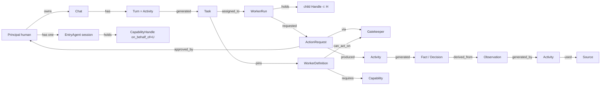
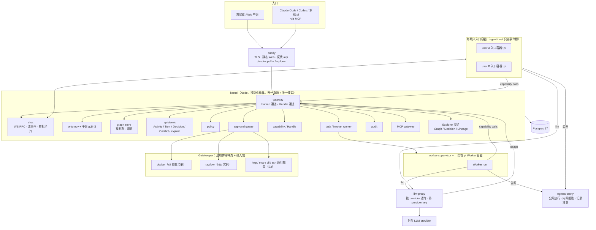

# 基于 Graph 的 AI 中台 —— 架构设计 v0.3

> 文档性质：架构设计 / 领域建模（Ontology-first）。
> 状态：**全部为提案（Target Architecture）**，尚无任何组件实现。凡描述「内核」「入口容器」「Gatekeeper」「Worker」等组件，均指待建目标。
> 版本脉络：v0.1 图内核与治理；v0.2 入口改为 **Web + 每用户一个常驻 pi agent**、全 TypeScript、用户隔离模型；v0.3 安全模型收敛为三条底线、agent 有真实工作环境、通用门与接口清单、三档编排、内核六层依赖与领域事件、`llm-proxy` 拆出、失控配额。差量与理由见 `design-review-2026-09-01.md` §8–§10。
> 参考项目源码分析见 `reference-projects-and-oss-landscape.md`。环境具体值在未入库的 `docs/private/`。
> 日期：2026-09-01

---

## 0. 怎么读

- 只要结论：§1、§8.1 一轮对话、§15 路线图。
- 做建模评审：§5（核心，其余章节都是它的投影）。
- 要动手：§9、§10、`development-tasks.md`。

---

## 1. 总体判断

**你要的平台（权威表述）**：一个 Web 中台入口。每个用户登录后有一个属于自己的、隔离的 AI agent（pi）和一个对话框。说出需求，这个 agent 在图上找到能干活的 Worker（也是 pi），动态拉起它们，各自通过统一的门对接不同系统，把结果和决策带着来龙去脉写回图里，再决定下一步。所有 agent 共享同一份图，受同一套规则约束，每一步可追溯、可审批、可重建。

**设计重心（不可偏移）**：(a) 基于 Graph 的 AI 中台，一份带类型、双时态、逐边溯源的共享图，既是记忆也是控制面；(b) 模块化，内核 / 宿主 / 门 / Worker 各自独立部署、独立失效；(c) 分权，读写分离、capability 授权、审批、审计、用户隔离，靠系统边界不靠 prompt；(d) 随时调用独立的 AI Worker，`invoke_worker` 是一等能力，Worker 在图上可被发现；(e) pi 是入口 agent 与 Worker 的运行底层。

判断：

1. **产品形态照 cloudflare-os，图基底照 Semantica 的概念，运行底层用 pi。** 三个项目各取一层，且源码研究已确认哪些可移植：cloudflare-os 的聊天 RPC 面、审批卡片与 `awaitDecision` 语义、自动批准 drain 算法可原样搬到 Node + Postgres；不可移植的 DO / Cap'n Web stub / 动态 Worker 各有替代。Semantica 的 Explorer 是纯前端、只依赖 HTTP 契约，可整体复用；它的 skills 直接 import 内部 Python 类，**不能靠工具名兼容复用**。pi 的 RPC 子进程模式是唯一既有文档又能真隔离的托管方式，`packages/server` 不能用。
2. **「基于 Graph」是领域模型的形状**：带类型对象 + 带类型有向关系 + 双时态 + 逐边溯源。Postgres 是唯一真源，图库是可后加的投影。
3. **五类图是一个 Domain Model 的三种视图**（§4）；Graph Engineering 的四部分完整保留，并加「执行本身也是图并写回同一个图」。
4. **常驻 agent 是缓存不是真源**。每用户的入口容器会崩会重启；对话与决策在 Postgres，pi 的上下文在它自己的 JSONL 会话目录，两者以 turn id 关联，重启后恢复（§7.2）。
5. **动态编排在受治理的边上进行，但 agent 必须真的能干活。** 入口 agent 与 Worker 都有真实工作环境：文件、bash、装包、经代理的公网访问、模型。治理只压在三条底线上：凭证永不进任何 agent 进程；碰有凭证、在内网、有状态的系统才走门与审批；用户隔离与审计不减。
6. **接入任意系统靠「通用传输种类 + 接口清单」，不靠逐系统写代码。** 门只有 `http` / `mcp` / `cli` / `ssh`（后续 `db` / `browser`）几种传输，系统能做什么由图里的接口清单描述；Worker 拿到的是清单投影出来的工具，永远看不到地址与凭证。编排分三档：单次观察直接调、多步或含写入交给 Worker、跨系统且重复的流程沉淀为 Procedure 与 Workflow（§8.5）。

---

## 2. 背景与目标

### 2.1 目标（可验证）

| # | 目标 | 验证 |
|---|------|------|
| G1 | 一个用户在 Web 里说需求，自己的入口 agent 动态拉起 Worker 经门完成，结果与决策带溯源写回图，对话里能看到过程与审批卡片 | S2 验收脚本 |
| G2 | 任何 agent 对外部系统的写操作都经策略判定并留下可重建的审批 / 执行记录 | 不存在无 policy 决策记录的已执行 ActionRequest |
| G3 | 图上任意事实能回答「为什么相信」：来源、活动、执行者、时间、被谁取代 | `explain(fact)` 完整 |
| G4 | 用户之间隔离：看不到彼此的私有来源与对话，不能用彼此的凭证，不能批彼此范围外的动作 | 隔离测试集 |
| G5 | 图有真实内容且看得见：目标主机的服务与依赖入图，Explorer 能浏览图、决策链、血缘 | S3 验收 |
| G6 | 其他运行时（Claude Code / Codex / 你本机的 pi）经 MCP 接入同一图与同一策略 | S3 验收 |
| G7 | 业务概念与代码符号互链，影响分析跨图 | P4 |

### 2.2 非目标（当前阶段）

不做 BI 语义层；不做分布式图库；不做可视化流程编辑器；不做 SaaS 计费；不接入 Hermes 记忆晋升；本机不做 LLM 推理。

---

## 3. 现状与约束

### 3.1 现状

- 已有：三个参考项目源码；本机 `codegraph` MCP 工具。
- 目标主机（只读盘点，具体值在 `docs/private/`）：一台 x86_64 Linux VM，资源足够跑 Postgres + 内核 + 宿主 + 数个 Worker；Docker + Compose，已配置 gVisor `runsc`（未验证可用）；已运行一套知识库栈（RAGFlow 及其存储）、一个 agent 运行时及其 SQLite 记忆、两个 FastAPI 数据运行时、一个本机 embedding 网关。没有 Postgres。GPU 已满，本机不能推理。
- 未有：中台的任何组件。

### 3.2 三个参考项目的角色

| 项目 | 角色 | 借什么 | 不借什么 |
|------|------|--------|---------|
| **cloudflare-os**（Apache-2.0，TS，基于 pi-agent-core） | 产品形态与治理蓝本 | 一个 WebSocket 会话 + 每工作区一个 RPC 对象的聊天面；`AiChatSubscriber` 式的流事件与「先订阅再翻页」；`ActionDescription{title, description, awaitDecision, autoApprovable, actionKind, implementsRevert}` 与聊天内审批卡片；两种动作模式（模拟不阻塞 / `awaitDecision` 挂起）；`AutoApprovalDrainer` 双信号严格顺序算法；Observation 与 Action 分离；单一鉴权收口；凭证只在 Gatekeeper；`build/use` 粗角色；认证配置留在环境变量层 | Durable Object、Cap'n Web stub、Facets、Dynamic Workers、`spawnCallable` 的 stub（以任务队列替代）、11k 行的 Overseer |
| **Semantica 0.6.7**（MIT，Python） | 图基底概念、Explorer、MCP 契约 | Decision / Conflict / ProvenanceEntry(PROV-O) / BiTemporalFact 一等；facade + adapter 存储抽象；`state_at`；**Explorer 整体复用**（纯前端，只依赖 `/api/*` 契约与 `X-API-Key`）；17 个 MCP 工具的名字与必填参数作为契约；`Decision` 与 `ProvenanceEntry` 字段名对齐 | 作为内核（43 个强制依赖含 torch，ContextGraph 是内存 / 文件结构，无租户）；**skills 不能复用**（它们直接 `import semantica.context`，不走 MCP，只借其子命令与输出格式作 UX 规范）；Ontology 工作区（3540 行路由，不承诺） |
| **pi 0.84.4**（MIT，TS） | 入口 agent 与 Worker 的运行底层 | `pi --mode rpc` 子进程：JSONL 命令 / 事件、`--session-dir`、`PI_CODING_AGENT_DIR`、`--system-prompt`、`-e 扩展`、`--tools` 白名单、`extension_ui_request` 子协议；扩展的 `context` / `tool_call` / `session_*` 事件；JSONL 父指针会话树；subagent 示例的子进程派生；pi-ai 的多 provider 与逐消息 usage / cost | `packages/server` / `client` / `protocol`（实验性，无连接身份，租约只在客户端）；进程内 SDK 托管多用户（只有逻辑隔离，且 `ResourceLoader` 会沿 cwd 自动加载扩展） |

### 3.3 约束

- 全 TypeScript：内核、agent 宿主、Web、Worker 镜像、Gatekeeper 基类、采集器；Postgres 17；MCP 官方 TS SDK。Python 只用于 P3 的 Semantica 抽取 Worker 与适合 Python 的 Gatekeeper（门的协议是 HTTP）。
- 自托管、docker-compose、单机；开源 MIT，仓库公开，入库文档不含环境具体值。
- LLM 全部外部、厂商中立；治理靠系统边界；不与 Hermes 绑定。

---

## 4. 五类图 → 一个 Domain Model 的三种模型

| 图 | 回答 | 定位 | 真源 | 时态 |
|----|------|------|------|------|
| Ontology | 有哪些概念、关系、动作、权限 | 类型层：ObjectType / LinkType / ActionType / Policy 注册表，带版本 | 人工发布，agent 可提议 | 版本化 |
| Knowledge Graph | 普遍为真的事实 | World Model 实例层：Object / Link，每条 Link 是带溯源的 Fact | 采集 / 抽取 / 断言 | 业务有效期 |
| Code Graph | 代码结构 | World Model 的派生子本体，真源 `repo@commit`，联邦现有 codegraph 索引 | indexer | 绑定 commit |
| Context Graph | 当前上下文、状态、决策、血缘、责任人 | Epistemic + 运行态：Source / Observation / Activity / Chat / Turn / Decision / Conflict / Evidence / Task / Dataset | 会话、审批、摄取、人工 | 双时态 |
| Graph Engineering | 系统怎么干活 | 把图建起来、跑起来的工程：数据工程、图谱建模、检索推理、Agent 编排；Governance Model 是编排的骨架 | 管理员 + 运行时事件 | 执行路径写回同一个图 |

```
World Model      = Ontology + Knowledge Graph + Code Graph
Epistemic Model  = Context Graph
Governance Model = Capability / Policy / Approval / Task / Audit
```

**Graph Engineering 的理解**：四部分完整保留，加一条统一原则：**执行本身也是图，且写回同一个图**。WorkerDefinition 是节点，Capability 是允许的边，Policy 是边上的守卫，一次执行（Chat → Turn → invoke_worker → Task → WorkerRun → ActionRequest → Gatekeeper → Activity → Fact / Decision）是图上被实例化的一条路径。「系统知道什么」与「系统怎么干活」用同一套存储、同一个 `explain` 回答。与「图即代码」的工作流引擎不同，这里的图是数据：节点、允许的边、守卫都可查询、可版本化、可授权；LLM 在允许的边内动态规划，人守边。

---

## 5. Domain Model

### 5.1 一等概念

#### 5.1.1 租户与主体

| 概念 | 含义 |
|------|------|
| **Workspace** | 逻辑租户；所有对象归属唯一 Workspace；跨 Workspace 只能经受审批的 Share |
| **Principal** | `human` / `agent`（一次 WorkerRun 或一个入口 agent 实例）/ `service` |
| **Role** | 五个，粗粒度：`owner` 授权与策略；`builder` 提议本体与 WorkerDefinition；`operator` 进审批队列；`member` 对话、调用、观察；`auditor` 只读含密钥元数据。角色是「能进哪个门」，capability 范围是「能做哪件事」 |
| **Session** | Principal 的一次会话：`entry`（入口 agent）、`worker_run`、`mcp_session`（外部运行时）、`service`、`web`（human 通道） |

#### 5.1.2 World Model

| 概念 | 含义 |
|------|------|
| **OntologyVersion / ObjectType / LinkType / PropertyType / ActionType** | 同 v0.1；ActionType 带 `reversibility`、`blast_radius`、`auto_approvable`、`await_decision`、`requester_can_approve` |
| **Object / Link(=Fact) / PropertyAssertion** | 同 v0.1 |
| **平台元本体（对象化的平台自身）** | `WorkerDefinition`、`Gatekeeper`、`Operation`、`Capability`、`Skill`、`Procedure` 也是 Object。`Gatekeeper --exposes--> Operation`，`Operation --reads|writes--> ObjectType`，`Gatekeeper --connects_to--> 系统对象`，`WorkerDefinition --can_act_on--> Gatekeeper | Operation | ObjectType`，`WorkerDefinition --requires--> Capability`，`WorkerDefinition --uses--> Skill`，`Procedure --steps--> Operation | WorkerDefinition`。入口 agent 找手段 = 一次 `traverse`（`find_operations` / `find_workers` / `find_procedures`）。这些对象的**发布**只能经 human 通道（I16）；agent 可以提议草稿 |
| **Code 子本体** | Repository / Commit / File / Symbol；`implemented_by` 跨图边 |

#### 5.1.3 Epistemic Model

| 概念 | 含义 |
|------|------|
| **Source** | 文档 / 数据库 / API / 人 / agent 会话；带 `owner_principal` 与 `visibility`（`workspace` / `private`） |
| **Activity** | PROV-O Activity：摄取运行、抽取、**Turn**（一轮对话）、Workflow Step |
| **Chat** | 一个用户与其入口 agent 的对话线程；属于该用户，私有 |
| **Turn** | Chat 中的一轮：用户消息 + agent 的一次运行；是 `kind=agent_turn` 的 Activity，`used` 上下文 Fact，`generated` Decision / Task |
| **Observation / Fact / Evidence / Conflict / Decision / Dataset / Lineage** | 同 v0.1；Fact 与 Decision 继承其 Source 的可见性 |

#### 5.1.4 Governance Model

| 概念 | 含义 |
|------|------|
| **Capability / CapabilityGrant / CapabilityHandle** | 同 v0.1；Handle 绑定 Session，携带 `on_behalf_of`（不变量 I13），只能衰减 |
| **Policy** | `allow` / `require_approval` / `deny`；双信号自动批准；`requester_can_approve` 按 `blast_radius` |
| **ActionRequest / Approval** | 同 v0.1；增加 `await_decision`、`parent_worker_run_id`、`actor_runtime`、`on_behalf_of` |
| **Task / WorkerRun** | 同 v0.1；WorkerRun 记 `parent_worker_run_id` |
| **WorkerDefinition** | 「可执行文件」：`kind`（`entry` / `worker`）、模型白名单、system prompt、skills、扩展、所需 Capability、能力上限；`draft → published → deprecated`；Task 固定引用启动时版本。`entry` 类的能力上限：图的 observe、门上的 **observe 类 Operation**、`find_*`、`invoke_worker`、`request_connection`、`record_decision`、`propose_*`；没有门上的 execute |
| **EntryAgent（入口 agent 实例）** | 每用户一个常驻容器（与 Worker 同镜像，`NEXTTIME_MODE=entry`），带该用户的持久工作目录；由 supervisor 管理生命周期，agent-host 只做事件桥；持有该用户的入口 Handle |
| **Connection（连接）** | 两个不同的动作。**建立**：某个门实例与某个系统之间的一次受治理的建立，由 agent `request_connection(kind, target)` 或人在「连接系统」页发起，人填地址与凭证，凭证只进门；产生 `Gatekeeper` 实例对象、系统对象与 `connects_to` 边；永久复用。**授权**：让某个用户的入口 agent 能用一个已存在的门是 `connect_gatekeeper`，本质是一条 CapabilityGrant，由 owner 执行。分权落在第二个动作上 |
| **InterfaceManifest / Operation（接口清单）** | 一个门实例暴露的操作集合。每个 Operation：`name`、`binding`（`http`: 方法 + 路径；`cli`: 命令模板；`mcp`: 工具名；`ssh`: 命令模板或命令模式）、`params_schema`、`mode`（observe / execute）、`blast_radius`、`reversibility`、`auto_approvable`、`await_decision`、`reads/writes` 的 ObjectType、可选的结果映射（JMESPath → 对象身份键与属性）。来源：从 OpenAPI 或 MCP `tools/list` 导入；agent 探索后 `propose_operation`；手写 YAML。**未分类的操作默认 `require_approval`** |
| **Skill（做法）** | 一份步骤文档（pi skill 格式），写明用哪些 Operation、怎么解析、有什么坑；`draft → published → deprecated`；Worker 结束时可 `propose_skill`，人发布；WorkerDefinition `uses` Skill，容器启动时装载 |
| **Procedure（沉淀的流程）** | 跨系统、重复出现的业务流程：有序步骤引用 Operation 与 WorkerDefinition，含审批步与验证步；由成功的 Task 沉淀（`propose_procedure`），人发布；P5 起可由 Workflow 引擎持久执行、由 Trigger 驱动 |
| **invoke_worker** | `invoke_worker(definition@version, input, wait, timeout) → result | task_id`；入口 agent 调用时子 Handle 是自身 Handle 的衰减且继承 `on_behalf_of` |
| **Gatekeeper** | 通用传输种类的一个实例：`http` / `mcp` / `cli` / `ssh`（后续 `db` / `browser`），加一份接口清单与一份凭证。协议 `describe_operations / observe / simulate / apply / revert / health`；`ssh` 与 `cli` 类另带命令策略表（模式 → 只读 / 执行 / 影响半径）；凭证两种：共享 / ConnectedAccount，按 `on_behalf_of` 取用。**门不是逐系统写的代码** |
| **ConnectedAccount** | 某 Principal 在某 Gatekeeper 的个人凭证引用，只存在 Gatekeeper 内；Gatekeeper 按 `on_behalf_of` 取用 |
| **Trigger** | 系统事件模式 → WorkerDefinition 的映射，受策略约束；P5 |
| **AuditRecord** | 每次受治理转移的 append-only 记录 |

### 5.2 关键关系



关系表同 v0.1，新增：`Chat owned_by Principal`（1:N，私有）；`Turn part_of Chat`；`Turn generated Task / Decision`；`WorkerRun parent WorkerRun`（0..1）；`WorkerDefinition can_act_on Gatekeeper | ObjectType`；`WorkerDefinition requires Capability`；`Gatekeeper connects_to Object`；`Task pins WorkerDefinition@version`。

### 5.3 永不允许存在的关系

1. 跨 Workspace 的 Link（除经审批的 Share）。
2. 任何 agent 进程持有外部系统凭证或 LLM provider key。
3. 已执行的 ActionRequest 没有 Policy 决策记录。
4. 没有 Activity 溯源的 Fact。
5. 一个 Object 两个 ObjectType。
6. `verified` 的 Fact 没有 `verified_by` 与 Evidence。
7. Code Graph 节点被人工编辑。
8. Handle 范围大于其来源。
9. 经 Handle 通道完成的 Approval。
10. `on_behalf_of` 来自请求体而非 Handle。
11. 入口 agent 的 Handle 含 execute 能力。
12. 平台元本体对象（WorkerDefinition / Gatekeeper / Operation / Capability / Skill / Procedure）的**发布**经 Handle 通道完成；Handle 通道最多只能写对提议者私有的草稿。

### 5.4 不变量与强制机制

| # | 不变量 | 机制 |
|---|--------|------|
| I1 | 每行业务表非空 `workspace_id`，查询带 workspace 谓词 | NOT NULL + 复合外键 + RLS |
| I2 | Link 符合 LinkType 的 domain / range | 内核写入校验 + 触发器 |
| I3 | Fact 必有 `activity_id`、`asserted_by`、`recorded_at` | NOT NULL |
| I4 | Fact 只追加不覆盖 | 只有 assert / supersede / invalidate；触发器禁改内容列 |
| I5 | 异源不一致 → Conflict；同源变化 → supersede | 写入路径按 `source_id` 判定 |
| I6 | ActionRequest 只沿转移表走 | 转移表驱动 + CHECK |
| I7 | 执行前必有 Policy 决策记录 | 状态机前置 + CHECK |
| I8 | 自动批准 = ActionType 声明 且 Workspace 规则开启 | 双信号 |
| I9 | 任何 agent 进程与内核进程内都没有外部凭证 | 系统凭证只在 Gatekeeper，LLM provider key 只在 `llm-proxy`；**内核进程零外部凭证**；agent 容器启动自检扫描 env |
| I10 | agent 容器（入口与 Worker）的出网只经出网代理：公网放行，内网地址段与平台内部服务拒绝，目标域名记录到本次 Activity | 容器无直接路由，`HTTP_PROXY` / `HTTPS_PROXY` 指向代理；从容器直连内网必须失败；代理按 WorkerDefinition 的允许 / 拒绝清单过滤 |
| I11 | 所有受治理转移写 AuditRecord | 同事务 |
| I12 | 已发布 OntologyVersion / WorkerDefinition 不可改 | 只读触发器 |
| I13 | `on_behalf_of` 只来自 Handle；子 Handle 继承且不可改 | gateway 从会话解析；`capability_handles` 列；请求体同名字段被拒 |
| I14 | 审批者必须持有所审批的 `action_kind × resource_scope` | `approve` 前置检查；角色只决定能否进队列 |
| I15 | 每用户入口容器的工作目录与 pi 目录只挂载给该用户的入口容器；其他用户的容器与任何 Worker 容器都不挂载 | 容器边界 + supervisor 的挂载规则 |
| I16 | 平台元本体对象只能经 human 通道**发布**；Handle 通道只能写对提议者私有的草稿 | gateway 按 ObjectType 与状态判定：Handle 通道写入非 `draft` 状态或修改他人草稿一律拒绝 |
| I17 | 未在接口清单中分类的操作一律 `require_approval`；分类只能经 human 通道发布 | 门在 `describe_operations` 之外的调用默认走审批；`propose_operation` 只产草稿 |
| I18 | 失控防护：`invoke_worker` 派生链深度 ≤ 3；每用户并发 WorkerRun、每 Task 的 token 与时长、每工作区日成本都有上限 | 深度超限时内核拒绝 `invoke_worker` 并返回入口 agent 可转述的错误；token 到 80% 时 `llm-proxy` 上报、内核经 `context` 注入警告，到 100% 时 `llm-proxy` 返回预算耗尽错误，Worker 本轮结束、Task 进入 `failed: budget_exhausted`、入口 agent 得知；时长超限由 reaper 终止；配额是工作区策略数据，owner 可调 |

### 5.5 状态机

**Fact**：生命周期 `recorded → superseded | invalidated`（时间戳列）；认知状态 `observed | extracted | inferred | asserted → verified | contradicted`（独立列）。

**Conflict**：`open → resolved | accepted_both | dismissed`；私有 Source 参与的 Conflict 只对私有一方可见。

**Decision**：`proposed → approved | rejected → executed → verified | failed → superseded | archived`。

**ActionRequest**：同 v0.1 的状态图。两种动作模式，由 Gatekeeper 的 `describe_operations` 逐动作声明：

- `await_decision=false`：Gatekeeper 返回 `simulate` 结果，Worker 的工具调用立即得到 `{status: pending_approval, simulated}` 并继续；依赖它的后续 ActionRequest 在父请求 `executed` 前不得进入 `executing`。
- `await_decision=true`：Worker 的工具调用等待，Task 进入 `waiting_approval`；等待受同一超时规则约束（见 §8.2），超时则工具返回 `{status: pending_approval, action_request_id}`，Worker 可选择结束本轮，结果在下一轮 `context` 中可见。

**Task**：`created → queued → running ⇄ waiting_approval → completed | failed | cancelled`。

**WorkerRun**：`provisioning → running → suspended → terminated`；terminated 撤销全部 Handle。

**EntryAgent session**：`starting → ready → busy → ready …`；`crashed → starting`（宿主自动恢复，见 §7.2）；`stopped`。

**OntologyVersion / WorkerDefinition**：`draft → published → deprecated`；draft 可由 agent 经 `propose_*` 提议，对提议者私有；publish 只走 human 通道，发布后工作区可见。

**CapabilityGrant**：`active → revoked | expired`。

### 5.6 认知状态与可见性

- `epistemic_status`：`observed`（系统 API 直接读取，采集器）/ `extracted`（NLP / LLM 抽取）/ `inferred`（agent 推理）/ `asserted`（人工）/ `verified` / `contradicted`；`confidence` 是独立的连续值。检索给 agent 的上下文必须带状态；高影响 ActionType 可要求依赖 Fact 为 `verified`。
- **可见性**：Source 带 `visibility`，Fact 与 Decision 继承。会话派生内容（Chat、Turn、Worker 会话）默认 `private` 给 `on_behalf_of` 的用户；晋升为 `workspace` 是 human 通道的受治理转移，产生 Decision。两个死角的规则：私有 Fact 与工作区 Fact 冲突时，Conflict 只对私有一方可见；agent 提议的本体 / WorkerDefinition 草稿对提议者私有，发布后可见。

### 5.7 三模型分离

同 v0.1：World / Epistemic / Governance 共享存储、语义分开。

### 5.8 用户隔离模型（分权的具体形态）

三层：Workspace 是数据边界（RLS）；Principal 与角色是权力边界；Capability 与 Handle 是执行边界。两条横切：代行（I13）与可见性（§5.6）。

| 事项 | 规则 |
|------|------|
| 入口 agent | 每用户一个实例，不共用；能力上限固定（§5.1.4）。共用一个常驻代理按对话切换 Handle 是混淆代理风险 |
| 审批 | 角色 `operator` 只是进队列；能批哪条由 capability 范围决定（I14）；`blast_radius=high` 默认 `requester_can_approve=false`，工作区可覆盖 |
| 凭证 | 共享凭证（docker、RouterOS）谁能用由授权决定；ConnectedAccount（GitHub、Slack、OA）按 `on_behalf_of` 取用；两种都只在 Gatekeeper 内，基类现在就区分；S2 实现共享凭证与静态录入的个人凭证，OAuth 流程 P5 |
| 身份配置 | 身份提供方、超级管理员在环境变量层，不进 API；`owner` 不能放宽登录 |
| 授权数据 | 不用图里 agent 可写的 `owned_by` / `member_of` 边做授权；需要关系型授权时用 OpenFGA / SpiceDB，元组只允许 human 通道写 |
| 不做 | 每用户一个数据库；自建 IdP |

---

## 6. 目标架构



分层：浏览器只与 caddy 通信；caddy 是唯一公网面（TLS）；内核是唯一真源与收口，进程内零外部凭证；入口容器与 Worker 只能到内核、`llm-proxy` 与出网代理；Gatekeeper 只被内核访问；Postgres 只对内核开放。

---

## 7. 核心模块

### 7.1 内核（kernel）模块

| 模块 | 职责 | 状态归属 |
|------|------|---------|
| gateway | 两类通道认证；解析 (principal, session, on_behalf_of, actor_runtime, capability, target)；限流；审计入口 | 无 |
| chat | Chat / Turn 持久化；WS RPC（§9.4）；把宿主转发的 pi 事件变成流事件推给该用户；把待审批与任务状态作为卡片推送 | Chat / Message |
| ontology | OntologyVersion 生命周期；类型校验；JSON Schema 投影；平台元本体 | 类型、WorkerDefinition、Gatekeeper、Capability 对象 |
| graph | Object / Link / Fact 写入与查询；`traverse` / `search` / `state_at`；`find_operations` / `find_workers` / `find_procedures` | Object / Link |
| epistemic | Activity / Observation / Evidence / Conflict / Decision；`explain`；可见性 | 同名对象 |
| policy | 数据化规则；`evaluate`；双信号；`requester_can_approve` | Policy |
| approval | ActionRequest 状态机；drain（每 Gatekeeper 单飞、升序、遇 pending 停）；`approve` 同事务写 Approval Decision | ActionRequest |
| capability | Grant；Handle 签发 / 验证 / 撤销 / 衰减；`on_behalf_of` | Grant / Handle |
| task | Task / WorkerRun；`invoke_worker`；调用 supervisor；崩溃回队；超时 | Task / WorkerRun |
| host-bridge | `AgentRuntime` 接口（`start / prompt / stop` + 平台事件词表）与 agent-host 的内部 RPC；把 pi 事件翻译为平台事件后发布 | 无 |
| connections | `request_connection` 卡片、门实例注册、清单导入草稿、`connect_gatekeeper` 授权；写平台元本体 | Gatekeeper 实例、连接请求 |
| gatekeeper-registry | `describe_operations` 缓存；健康 | 元数据 |
| llm-usage | 接收 `llm-proxy` 上报的用量，按 Task / Turn 记账；配额判定（I18）；provider 配置的发布 | LlmUsage / Quota |
| mcp | MCP TS SDK；工具 = capability 投影；Semantica 工具名契约 | 无 |
| explorer-contract | 实现 Semantica Explorer 的 Graph / Decision / Lineage 端点（§9.5） | 无 |
| audit | append-only；`reconstruct`；PROV-O 导出 | AuditRecord |
| codegraph | 联邦 `.codegraph/` SQLite（P4） | `implemented_by` |

### 7.2 每用户一个常驻入口容器，agent-host 只做事件桥

- **形态**：入口 agent 与 Worker 用同一个镜像（§7.3）。每个用户一个常驻容器，`NEXTTIME_MODE=entry`，挂载该用户的持久工作目录 `${NEXTTIME_DATA}/workspaces/<uid>/`（含 pi 的 `--session-dir` 与 `PI_CODING_AGENT_DIR`）。容器里跑 `pi --mode rpc`，`--system-prompt` 来自该用户入口 WorkerDefinition 的已发布版本，`-e platform-extension`，**内置工具全开**（read / write / edit / bash / grep / find / ls）。
- **agent-host**：一个 Node 服务，只负责：向 supervisor 申请 / 停止入口容器、向内核申请入口 Handle、把容器 stdout 的 JSONL 事件（`message_update` / `tool_execution_*` / `agent_end`）桥到内核 `host-bridge` → chat → 该用户的 WS，以及把 `prompt` / `stop` 写回。`extension_ui_request` 子协议承接需要用户即时回答的交互。
- **I15** 由容器边界成立：该目录只挂给这个用户的入口容器。
- **连续性规则（真源）**：对话、Turn、决策、任务在 Postgres；pi 的上下文在它的 JSONL 会话目录；两者以 `turn_id` 关联（扩展每轮把 `turn_id` 写入会话条目）。容器崩溃或重启后以同一目录重拉，pi 从 JSONL 恢复；内核侧未完成的 Turn 标 `interrupted`，下一轮 `context` 注入「上轮中断」。**容器是缓存，不是真源。**
- **资源**：cgroup 上限；空闲超时停容器，下次对话再拉起（冷启动数秒）。
- **不做**：不用 pi `packages/server`；不在宿主进程内用 SDK 托管多用户；不在共享进程里跑用户的 pi。

### 7.3 agent 运行时（入口与 Worker 同一镜像）

- **镜像**：`node:24-bookworm-slim` + pi 0.84.4 + 平台扩展 + 常用工具链（git、curl、python3、pip、build-essential、ripgrep）；非 root；根文件系统只读，工作目录与 `/tmp` 可写；`runsc`。
- **真实工作环境（默认全开、只记录）**：读写自己的工作目录；跑 bash / python / node；装包（pip / npm / apt 经代理）；抓公网（HTTP / HTTPS、公开仓库 clone）；调模型（经 `llm-proxy`）；观察图。**只有经门去动有凭证的系统才受策略与审批。**
- **出网**：容器没有直接路由；`HTTP_PROXY` / `HTTPS_PROXY` 指向出网代理（§7.9）。
- **启动**：Worker 由 supervisor 一次性运行 `pi --mode rpc`（或 pi subagent 示例同款的 `--mode json -p`）；env 只注入 `KERNEL_URL / KERNEL_LLM_URL / CAPABILITY_HANDLE / TASK_ID / WORKSPACE_ID / WORKER_RUN_ID / NEXTTIME_MODE / HTTP(S)_PROXY`；**不继承宿主 env**。Task 工作目录 `${NEXTTIME_DATA}/workspaces/tasks/<task_id>/` 挂载，Task 结束后保留为 artifact，按保留策略清理。
- **结果契约**：Worker 结束时返回结构化结果 `{summary, findings, facts_to_assert[], evidence[], artifacts[], proposed_skill?, proposed_operations?}`；内核把 `facts_to_assert` 以 `inferred` 状态写入、把证据挂到 Activity、把提议存为草稿。会话 JSONL 回流为私有 Source。

### 7.4 平台扩展（唯一的共享 TS 扩展，三种模式）

`NEXTTIME_MODE` 决定行为：

| 模式 | 运行处 | 注册的工具 | `context` 注入 | 会话回传 |
|------|--------|-----------|---------------|---------|
| `entry` | 每用户入口容器 | 图的 observe 组（含 `get_task`）、Handle 内各门的 **observe 类 Operation**（投影为 `<gate>.<op>` 工具）、`find_operations` / `find_workers` / `find_procedures`、`invoke_worker`、`request_connection`、`record_decision`、`propose_*`；与 §5.1.4 能力上限一致；S1 只注册图的 observe 组 | 该用户的待审批、进行中 Task 及其结果、相关 Fact、先例、可用的门与 Procedure 摘要 | 每轮回传 Turn 与决策 |
| `worker` | Worker 容器 | Handle 内各门的 Operation（observe 直接调、execute 经 `request_action`）、图的 observe 与 `assert_fact`、`propose_*` | Task 输入、相关 Fact、装载的 Skill | 全量 JSONL + 结果契约 |
| `interactive` | 你本机的 pi | 同 `entry` 或按 Handle | 同 `entry` | 默认不回传 |

**接口注入的机制**：扩展启动时向内核请求 Handle 内允许的 Operation 列表（含参数 schema 与说明），逐个注册为 pi 工具 `<gate>.<op>`；工具调用 → observe 类直接经内核转门；execute 类由 `tool_call` 拦截转 `request_action`。Worker 从头到尾只看到工具名与参数，看不到传输、地址、凭证。拦截是便利闸门，安全边界在 gateway。

### 7.5 Gatekeeper：通用传输种类 + 接口清单

- **传输种类（S2 全部交付通用基类）**：`http`（REST / GraphQL，清单可从 OpenAPI 导入，GET 默认 observe、其余默认 execute 并按动词给默认影响半径）、`mcp`（代理外部 MCP server，`tools/list` 即清单，`readOnlyHint` 为 observe，其余 execute；自动批准需 `vetted`）、`cli`（门容器内的命令模板，如 `kubectl`、`gh`、厂商 CLI）、`ssh`（远程命令模板 + 命令策略表，兼容 RouterOS 这类只有 CLI 的设备）。后续：`db`（默认只读 SQL，写入以声明的存储过程为 Operation）、`browser`（无 API 系统的 RPA）。`docker` 是 `cli` 种类的一个预置清单。
- **协议**：`describe_operations`、`observe`、`simulate`、`apply`（以 `action_request_id` 幂等）、`revert`、`health`。
- **命令策略表（`ssh` / `cli`）**：正则模式 → `mode / blast_radius / auto_approvable`；未命中默认 `require_approval`（I17）；审批卡片上的「此类总是允许」把模式写入工作区策略。
- **结果映射**：Operation 可声明 JMESPath 映射把响应变成对象身份键与属性，门返回时内核写为 `observed` Fact；没有映射的结果只作为 Observation 挂在 Activity 上，仍可在对话里使用。
- **凭证**：基类内置共享（env）与 ConnectedAccount（门本地加密存储，按 `on_behalf_of`）；报销、审批这类必须以本人身份操作的系统用后者，库存、基础设施用前者。
- **连接流程**：`request_connection(kind, target)` 或「连接系统」页 → 卡片 → 人填地址与凭证（凭证直达门，不经内核持久化）→ 门实例注册 → 图里生成 `Gatekeeper` 与系统对象 → 若是 `http` / `mcp` 自动导入清单草稿 → owner 发布清单。
- 系统一侧的适配可以用任何语言；对平台一侧的协议不变。

### 7.6 Web（中台入口）

- React + Vite SPA，由 caddy 静态服务；一个 WebSocket；JSON-RPC 请求 / 响应 + 服务端推送（§9.4）。
- 页面：登录；对话（流式文本、工具调用行、Worker 拉起行、审批卡片：标题、Markdown 描述、模拟效果、动作种类、批准 / 拒绝 / 「总是批准此类」）；任务与 Worker 列表；连接系统（两件事：建立新门并填凭证；把已有的门授予某用户的入口 agent，cloudflare-os 的 capsule 语义）；审计与 explain 视图。
- **Explorer 挂载（S3）**：Semantica Explorer 静态构建挂在 `/explorer`，内核实现其 Graph / Decision / Lineage 契约（§9.5）；Ontology 与其他工作区隐藏，不承诺。Explorer 是 human 通道客户端，用 API key，不用 Handle。

### 7.7 模型策略

不绑定单一厂商。Worker 与入口 agent 侧复用 pi-ai 的 provider 实现；独立的 `llm-proxy` 服务做按 provider 的透传代理：用内核公钥在本地验证 Handle 签名（不逐请求回调内核）、注入真实 key、模型白名单、SSE 原样、用量与 80% 预算警告上报内核；内核进程不持有任何 provider key。内核自用调用（P3 起）用 OpenAI 兼容子集，同样经 `llm-proxy`。厂商与模型是配置 `${NEXTTIME_DATA}/config/llm-providers.yaml`，同一份配置生成内核路由表与 `models.json`。成本元数据复用 pi-ai 的 `ModelCost`。

### 7.8 采集器（TS）

`collectors/host-inventory`：dockerode + `systemctl` + `git remote` + 进程树；只采结构性事实；命令行在形成 Observation 前脱敏，`environ` 不读；service Principal，写 `observed` Fact；同源变化 supersede。

### 7.9 出网代理

一个小的转发代理容器（几百行 Node，或 tinyproxy 加策略脚本），挂在 `control` 与 `workers` 两个网络上。规则：放行公网；拒绝 RFC1918、链路本地与平台内部服务名；按来源容器解析到 WorkerRun / 入口会话，套用其 WorkerDefinition 的允许 / 拒绝清单；记录每个目标域名与字节数到该次 Activity 的 `metadata`。不解密 TLS。这是 I10 的实现，也是「agent 能抓公网、装包、clone 公开仓库」的前提。宿主网络若是 fake-IP 式透明代理（解析器把所有公网域名答成某个私有段，由本地代理映射回真实目标），用 `EGRESS_TRUSTED_RESOLVED_CIDRS` 声明该段：**域名**解析进该段视为公网，字面 IP 与平台子网仍拒绝；正常网络留空。

### 7.10 内核内部分层、模块契约、领域事件

**六层单向依赖**，用 dependency-cruiser 在 CI 强制（R1 / R3）：

| 层 | 内容 | 允许依赖 |
|----|------|---------|
| domain | `packages/shared`：枚举、转移表、capability 注册表、事件与 ActionDescription 的 Zod schema | 无 |
| substrate（图基底） | ontology、graph、epistemic、audit | domain |
| governance | capability、policy、approval、connections、llm-usage | domain、substrate |
| application | chat、task、host-bridge、worker（定义与 `find_*`） | domain、substrate、governance 的**服务接口与事件**，不读其表 |
| adapters | db、gatekeeper client、egress / llm-proxy 上报接收、supervisor client | 实现上层声明的 port |
| interfaces | http、ws、mcp、explorer-contract | application 与 governance 的服务接口 |

**模块契约**：每个模块拥有自己的表与迁移文件（`migrations/<module>/NNNN.sql`），只经 `index.ts` 暴露服务接口；不 import 其他模块的内部文件，不查询其他模块的表；跨模块联动经**领域事件**。

**领域事件与 outbox**：状态转移与业务写入在同一事务里写 `outbox` 表；一个派发器把事件投给进程内订阅者并标记已投递，重启后未投递的重放。事件词表在 domain 层（`TurnStarted / TurnCompleted / TaskUpdated / ActionRequestPending / ActionRequestUpdated / ConnectionCreated / FactAsserted / EgressObserved / BudgetWarning`）。规则：`chat` 与 `web` 只消费事件与只读视图，永不 import `approval` / `task`；审批路由是 `approval` 发事件、`chat` 订阅后写各持有者的系统消息。没有这条，outbox 只是更慢的函数调用。

**运行时适配层**：`host-bridge` 定义 `AgentRuntime` 接口：`start / prompt / stop` 与平台事件词表的事件流。pi 是**唯一计划的实现**，接口存在的目的是让 chat 与 web 永远看不到 pi 的事件名，而不是为了引入第二种运行时。

**机制与内容分离的物理形态**：内核是机制；内容以两种包交付，都是版本化 YAML 加文件，走 git 与 PR，经 human 通道发布进图：
- **领域包** `ontology/<domain>/`：`types.yaml`（ObjectType / LinkType / ActionType）、`skills/`、`procedures/`、`workers/`（WorkerDefinition）。`ops-assets` 是第一个，库存 / 报销 / 排班各一个。
- **接入包** `gatekeepers/<system>/`：`manifest.yaml`（Operation）、`policy.yaml`（命令策略表）、`mappings/`（结果映射）、`skills/`。`docker` 与 `ragflow` 是预置的两个。
- **CI 规则**：`packages/kernel/src` 下（测试 fixture 除外）不得出现任何具体系统名（`docker / ragflow / routeros / erp / oa` 等一张可维护的清单），命中即失败。内核里出现系统名，就是机制被内容污染的信号。

**规模门槛（review 时检查）**：单模块 ≤ 3000 行，单文件 ≤ 600 行，函数 ≤ 80 行；超过即拆，不等重构。这是 cloudflare-os 那个 11k 行 Overseer 的教训。

**测试分层**：domain 用纯单元测试（转移表穷举）；substrate 与 governance 用内核 + Postgres 集成测试；平台扩展与 gatekeeper 基类用契约测试（pi faux provider、fake 系统）；接口层用生成式一致性校验；端到端用 Playwright 与三个验收脚本。每层的失败都能定位到一层。

---

## 8. 数据流

### 8.1 一轮对话

```mermaid
sequenceDiagram
  participant B as 浏览器
  participant K as kernel
  participant H as agent-host
  participant E as 用户的入口容器 pi
  participant S as supervisor
  participant W as Worker pi
  participant G as Gatekeeper
  B->>K: sendChatMessage(chatId, text)
  K->>K: Turn(Activity) 落库; ensure entry agent
  K->>H: prompt(userId, turnId, text)
  H->>E: RPC prompt
  E->>K: context 事件: 拉待审批 / 任务 / Fact
  E->>K: find_operations / find_workers(need) → traverse 元本体
  E->>K: invoke_worker(def@v, input, wait=true, timeout)
  K->>K: policy + 配额(I18) → Task(queued) → child Handle ⊂ entry Handle
  K->>S: spawn(agent image, mode=worker, env{HANDLE,TASK_ID})
  S->>W: run (runsc, 出网经代理)
  W->>K: observe / request_action(docker.container_restart)
  K->>G: simulate
  K-->>W: pending_approval + simulated
  K-->>B: 审批卡片 (WS push)
  B->>K: approveAction(id)   [human 通道, I14]
  K->>G: apply(action_request_id)
  K-->>W: executed (下一次 context 或阻塞返回)
  W->>K: Task completed(result)
  K-->>E: invoke_worker 返回 result
  E-->>H: message_update … agent_end
  H-->>K: 事件
  K-->>B: textDelta … turn end
  K->>K: Turn generated Decision / Task; 会话回流 Source
```

### 8.2 `invoke_worker` 的同步与异步

`wait=true` 只等到 `timeout`（默认 90 秒）；超时返回 `{task_id, status}`，入口 agent 结束本轮并告知用户「已交给 Worker，等待审批 / 执行」。Task 终态或审批状态变化时，chat 模块推送卡片；用户下一次发言时，`context` 事件把 Task 结果注入，入口 agent 续接。cloudflare-os 式的「turn 挂起直到审批」在 P5 评估。入口 WorkerDefinition 的 system prompt 必须教这套异步模型。

### 8.3 采集到可解释事实

同 v0.1 §8.1。

### 8.4 手段发现

`find_operations(need)` / `find_workers(need)` / `find_procedures(need)`：在平台元本体上 `traverse`，与用户的 Grant 取交集，返回可用的 Operation、`WorkerDefinition@version`、Procedure 及摘要；入口 agent 据此选择三档编排之一。

### 8.5 编排模型：三档，由入口 agent 按图上的状态选择

| 档 | 何时 | 谁执行 | 例子 |
|----|------|--------|------|
| **直接观察** | 一次 observe 类 Operation 就能回答 | 入口 agent 自己调 `<gate>.<op>` | 「库存里 SKU X 还有多少」→ `inventory.stock.get` |
| **委派任务** | 多步、需要探索、含写入、跨少数系统 | `invoke_worker(定义, 任务, gates=[…])`，Handle 衰减到所需的门 | 「查最大流量 IP 并找出进程」；「把这张发票提交报销」 |
| **沉淀流程** | 跨系统且重复、有固定审批点 | 第一次作为委派任务跑通 → `propose_procedure` → 人发布 → P5 起由 Workflow 持久执行、Trigger 驱动 | 「每周一生成排班并通知」 |

入口 agent 的循环：理解需求 → 查图（Fact、先例、Procedure、可用手段）→ 单次观察够就直接答 → 否则选 Procedure 或 Worker 定义（没有专用就用通用 `ops-runner`）→ 衰减出只含所需门的 Handle → `invoke_worker` → 缺手段就 `request_connection` 或问用户 → 收到结果后把持久知识写图、记 Decision、成功且新颖时提议 Skill / Procedure。没有预画的流程图；顺序依赖逐轮推进，独立子任务并行拉起。

**写入业务系统的审批路由**：Worker 的 execute 类 ActionRequest 按 I14 路由给**持有该动作范围的人**，不一定是发起对话的用户。例如报销提交由申请人的入口 agent 发起，卡片出现在财务 operator 的队列与对话里；排班写回由 HR owner 批。请求者若同时持有范围且 `requester_can_approve` 允许，卡片出现在自己的对话里。**卡片出现的位置**：进入每个持有范围者自己的对话（作为系统消息）与审批队列；请求者的对话里只显示该动作的状态，没有批准按钮，除非请求者本人持有范围。Chat 仍然对其 owner 私有，跨用户传递的只是 ActionRequest，不是对话内容。

### 8.6 三个场景在全新平台上的走法

**运维：RouterOS 找流量大户并定位进程。** 图里没有 RouterOS 门 → 入口 agent `request_connection(ssh, RouterOS)` → 你填地址与凭证 → 门与设备对象入图。`invoke_worker(ops-runner, "找出当前内网流量最大的 IP", gates=[routeros-1])` → Worker 经 `ssh` 门跑 RouterOS 命令，`print` 类自动放行，未知命令第一次要你批并可勾「总是允许」→ 得到 IP。IP 对应主机：查图；没有就再 `request_connection(ssh, 那台服务器)`。第二个 Worker 在主机上 `ss -tnp` 定位进程，装 `nethogs` 是中影响动作走审批。入口 agent 合成答案，`record_decision`。留下：两道永久的门、IP 与主机的 Fact、两次 Task 与会话、命令与审批记录、一条 Decision；Worker 提议的「RouterOS 找流量大户」Skill 你发布后成为下次的手段。

**库存：从 ERP 拉库存。** 「连接系统」页填 ERP 的 OpenAPI 地址与服务账号 → `http` 门自动导入清单草稿：`GET /stock` 为 observe，`POST /adjust` 为 execute 高影响 → owner 发布。此后「SKU X 还有多少」是直接观察，入口 agent 自己调 `erp.stock.get`，结果按映射写成 `Stock` 对象的 `observed` Fact；「把 X 的库存调成 100」是委派任务或直接一次 `request_action`，由持有 `erp.adjust` 范围的人批。

**报销：提交并推进一张报销单。** OA 系统用 `http` 或 `mcp` 门接入，凭证种类是 ConnectedAccount，每个用户绑定自己的 OA 账号，门按 `on_behalf_of` 取用，所以报销单以本人身份提交。申请人上传发票作为对话附件（artifact），入口 agent 委派 Worker 填单并 `request_action(oa.expense.submit)`；审批卡片按范围路由到财务 operator 的对话；执行后回写 `ExpenseClaim` 对象与状态 Fact。跑通两次后沉淀为 Procedure：校验发票 → 填单 → 提交 → 等财务批 → 回写通知。

**排班：每周生成排班表。** HR 系统（`http`）提供人员与可用时间，规则在知识库（`ragflow` 门），排班结果写回 HR 并经消息门通知。第一次是委派任务；成功后 `propose_procedure` 固化为五步（拉人员、拉规则、生成、写回需 HR owner 批、通知）；P5 起 Trigger 每周一触发 Workflow。图里留下 `Staff / Shift / Rule` 对象与每周的 Decision，下次任何人问「为什么小王排了周三夜班」，`explain` 给出规则与证据。

三个场景用的是同一套机制：通用门 + 接口清单 + 三档编排 + 按范围路由的审批 + 结果契约写回图。不同的只是本体模块（运维资产、库存、报销、排班各一份）与清单。

---

## 9. 数据 / API 设计

### 9.1 存储决策

同 v0.1：Postgres 17 + pgvector 唯一真源；`GraphStore` facade 先 SQL；Apache AGE 为第一升级路径（PG 版本兼容需核实）；独立图库只在需要在线图算法或深遍历时。

### 9.2 核心表（增量）

在 v0.1 的 `workspaces / principals / ontology_versions / objects / activities / links / conflicts / audit_records` 基础上增加或修改：

```sql
create table sessions (
  workspace_id uuid not null, id uuid not null,
  principal_id uuid not null,
  kind text not null check (kind in ('web','entry','worker_run','mcp_session','service')),
  on_behalf_of uuid not null,           -- I13：会话级，Handle 从此派生
  status text not null, created_at timestamptz not null default now(), expires_at timestamptz,
  primary key (workspace_id, id)
);

create table chats (
  workspace_id uuid not null, id uuid not null,
  owner_principal_id uuid not null, title text, visibility text not null default 'private',
  created_at timestamptz not null default now(), primary key (workspace_id, id)
);
-- Turn = activities(kind='agent_turn', chat_id, sequence, user_message, status in ('running','completed','interrupted','failed'))

create table capability_handles (
  workspace_id uuid not null, jti uuid not null,
  session_id uuid not null, on_behalf_of uuid not null,   -- 从 sessions 复制，不可改
  parent_jti uuid,                                         -- 衰减来源
  scope jsonb not null, expires_at timestamptz not null, revoked_at timestamptz,
  primary key (workspace_id, jti)
);

-- action_requests 增列
--   on_behalf_of uuid not null, await_decision boolean not null default false,
--   parent_worker_run_id uuid, actor_runtime text not null
-- outbox(workspace_id, id bigserial, event_type, payload jsonb, created_at, dispatched_at)   -- §7.10
-- quotas(workspace_id, key, value jsonb)                                                   -- I18，工作区策略数据
-- gatekeeper_instances / operations / skills / procedures 作为平台元本体存于 objects / links，状态与版本在 properties

create table worker_definitions (
  workspace_id uuid not null, id uuid not null, version int not null,
  kind text not null check (kind in ('entry','worker')),
  status text not null check (status in ('draft','published','deprecated')),
  definition jsonb not null,           -- 模型白名单、prompt、skills、扩展、所需 capability、能力上限
  proposed_by uuid not null, published_by uuid,
  primary key (workspace_id, id, version)
);
```

其余表同 v0.1（`sources` 增 `owner_principal_id`、`visibility`）。RLS 谓词扩展为：workspace 匹配，且（`visibility='workspace'` 或 `owner = current principal` 或存在 Share）。

### 9.3 Capability 契约（HTTP 与 MCP 两个投影）

| 组 | capability | 模式 | 备注 |
|----|-----------|------|------|
| chat | `list_chats` / `new_chat` / `send_chat_message` / `stop_agent` / `get_chat_history` / `subscribe_chat` | human | 只走 human 通道 |
| ontology | `publish_ontology_version` / `propose_ontology_change` / `get_type` / `list_types` / `validate` | execute（human）/ propose / observe | |
| graph | `get_object` / `traverse` / `search` / `state_at` / `find_operations` / `find_workers` / `find_procedures` | observe | 结果带 `epistemic_status`；`find_*` 与调用者 Grant 取交集 |
| gate | `<gate>.<op>`（observe 类） | observe | 接口清单投影出的工具；入口与 Worker 均可 |
| | `<gate>.<op>`（execute 类）经 `request_action` | execute | 只有 Worker 的 Handle 可含 |
| connection | `request_connection` | propose（Handle 通道） | 产生连接请求卡片 |
| | `create_connection`（填凭证、注册门、导入清单草稿）/ `publish_manifest` / `connect_gatekeeper` | human（owner） | 凭证直达门；`connect_gatekeeper` = CapabilityGrant |
| meta | `propose_operation` / `propose_skill` / `propose_procedure` | propose | 私有草稿（I16） |
| | `publish_skill` / `publish_procedure` / `deprecate_*` | human | |
| | `assert_fact` / `supersede_fact` / `invalidate_fact` | propose | 状态由调用方类型决定 |
| epistemic | `explain` / `record_decision` / `query_decisions` / `find_precedents` / `causal_chain` / `decision_impact` / `list_conflicts` / `resolve_conflict` / `verify_fact` | observe / propose | Semantica 工具名与必填参数保持一致（`get_provenance`=`explain`，`get_causal_chain`=`causal_chain`，`analyze_decision_impact`=`decision_impact`） |
| governance | `request_action` | execute | Worker |
| | `approve` / `reject` / `list_pending` / `get_action` / `set_auto_approved_action_kind` | human | I14 |
| | `grant_capability` / `revoke_capability` / `set_policy` / `set_quota` / `issue_handle` | human（owner） | |
| task | `create_task` / `invoke_worker` / `get_task` / `cancel_task` | propose / observe | |
| worker | `propose_worker_definition` / `publish_worker_definition` / `deprecate_worker_definition` / `list_worker_definitions` | propose / human / observe | |
| ingest | `register_source` / `submit_observations` | propose | service |
| audit | `audit_query` / `reconstruct` / `export_prov` | observe（auditor） | |

MCP 工具 = Handle 通道可用行的投影。Semantica 的 17 个工具名与必填参数作为契约保留；其 skills 需按本平台 MCP 重写实现，只沿用子命令与输出格式。

### 9.4 聊天 WebSocket 协议

- 一个 WS 连接 `/ws`，human 通道认证后使用；JSON-RPC 2.0 请求 / 响应（带 `id`）+ 服务端推送通知（无 `id`）。
- 推送事件（借 cloudflare-os `AiChatSubscriber`）：`chat.message`（持久消息）、`chat.stream`（`textDelta` / `toolCallStarted` / `toolCallEnded` / `workerSpawned` / `taskUpdated`）、`chat.metadata`、`action.pending` / `action.updated`（审批卡片）、`task.updated`。
- **客户端规则：先 `subscribe_chat(chatId, startAfter)` 再 `get_chat_history` 翻页**，否则会丢事件。
- 一个 Chat 同时只允许一个进行中的 Turn；进行中时 `send_chat_message` 被拒，只能 `stop_agent`。

### 9.5 Explorer 契约（S3，只做这些）

内核实现 Semantica Explorer 需要的：`GET /api/graph/nodes?limit&cursor`、`GET /api/graph/edges`、`POST /api/graph/search`、`GET /api/temporal/bounds`、`GET /api/temporal/snapshot?at=`、`GET /api/decisions`、`GET /api/decisions/{id}/chain`、`GET /api/provenance?node_id=`、`GET /api/provenance/report?node_id=&format=`，响应形状按其 `explorer/schemas.py`（`NodeResponse` / `EdgeResponse` / `DecisionResponse` / `ProvenanceNode` / `ProvenanceEdge`），含 `207` 部分成功约定与 `X-API-Key`。Ontology、Vocabulary、Reasoning、Enrich、SPARQL、Manage 工作区隐藏。

---

## 10. 部署与运维

### 10.1 目录结构（pnpm workspaces，全 TS）

```
NextTime-AI/
├── docker-compose.yml  .env.example  Makefile  LICENSE  README.md
├── packages/
│   ├── kernel/               # Node + TS：Fastify + ws + pg；模块见 §7.1；migrations/*.sql
│   ├── agent-host/           # 入口容器的事件桥（AgentRuntime 适配，pi 唯一实现）
│   ├── worker-supervisor/    # docker socket；runsc；只允许 nexttime/worker-runtime
│   ├── platform-extension/   # 唯一的 pi 扩展，三种模式
│   ├── web/                  # React + Vite：聊天、审批、任务、连接系统、审计
│   ├── gatekeeper-base/      # 协议、四种传输种类、清单模型、凭证解析、幂等存储
│   ├── llm-proxy/            # 按 provider 透传；本地验 Handle 签名；持 provider key；用量上报
│   ├── egress-proxy/         # 公网放行、内网拒绝、域名记录
│   └── shared/               # domain 层：枚举、转移表、capability 注册表、事件与 Zod schema
├── gatekeepers/              # 接入包：<system>/{manifest.yaml, policy.yaml, mappings/, skills/}
│   ├── docker/  ragflow/     # 预置两个
├── worker-runtime/           # Dockerfile：pi 0.84.4 + platform-extension + 工具链（入口与 Worker 共用）
├── collectors/host-inventory # TS
├── explorer/                 # Semantica Explorer 静态构建的挂载说明与构建脚本（S3）
├── ontology/                 # 领域包：platform-meta/、ops-assets/{types.yaml, skills/, procedures/, workers/}
├── deploy/caddy/Caddyfile  deploy/backup/
├── scripts/                  # accept_s1.sh accept_s2.sh accept_s3.sh check-capability-consistency.ts gen-models-json.ts check-kernel-purity.sh
├── .dependency-cruiser.cjs   # §7.10 的六层依赖规则
└── docs/  docs/runbooks/  (docs/private/ 不入库)
```

### 10.2 docker-compose 骨架

```yaml
services:
  postgres:
    image: pgvector/pgvector:pg17
    environment: { POSTGRES_DB: nexttime, POSTGRES_USER: nexttime, POSTGRES_PASSWORD_FILE: /run/secrets/pg_password }
    volumes: ["${NEXTTIME_DATA}/pgdata:/var/lib/postgresql/data"]
    secrets: [pg_password]
    healthcheck: { test: ["CMD-SHELL","pg_isready -U nexttime"], interval: 10s, retries: 5 }
    restart: unless-stopped
    networks: [control]

  kernel:
    build: { context: ., dockerfile: packages/kernel/Dockerfile }
    env_file: ${NEXTTIME_DATA}/secrets/kernel.env          # DB URL、Handle 密钥文件路径；无任何外部凭证（I9）
    secrets: [handle_key]                                   # Handle 签名私钥只进这一个容器：/run/secrets/handle_key
    volumes: ["${NEXTTIME_DATA}/config:/data/config:ro", "${NEXTTIME_DATA}/sessions:/data/sessions:ro"]
    depends_on: { postgres: { condition: service_healthy } }
    networks: [control, workers]
    restart: unless-stopped

  agent-host:
    build: { context: ., dockerfile: packages/agent-host/Dockerfile }
    environment: { KERNEL_URL: http://kernel:8080, SUPERVISOR_URL: http://worker-supervisor:8081 }
    networks: [control]                                      # 只到 kernel 与 supervisor；不挂载任何用户目录
    restart: unless-stopped

  worker-supervisor:                                         # resident mode: S1.5a; one-shot Task mode: S2.8
    build: { context: ., dockerfile: packages/worker-supervisor/Dockerfile }
    # config/ ro, except egress-sources.json re-mounted rw on top (no admin endpoint on
    # egress-proxy — the SOURCE_MAP_FILE is the documented registration contract, S1.5a).
    # group_add: non-root uid 10001 needs the host's `docker` group gid as a supplementary group
    # to reach /var/run/docker.sock (root:docker 660) — verified missing on the target host
    # (crash loop, EACCES) during S1.5a host verification; DOCKER_GID varies by host (`stat -c
    # '%g' /var/run/docker.sock`), 999 is only a common default.
    group_add: ["${DOCKER_GID:-999}"]
    volumes: ["/var/run/docker.sock:/var/run/docker.sock", "${NEXTTIME_DATA}/workspaces:/data/workspaces", "${NEXTTIME_DATA}/config:/data/config:ro", "${NEXTTIME_DATA}/config/egress-sources.json:/data/config/egress-sources.json"]
    # NEXTTIME_DATA: HOST path — bind-mount sources for spawned containers are resolved by the
    # daemon against the host fs, not this container's own /data/workspaces mount.
    environment: { WORKER_IMAGE: nexttime-ai-worker-runtime, WORKER_RUNTIME: "${WORKER_RUNTIME:-runc}", NEXTTIME_DATA: "${NEXTTIME_DATA}", KERNEL_URL: http://kernel:8080, KERNEL_LLM_URL: http://llm-proxy:8082, HTTP_PROXY_FOR_WORKERS: http://egress-proxy:3128 }
    networks: [control]
    restart: unless-stopped

  worker-runtime:                                            # build-only — produces the image worker-supervisor spawns by name (§7.3)
    build: { context: ., dockerfile: deploy/worker-runtime/Dockerfile }
    image: nexttime-ai-worker-runtime
    profiles: ["build-only"]

  gatekeeper-docker:
    build: { context: ., dockerfile: gatekeepers/docker/Dockerfile }
    volumes: ["/var/run/docker.sock:/var/run/docker.sock"]
    networks: [control]
    restart: unless-stopped

  gatekeeper-ragflow:
    build: { context: ., dockerfile: gatekeepers/ragflow/Dockerfile }
    env_file: ${NEXTTIME_DATA}/secrets/gatekeeper-ragflow.env
    networks: [control]
    restart: unless-stopped

  caddy:
    build: { context: ., dockerfile: deploy/caddy/Dockerfile }  # caddy:2.10 + 内建 web 静态产物
    image: nexttime-ai-caddy
    ports: ["${KERNEL_BIND_ADDR}:8443:8443"]
    # 静态根随镜像走：Dockerfile 里构建 packages/web 并拷进 /srv/web（/srv/explorer 在 S3 前是占位目录，
    # 之后同样拷进镜像）；改 web 就重建镜像。Caddyfile 仍 bind mount，改路由不必重建。
    volumes: ["./deploy/caddy/Caddyfile:/etc/caddy/Caddyfile:ro", "${NEXTTIME_DATA}/caddy:/data"]
    depends_on: [kernel]
    networks: [control]
    restart: unless-stopped                                  # 以 root 运行（E8：官方镜像 /config 卷非
                                                                # root 场景需自定义 Dockerfile，超出范围）

  llm-proxy:
    build: { context: ., dockerfile: packages/llm-proxy/Dockerfile }
    env_file: ${NEXTTIME_DATA}/secrets/llm-proxy.env       # provider keys 只在这里
    volumes: ["${NEXTTIME_DATA}/config/llm-providers.yaml:/data/config/llm-providers.yaml:ro"]
    environment: { KERNEL_URL: http://kernel:8080, HANDLE_PUBLIC_KEY_FILE: /data/config/handle.pub }
    networks: [control, workers]
    restart: unless-stopped

  egress-proxy:
    build: { context: ., dockerfile: packages/egress-proxy/Dockerfile }
    environment: { KERNEL_URL: http://kernel:8080 }
    networks: [control, workers]
    restart: unless-stopped

  backup:
    image: postgres:17-alpine                                # 与 postgres 同大版本
    entrypoint: ["/bin/sh", "/backup.sh"]                    # 每日 pg_dump + sessions/workspaces rsync，保留 7 份
    volumes: ["./deploy/backup/backup.sh:/backup.sh:ro", "${NEXTTIME_DATA}:/data"]
    secrets: [pg_password]
    networks: [control]
    restart: unless-stopped

networks:
  control: { ipam: { config: [{ subnet: "${NEXTTIME_SUBNET_CONTROL}" }] } }
  workers: { internal: true, ipam: { config: [{ subnet: "${NEXTTIME_SUBNET_WORKERS}" }] } }
secrets:
  pg_password: { file: "${NEXTTIME_DATA}/secrets/pg_password" }
  handle_key: { file: "${NEXTTIME_DATA}/secrets/handle.key" }   # 私钥在 secrets/，公钥 config/handle.pub
```

`${NEXTTIME_DATA}` 下：`pgdata/ sessions/ workspaces/ secrets/ config/ artifacts/ backups/ caddy/`。环境值在目标主机 `.env`，取值记录在 `docs/private/`。内核不对主机发布端口，只有 caddy 的 8443。

### 10.3 启动与验证

```bash
docker run --rm --runtime=runsc alpine:3.20 true && echo "runsc ok"
pnpm install && pnpm -r build && pnpm --filter kernel migrate
docker compose up -d
curl -sk "https://${KERNEL_BIND_ADDR}:8443/api/health"
nexttime workspace create demo && nexttime principal create --kind human --role owner alice
nexttime pack publish ./ontology/platform-meta --workspace demo      # 元本体 + 入口与 ops-runner 定义
nexttime pack publish ./gatekeepers/docker --workspace demo          # 接入包
# 浏览器登录 → 对话 → 看到 Turn 入图：
nexttime explain <turn_activity_id>
```

### 10.4 回滚

同 v0.1；增加：agent-host 重启不丢对话（真源在 Postgres + JSONL）；`worker_definitions` 发布不可变，问题版本 `deprecate`。

---

## 11. 权限与安全（刻意简化）

**三条底线，其余放开。**

1. **凭证不进任何 agent 进程，也不进内核进程**：系统凭证只在门，provider key 只在 `llm-proxy`；agent 容器 env 与文件系统里没有任何密钥（I9）。
2. **碰有凭证、在内网、有状态的系统才走门与审批**：公网上不需要认证就能做的事是观察，只记录不审批。一句话：凭证在哪，审批就在哪。
3. **用户隔离与审计不减**：两通道；Handle 带 `on_behalf_of`（I13）；审批者持有范围（I14）；每步入图。

在此之上的机制：

- **网络**：只有 caddy 有公网面；内核不发布端口；agent 容器经出网代理上公网、到不了内网（I10）；Gatekeeper 只被内核访问；Postgres 只对内核。
- **agent 容器**：入口与 Worker 同镜像，内置工具全开，runsc，只读根 + 可写工作目录，不继承 env，Handle 衰减，来源绑定（supervisor 注册容器 ip）。
- **审批默认值**：`blast_radius=low` 默认自动批准（双信号中的工作区规则默认开启 low），`medium` / `high` 要人批；未分类操作要人批（I17）；`requester_can_approve` 按影响半径；高影响的工作区规则不能关闭审批。
- **门**：自身信任域；`apply` 幂等；两种凭证；接口清单声明风险标注。
- **TLS**：caddy。**身份**：S1 用 API key / 本地账号，P5 接自托管 OIDC；身份配置留在环境变量层。

去掉的东西：入口 agent 的子进程模式、每用户 OS 账号、无出网网络、内置工具白名单。加上的东西：一个出网代理容器和一张默认策略表。

---

## 12. 可观测与审计

结构化日志固定字段 `workspace_id / principal_id / on_behalf_of / session_id / chat_id / turn_id / task_id / worker_run_id / action_request_id / gatekeeper / outcome / duration_ms`；不记凭证与 prompt 正文。OpenTelemetry：一个 Turn 一个 trace。指标：待审批数与等待时长、ActionRequest 终态计数、open Conflict、Fact 按状态分布、每 Task 与每 Turn 的 token 成本、入口 agent 重启次数、Worker 失败率。审计 append-only；`reconstruct`；`export_prov`；不变量 I1–I18 定时校验；出网域名与用量进入各 Activity 的 `metadata`。

---

## 13. 故障恢复

| 故障 | 恢复 |
|------|------|
| 用户的入口容器崩溃 | supervisor 以同一工作目录重拉，pi 从 JSONL 恢复；未完成 Turn 标 `interrupted`；下一轮注入「上轮中断」 |
| agent-host 重启 | 入口容器不受影响；事件桥重连并从最后确认的事件续读；对话在 Postgres 无损 |
| Worker 崩溃 | Task 回 `queued`，attempt+1；已 executed 的 ActionRequest 不重复 |
| Gatekeeper apply 超时 | 幂等重试；失败 → revert → compensated 或人工队列 |
| 审批超时 | `expired`；卡片更新；入口 agent 下一轮得知 |
| Worker 预算耗尽 / 派生链过深 / 并发超限 | I18：Task `failed: budget_exhausted` 或 `invoke_worker` 被拒，入口 agent 得到可转述的错误；owner 可调配额 |
| `llm-proxy` 或 `egress-proxy` 重启 | 无状态；进行中的流式请求失败一次，pi 自行重试；用量上报有 outbox 式重放 |
| outbox 派发器崩溃 | 事件已在事务内落库；重启后重放未投递事件；消费者幂等 |
| 内核重启 | 无内存态；扫描 `executing` 超时项与 `running` Turn |
| 库损坏 | `backup` 容器每日 `pg_dump` 与 `sessions/`、`workspaces/` 备份（S1.12），`scripts/restore.sh` 恢复并跑验收脚本 |

---

## 14. 验证

| 维度 | 检查 |
|------|------|
| 功能 | 一轮对话端到端；采集 → Fact → explain |
| 领域 | 抽取为 `extracted`，agent 断言为 `inferred`，采集为 `observed` |
| 状态 | ActionRequest / Task / Turn 非法转移被拒 |
| 关系 | 跨 Workspace Link 被拒；LinkType domain / range |
| 授权 | Handle 范围外被拒；Handle 通道 `approve` 被拒；I13 请求体 `on_behalf_of` 被拒；I14 范围外审批被拒；子 Handle 超父范围被拒 |
| 隔离 | 用户 B 看不到 A 的 Chat / 私有 Source；B 的 Worker 挂载不到 A 的入口目录（I15）；B 不能用 A 的 ConnectedAccount |
| 溯源 | 随机 Fact / Decision / Turn 的 `explain` 到 Source 与 Principal |
| 失效 | 杀入口容器后对话可续；杀 Worker 后 Task 回队且不重复执行；杀 outbox 派发器后事件重放不丢不重 |
| 审计 | `reconstruct(object, t)` 与快照一致 |
| Agent | 入口、Worker 与内核进程内无凭证；agent 容器直连内网失败、经代理公网通；派生链第四层被拒；预算耗尽 Task 失败可读 |
| 分层 | dependency-cruiser 零违规；内核纯度检查零命中 |
| 语义一致 | capability 注册表 = HTTP 路由 = MCP 工具 = WS 方法 = policy 可识别 action_kind（生成式校验） |

---

## 15. 路线图

| 切片 | 目标 | 内容 | 验收 |
|------|------|------|------|
| **S1 一个用户能聊，每轮入图** | 登录 → 对话 → 自己的入口容器回答 → Turn 成为 Activity | postgres；kernel 核心（workspace / principal / session / API key、graph 最小、activities、audit、chat WS）；agent 镜像 + supervisor + 出网代理 + `llm-proxy` + 备份容器；agent-host 事件桥；platform-extension `entry` 模式（图 observe 工具 + context）；web 聊天页；caddy TLS；outbox | 两个用户各自对话互不可见；杀掉入口容器后对话可续；入口 agent 能抓公网、跑脚本、写文件；从容器直连内网失败；`explain(turn)` 完整 |
| **S2 能经审批做事，动态拉起 Worker，接入任意系统** | 说需求 → `find_*` → `invoke_worker` → Worker 经门操作 → 审批按范围路由 → 执行 → 结果契约写回；「连接系统」把新系统接进来 | capability / Handle / policy / ActionRequest / approval（含范围路由）；平台元本体（WorkerDefinition / Gatekeeper / Operation / Skill / Procedure）；通用门基类 `http` / `mcp` / `cli` / `ssh` + 接口清单（OpenAPI / MCP 导入）+ 命令策略表；`request_connection` 流程；`docker` 预置清单；`ragflow` 作 `http` 门实例；结果契约；`propose_skill / operation / procedure`；审批卡片与连接卡片 UI；Task 视图 | 用户 A 接入一台 SSH 主机并请求重启测试容器：卡片出现、A 批准、门执行、`explain` 全链；A 用 OpenAPI 接入一个测试 API，入口 agent 直接观察其 GET；未分类命令第一次要批、勾选后第二次不批；用户 B 看不到也批不了 |
| **S3 图有内容、看得见、找得到** | 本体 v1 + 采集器让图有真实服务与依赖；Explorer 浏览；Claude Code 经 MCP 接入 | 领域包 `ontology/ops-assets/`（含 Process 与身份键）；采集器；冲突检测；`ragflow` 采集扩展与本体 v2；Explorer 契约与挂载；MCP gateway；`interactive` 模式；运行手册 | 入口 agent 能回答「哪个服务依赖哪个」并 explain；Explorer 展示图与决策链；Claude Code 经 MCP 观察同一图 |
| P3 | Semantica 抽取 Worker（Python） | `submit_observations`；语义级冲突 | 两个矛盾文档产生 Conflict |
| P4 | Code Graph 联邦与影响分析 | | |
| P5 | Trigger 与 Workflow 引擎（Procedure 的持久执行）；`db` / `browser` 门；ConnectedAccount 的 OAuth 流程；turn 挂起式审批评估；OIDC；各业务领域本体模块（库存 / 报销 / 排班）按需 | | |
| P6 | 加固：备份恢复演练常态化、AGE 或图库投影、ReBAC 评估、性能基线、每门熔断器 | | |

S1 + S2 + S3 = 最小当前版本。

---

## 16. 最小当前版本

包含：Postgres 17；kernel（全部 §7.1 模块，codegraph 除外）；agent 镜像（入口与 Worker）+ supervisor + 出网代理 + agent-host 事件桥；platform-extension 三模式；web；caddy；通用门基类 `http` / `mcp` / `cli` / `ssh` 与接口清单、命令策略表、连接流程；`docker` 预置清单与 `ragflow` 实例；结果契约与 `propose_*`；采集器；本体 v1 + 平台元本体 + 入口与 `ops-runner` 定义；Explorer 挂载（Graph / Decision / Lineage）；MCP gateway。

不包含：Semantica 抽取、Code Graph、Workflow 引擎与 Trigger、`db` / `browser` 门、ConnectedAccount 的 OAuth 流程（S2 只做静态个人凭证录入）、OIDC、图数据库扩展、turn 挂起式审批。

---

## 17. 未来增强

Trigger 与事件驱动；`db` / `browser` 门；ConnectedAccount 的 OAuth；OIDC；turn 挂起式审批；Worker 预热池；每门熔断器；`docs/adr/` 拆分与 capability 文档自动生成；把 MCP gateway 与 Explorer 契约拆成独立的接口进程；Semantica 推理引擎与 Explorer Ontology 工作区；ReBAC（OpenFGA）；Apache AGE；A2A；Hermes 记忆作为 Source。

---

## 18. 风险与反模式

| 风险 | 缓解 |
|------|------|
| 常驻入口容器被当成真源 | §7.2 连续性规则；S1 验收含杀容器续聊 |
| `invoke_worker` 阻塞工具调用等人审批 | §8.2 超时返回 `task_id`；prompt 教异步 |
| Worker 往入口 agent 目录塞扩展 | I15（容器边界 + 挂载规则） |
| 入口 agent 拿到门的 execute 能力 | 能力上限在 WorkerDefinition，gateway 强制 |
| 接口清单把写操作误分类为观察 | 导入时按动词给默认值，owner 发布前必须过目；未分类默认要批（I17）；`ssh` / `cli` 的策略表只放行明确只读模式 |
| agent 经公网把数据带出去 | 出网代理记录目标域名；WorkerDefinition 可加拒绝清单；敏感工作区可切到「仅允许清单」模式。这是有意接受的剩余风险，换取 agent 能干活 |
| 安全模型再次复杂化 | §11 只有三条底线；任何新增限制必须回答「不加它 agent 会拿到凭证吗、会越过用户边界吗」，否则不加 |
| Explorer 契约成本失控 | 只做 §9.5 的 9 个端点，其余工作区隐藏 |
| Semantica skills 误以为可直接复用 | 已纠正：只借 UX 规范 |
| 每用户一个 pi 进程的内存 | 空闲超时停进程，按需拉起 |
| pi 升级破坏扩展 ABI | 锁 0.84.4；契约测试 |
| 授权依赖 agent 可写数据 | 不用图边做授权；元本体只 human 通道写（I16） |
| 公开仓库泄露环境 | `docs/private/`；CI 扫描 |

不要做：不 fork cloudflare-os；不用 pi `packages/server`；不在宿主进程内用 SDK 托管多用户；不把业务逻辑放进 MCP；不用向量库承担身份与状态。

---

## 19. 决策记录

| # | 决定 | 落点 |
|---|------|------|
| 1 | **全 TypeScript**（取代 v0.1 的 Python 内核） | §3.3、§10 |
| 2 | MVP 入口 = Web + 每用户一个常驻 pi agent | §1、§7.2、§7.6 |
| 3 | 第一本体领域 = 目标主机服务与数据资产 | §15 S3 |
| 4 | 部署目标 = 目标主机；环境值在 `docs/private/` | §10 |
| 5 | 开源 MIT，暂不商用 | `LICENSE` |
| 6 | 不接入 Hermes 记忆、不绑定其目录 | §2.2 |
| 7 | LLM 外部、厂商中立、复用 pi-ai | §7.7 |
| 8 | 环境整改不做；E7 平台备份 P2 后重评 | 任务清单 |
| 9 | TLS 用 caddy | §10.2、§11 |
| 10 | 采集器纳入 agent 运行时自行拉起的子进程，脱敏在前 | §7.8 |
| 11 | 用户隔离模型：三层两横切，I13 / I14 / I15 / I16，五角色，两种凭证 | §5.8 |
| 12 | 入口 agent 每用户一个，能力上限固定 | §5.1.4 |
| 13 | `invoke_worker` 短超时异步；turn 挂起留 P5 | §8.2 |
| 14 | Explorer 复用限 Graph / Decision / Lineage；skills 不复用 | §3.2、§9.5 |
| 15 | 改动走分支 + PR | README |
| 16 | 安全模型简化为三条底线；agent 有真实工作环境（内置工具全开、经代理出网、装包）；入口 agent 改为每用户常驻容器 | §7.2、§7.3、§7.9、§11 |
| 17 | 接入任意系统靠通用门种类 `http` / `mcp` / `cli` / `ssh` + 接口清单 + 命令策略表 + 连接流程，全部进 S2 | §5.1.4、§7.5 |
| 18 | 编排三档：直接观察 / 委派任务 / 沉淀流程；审批按范围路由；Worker 结果契约；Skill 与 Procedure 入元本体 | §8.5、§8.6 |
| 19 | 内核六层单向依赖 + 模块契约 + outbox 领域事件，CI 强制；chat 与 web 只消费事件 | §7.10 |
| 20 | `llm-proxy` 拆出内核，本地验 Handle 签名；内核进程零外部凭证（I9 改写） | §7.7、§10.2 |
| 21 | 机制与内容分离：领域包与接入包是版本化 YAML；内核代码不得出现具体系统名（CI） | §7.10、§10.1 |
| 22 | 失控防护配额（I18）；备份以 compose 内容器回到 S1（不改主机，回滚依赖它） | §5.4、§10.2、§13 |

待决：无。

---

## 附录 A：方法论对照

Define what exists §5.1；Relationships §5.2–5.3；Invariants §5.4；State §5.5；Knowledge vs truth §5.6；World / Epistemic / Governance §4、§5.7；Capability / Policy §5.1.4、§9.3、§11；Schema §9.2；API §9.3–9.5；Runtime §6、§7、§10；Verification §14。
