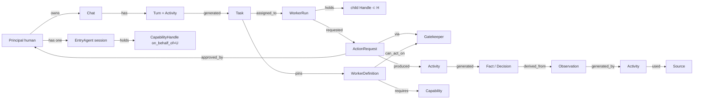
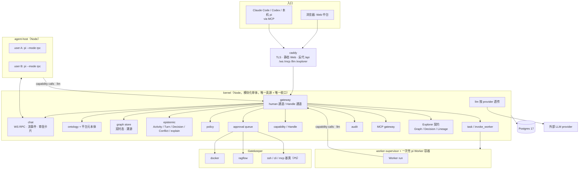

# 基于 Graph 的 AI 中台 —— 架构设计 v0.2

> 文档性质：架构设计 / 领域建模（Ontology-first）。
> 状态：**全部为提案（Target Architecture）**，尚无任何组件实现。凡描述「内核」「agent 宿主」「Gatekeeper」「Worker」等组件，均指待建目标。
> v0.2 相对 v0.1 的变化：入口从 CLI / MCP 改为 **Web + 每用户一个常驻 pi agent**；技术栈改为**全 TypeScript**；补齐用户隔离模型、Worker 在图上的发现、入站触发的位置；纠正 Semantica skills 复用的错误承诺。差量与理由见 `design-review-2026-09-01.md` §8。
> 参考项目源码分析见 `reference-projects-and-oss-landscape.md`。环境具体值在未入库的 `docs/private/`。
> 日期：2026-09-01

---

## 0. 怎么读

- 只要结论：§1、§8.1 一轮对话、§15 路线图。
- 做建模评审：§5（核心，其余章节都是它的投影）。
- 要动手：§9、§10、`development-tasks.md`。

---

## 1. 总体判断

**你要的平台（权威表述）**：一个 Web 中台入口。每个用户登录后有一个属于自己的、隔离的 AI agent（pi）和一个对话框。说出需求，这个 agent 在图上找到能干活的 Worker（也是 pi），动态拉起它们，各自通过统一的门对接不同系统，把结果和决策带着来龙去脉写回图里，再决定下一步。所有 agent 共享同一份图，受同一套规则约束，每一步可追溯、可审批、可重建。

**设计重心（不可偏移）**：(a) 基于 Graph 的 AI 中台，一份带类型、双时态、逐边溯源的共享图，既是记忆也是控制面；(b) 模块化，内核 / 宿主 / 门 / Worker 各自独立部署、独立失效；(c) 分权，读写分离、capability 授权、审批、审计、用户隔离，靠系统边界不靠 prompt；(d) 随时调用独立的 AI Worker，`invoke_worker` 是一等能力，Worker 在图上可被发现；(e) pi 是入口 agent 与 Worker 的运行底层。

判断：

1. **产品形态照 cloudflare-os，图基底照 Semantica 的概念，运行底层用 pi。** 三个项目各取一层，且源码研究已确认哪些可移植：cloudflare-os 的聊天 RPC 面、审批卡片与 `awaitDecision` 语义、自动批准 drain 算法可原样搬到 Node + Postgres；不可移植的 DO / Cap'n Web stub / 动态 Worker 各有替代。Semantica 的 Explorer 是纯前端、只依赖 HTTP 契约，可整体复用；它的 skills 直接 import 内部 Python 类，**不能靠工具名兼容复用**。pi 的 RPC 子进程模式是唯一既有文档又能真隔离的托管方式，`packages/server` 不能用。
2. **「基于 Graph」是领域模型的形状**：带类型对象 + 带类型有向关系 + 双时态 + 逐边溯源。Postgres 是唯一真源，图库是可后加的投影。
3. **五类图是一个 Domain Model 的三种视图**（§4）；Graph Engineering 的四部分完整保留，并加「执行本身也是图并写回同一个图」。
4. **常驻 agent 是缓存不是真源**。每用户的 pi 子进程会崩会重启；对话与决策在 Postgres，pi 的上下文在它自己的 JSONL 会话目录，两者以 turn id 关联，重启后恢复（§7.2）。
5. **动态编排在受治理的边上进行**。入口 agent 只有调度权与观察权，专用 Worker 只拿最小能力，写动作必过策略，凭证永不进任何 agent 进程。

---

## 2. 背景与目标

### 2.1 目标（可验证）

| # | 目标 | 验证 |
|---|------|------|
| G1 | 一个用户在 Web 里说需求，自己的入口 agent 动态拉起 Worker 经门完成，结果与决策带溯源写回图，对话里能看到过程与审批卡片 | S2 验收脚本 |
| G2 | 任何 agent 对外部系统的写操作都经策略判定并留下可重建的审批 / 执行记录 | 不存在无 policy 决策记录的已执行 ActionRequest |
| G3 | 图上任意事实能回答「为什么相信」：来源、活动、执行者、时间、被谁取代 | `explain(fact)` 完整 |
| G4 | 用户之间隔离：看不到彼此的私有来源与对话，不能用彼此的凭证，不能批彼此范围外的动作 | 隔离测试集 |
| G5 | 图有真实内容且看得见：目标主机的服务与依赖入图，Explorer 能浏览图、决策链、血缘 | S3 验收 |
| G6 | 其他运行时（Claude Code / Codex / 你本机的 pi）经 MCP 接入同一图与同一策略 | S3 验收 |
| G7 | 业务概念与代码符号互链，影响分析跨图 | P4 |

### 2.2 非目标（当前阶段）

不做 BI 语义层；不做分布式图库；不做可视化流程编辑器；不做 SaaS 计费；不接入 Hermes 记忆晋升；本机不做 LLM 推理。

---

## 3. 现状与约束

### 3.1 现状

- 已有：三个参考项目源码；本机 `codegraph` MCP 工具。
- 目标主机（只读盘点，具体值在 `docs/private/`）：一台 x86_64 Linux VM，资源足够跑 Postgres + 内核 + 宿主 + 数个 Worker；Docker + Compose，已配置 gVisor `runsc`（未验证可用）；已运行一套知识库栈（RAGFlow 及其存储）、一个 agent 运行时及其 SQLite 记忆、两个 FastAPI 数据运行时、一个本机 embedding 网关。没有 Postgres。GPU 已满，本机不能推理。
- 未有：中台的任何组件。

### 3.2 三个参考项目的角色

| 项目 | 角色 | 借什么 | 不借什么 |
|------|------|--------|---------|
| **cloudflare-os**（Apache-2.0，TS，基于 pi-agent-core） | 产品形态与治理蓝本 | 一个 WebSocket 会话 + 每工作区一个 RPC 对象的聊天面；`AiChatSubscriber` 式的流事件与「先订阅再翻页」；`ActionDescription{title, description, awaitDecision, autoApprovable, actionKind, implementsRevert}` 与聊天内审批卡片；两种动作模式（模拟不阻塞 / `awaitDecision` 挂起）；`AutoApprovalDrainer` 双信号严格顺序算法；Observation 与 Action 分离；单一鉴权收口；凭证只在 Gatekeeper；`build/use` 粗角色；认证配置留在环境变量层 | Durable Object、Cap'n Web stub、Facets、Dynamic Workers、`spawnCallable` 的 stub（以任务队列替代）、11k 行的 Overseer |
| **Semantica 0.6.7**（MIT，Python） | 图基底概念、Explorer、MCP 契约 | Decision / Conflict / ProvenanceEntry(PROV-O) / BiTemporalFact 一等；facade + adapter 存储抽象；`state_at`；**Explorer 整体复用**（纯前端，只依赖 `/api/*` 契约与 `X-API-Key`）；17 个 MCP 工具的名字与必填参数作为契约；`Decision` 与 `ProvenanceEntry` 字段名对齐 | 作为内核（43 个强制依赖含 torch，ContextGraph 是内存 / 文件结构，无租户）；**skills 不能复用**（它们直接 `import semantica.context`，不走 MCP，只借其子命令与输出格式作 UX 规范）；Ontology 工作区（3540 行路由，不承诺） |
| **pi 0.84.4**（MIT，TS） | 入口 agent 与 Worker 的运行底层 | `pi --mode rpc` 子进程：JSONL 命令 / 事件、`--session-dir`、`PI_CODING_AGENT_DIR`、`--system-prompt`、`-e 扩展`、`--tools` 白名单、`extension_ui_request` 子协议；扩展的 `context` / `tool_call` / `session_*` 事件；JSONL 父指针会话树；subagent 示例的子进程派生；pi-ai 的多 provider 与逐消息 usage / cost | `packages/server` / `client` / `protocol`（实验性，无连接身份，租约只在客户端）；进程内 SDK 托管多用户（只有逻辑隔离，且 `ResourceLoader` 会沿 cwd 自动加载扩展） |

### 3.3 约束

- 全 TypeScript：内核、agent 宿主、Web、Worker 镜像、Gatekeeper 基类、采集器；Postgres 17；MCP 官方 TS SDK。Python 只用于 P3 的 Semantica 抽取 Worker 与适合 Python 的 Gatekeeper（门的协议是 HTTP）。
- 自托管、docker-compose、单机；开源 MIT，仓库公开，入库文档不含环境具体值。
- LLM 全部外部、厂商中立；治理靠系统边界；不与 Hermes 绑定。

---

## 4. 五类图 → 一个 Domain Model 的三种模型

| 图 | 回答 | 定位 | 真源 | 时态 |
|----|------|------|------|------|
| Ontology | 有哪些概念、关系、动作、权限 | 类型层：ObjectType / LinkType / ActionType / Policy 注册表，带版本 | 人工发布，agent 可提议 | 版本化 |
| Knowledge Graph | 普遍为真的事实 | World Model 实例层：Object / Link，每条 Link 是带溯源的 Fact | 采集 / 抽取 / 断言 | 业务有效期 |
| Code Graph | 代码结构 | World Model 的派生子本体，真源 `repo@commit`，联邦现有 codegraph 索引 | indexer | 绑定 commit |
| Context Graph | 当前上下文、状态、决策、血缘、责任人 | Epistemic + 运行态：Source / Observation / Activity / Chat / Turn / Decision / Conflict / Evidence / Task / Dataset | 会话、审批、摄取、人工 | 双时态 |
| Graph Engineering | 系统怎么干活 | 把图建起来、跑起来的工程：数据工程、图谱建模、检索推理、Agent 编排；Governance Model 是编排的骨架 | 管理员 + 运行时事件 | 执行路径写回同一个图 |

```
World Model      = Ontology + Knowledge Graph + Code Graph
Epistemic Model  = Context Graph
Governance Model = Capability / Policy / Approval / Task / Audit
```

**Graph Engineering 的理解**：四部分完整保留，加一条统一原则：**执行本身也是图，且写回同一个图**。WorkerDefinition 是节点，Capability 是允许的边，Policy 是边上的守卫，一次执行（Chat → Turn → invoke_worker → Task → WorkerRun → ActionRequest → Gatekeeper → Activity → Fact / Decision）是图上被实例化的一条路径。「系统知道什么」与「系统怎么干活」用同一套存储、同一个 `explain` 回答。与「图即代码」的工作流引擎不同，这里的图是数据：节点、允许的边、守卫都可查询、可版本化、可授权；LLM 在允许的边内动态规划，人守边。

---

## 5. Domain Model

### 5.1 一等概念

#### 5.1.1 租户与主体

| 概念 | 含义 |
|------|------|
| **Workspace** | 逻辑租户；所有对象归属唯一 Workspace；跨 Workspace 只能经受审批的 Share |
| **Principal** | `human` / `agent`（一次 WorkerRun 或一个入口 agent 实例）/ `service` |
| **Role** | 五个，粗粒度：`owner` 授权与策略；`builder` 提议本体与 WorkerDefinition；`operator` 进审批队列；`member` 对话、调用、观察；`auditor` 只读含密钥元数据。角色是「能进哪个门」，capability 范围是「能做哪件事」 |
| **Session** | Principal 的一次会话：`entry`（入口 agent）、`worker_run`、`mcp_session`（外部运行时）、`service`、`web`（human 通道） |

#### 5.1.2 World Model

| 概念 | 含义 |
|------|------|
| **OntologyVersion / ObjectType / LinkType / PropertyType / ActionType** | 同 v0.1；ActionType 带 `reversibility`、`blast_radius`、`auto_approvable`、`await_decision`、`requester_can_approve` |
| **Object / Link(=Fact) / PropertyAssertion** | 同 v0.1 |
| **平台元本体（对象化的平台自身）** | `WorkerDefinition`、`Gatekeeper`、`Capability` 也是 Object；`WorkerDefinition --can_act_on--> Gatekeeper | ObjectType`，`Gatekeeper --connects_to--> 系统对象`，`WorkerDefinition --requires--> Capability`。入口 agent 找 Worker = 一次 `traverse`。这些对象只能经 human 通道写入（不变量 I16） |
| **Code 子本体** | Repository / Commit / File / Symbol；`implemented_by` 跨图边 |

#### 5.1.3 Epistemic Model

| 概念 | 含义 |
|------|------|
| **Source** | 文档 / 数据库 / API / 人 / agent 会话；带 `owner_principal` 与 `visibility`（`workspace` / `private`） |
| **Activity** | PROV-O Activity：摄取运行、抽取、**Turn**（一轮对话）、Workflow Step |
| **Chat** | 一个用户与其入口 agent 的对话线程；属于该用户，私有 |
| **Turn** | Chat 中的一轮：用户消息 + agent 的一次运行；是 `kind=agent_turn` 的 Activity，`used` 上下文 Fact，`generated` Decision / Task |
| **Observation / Fact / Evidence / Conflict / Decision / Dataset / Lineage** | 同 v0.1；Fact 与 Decision 继承其 Source 的可见性 |

#### 5.1.4 Governance Model

| 概念 | 含义 |
|------|------|
| **Capability / CapabilityGrant / CapabilityHandle** | 同 v0.1；Handle 绑定 Session，携带 `on_behalf_of`（不变量 I13），只能衰减 |
| **Policy** | `allow` / `require_approval` / `deny`；双信号自动批准；`requester_can_approve` 按 `blast_radius` |
| **ActionRequest / Approval** | 同 v0.1；增加 `await_decision`、`parent_worker_run_id`、`actor_runtime`、`on_behalf_of` |
| **Task / WorkerRun** | 同 v0.1；WorkerRun 记 `parent_worker_run_id` |
| **WorkerDefinition** | 「可执行文件」：`kind`（`entry` / `worker`）、模型白名单、system prompt、skills、扩展、所需 Capability、能力上限；`draft → published → deprecated`；Task 固定引用启动时版本。`entry` 类的能力上限固定为 observe + `find_workers` + `invoke_worker` + `record_decision`，没有 execute |
| **EntryAgent（入口 agent 实例）** | 每用户一个，`WorkerDefinition.kind=entry` 的常驻 Session；由 agent 宿主管理；持有该用户的入口 Handle |
| **invoke_worker** | `invoke_worker(definition@version, input, wait, timeout) → result | task_id`；入口 agent 调用时子 Handle 是自身 Handle 的衰减且继承 `on_behalf_of` |
| **Gatekeeper** | 独立部署，持凭证；`describe_actions / observe / simulate / apply / revert / health`；每个动作种类声明 `auto_approvable`、`await_decision`、`reversibility`、`blast_radius`；凭证两种：共享 / ConnectedAccount |
| **ConnectedAccount** | 某 Principal 在某 Gatekeeper 的个人凭证引用，只存在 Gatekeeper 内；Gatekeeper 按 `on_behalf_of` 取用 |
| **Trigger** | 系统事件模式 → WorkerDefinition 的映射，受策略约束；P5 |
| **AuditRecord** | 每次受治理转移的 append-only 记录 |

### 5.2 关键关系



关系表同 v0.1，新增：`Chat owned_by Principal`（1:N，私有）；`Turn part_of Chat`；`Turn generated Task / Decision`；`WorkerRun parent WorkerRun`（0..1）；`WorkerDefinition can_act_on Gatekeeper | ObjectType`；`WorkerDefinition requires Capability`；`Gatekeeper connects_to Object`；`Task pins WorkerDefinition@version`。

### 5.3 永不允许存在的关系

1. 跨 Workspace 的 Link（除经审批的 Share）。
2. 任何 agent 进程持有外部系统凭证或 LLM provider key。
3. 已执行的 ActionRequest 没有 Policy 决策记录。
4. 没有 Activity 溯源的 Fact。
5. 一个 Object 两个 ObjectType。
6. `verified` 的 Fact 没有 `verified_by` 与 Evidence。
7. Code Graph 节点被人工编辑。
8. Handle 范围大于其来源。
9. 经 Handle 通道完成的 Approval。
10. `on_behalf_of` 来自请求体而非 Handle。
11. 入口 agent 的 Handle 含 execute 能力。
12. 平台元本体对象（WorkerDefinition / Gatekeeper / Capability）由 Handle 通道写入。

### 5.4 不变量与强制机制

| # | 不变量 | 机制 |
|---|--------|------|
| I1 | 每行业务表非空 `workspace_id`，查询带 workspace 谓词 | NOT NULL + 复合外键 + RLS |
| I2 | Link 符合 LinkType 的 domain / range | 内核写入校验 + 触发器 |
| I3 | Fact 必有 `activity_id`、`asserted_by`、`recorded_at` | NOT NULL |
| I4 | Fact 只追加不覆盖 | 只有 assert / supersede / invalidate；触发器禁改内容列 |
| I5 | 异源不一致 → Conflict；同源变化 → supersede | 写入路径按 `source_id` 判定 |
| I6 | ActionRequest 只沿转移表走 | 转移表驱动 + CHECK |
| I7 | 执行前必有 Policy 决策记录 | 状态机前置 + CHECK |
| I8 | 自动批准 = ActionType 声明 且 Workspace 规则开启 | 双信号 |
| I9 | Worker 与入口 agent 进程内无任何凭证 | 凭证只在 Gatekeeper 与内核 `llm`；启动自检扫描 env |
| I10 | Worker 只能到达内核 gateway（含 `llm` 端点） | internal 网络；外连测试必须失败 |
| I11 | 所有受治理转移写 AuditRecord | 同事务 |
| I12 | 已发布 OntologyVersion / WorkerDefinition 不可改 | 只读触发器 |
| I13 | `on_behalf_of` 只来自 Handle；子 Handle 继承且不可改 | gateway 从会话解析；`capability_handles` 列；请求体同名字段被拒 |
| I14 | 审批者必须持有所审批的 `action_kind × resource_scope` | `approve` 前置检查；角色只决定能否进队列 |
| I15 | 入口 agent 的 cwd 与 `PI_CODING_AGENT_DIR` 为平台所有，对该用户的任何 Worker 只读 | 宿主创建目录、独立 OS 用户或只读挂载；Worker 容器不挂载它 |
| I16 | 平台元本体对象只能经 human 通道写入 | gateway 按 ObjectType 拒绝 Handle 通道写 |

### 5.5 状态机

**Fact**：生命周期 `recorded → superseded | invalidated`（时间戳列）；认知状态 `observed | extracted | inferred | asserted → verified | contradicted`（独立列）。

**Conflict**：`open → resolved | accepted_both | dismissed`；私有 Source 参与的 Conflict 只对私有一方可见。

**Decision**：`proposed → approved | rejected → executed → verified | failed → superseded | archived`。

**ActionRequest**：同 v0.1 的状态图。两种动作模式，由 Gatekeeper 的 `describe_actions` 逐动作声明：

- `await_decision=false`：Gatekeeper 返回 `simulate` 结果，Worker 的工具调用立即得到 `{status: pending_approval, simulated}` 并继续；依赖它的后续 ActionRequest 在父请求 `executed` 前不得进入 `executing`。
- `await_decision=true`：Worker 的工具调用等待，Task 进入 `waiting_approval`；等待受同一超时规则约束（见 §8.2），超时则工具返回 `{status: pending_approval, action_request_id}`，Worker 可选择结束本轮，结果在下一轮 `context` 中可见。

**Task**：`created → queued → running ⇄ waiting_approval → completed | failed | cancelled`。

**WorkerRun**：`provisioning → running → suspended → terminated`；terminated 撤销全部 Handle。

**EntryAgent session**：`starting → ready → busy → ready …`；`crashed → starting`（宿主自动恢复，见 §7.2）；`stopped`。

**OntologyVersion / WorkerDefinition**：`draft → published → deprecated`；draft 可由 agent 经 `propose_*` 提议，对提议者私有；publish 只走 human 通道，发布后工作区可见。

**CapabilityGrant**：`active → revoked | expired`。

### 5.6 认知状态与可见性

- `epistemic_status`：`observed`（系统 API 直接读取，采集器）/ `extracted`（NLP / LLM 抽取）/ `inferred`（agent 推理）/ `asserted`（人工）/ `verified` / `contradicted`；`confidence` 是独立的连续值。检索给 agent 的上下文必须带状态；高影响 ActionType 可要求依赖 Fact 为 `verified`。
- **可见性**：Source 带 `visibility`，Fact 与 Decision 继承。会话派生内容（Chat、Turn、Worker 会话）默认 `private` 给 `on_behalf_of` 的用户；晋升为 `workspace` 是 human 通道的受治理转移，产生 Decision。两个死角的规则：私有 Fact 与工作区 Fact 冲突时，Conflict 只对私有一方可见；agent 提议的本体 / WorkerDefinition 草稿对提议者私有，发布后可见。

### 5.7 三模型分离

同 v0.1：World / Epistemic / Governance 共享存储、语义分开。

### 5.8 用户隔离模型（分权的具体形态）

三层：Workspace 是数据边界（RLS）；Principal 与角色是权力边界；Capability 与 Handle 是执行边界。两条横切：代行（I13）与可见性（§5.6）。

| 事项 | 规则 |
|------|------|
| 入口 agent | 每用户一个实例，不共用；能力上限固定（§5.1.4）。共用一个常驻代理按对话切换 Handle 是混淆代理风险 |
| 审批 | 角色 `operator` 只是进队列；能批哪条由 capability 范围决定（I14）；`blast_radius=high` 默认 `requester_can_approve=false`，工作区可覆盖 |
| 凭证 | 共享凭证（docker、RouterOS）谁能用由授权决定；ConnectedAccount（GitHub、Slack）按 `on_behalf_of` 取用；两种都只在 Gatekeeper 内，基类现在就区分，S2 只实现共享 |
| 身份配置 | 身份提供方、超级管理员在环境变量层，不进 API；`owner` 不能放宽登录 |
| 授权数据 | 不用图里 agent 可写的 `owned_by` / `member_of` 边做授权；需要关系型授权时用 OpenFGA / SpiceDB，元组只允许 human 通道写 |
| 不做 | 每用户一个数据库；自建 IdP |

---

## 6. 目标架构



分层：浏览器只与 caddy 通信；caddy 是唯一公网面（TLS）；内核是唯一真源与收口；agent 宿主与 Worker 都只能到内核；Gatekeeper 只被内核访问；Postgres 只对内核开放。

---

## 7. 核心模块

### 7.1 内核（kernel）模块

| 模块 | 职责 | 状态归属 |
|------|------|---------|
| gateway | 两类通道认证；解析 (principal, session, on_behalf_of, actor_runtime, capability, target)；限流；审计入口 | 无 |
| chat | Chat / Turn 持久化；WS RPC（§9.4）；把宿主转发的 pi 事件变成流事件推给该用户；把待审批与任务状态作为卡片推送 | Chat / Message |
| ontology | OntologyVersion 生命周期；类型校验；JSON Schema 投影；平台元本体 | 类型、WorkerDefinition、Gatekeeper、Capability 对象 |
| graph | Object / Link / Fact 写入与查询；`traverse` / `search` / `state_at`；`find_workers` | Object / Link |
| epistemic | Activity / Observation / Evidence / Conflict / Decision；`explain`；可见性 | 同名对象 |
| policy | 数据化规则；`evaluate`；双信号；`requester_can_approve` | Policy |
| approval | ActionRequest 状态机；drain（每 Gatekeeper 单飞、升序、遇 pending 停）；`approve` 同事务写 Approval Decision | ActionRequest |
| capability | Grant；Handle 签发 / 验证 / 撤销 / 衰减；`on_behalf_of` | Grant / Handle |
| task | Task / WorkerRun；`invoke_worker`；调用 supervisor；崩溃回队；超时 | Task / WorkerRun |
| host-bridge | 与 agent-host 的内部 RPC：`ensureEntryAgent(user)`、`prompt(turn)`、`stop`、事件回流 | 无 |
| gatekeeper-registry | 部署时注册；`describe_actions` 缓存；健康 | 元数据 |
| llm | 按 provider 透传（§7.7） | LlmUsage |
| mcp | MCP TS SDK；工具 = capability 投影；Semantica 工具名契约 | 无 |
| explorer-contract | 实现 Semantica Explorer 的 Graph / Decision / Lineage 端点（§9.5） | 无 |
| audit | append-only；`reconstruct`；PROV-O 导出 | AuditRecord |
| codegraph | 联邦 `.codegraph/` SQLite（P4） | `implemented_by` |

### 7.2 agent 宿主（agent-host）：每用户一个常驻 pi

- **形态**：一个 Node 服务；每个用户一个 `pi --mode rpc` 子进程（pi 0.84.4 锁版本）。启动参数：`--no-session` 不用，改用 `--session-dir ${HOST_DATA}/users/<uid>/sessions`；`PI_CODING_AGENT_DIR=${HOST_DATA}/users/<uid>/agent`（配置、`models.json`、扩展）；`--system-prompt` 来自该用户入口 WorkerDefinition 的已发布版本；`-e platform-extension`；`--tools` 只留平台工具（不给 read / write / edit / bash）。
- **I15**：`cwd` 与 `PI_CODING_AGENT_DIR` 由宿主创建，属于平台的 OS 用户；该用户的 Worker 容器不挂载它。否则一个有文件系统门的 Worker 能往自己用户的入口 agent 里塞扩展。
- **事件桥**：读子进程 stdout 的 JSONL 事件（`message_update` / `tool_execution_*` / `agent_end` 等）→ 内核 `host-bridge` → chat 模块 → 该用户的 WS。`extension_ui_request` 子协议用于需要用户即时回答的交互。
- **连续性规则（真源）**：对话、Turn、决策、任务在 Postgres；pi 的上下文在它的 JSONL 会话目录；两者以 `turn_id` 关联（扩展在每轮把 `turn_id` 写入会话条目）。子进程崩溃或宿主重启后，宿主以同一 `--session-dir` 重新拉起，pi 从 JSONL 恢复上下文；内核侧未完成的 Turn 标记 `interrupted`，下一轮 `context` 注入「上轮中断」。**子进程是缓存，不是真源。**
- **隔离**：进程级；可选每用户独立 OS 用户；资源 cgroup 上限；空闲超时后停止子进程，下次对话再拉起（冷启动数秒，可接受）。
- **不做**：不用 `packages/server`（实验性，无连接身份）；不在宿主进程内用 SDK 托管多用户。

### 7.3 Worker 运行时

- 镜像：`node:24-bookworm-slim` + `npm install -g --ignore-scripts @earendil-works/pi-coding-agent@0.84.4` + 平台扩展；非 root；只读根文件系统；`runsc`。
- 启动：supervisor 以 `pi --mode rpc` 或 pi subagent 示例同款的 `--mode json -p` 一次性运行；env 只注入 `KERNEL_URL / KERNEL_LLM_URL / CAPABILITY_HANDLE / TASK_ID / WORKSPACE_ID / WORKER_RUN_ID`；**不继承宿主 env**（pi 的 subagent 示例默认继承父 env，我们显式传空基底）。
- 会话 JSONL 回流为 Source（私有给 `on_behalf_of`）；结果作为 Task 结果返回。
- 网络：只到内核；LLM 经内核 `llm` 端点。

### 7.4 平台扩展（唯一的共享 TS 扩展，三种模式）

`NEXTTIME_MODE` 决定行为：

| 模式 | 运行处 | 注册的工具 | `context` 注入 | 会话回传 |
|------|--------|-----------|---------------|---------|
| `entry` | agent-host 子进程 | observe 组（含 `get_task`）、`find_workers`、`invoke_worker`、`record_decision`，与 §5.1.4 的能力上限一致；S1 只注册 observe 组，`find_workers` / `invoke_worker` 随 S2.7 加入 | 该用户的待审批、进行中 Task 及其结果、相关 Fact 与先例 | 每轮回传 Turn 与决策 |
| `worker` | Worker 容器 | Handle 内的 capability（含 `request_action`、`observe`） | Task 输入、相关 Fact | 全量 JSONL |
| `interactive` | 你本机的 pi | 同 `entry` 或按 Handle | 同 `entry` | 默认不回传 |

`tool_call` 拦截把 execute 类调用转成 `request_action`；这是便利闸门，安全边界在 gateway。

### 7.5 Gatekeeper

- 协议同 v0.1（HTTP + JSON）：`describe_actions`（每动作：`action_kind, params_schema, auto_approvable, await_decision, reversibility, blast_radius, read_only, title, description_template`）、`observe`、`simulate`、`apply`（以 `action_request_id` 幂等）、`revert`、`health`。
- 基类（TS）内置两种凭证解析：共享（env）与 ConnectedAccount（Gatekeeper 本地加密存储，按 `on_behalf_of` 取）。
- 传输种类：HTTP API、docker socket、SSH 远程命令、本地 CLI、MCP 代理。S2 交付 `docker` 与 `ragflow`；P5 交付 `ssh` / `cli` / `mcp` 通用基类，把命令包装为带 `blast_radius` 标注的动作。
- 系统一侧的适配可以用任何语言；对平台一侧的协议不变。

### 7.6 Web（中台入口）

- React + Vite SPA，由 caddy 静态服务；一个 WebSocket；JSON-RPC 请求 / 响应 + 服务端推送（§9.4）。
- 页面：登录；对话（流式文本、工具调用行、Worker 拉起行、审批卡片：标题、Markdown 描述、模拟效果、动作种类、批准 / 拒绝 / 「总是批准此类」）；任务与 Worker 列表；连接系统（把某个 Gatekeeper 资源授予当前用户的入口 agent，cloudflare-os 的 capsule 语义）；审计与 explain 视图。
- **Explorer 挂载（S3）**：Semantica Explorer 静态构建挂在 `/explorer`，内核实现其 Graph / Decision / Lineage 契约（§9.5）；Ontology 与其他工作区隐藏，不承诺。Explorer 是 human 通道客户端，用 API key，不用 Handle。

### 7.7 模型策略

不绑定单一厂商。Worker 与入口 agent 侧复用 pi-ai 的 provider 实现；内核只做按 provider 的透传代理（注入真实 key、模型白名单、计量、SSE 原样）；内核自用调用（P3 起）用 OpenAI 兼容子集。厂商与模型是配置 `${NEXTTIME_DATA}/config/llm-providers.yaml`，同一份配置生成内核路由表与 `models.json`。成本元数据复用 pi-ai 的 `ModelCost`。

### 7.8 采集器（TS）

`collectors/host-inventory`：dockerode + `systemctl` + `git remote` + 进程树；只采结构性事实；命令行在形成 Observation 前脱敏，`environ` 不读；service Principal，写 `observed` Fact；同源变化 supersede。

---

## 8. 数据流

### 8.1 一轮对话

```mermaid
sequenceDiagram
  participant B as 浏览器
  participant K as kernel
  participant H as agent-host
  participant E as 用户的 pi
  participant S as supervisor
  participant W as Worker pi
  participant G as Gatekeeper
  B->>K: sendChatMessage(chatId, text)
  K->>K: Turn(Activity) 落库; ensure entry agent
  K->>H: prompt(userId, turnId, text)
  H->>E: RPC prompt
  E->>K: context 事件: 拉待审批 / 任务 / Fact
  E->>K: find_workers(need) → traverse 元本体
  E->>K: invoke_worker(def@v, input, wait=true, timeout)
  K->>K: policy → Task(queued) → child Handle ⊂ entry Handle
  K->>S: spawn(worker image, env{HANDLE,TASK_ID})
  S->>W: run (runsc, no egress)
  W->>K: observe / request_action(docker.container_restart)
  K->>G: simulate
  K-->>W: pending_approval + simulated
  K-->>B: 审批卡片 (WS push)
  B->>K: approveAction(id)   [human 通道, I14]
  K->>G: apply(action_request_id)
  K-->>W: executed (下一次 context 或阻塞返回)
  W->>K: Task completed(result)
  K-->>E: invoke_worker 返回 result
  E-->>H: message_update … agent_end
  H-->>K: 事件
  K-->>B: textDelta … turn end
  K->>K: Turn generated Decision / Task; 会话回流 Source
```

### 8.2 `invoke_worker` 的同步与异步

`wait=true` 只等到 `timeout`（默认 90 秒）；超时返回 `{task_id, status}`，入口 agent 结束本轮并告知用户「已交给 Worker，等待审批 / 执行」。Task 终态或审批状态变化时，chat 模块推送卡片；用户下一次发言时，`context` 事件把 Task 结果注入，入口 agent 续接。cloudflare-os 式的「turn 挂起直到审批」在 P5 评估。入口 WorkerDefinition 的 system prompt 必须教这套异步模型。

### 8.3 采集到可解释事实

同 v0.1 §8.1。

### 8.4 Worker 发现

`find_workers(need)`：在平台元本体上 `traverse`，按 `can_act_on` 的 Gatekeeper / ObjectType 与 `requires` 的 Capability 与用户 Grant 交集过滤，返回可用的 `WorkerDefinition@version` 列表与简介；入口 agent 据此选择。

---

## 9. 数据 / API 设计

### 9.1 存储决策

同 v0.1：Postgres 17 + pgvector 唯一真源；`GraphStore` facade 先 SQL；Apache AGE 为第一升级路径（PG 版本兼容需核实）；独立图库只在需要在线图算法或深遍历时。

### 9.2 核心表（增量）

在 v0.1 的 `workspaces / principals / ontology_versions / objects / activities / links / conflicts / audit_records` 基础上增加或修改：

```sql
create table sessions (
  workspace_id uuid not null, id uuid not null,
  principal_id uuid not null,
  kind text not null check (kind in ('web','entry','worker_run','mcp_session','service')),
  on_behalf_of uuid not null,           -- I13：会话级，Handle 从此派生
  status text not null, created_at timestamptz not null default now(), expires_at timestamptz,
  primary key (workspace_id, id)
);

create table chats (
  workspace_id uuid not null, id uuid not null,
  owner_principal_id uuid not null, title text, visibility text not null default 'private',
  created_at timestamptz not null default now(), primary key (workspace_id, id)
);
-- Turn = activities(kind='agent_turn', chat_id, sequence, user_message, status in ('running','completed','interrupted','failed'))

create table capability_handles (
  workspace_id uuid not null, jti uuid not null,
  session_id uuid not null, on_behalf_of uuid not null,   -- 从 sessions 复制，不可改
  parent_jti uuid,                                         -- 衰减来源
  scope jsonb not null, expires_at timestamptz not null, revoked_at timestamptz,
  primary key (workspace_id, jti)
);

-- action_requests 增列
--   on_behalf_of uuid not null, await_decision boolean not null default false,
--   parent_worker_run_id uuid, actor_runtime text not null

create table worker_definitions (
  workspace_id uuid not null, id uuid not null, version int not null,
  kind text not null check (kind in ('entry','worker')),
  status text not null check (status in ('draft','published','deprecated')),
  definition jsonb not null,           -- 模型白名单、prompt、skills、扩展、所需 capability、能力上限
  proposed_by uuid not null, published_by uuid,
  primary key (workspace_id, id, version)
);
```

其余表同 v0.1（`sources` 增 `owner_principal_id`、`visibility`）。RLS 谓词扩展为：workspace 匹配，且（`visibility='workspace'` 或 `owner = current principal` 或存在 Share）。

### 9.3 Capability 契约（HTTP 与 MCP 两个投影）

| 组 | capability | 模式 | 备注 |
|----|-----------|------|------|
| chat | `list_chats` / `new_chat` / `send_chat_message` / `stop_agent` / `get_chat_history` / `subscribe_chat` | human | 只走 human 通道 |
| ontology | `publish_ontology_version` / `propose_ontology_change` / `get_type` / `list_types` / `validate` | execute（human）/ propose / observe | |
| graph | `get_object` / `traverse` / `search` / `state_at` / `find_workers` | observe | 结果带 `epistemic_status` |
| | `assert_fact` / `supersede_fact` / `invalidate_fact` | propose | 状态由调用方类型决定 |
| epistemic | `explain` / `record_decision` / `query_decisions` / `find_precedents` / `causal_chain` / `decision_impact` / `list_conflicts` / `resolve_conflict` / `verify_fact` | observe / propose | Semantica 工具名与必填参数保持一致（`get_provenance`=`explain`，`get_causal_chain`=`causal_chain`，`analyze_decision_impact`=`decision_impact`） |
| governance | `request_action` | execute | Worker |
| | `approve` / `reject` / `list_pending` / `get_action` / `set_auto_approved_action_kind` | human | I14 |
| | `grant_capability` / `revoke_capability` / `set_policy` / `issue_handle` / `connect_gatekeeper` | human（owner） | `connect_gatekeeper` = 把某门的资源授予某用户的入口 agent |
| task | `create_task` / `invoke_worker` / `get_task` / `cancel_task` | propose / observe | |
| worker | `propose_worker_definition` / `publish_worker_definition` / `deprecate_worker_definition` / `list_worker_definitions` | propose / human / observe | |
| ingest | `register_source` / `submit_observations` | propose | service |
| audit | `audit_query` / `reconstruct` / `export_prov` | observe（auditor） | |

MCP 工具 = Handle 通道可用行的投影。Semantica 的 17 个工具名与必填参数作为契约保留；其 skills 需按本平台 MCP 重写实现，只沿用子命令与输出格式。

### 9.4 聊天 WebSocket 协议

- 一个 WS 连接 `/ws`，human 通道认证后使用；JSON-RPC 2.0 请求 / 响应（带 `id`）+ 服务端推送通知（无 `id`）。
- 推送事件（借 cloudflare-os `AiChatSubscriber`）：`chat.message`（持久消息）、`chat.stream`（`textDelta` / `toolCallStarted` / `toolCallEnded` / `workerSpawned` / `taskUpdated`）、`chat.metadata`、`action.pending` / `action.updated`（审批卡片）、`task.updated`。
- **客户端规则：先 `subscribe_chat(chatId, startAfter)` 再 `get_chat_history` 翻页**，否则会丢事件。
- 一个 Chat 同时只允许一个进行中的 Turn；进行中时 `send_chat_message` 被拒，只能 `stop_agent`。

### 9.5 Explorer 契约（S3，只做这些）

内核实现 Semantica Explorer 需要的：`GET /api/graph/nodes?limit&cursor`、`GET /api/graph/edges`、`POST /api/graph/search`、`GET /api/temporal/bounds`、`GET /api/temporal/snapshot?at=`、`GET /api/decisions`、`GET /api/decisions/{id}/chain`、`GET /api/provenance?node_id=`、`GET /api/provenance/report?node_id=&format=`，响应形状按其 `explorer/schemas.py`（`NodeResponse` / `EdgeResponse` / `DecisionResponse` / `ProvenanceNode` / `ProvenanceEdge`），含 `207` 部分成功约定与 `X-API-Key`。Ontology、Vocabulary、Reasoning、Enrich、SPARQL、Manage 工作区隐藏。

---

## 10. 部署与运维

### 10.1 目录结构（pnpm workspaces，全 TS）

```
NextTime-AI/
├── docker-compose.yml  .env.example  Makefile  LICENSE  README.md
├── packages/
│   ├── kernel/               # Node + TS：Fastify + ws + pg；模块见 §7.1；migrations/*.sql
│   ├── agent-host/           # 每用户 pi RPC 子进程管理与事件桥
│   ├── worker-supervisor/    # docker socket；runsc；只允许 nexttime/worker-runtime
│   ├── platform-extension/   # 唯一的 pi 扩展，三种模式
│   ├── web/                  # React + Vite：聊天、审批、任务、连接系统、审计
│   ├── gatekeeper-base/      # 协议、凭证解析（共享 / ConnectedAccount）、幂等存储
│   └── shared/               # 类型：capability 注册表、事件、ActionDescription、Zod schema
├── gatekeepers/docker  gatekeepers/ragflow            # S2；P5: ssh cli mcp
├── worker-runtime/           # Dockerfile：pi 0.84.4 + platform-extension
├── collectors/host-inventory # TS
├── explorer/                 # Semantica Explorer 静态构建的挂载说明与构建脚本（S3）
├── ontology/                 # ops-assets-v1.yaml、platform-meta.yaml、entry-agent.yaml
├── deploy/caddy/Caddyfile
├── scripts/                  # accept_s1.sh accept_s2.sh accept_s3.sh check-capability-consistency.ts gen-models-json.ts
└── docs/  (docs/private/ 不入库)
```

### 10.2 docker-compose 骨架

```yaml
services:
  postgres:
    image: pgvector/pgvector:pg17
    environment: { POSTGRES_DB: nexttime, POSTGRES_USER: nexttime, POSTGRES_PASSWORD_FILE: /run/secrets/pg_password }
    volumes: ["${NEXTTIME_DATA}/pgdata:/var/lib/postgresql/data"]
    secrets: [pg_password]
    healthcheck: { test: ["CMD-SHELL","pg_isready -U nexttime"], interval: 10s, retries: 5 }
    restart: unless-stopped
    networks: [control]

  kernel:
    build: { context: ., dockerfile: packages/kernel/Dockerfile }
    env_file: ${NEXTTIME_DATA}/secrets/kernel.env          # DB URL、Handle 签名密钥、LLM provider keys；无 Gatekeeper 凭证
    volumes: ["${NEXTTIME_DATA}/config:/data/config:ro", "${NEXTTIME_DATA}/sessions:/data/sessions:ro"]
    depends_on: { postgres: { condition: service_healthy } }
    networks: [control, workers]
    restart: unless-stopped

  agent-host:
    build: { context: ., dockerfile: packages/agent-host/Dockerfile }
    environment: { KERNEL_URL: http://kernel:8080, HOST_DATA: /data/host }
    volumes: ["${NEXTTIME_DATA}/host:/data/host", "${NEXTTIME_DATA}/config/models.json:/data/config/models.json:ro"]
    networks: [control]                                      # 只到 kernel
    restart: unless-stopped

  worker-supervisor:
    build: { context: ., dockerfile: packages/worker-supervisor/Dockerfile }
    volumes: ["/var/run/docker.sock:/var/run/docker.sock", "${NEXTTIME_DATA}/sessions:/data/sessions", "${NEXTTIME_DATA}/config/models.json:/data/config/models.json:ro"]
    environment: { ALLOWED_IMAGES: "nexttime/worker-runtime:*", WORKER_NETWORK: workers, WORKER_RUNTIME: "${WORKER_RUNTIME:-runc}" }
    networks: [control]
    restart: unless-stopped

  gatekeeper-docker:
    build: { context: ., dockerfile: gatekeepers/docker/Dockerfile }
    volumes: ["/var/run/docker.sock:/var/run/docker.sock"]
    networks: [control]
    restart: unless-stopped

  gatekeeper-ragflow:
    build: { context: ., dockerfile: gatekeepers/ragflow/Dockerfile }
    env_file: ${NEXTTIME_DATA}/secrets/gatekeeper-ragflow.env
    networks: [control]
    restart: unless-stopped

  caddy:
    image: caddy:2.10                                        # pin 具体版本
    ports: ["${KERNEL_BIND_ADDR}:8443:8443"]
    volumes: ["./deploy/caddy/Caddyfile:/etc/caddy/Caddyfile:ro", "./packages/web/dist:/srv/web:ro", "./explorer/dist:/srv/explorer:ro", "${NEXTTIME_DATA}/caddy:/data"]
    networks: [control]
    restart: unless-stopped

networks:
  control: { ipam: { config: [{ subnet: "${NEXTTIME_SUBNET_CONTROL}" }] } }
  workers: { internal: true, ipam: { config: [{ subnet: "${NEXTTIME_SUBNET_WORKERS}" }] } }
secrets:
  pg_password: { file: "${NEXTTIME_DATA}/secrets/pg_password" }
```

`${NEXTTIME_DATA}` 下：`pgdata/ sessions/ host/ secrets/ config/ artifacts/ backups/ caddy/`。环境值在目标主机 `.env`，取值记录在 `docs/private/`。内核不对主机发布端口，只有 caddy 的 8443。

### 10.3 启动与验证

```bash
docker run --rm --runtime=runsc alpine:3.20 true && echo "runsc ok"
pnpm install && pnpm -r build && pnpm --filter kernel migrate
docker compose up -d
curl -sk "https://${KERNEL_BIND_ADDR}:8443/api/health"
nexttime workspace create demo && nexttime principal create --kind human --role owner alice
nexttime worker-def publish ./ontology/entry-agent.yaml --workspace demo
# 浏览器登录 → 对话 → 看到 Turn 入图：
nexttime explain <turn_activity_id>
```

### 10.4 回滚

同 v0.1；增加：agent-host 重启不丢对话（真源在 Postgres + JSONL）；`worker_definitions` 发布不可变，问题版本 `deprecate`。

---

## 11. 权限与安全

1. **网络**：只有 caddy 有公网面；内核不发布端口；宿主与 Worker 只到内核；Gatekeeper 只被内核访问；Postgres 只对内核。
2. **gateway 两通道**：human（Web 登录 / API key，可审批、授权）；Handle（入口 agent、Worker、MCP 会话、service；只能调用 Handle 内能力；永不能审批）。
3. **Handle**：内核签发的短期可衰减 token，绑定 session 与 `on_behalf_of`（I13）；撤销表；来源绑定（supervisor 注册容器 ip；宿主注册子进程）。
4. **入口 agent**：能力上限固定；无内置文件 / bash 工具；I15 目录隔离；每用户一个实例。
5. **Worker**：容器、runsc、只读根、无出网、不继承 env、Handle 衰减。
6. **Gatekeeper**：自身信任域；`apply` 幂等；两种凭证；`describe_actions` 声明风险标注。
7. **审批**：I14；`requester_can_approve` 按 `blast_radius`；高影响 ActionType 默认 `require_approval` 且工作区不能关闭。
8. **TLS**：caddy，内网 CA 或自签；Handle 不再明文跨 LAN。
9. **身份**：S1 用 API key / 本地账号；P5 经 caddy forward-auth 接自托管 OIDC；身份配置留在环境变量层。

---

## 12. 可观测与审计

结构化日志固定字段 `workspace_id / principal_id / on_behalf_of / session_id / chat_id / turn_id / task_id / worker_run_id / action_request_id / gatekeeper / outcome / duration_ms`；不记凭证与 prompt 正文。OpenTelemetry：一个 Turn 一个 trace。指标：待审批数与等待时长、ActionRequest 终态计数、open Conflict、Fact 按状态分布、每 Task 与每 Turn 的 token 成本、入口 agent 重启次数、Worker 失败率。审计 append-only；`reconstruct`；`export_prov`；不变量 I1–I16 定时校验。

---

## 13. 故障恢复

| 故障 | 恢复 |
|------|------|
| 用户的 pi 子进程崩溃 | 宿主以同一 `--session-dir` 重拉；未完成 Turn 标 `interrupted`；下一轮注入「上轮中断」 |
| agent-host 重启 | 所有子进程按需重拉；对话在 Postgres 无损 |
| Worker 崩溃 | Task 回 `queued`，attempt+1；已 executed 的 ActionRequest 不重复 |
| Gatekeeper apply 超时 | 幂等重试；失败 → revert → compensated 或人工队列 |
| 审批超时 | `expired`；卡片更新；入口 agent 下一轮得知 |
| 内核重启 | 无内存态；扫描 `executing` 超时项与 `running` Turn |
| 库损坏 | `pg_dump` + WAL；`sessions/`、`host/` 备份（E7 暂缓，P2 后重评） |

---

## 14. 验证

| 维度 | 检查 |
|------|------|
| 功能 | 一轮对话端到端；采集 → Fact → explain |
| 领域 | 抽取为 `extracted`，agent 断言为 `inferred`，采集为 `observed` |
| 状态 | ActionRequest / Task / Turn 非法转移被拒 |
| 关系 | 跨 Workspace Link 被拒；LinkType domain / range |
| 授权 | Handle 范围外被拒；Handle 通道 `approve` 被拒；I13 请求体 `on_behalf_of` 被拒；I14 范围外审批被拒；子 Handle 超父范围被拒 |
| 隔离 | 用户 B 看不到 A 的 Chat / 私有 Source；B 的 Worker 挂载不到 A 的入口目录（I15）；B 不能用 A 的 ConnectedAccount |
| 溯源 | 随机 Fact / Decision / Turn 的 `explain` 到 Source 与 Principal |
| 失效 | 杀 pi 子进程后对话可续；杀 Worker 后 Task 回队且不重复执行 |
| 审计 | `reconstruct(object, t)` 与快照一致 |
| Agent | 入口与 Worker 进程内无凭证；Worker 外连失败 |
| 语义一致 | capability 注册表 = HTTP 路由 = MCP 工具 = WS 方法 = policy 可识别 action_kind（生成式校验） |

---

## 15. 路线图

| 切片 | 目标 | 内容 | 验收 |
|------|------|------|------|
| **S1 一个用户能聊，每轮入图** | 登录 → 对话 → 自己的 pi 回答 → Turn 成为 Activity | postgres；kernel 核心（workspace / principal / session / API key、graph 最小、activities、audit、chat WS）；agent-host；platform-extension `entry` 模式（observe 工具 + context）；web 聊天页；caddy TLS；`llm` 透传 | 两个用户各自对话互不可见；杀掉 pi 子进程后对话可续；`explain(turn)` 完整 |
| **S2 能经审批做事，动态拉起 Worker** | 说需求 → 入口 agent `find_workers` → `invoke_worker` → Worker 经门动作 → 审批卡片 → 执行 → 写回 | capability / Handle / policy / ActionRequest / approval；平台元本体与 WorkerDefinition 注册表；supervisor + worker-runtime；`gatekeeper-docker`；审批卡片 UI；Task 视图；I13 / I14 / I15 测试 | 用户 A 请求重启测试容器：卡片出现、A 批准、门执行、`explain` 全链；用户 B 看不到也批不了 |
| **S3 图有内容、看得见、找得到** | 本体 v1 + 采集器让图有真实服务与依赖；Explorer 浏览；Claude Code 经 MCP 接入 | `ontology/ops-assets-v1.yaml`（含 Process）；采集器；冲突检测；`gatekeeper-ragflow`；Explorer 契约与挂载；MCP gateway；`interactive` 模式 | 入口 agent 能回答「哪个服务依赖哪个」并 explain；Explorer 展示图与决策链；Claude Code 经 MCP 观察同一图 |
| P3 | Semantica 抽取 Worker（Python） | `submit_observations`；语义级冲突 | 两个矛盾文档产生 Conflict |
| P4 | Code Graph 联邦与影响分析 | | |
| P5 | Trigger；ssh / cli / mcp 门基类；多步 Workflow；ConnectedAccount；turn 挂起式审批评估；OIDC | | |
| P6 | 加固：备份、AGE 或图库投影、ReBAC 评估、性能 | | |

S1 + S2 + S3 = 最小当前版本。

---

## 16. 最小当前版本

包含：Postgres 17；kernel（全部 §7.1 模块，codegraph 除外）；agent-host；platform-extension 三模式；worker-supervisor + worker-runtime；web；caddy；`gatekeeper-docker`、`gatekeeper-ragflow`；采集器；本体 v1 + 平台元本体 + 入口 agent 定义；Explorer 挂载（Graph / Decision / Lineage）；MCP gateway。

不包含：Semantica 抽取、Code Graph、多步 Workflow、Trigger、ConnectedAccount、OIDC、图数据库扩展、turn 挂起式审批。

---

## 17. 未来增强

Trigger 与事件驱动；ssh / cli / mcp 通用门；ConnectedAccount；OIDC；turn 挂起式审批；Worker 预热池；Semantica 推理引擎与 Explorer Ontology 工作区；ReBAC（OpenFGA）；Apache AGE；A2A；Hermes 记忆作为 Source。

---

## 18. 风险与反模式

| 风险 | 缓解 |
|------|------|
| 常驻 pi 子进程被当成真源 | §7.2 连续性规则；S1 验收含杀进程续聊 |
| `invoke_worker` 阻塞工具调用等人审批 | §8.2 超时返回 `task_id`；prompt 教异步 |
| Worker 往入口 agent 目录塞扩展 | I15 |
| 入口 agent 拿到 execute 能力 | 能力上限在 WorkerDefinition，gateway 强制 |
| Explorer 契约成本失控 | 只做 §9.5 的 9 个端点，其余工作区隐藏 |
| Semantica skills 误以为可直接复用 | 已纠正：只借 UX 规范 |
| 每用户一个 pi 进程的内存 | 空闲超时停进程，按需拉起 |
| pi 升级破坏扩展 ABI | 锁 0.84.4；契约测试 |
| 授权依赖 agent 可写数据 | 不用图边做授权；元本体只 human 通道写（I16） |
| 公开仓库泄露环境 | `docs/private/`；CI 扫描 |

不要做：不 fork cloudflare-os；不用 pi `packages/server`；不在宿主进程内用 SDK 托管多用户；不把业务逻辑放进 MCP；不用向量库承担身份与状态。

---

## 19. 决策记录

| # | 决定 | 落点 |
|---|------|------|
| 1 | **全 TypeScript**（取代 v0.1 的 Python 内核） | §3.3、§10 |
| 2 | MVP 入口 = Web + 每用户一个常驻 pi agent | §1、§7.2、§7.6 |
| 3 | 第一本体领域 = 目标主机服务与数据资产 | §15 S3 |
| 4 | 部署目标 = 目标主机；环境值在 `docs/private/` | §10 |
| 5 | 开源 MIT，暂不商用 | `LICENSE` |
| 6 | 不接入 Hermes 记忆、不绑定其目录 | §2.2 |
| 7 | LLM 外部、厂商中立、复用 pi-ai | §7.7 |
| 8 | 环境整改不做；E7 平台备份 P2 后重评 | 任务清单 |
| 9 | TLS 用 caddy | §10.2、§11 |
| 10 | 采集器纳入 agent 运行时自行拉起的子进程，脱敏在前 | §7.8 |
| 11 | 用户隔离模型：三层两横切，I13 / I14 / I15 / I16，五角色，两种凭证 | §5.8 |
| 12 | 入口 agent 每用户一个，能力上限固定 | §5.1.4 |
| 13 | `invoke_worker` 短超时异步；turn 挂起留 P5 | §8.2 |
| 14 | Explorer 复用限 Graph / Decision / Lineage；skills 不复用 | §3.2、§9.5 |
| 15 | 改动走分支 + PR | README |

待决：无。

---

## 附录 A：方法论对照

Define what exists §5.1；Relationships §5.2–5.3；Invariants §5.4；State §5.5；Knowledge vs truth §5.6；World / Epistemic / Governance §4、§5.7；Capability / Policy §5.1.4、§9.3、§11；Schema §9.2；API §9.3–9.5；Runtime §6、§7、§10；Verification §14。
